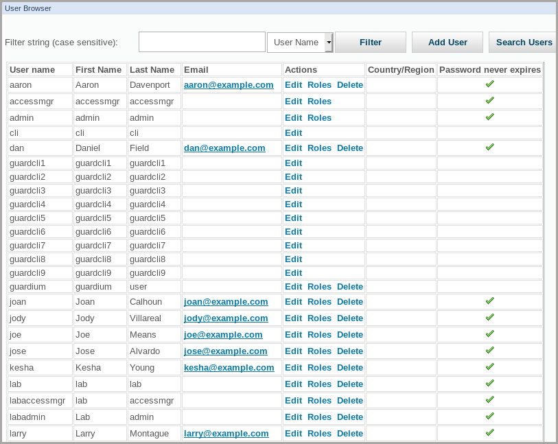
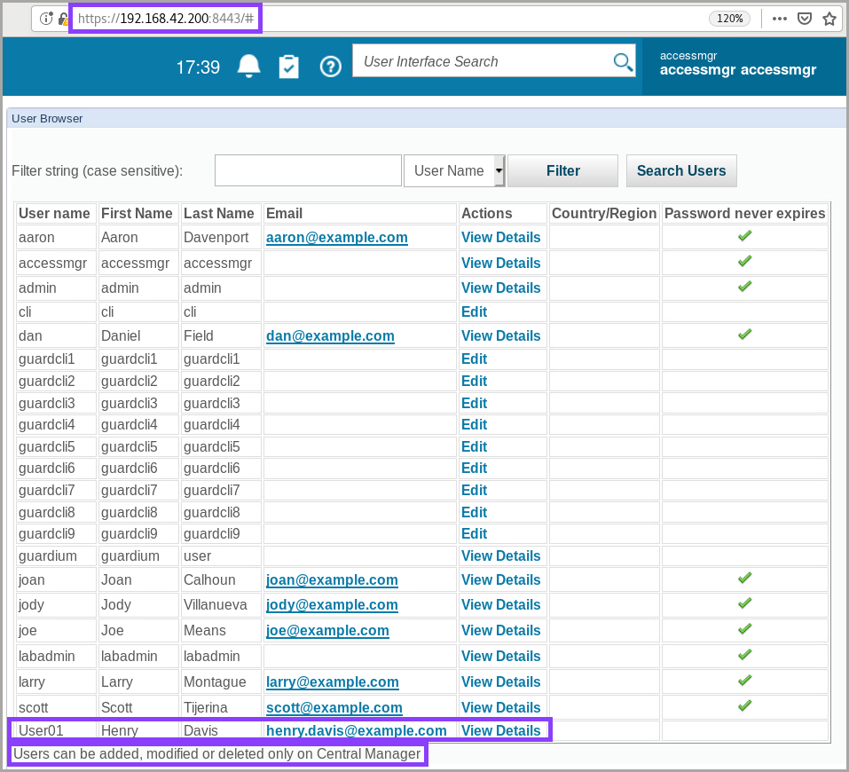

# Crear / Gestionar Usuarios y Asignar Roles de Trabajo

Este laboratorio se centrará en mostrarnos cómo crear nuevos usuarios, gestionar estos usuarios, así como asignar roles para estos usuarios. Una simple vista de arquitectura de alto nivel de este laboratorio se puede ver a continuación

## Prepare

Después de asegurarnos de que su entorno está configurado y funciona correctamente, queremos asegurarnos de algunas cosas antes de empezar con los ejercicios de este laboratorio

Hay un par de pasos, enumerados a continuación, que querremos asegurarnos de que se completan antes de saltar a este laboratorio

1.  Inicie o asegure las tres máquinas virtuales.

2.  Inicie sesión en la máquina virtual del servidor de BD (raptor) como usuario `root` con la contraseña `guardium`.

3.  Compruebe que la base de datos Db2 está en funcionamiento.

    *   Abra una ventana de Terminal.

    *   Para cambiar a la cuenta de usuario DB2INST1, escriba:

        ```bash
        su - db2inst1.
        ```

        .

    <br />

    *   Para comprobar que la base de datos se está ejecutando, escriba:

        ```bash
        db2start
        ```

    <br />

    *   Para activar la base de datos Db2, escriba:

        ```bash
        db2 activate database sample.
        ```

        .

    <br />

    Si la base de datos se está ejecutando, recibirá el siguiente mensaje:

    

    <br />

    Si la base de datos **NO** se está ejecutando, puede iniciarla ejecutando el siguiente comando:

    <br />

    ```bash
    db2start
    ```

    <br />

    

    <br />

4.  Después de cerrar la ventana de terminal, asegúrese de que raptor puede conectarse a `MA170` y `C200`. Puede comprobarlo asegurándose de que se muestra la pantalla de inicio de sesión de cada interfaz de Guardium.

// TODO: AÑADIR imagen de inicio de sesión

## Creación de usuarios y roles de Guardium

En esta sección del laboratorio, utilizaremos la consola IBM Guardium Data Protection para crear usuarios de Guardium y asignarles los roles adecuados. Guardium incluye dos usuarios integrados para gestionar el acceso a la consola de Guardium:

*   `labaccessmgr`

    Un miembro del rol `accessmgr`. Utilice este usuario para crear otros usuarios y roles, y para establecer la pertenencia a roles.

*   `labadmin`

    Un miembro del rol `admin`. Utilice este usuario para todas las demás funciones administrativas.

> Guardium proporciona usuarios `admin` y `accessmgr`. No es posible eliminar estos usuarios, ni quitarles sus roles predeterminados. Esta guía de laboratorio sigue el principio de seguridad de evitar el uso de cuentas de alto nivel.

> En un entorno con un gestor central, como el entorno de laboratorio, los usuarios de Guardium deben gestionarse desde el gestor central.

### Creación de usuarios

1.  En el servidor de base de datos, vaya a la consola gráfica Guardium para el gestor central `MA170` en `https://192.168.42.170:8443`
2.  Inicie sesión con el nombre de usuario `labaccessmgr` y la contraseña `P@ssw0rd`.
3.  Vaya a **Acceso** > **Gestión de acceso**.



> Se han añadido usuarios adicionales al servidor de Guardium con fines didácticos. Una nueva instalación de Guardium no incluye todos estos usuarios.

4.  Para añadir un usuario, haga clic en **Añadir usuario** e introduzca la siguiente información:

    \- **Nombre de usuario**: `User01`- **Contraseña**: `P@ssw0rd`- **Nombre**: `Henry`- **Apellidos**: `Davis`- **Email**: `henry.davis@example.com`- **Casilla desactivada**: no seleccionada

<Warning text="Remember to clear (or unselect) the **Disabled** checkbox because it is enabled by default." />


5.  Haga clic en **Añadir usuario**

    

> Si no ve **Usuario01**, es posible que tenga que ir a la segunda página de usuarios, o filtrar en el nombre de usuario **User01**


6.  Para `User01`, haga clic en el enlace **Roles**.

7.  Para añadir a `User01` al rol **Infosec**, seleccione la casilla **Infosec**.

    `User01` ya es miembro del rol de usuario. Observe que el rol de usuario está seleccionado.

    

8.  Desplácese hacia abajo y haga clic en **Guardar**.

    *El navegador del usuario debería aparecer de nuevo.*

9.  Para visualizar información resumida sobre la pertenencia a usuarios y funciones, vaya a **Acceso** > **Informes de usuarios y funciones**

    

<Callout>
  You should see the user that you created earlier in the **User - Role** report.
</Callout>

10. Para visualizar un informe con las funciones del usuario, haga clic con el botón derecho del ratón en el usuario que ha creado y seleccione **Detalles del registro**.


<Callout>
  A new window opens with the details.
</Callout>

11. Cierre la ventana y vuelva a la interfaz principal de Guardium.

### Creación de roles en Guardium

En esta sección del laboratorio, crearemos un rol y le asignaremos permisos de acceso.

1.  Vaya a **Acceso** > **Gestión de acceso**.

<Callout>
  The **User Browser** pane opens and you should see a list of Guardium users.
</Callout>

2.  Seleccione **Role Browser**.


<Callout>
  The **Role Browser** pane opens
</Callout>

3.  Haga clic en **Añadir función**


<Callout>
  The **Role Form** window opens.
</Callout>

4.  En el campo **Nombre de Rol**, introduzca `labrole` y haga clic en **Añadir Rol**. Debería ver el nuevo rol, `labrole`, listado en el **Navegador de Roles**.


5.  En el elemento de la fila `labrole`, haga clic en **Gestionar permisos**


<Callout>
  The **Manage Permissions** for Role `labrole` window opens.
</Callout>

6.  A continuación vamos a añadir la aplicación de *Configuración del Sistema* al nuevo rol.

    *   En la lista de **elementos inaccesibles**, utilice el campo de filtro para buscar `system` y, a continuación, seleccione **Configuración del sistema**.

    

    *   Para mover **Configuración del sistema** a la lista **Elementos accesibles**, haga clic en **Mover a la derecha (flecha derecha → )**

    

    *   Haga clic en **Aceptar** y cierre el mensaje de confirmación.

    <Callout>
      The Role Browser should reopen.
    </Callout>

7.  Ahora vamos a añadir nuestro rol recién creado a un usuario

    *   Vaya al **navegador de usuarios**.

    *   Busque `User01`, que creamos en la sección anterior del laboratorio, y haga clic en **Roles**.

    *   Debería ver el `labrole` disponible para añadirlo como rol.

        

    *   Seleccione `labrole`

    *   Pulse **Guardar** para completar la adición de este nuevo rol a `User01`

8.  Ahora que hemos completado la creación del nuevo usuario, roles, y la asignación de los nuevos roles podemos cerrar sesión en la consola de Guardium.

### Usuario de prueba con funciones

Ahora que agregó un usuario al administrador central, debe sincronizar los datos del usuario del portal con el recopilador. Normalmente, esta sincronización se programa automáticamente. En esta sección del laboratorio, sincronizaremos manualmente en lugar de esperar el trabajo programado. Luego, inicie sesión como el nuevo usuario en el recopilador y explore la consola.

1.  Inicie sesión en el portal Guardium en `MA170` como usuario `labadmin` con la contraseña `P@ssw0rd`.
2.  Vaya a **Gestión** > **Gestión central** > **Gestión central**.


<Callout>
  The **Central Management** pane opens.
</Callout>

3.  Junto a Unidad *C200.ejemplo.com*, haga clic en **Actualizar**

<Callout>
  Wait 2 minutes for the refresh to complete.
</Callout>

> Si la actualización no funciona, seleccione la casilla de verificación del elemento que desea actualizar, desplácese por la página y haga clic en el botón de actualización de la pantalla en lugar de en el icono, o pruebe con **Gestión** > **Gestión centralizada** > **Sincronización de usuarios del portal** y actualice desde allí.

4.  En el recopilador *(C200)*, inicie sesión en la consola de Guardium como `labaccessmgr` con la contraseña `P@ssw0rd`.
5.  Vaya a **Acceso** > **Gestión de acceso**

<Callout>
  The **User Browser** pane opens and you see should your new user form the previous section, *Henry Davis*, in the **User Browser**.
</Callout>



> Si no ve el nuevo usuario, espere 5 minutos y actualice el navegador. Compruebe también la segunda página o filtro para encontrar `User01`.

6.  Cerrar sesión como `labaccessmgr`

7.  En el recopilador *(C200)*, inicie sesión en la consola de Guardium como `User01`.

    Si su contraseña ha caducado, se abre un cuadro de diálogo *Cambiar la contraseña de su cuenta*.

8.  Introduzca la antigua contraseña de `P@ssw0rd` y, a continuación, elija una nueva contraseña que cumpla los requisitos del cuadro de diálogo. Un ejemplo podría ser `P@ssw0rd1`. Anote esta nueva contraseña para futuras consultas:


9.  Haga clic en **OK**

    Se abrirá un cuadro de diálogo de éxito que debería mostrar que la contraseña se ha cambiado correctamente.

10. Cierre el cuadro de diálogo. Se abrirá la consola `User01`.

11. Explore la consola utilizando la búsqueda de la interfaz de usuario y el menú de navegación y anote las funciones.


Algunas de las diferencias con respecto al portal `admin` usuario `admin` que puede notar son:

\- Los iconos **Gestionar** y **Aplicación** no están disponibles en el menú de navegación.

\- Hay menos informes listados bajo el icono **Informes**. En concreto, las categorías de informes **Elementos de configuración de Guardium** y **Supervisión del sistema Guardium** no están disponibles.

\- Hay menos opciones en **Harden** > **Evaluación de vulnerabilidades**.

12. Cierre de sesión de `User01`

Felicitaciones, este es el final del Laboratorio 201, usted ha completado exitosamente este laboratorio donde aprendió como crear nuevos usuarios, crear nuevos roles, y asignar roles a usuarios.

Continúe hasta el [laboratorio 202](/guardium/level-4/202)
