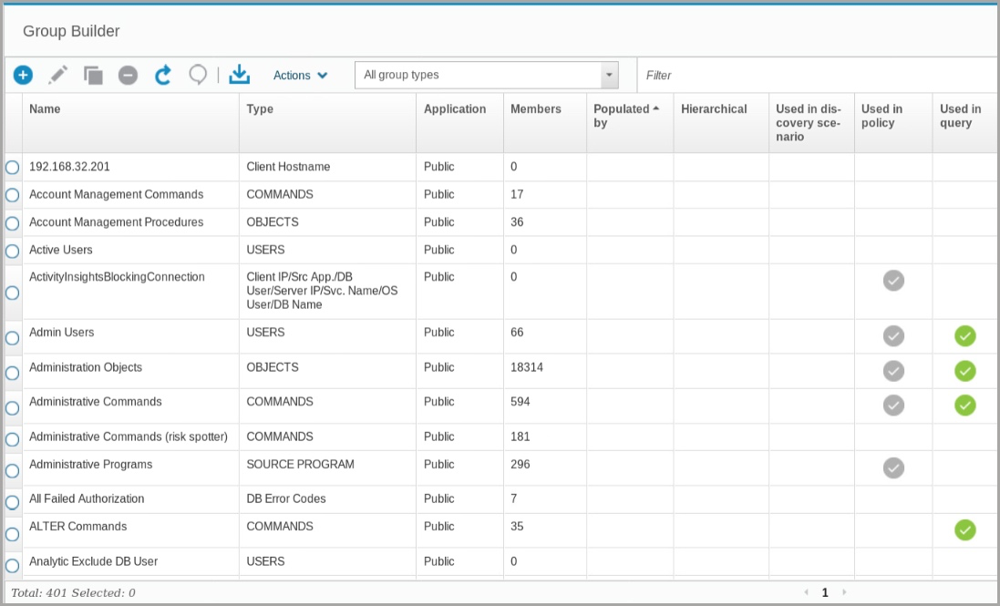
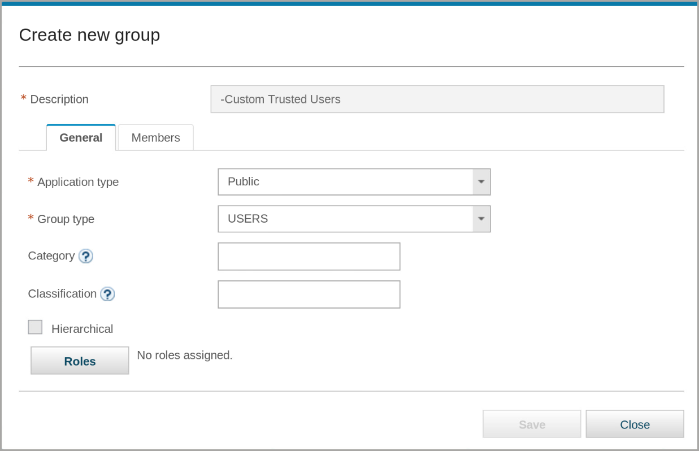
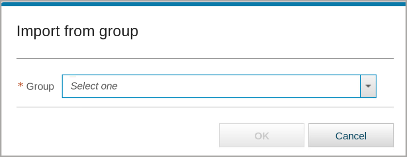
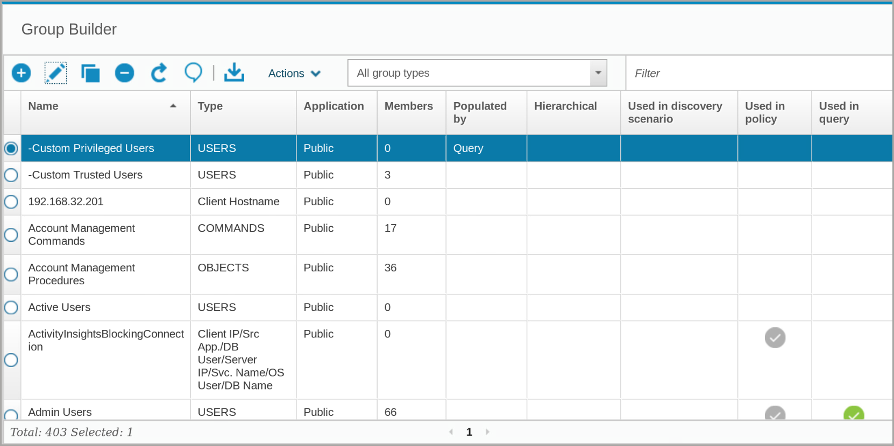
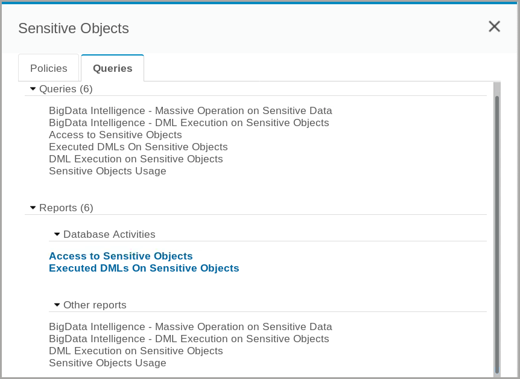

# Grupos

En este laboratorio, creamos algunos grupos de Guardium que incluyen diferentes usuarios. También añadiremos algunos objetos a un grupo predefinido. Al final de este ejercicio de laboratorio habremos aprendido a realizar las siguientes tareas:

\- Examinar Group Builder - Crear un nuevo grupo - Utilizar una consulta para rellenar un grupo - Ver grupos

## Examinar el Group Builder

Empezaremos accediendo al creador de grupos:

1.  En el servidor de base de datos, inicie el navegador web e inicie sesión en la consola de Guardium en `MA170` como usuario `labadmin` con la contraseña `P@ssw0rd`.
2.  En el menú de navegación de la parte izquierda de la página, vaya a **Configuración** > **Herramientas y vistas** > **Creador de grupos**.

<Callout>
  Group Builder is an important application, and you can access it through a number of paths, depending on your roles.
</Callout>

La ventana Group Builder muestra las siguientes características:

*   Una cabecera, con iconos para crear, editar, copiar y eliminar grupos.
*   Un icono para actualizar la vista
*   Un icono para ver y añadir comentarios
*   Un icono para descargar la lista de grupos como archivo CSV
*   Un menú de acciones
*   Métodos para filtrar el grupo por tipo o nombre
*   Encabezados de columna que le ayudan a encontrar detalles sobre los grupos: - Nombre - Tipo

En Group Builder, hay muchos grupos preconfigurados. Puede gestionar la pertenencia a estos grupos.

### Crear un nuevo grupo

Un grupo útil podría ser una lista de usuarios de confianza de la base de datos. Este grupo puede incluir aplicaciones que utilizan la base de datos. Puede utilizar esta lista para escribir una política que ignore las sesiones creadas por estos usuarios, lo que reduce la carga de procesamiento en la red y en el servidor Guardium. Vamos a crear un nuevo grupo dentro de Guardium Data Protection.

1.  Para abrir *la ventana Crear nuevo grupo*, haga clic en **Nuevo**

2.  En la pestaña **General**, rellene los siguientes campos:

\- **Descripción**: `-Custom Trusted Users`

\- **Tipo de solicitud**: Público

\- **Tipo de grupo**: USUARIOS

\- **Categoría y clasificación**: dejar en blanco

\- **Jerárquico**: no seleccionado

> Es una buena práctica identificar los grupos que se crean con un prefijo para distinguir los grupos añadidos por el usuario de los grupos incorporados. En este ejemplo se utiliza *-Personalizado*. El "-" indica que se trata de un grupo creado por el usuario. Si ordenas los grupos por nombre, en orden alfabético ascendente, el grupo personalizado se encuentra cerca del principio de la lista en Group Builder.

3.  Para añadir el nuevo grupo, haga clic en **Guardar** y, a continuación, cierre el mensaje de confirmación.

<Callout>
  The new group is created but it contains no members.
</Callout>

4.  Para añadir miembros al grupo, haz clic en la pestaña **Miembros**.

5.  Para examinar las opciones, haga clic en el menú **Importar**.

Cuando añades nuevos miembros, las opciones incluyen:

\- **Desde CSV**: Puede importar los miembros de un grupo desde un archivo simple. El archivo puede ser una sola columna con una cabecera, o varias columnas con una cabecera para grupos de tuplas.

\- **Desde grupo**: Esta opción añade miembros de otro grupo.

\- **Desde fuente de datos externa**: Esta opción añade miembros desde una tabla de base de datos externa.

\- **Desde consulta**: Esta opción añade miembros basándose en una consulta de Guardium.

\- **Desde LDAP**

> En esta sección del laboratorio, añadiremos usuarios de otro grupo.

6.  En el menú **Importar**, seleccione **Del grupo**.

7.  En el menú **Grupo**, seleccione **Usuarios de confianza del laboratorio**.
8.  Haga clic en **OK**

> Comprueba que `KESHA` y `OMAR` se añaden al nuevo grupo.

9.  Desplácese hacia abajo y haga clic en **Guardar**.
10. Para cerrar el mensaje de confirmación, haga clic en **Aceptar** y, a continuación, en **Cerrar**.

<Callout>
  You see the new group in the Group Builder window.
</Callout>

> Si no ve el grupo, haga clic dos veces en el encabezado **Nombre** para ordenarlo por nombre, de forma ascendente. El "-" que precede al nombre del grupo lo sitúa al principio de la lista.

### Utilizar una consulta para rellenar un grupo

En esta parte del laboratorio, usted desea crear un grupo de usuarios que tengan un alto nivel de privilegios sobre bases de datos que contengan datos sensibles. Es posible que desee supervisar las acciones de estos usuarios más de cerca para asegurarse de que no se abusa de estos privilegios.

> Para esta tarea, utilice la pestaña del navegador web que se conecta al colector (C200).

1.  En esta tarea, se crea un grupo y se utiliza una consulta para rellenarlo.

Crea un grupo con las siguientes características:

\- **Descripción**: `-Custom Privileged Users`

\- **Tipo de solicitud**: Público

\- **Tipo de grupo**: USUARIOS

\- **Categoría** y **clasificación**: *dejar en blanco*

\- **Jerárquico**: no seleccionado

2.  En la pestaña **Miembros**, en el menú **Importar**, seleccione **Desde consulta**.

<Callout>
  A new tab, Import by query, opens.
</Callout>

3.  En el menú **Consulta**, seleccione **Lista detallada de sesiones**.

> Observe que se han añadido más campos a la pestaña **Importar** por consulta.

4.  En el campo Introducir período desde, haga clic en el icono **Calendario**.
5.  Establezca los valores de la ventana de calendario en **1 de enero de 2022** y la Fuente de fecha remota en **C200.ejemplo.com**.

6.  Deje el resto de campos con los valores predeterminados y haga clic en **Guardar**.
7.  Para cerrar el mensaje de confirmación, pulse **OK**.

<Warning text="You set up the query, but you did not run it yet, so NO members are added to the group." />

8.  En la parte izquierda de la ventana, haga clic en la pestaña **Programación**

9.  Puede configurar una programación para ejecutar la consulta periódicamente; sin embargo, para este ejercicio, ejecutará la consulta una vez. Desplácese hasta la parte inferior de la ventana y haga clic en **Ejecutar una vez ahora**.
10. Para cerrar el mensaje informativo, haga clic en **Aceptar**.
11. Haga clic en la pestaña **Miembros**.

<Callout>
  You see that the import was successful.
</Callout>

12. **Guarde** y **cierre** el grupo.

<Callout>
  Your new group is added to the Group Builder window.
</Callout>

> Puede que tenga que hacer clic en **Actualizar** para mostrar que el grupo tiene un miembro.

### Ver grupos

En esta parte del laboratorio, vemos los detalles de los grupos que hemos creado.

> Vuelva a la pestaña del navegador web que conecta con el gestor central *(MA170)* para el resto de ejercicios de esta unidad.

1.  Para ver un grupo existente, busque y seleccione el grupo **Objetos sensibles**.

<Callout>
  You can narrow the list of groups by typing the name into the filter field.
</Callout>

> Verá que el grupo **Objetos sensibles** tiene cinco miembros y se utiliza en una o más políticas y en consultas.

2.  En el menú desplegable **Acciones**, seleccione **Ver detallesZ**

<Callout>
  The **Sensitive Objects** group is associated with several security policies. There is a link to Go to policy builder.
</Callout>

3.  Seleccione la pestaña **Consultas**.

<Callout>
  The **Sensitive Objects** group is associated with six queries and six reports.
</Callout>

4.  Cierre la ventana **Objetos sensibles**.
5.  Para abrir la ventana Editar grupo, haz clic en **Editar** y, a continuación, en la pestaña **Miembros**.

> Algunos de estos miembros de grupo contienen comodines de expresión regular (%).

6.  Cerrar el grupo

En este laboratorio hemos aprendido a utilizar las siguientes funcionalidades de Guardium Data Protection:

*   **Utilizar Group Builder**
*   **Crear un nuevo grupo**
*   **Utilizar una consulta para rellenar un grupo**

Continúe hasta el [laboratorio 203](/guardium/level-4/203)
