# Descubriendo datos

Para proteger los datos sensibles, debe saber dónde se encuentran en su empresa. Guardium Data Protection (GDP) proporciona herramientas que puede utilizar para descubrir e informar sobre bases de datos y encontrar datos confidenciales. En esta parte del laboratorio, realizaremos las siguientes tareas:

*   Descubrir datos sensibles
*   Afinar los resultados del descubrimiento
*   Compruebe que el grupo Objetos sensibles del titular de la tarjeta PCI está actualizado.

## Descubrir datos sensibles

En esta tarea, descubriremos datos sensibles en un servidor de datos utilizando plantillas de reglas predefinidas. En Guardium, se pueden modificar las reglas existentes o incluso crear otras nuevas, pero ese proceso queda fuera del alcance de este curso.

1.  Inicie sesión en la consola gráfica de usuario del colector *(C200* ) como usuario `labadmin` con la contraseña `P@ssw0rd`.
2.  En el menú de navegación, haga clic en **Descubrir** > **Clasificación** > **Descubrir datos confidenciales**.

3.  Para añadir un escenario, haga clic en **Crear**

4.  Para el nombre, introduzca `Lab Discovery`.
5.  Para la política de Clasificación, seleccione **PCI \[plantilla]**.

<Callout>
  A classification policy based on the PCI template is automatically created.
</Callout>

6.  En Categoría, seleccione **PCI**.

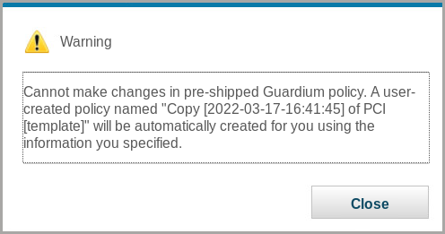

7.  Cerrar la advertencia
8.  Para Clasificación, introduzca **Tarjeta de crédito**.
9.  En Tipo de fuente de datos, seleccione **Relacional (SQL)**.

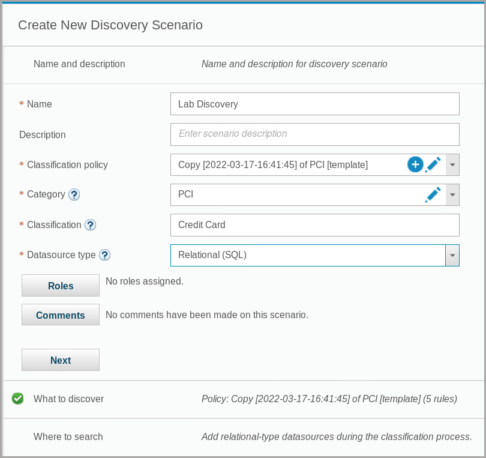

> Observe que se ha creado una copia de la plantilla PCI con cinco reglas.

10. Para definir las reglas de clasificación para la detección, haga clic en **Siguiente**.

<Callout>
  Because they are part of the PCI template, the classification rules for different types of credit cards are already populated
</Callout>

> Cuando el nombre de una regla empieza por **guardium://CREDIT\_CARD** y hay un patrón de número de tarjeta de crédito válido en el cuadro Expresión de búsqueda, la política de clasificación utiliza el algoritmo Luhn, que es un algoritmo muy utilizado para validar números de identificación como los números de tarjetas de crédito. También utiliza la concordancia de patrones estándar.

En la lista de plantillas de reglas de clasificación disponibles, se muestran plantillas para patrones universales, como números de tarjetas de crédito.

11. Ahora puede ver en qué consiste una regla. No creará ni modificará reglas, sólo verá las reglas existentes. En la tabla Reglas de clasificación seleccionadas, seleccione la primera regla de clasificación, **guardium://CREDIT\_CARD** tarjeta de crédito.
12. Haga clic en **Editar**
13. Para ver los criterios de las reglas, haga clic en **Siguiente**.

> Puede ver los detalles de los criterios de la regla, como la expresión regular que se utiliza para buscar números de tarjetas de crédito y los tipos de objetos (tablas, vistas) en los que se produce la búsqueda.

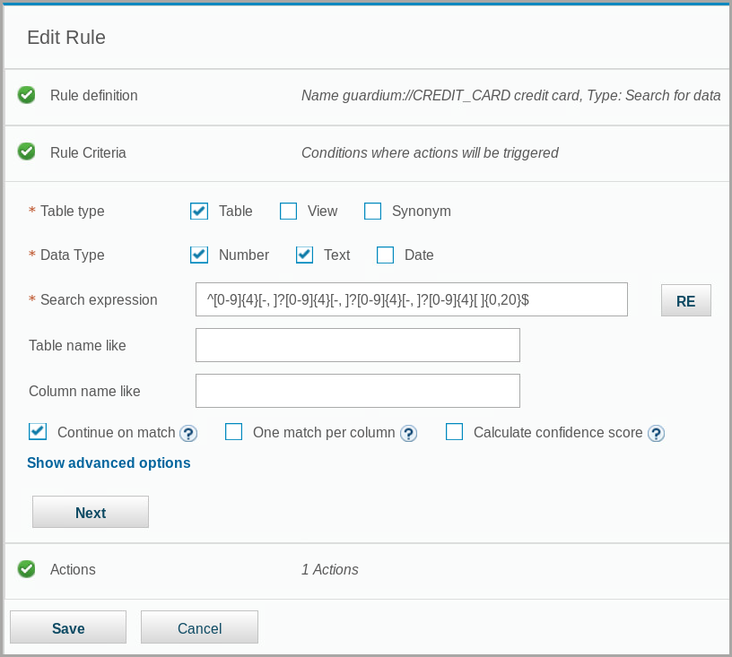

14. Para ver las acciones asociadas a esta regla, haga clic en **Siguiente**.

> La plantilla PCI proporciona una acción, que consiste en añadir los objetos que encuentra la búsqueda al grupo Objetos sensibles del titular de la tarjeta PCI.

15. Haga clic en **Guardar**
16. Desplácese hacia abajo y haga clic en **Guardar**

> Sugerencia: Para ahorrar espacio, haga clic en el divisor *(mini chevron)* para minimizar la sección Escenarios de descubrimiento.

17. Para ampliar la sección **Dónde** buscar, haga clic en **Ampliar**

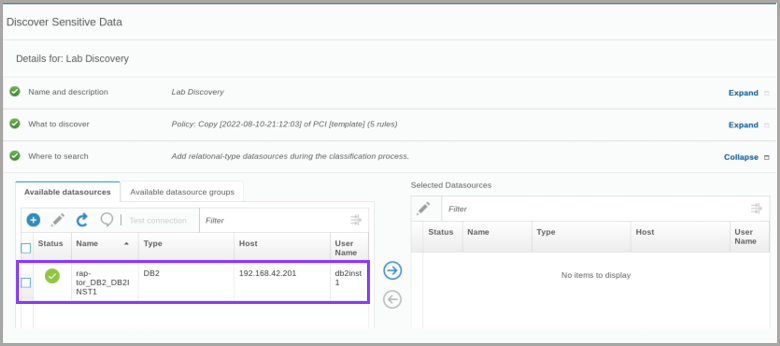

> En esta sección, usted elige dónde se ejecuta la búsqueda de datos sensibles. Puede elegir uno o varios orígenes de datos, o grupos de orígenes de datos, como objetivos.

18. En la tabla de fuentes de datos disponibles, seleccione la fuente de datos **raptor\_DB2\_DB2INST1** y haga clic en **Mover a la derecha.**

19. Para abrir la sección Run discovery, haga clic en **Next**
20. Para ejecutar la detección, haga clic en **Ejecutar ahora**.

<Callout>
  The progress changes to **WAITING** and then to **RUNNING**
</Callout>

<Callout>
  The process may take several minutes to complete. When the process is complete, the Review report section shows a summary of the results.
</Callout>

21. Para ampliar la sección Informe de revisión, haga clic en **Siguiente**.

> Observe cómo el informe muestra información sobre el esquema, la tabla y la columna de los datos confidenciales descubiertos, así como la regla que activó la entrada.

### Afinar los resultados del descubrimiento

A continuación, afine los resultados para excluir los falsos positivos que no contengan datos confidenciales. Para los fines de este laboratorio, se supone que la tabla denominada CC1 es una tabla de prueba que no incluye datos confidenciales.

1.  En la sección Revisar informe, haga clic en el campo **Filtro**, escriba `cc1` y pulse **Intro**.

<Callout>
  The report entries are filtered to show four entries, which correspond to table named CC1.
</Callout>

2.  Para seleccionar todos los resultados, marque la casilla situada junto a **Catálogo**.

3.  En el menú Añadir a grupo, seleccione **Añadir a grupo de tablas a excluir**.

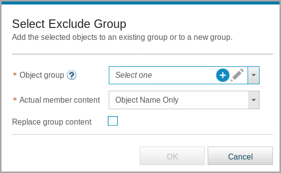

4.  Haga clic en **Nuevo grupo**

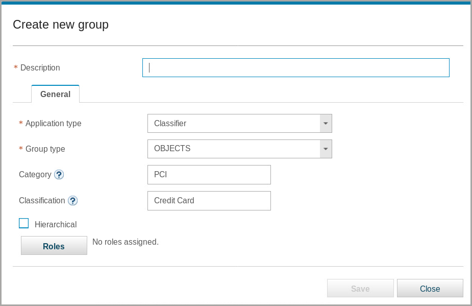

5.  En Descripción, introduzca `Lab skip objects`.
6.  Haga clic en **Guardar**
7.  Cierra el mensaje informativo.

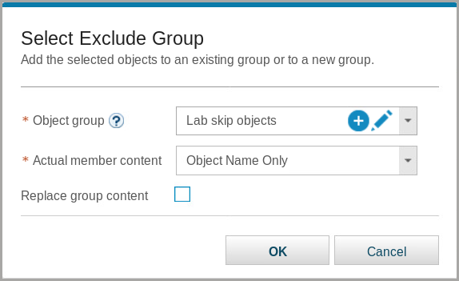

8.  Para completar la selección del grupo y cerrar el cuadro de diálogo Seleccionar grupo excluido, haga clic en **Aceptar**.
9.  Cierre el cuadro de diálogo Éxito.
10. En la sección Qué descubrir, haga clic en **Ampliar**.

11. En la sección Reglas de clasificación seleccionadas, seleccione la regla de tarjeta de crédito **guardium://CREDIT\_CARD** y haga clic en **Editar**
12. Para ver la sección Criterios de la regla, haga clic en **Expandir**.

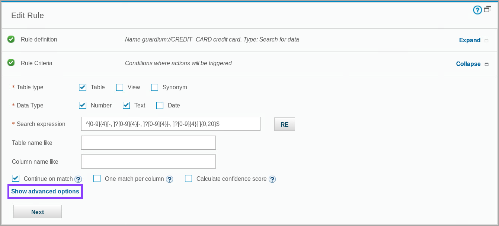

13. Para editar las opciones avanzadas, haga clic en **Mostrar opciones avanzadas**.

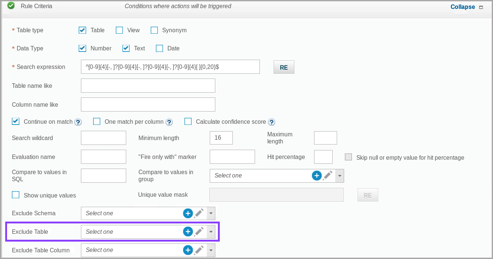

14. En Excluir tabla, seleccione `Lab skip objects`.
15. Para guardar la regla, desplácese hacia abajo y haga clic en **Guardar**.
16. Desplácese hacia abajo y amplíe la sección Ejecutar detección.
17. Haga clic en **Ejecutar ahora**

> Una vez ejecutado el escenario de detección, el panel muestra 12 coincidencias encontradas en lugar de 13.

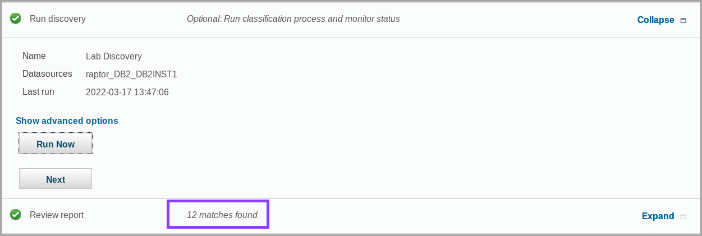

### Verificación de la actualización del grupo Objetos sensibles del titular de la tarjeta PCI

En esta sección del laboratorio, se verifica que las tablas sensibles que encuentra el proceso de descubrimiento se agreguen al grupo adecuado. Esta tarea se realiza en el recopilador *(C200)*.

1.  Vaya a **Proteger** > **Políticas de seguridad** > **Creador de grupos**.

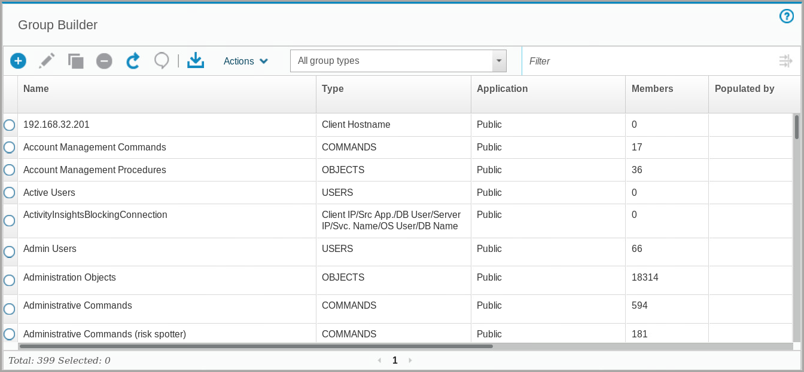

2.  Para filtrar las entradas, en el campo **Filtro**, escriba `pci`.
3.  Seleccione el grupo de **objetos sensibles del titular de la tarjeta PCI**

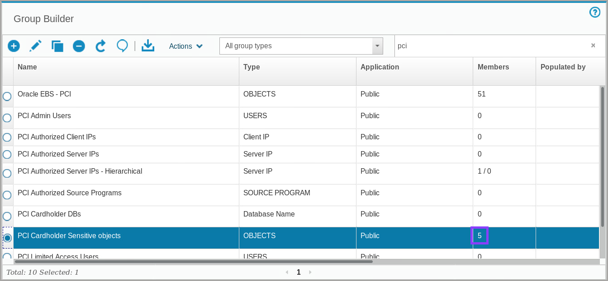

> Tenga en cuenta que ahora hay cinco miembros en el grupo.

4.  Para ver cómo se utiliza este grupo, desplácese a la derecha.

> Las marcas verdes en las columnas **Utilizado en** escenario de **descubrimiento** y **Utilizado en consulta** indican que este grupo se utiliza en al menos un escenario de descubrimiento y una consulta. Las marcas de verificación grises en la columna **Utilizado en política** indican que el grupo se utiliza en una política que no está activa.

5.  En el menú Acciones, seleccione **Ver detalles**.

<Callout>
  The dialog shows that the group is associated with your discovery. You can also view which queries this group is associated with.
</Callout>

6.  Cierre el cuadro de diálogo Objetos sensibles de PCICardholder.
7.  Para ver los miembros del grupo, seleccione el grupo y haga clic en **Editar**
8.  Haga clic en la pestaña **Miembros**.

> Debería ver los miembros del grupo, que fueron añadidos por el proceso de descubrimiento de datos.

9.  Desplácese hacia abajo y cierre el cuadro de diálogo Editar grupo.

En este laboratorio hemos aprendido a utilizar las siguientes funcionalidades de Guardium Data Protection:

*   **Descubrir datos sensibles**
*   **Afinar los resultados del descubrimiento**
*   **Comprobar que la información está actualizada**

Continúe hasta el [laboratorio 204](/guardium/level-4/204)
