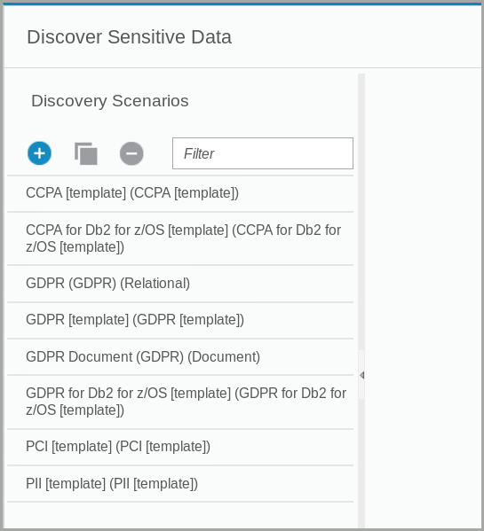
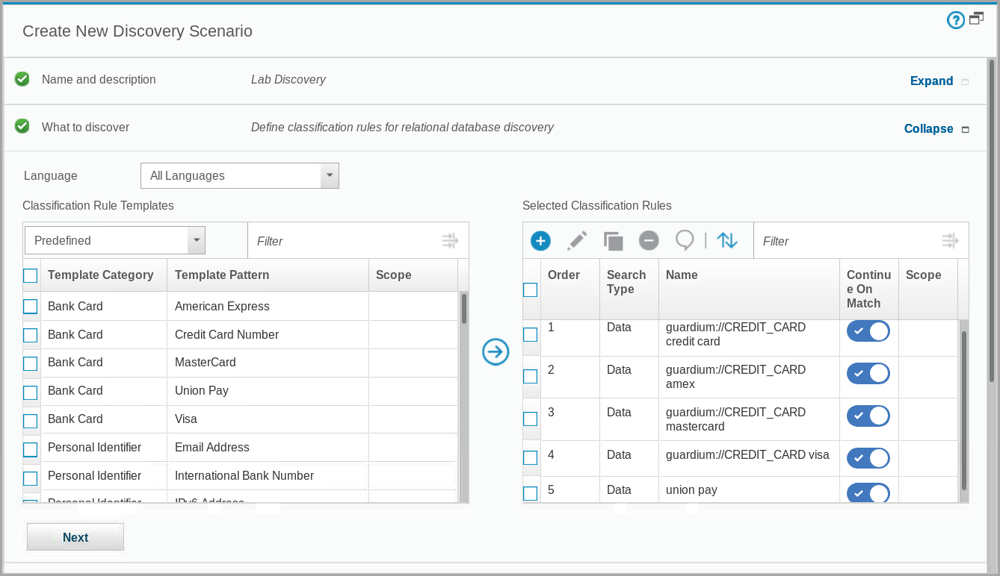
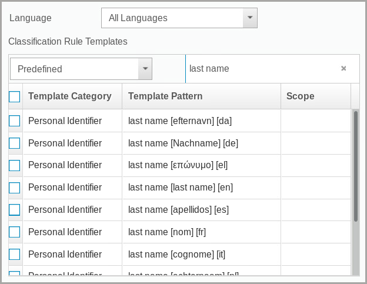
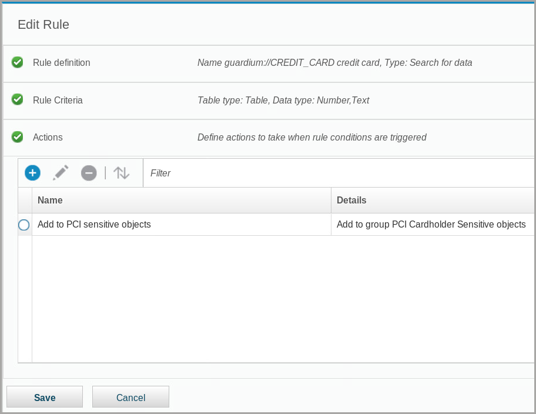
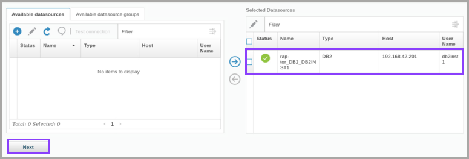
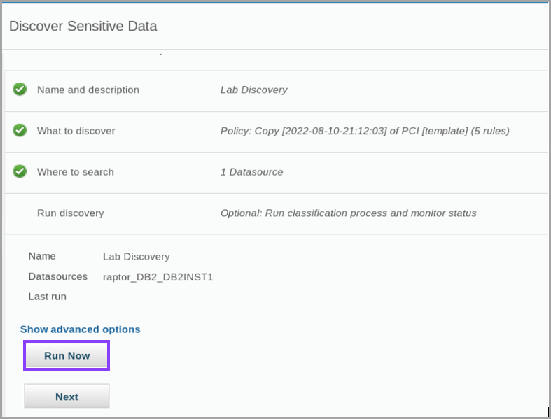
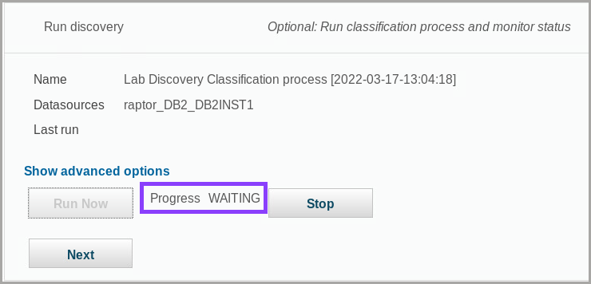
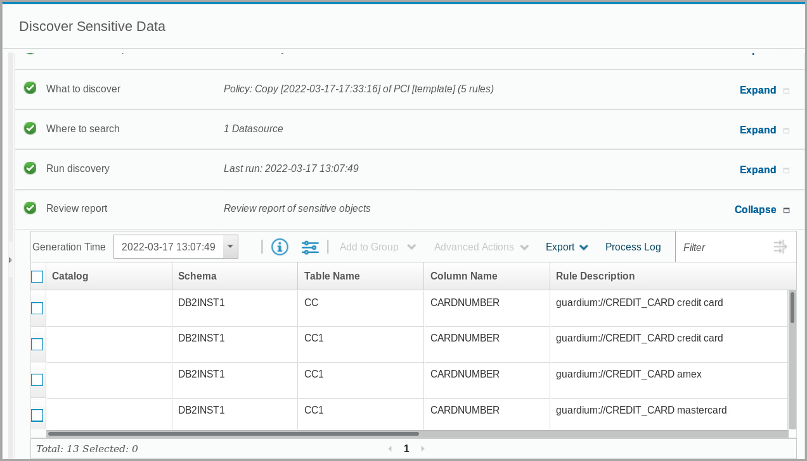
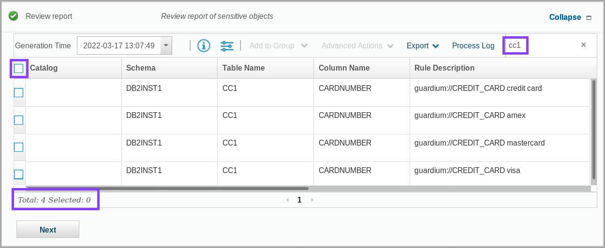
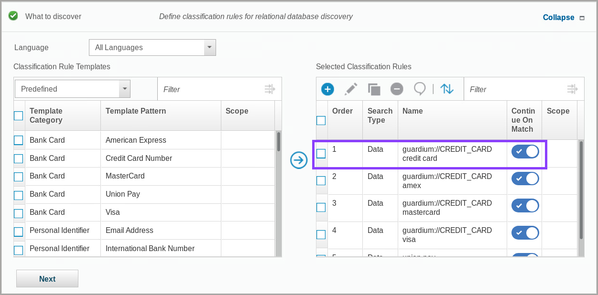

# Discovering Data

To protect sensitive data, you must know where it exists in your enterprise. Guardium Data Protection (GDP) provides tools that you can use to discover and report on databases and find sensitive data. In this part of the lab, we will perform the following tasks:

- Discover sensitive data

- Refine the discovery results

- Verify that the PCI Cardholder Sensitive Objects group is updated

## Discovering Sensitive Data

In this task, we will discover sensitive data on a data server by using predefined rule templates. In Guardium, you can modify existing rules or even create new ones, but that process is beyond the scope of this course.

1. Log in to the collector _(C200)_ graphical user console as user `labadmin` with password `P@ssw0rd`.

2. In the navigation menu, click **Discover** > **Classification** > **Discover Sensitive Data**.

3. To add a scenario, click **Create**

4. For name, enter `Lab Discovery`.

5. For Classification policy, select **PCI \[template]**.

<Callout>
A classification policy based on the PCI template is automatically created.
</Callout>

6. For Category, select **PCI**.

7. Close the warning

8. For Classification, enter **Credit Card**.

9. For Datasource type, select **Relational (SQL)**.

> Note that a copy of the PCI template was created with five rules.

10. To define the classification rules for discovery, click **Next**.

<Callout>
Because they are part of the PCI template, the classification rules for different types of credit cards are already populated
</Callout>

> When a rule name begins with **guardium://CREDIT_CARD** and there is a valid credit card number pattern in the Search Expression box, the classification policy uses the Luhn algorithm, which is a widely used algorithm for validating identification numbers such as credit card numbers. It also uses standard pattern matching.

In the available classification rule templates list, templates for universal patterns, such as credit card numbers are displayed.

11. Now you can see what a rule consists of. You will not create or modify rules, only view existing rules. In the Selected Classification Rules table, select the first classification rule, **guardium://CREDIT_CARD** credit card.

12. Click **Edit**

13. To view the rule criteria, click **Next**.

> You can see the details of the rule criteria, such as the regular expression that is used to search for credit card numbers and the types of objects (tables, views) where the search occurs.

14. To view the actions associated with this rule, click **Next**.

> The PCI template provides an action, which is to add the objects that the search finds to the group PCI Cardholder Sensitive objects.

15. Click **Save**

16. Scroll down and click **Save**

> Hint: To save space, click the divider _(mini chevron)_ to minimize the Discovery Scenarios section.

17. To expand the **Where** to search section, click **Expand**

> In this section, you choose where the search for sensitive data runs. You can choose one or more datasources, or groups of datasources, as targets.

18. In the Available datasources table, select the **raptor_DB2_DB2INST1** datasource and click **Move Right**

19. To open the Run discovery section, click **Next**

20. To run the discovery, click **Run Now**.

<Callout>
The progress changes to **WAITING** and then to **RUNNING**
</Callout>

<Callout>
The process may take several minutes to complete. When the process is complete, the Review report section shows a summary of the results.
</Callout>

21. To expand the Review report section, click **Next**.

> Notice how the report shows schema, table, and column information for discovered sensitive data, and the rule that the entry triggered.

### Refining the Discovery Results

Now, you refine the results to exclude false positives that do not hold sensitive data. For the purposes of this lab, you assume that the table named CC1 is a test table that does not include sensitive data.

1. In the Review report section, click the **Filter** field, type `cc1`, and press **Enter**.

<Callout>
The report entries are filtered to show four entries, which correspond to table named CC1.
</Callout>

2. To select all of the results, select the checkbox next to **Catalog**.

3. From the Add to Group menu, select **Add to Group of Tables to Exclude**.

4. Click **New Group**

5. For Description, enter `Lab skip objects`.

6. Click **Save**

7. Close the informational message.

8. To complete the group selection and close the Select Exclude Group dialog, click **OK**.

9. Close the Success dialog.

10. In the What to discover section, click **Expand**.

11. In the Selected Classification Rules section, select the **guardium://CREDIT_CARD** credit card rule and click **Edit**

12. To view the Rule Criteria section, click **Expand**.

13. To edit the advanced options, click **Show advanced options**.

14. For Exclude Table, select `Lab skip objects`.

15. To save the rule, scroll down and click **Save**.

16. Scroll down and expand the Run discovery section.

17. Click **Run Now**

> After the discovery scenario runs, the pane shows 12 matches found rather than 13.

### Verifying that the PCI Cardholder Sensitive Objects group is updated

In this section of the lab, you verify that the sensitive tables that your discovery process finds are added to the appropriate group. This task takes place on the collector _(C200)_.

1. Go to **Protect** > **Security Policies** > **Group Builder**.

2. To filter the entries, in the **Filter** field, type `pci`.

3. Select the **PCI Cardholder Sensitive objects** group

> Take note that there are now five members in the group.

4. To view how this group is used, scroll to the right.

> Green checkmarks in the **Used in discovery scenario** and **Used in query** columns indicate that this group is used in at least one discovery scenario and one query. The gray checkmarks in the **Used in policy** column indicate that the group is used in a policy that is not active.

5. From the Actions menu, select **View details**.

<Callout>
The dialog shows that the group is associated with your discovery. You can also view which queries this group is associated with.
</Callout>

6. Close the PCICardholder Sensitive objects dialog.

7. To view group members, select the group and click **Edit**

8. Click the **Members** tab.

> You should see the group members, which were added by the data discovery process.

9. Scroll down and close the Edit group dialog.

In this lab, we learned how to use the following functionality from Guardium Data Protection:

- **Discover sensitive data**
- **Refine the discovery results**
- **Verify that information is updated**

Continue onward to [Lab 204](/guardium/level-4/204)
