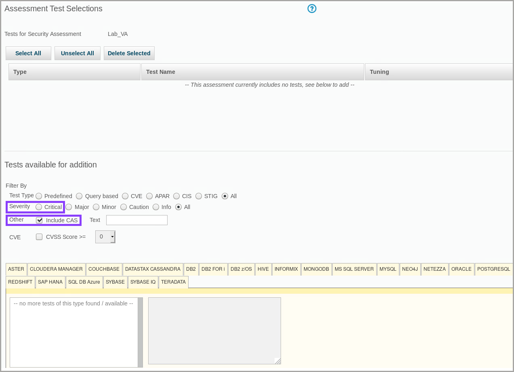
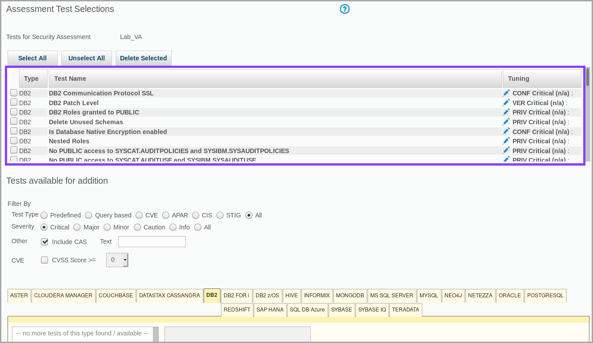
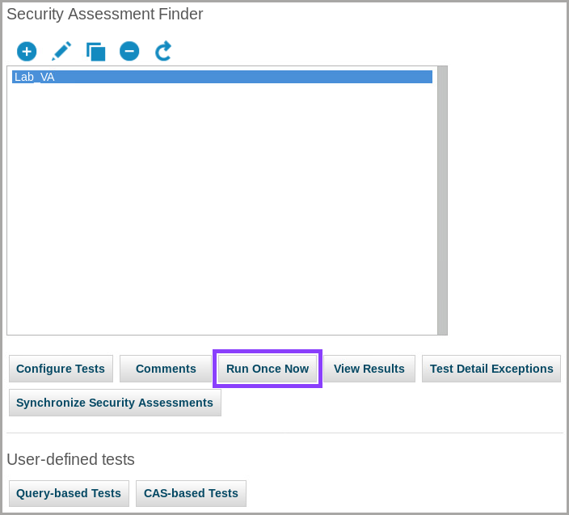
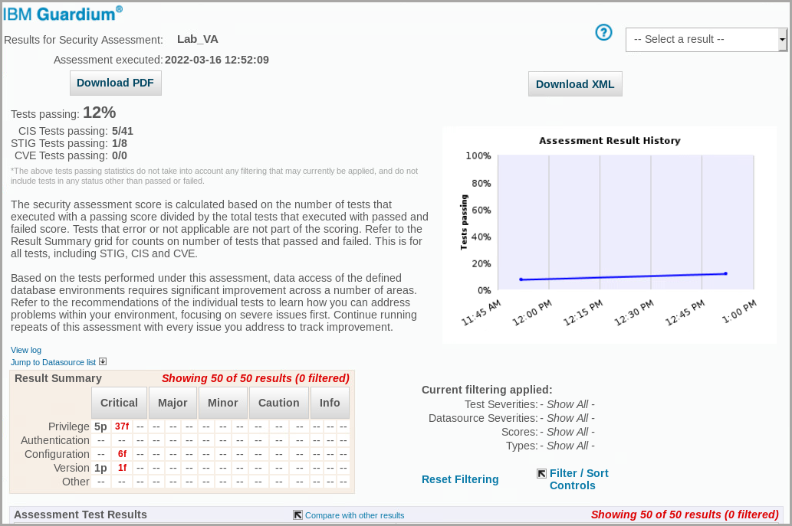
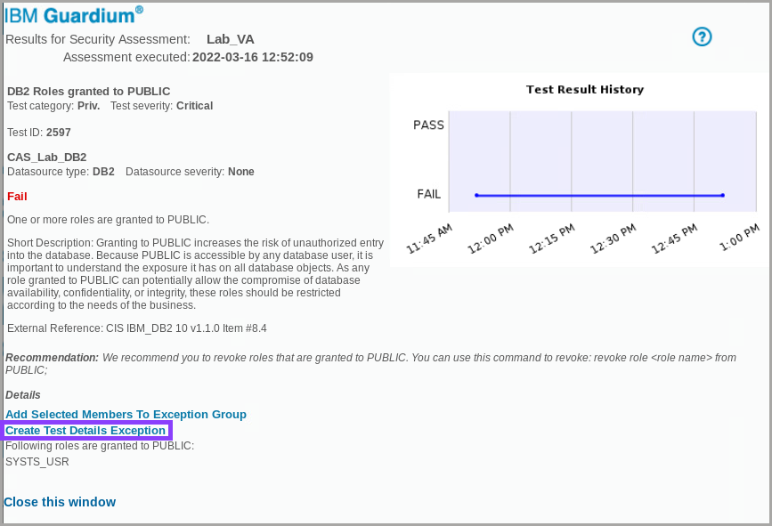
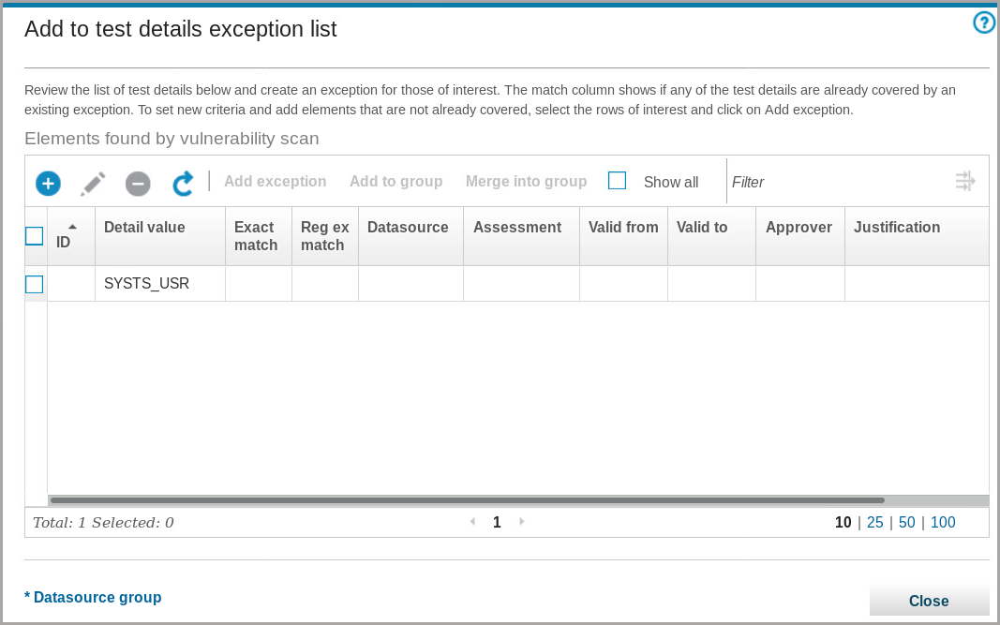

# Evaluación de la vulnerabilidad

Guardium Vulnerability Assessment ayuda a identificar y abordar las vulnerabilidades de las bases de datos. El proceso de evaluación evalúa y sugiere acciones para mejorar la salud de su entorno de base de datos. Guardium proporciona pruebas predefinidas que puede añadir a las evaluaciones de seguridad, y puede definir pruebas personalizadas. En este ejercicio, se realizan las siguientes tareas:

*   Conceder permisos para crear y ejecutar evaluaciones de seguridad
*   Crear y ejecutar una evaluación de seguridad
*   Utilice el informe para reforzar la base de datos y validar la evaluación
*   Crear una excepción para probar la evaluación

## Ejecución de una evaluación de vulnerabilidades

Para crear y ejecutar evaluaciones de seguridad, un usuario de Guardium debe tener el rol vulnerability-assess. En un entorno con varias unidades gestionadas y un gestor central, el rol de usuario debe concederse en el gestor central.

En esta tarea, se verifica que el usuario admin tenga la función de evaluación de vulnerabilidades y acceso a las herramientas de evaluación de vulnerabilidades.

### Concesión de permisos para crear y ejecutar evaluaciones de seguridad

Para crear y ejecutar evaluaciones de seguridad, un usuario de Guardium debe tener el rol vulnerability-assess. En un entorno con varias unidades gestionadas y un gestor central, el rol de usuario debe concederse en el gestor central.

En este laboratorio, verificamos que el usuario `admin` tiene el rol de evaluación de vulnerabilidades y acceso a las herramientas de evaluación de vulnerabilidades.

1.  Inicie sesión en la consola gráfica MA170 Guardium como usuario `labaccessmgr` con la contraseña `P@ssw0rd`.

> Las funciones se gestionan desde el gestor central, en este caso MA170.

2.  Haga clic en **Acceso** > **Gestión de acceso**


3.  Para ver las funciones del usuario `labadmin`, haga clic en **Funciones**.
4.  Para activar la evaluación de vulnerabilidades para el usuario `labadmin`, desplácese hacia abajo, asegúrese de que la **función de evaluación de vulnerabilidades** está seleccionada y haga clic en **Guardar**.


5.  Para cerrar la sesión como usuario `labaccessmgr`, en el menú de cuentas del banner azul situado en el cuadrante superior derecho de la pantalla, haga clic en **Cerrar sesión**.


### Creación y ejecución de una evaluación de la seguridad

Después de verificar que el usuario de Guardium tiene el rol correcto, se crea, configura y ejecuta una evaluación de seguridad. Una evaluación de seguridad se asocia a un origen de datos o a un grupo de orígenes de datos. Cada fuente de datos contiene la información de conexión que Guardium utiliza para acceder y ejecutar pruebas en una base de datos. Añada pruebas predefinidas de Guardium para controlar lo que comprueba la evaluación.

Por lo general, una evaluación es un proceso iterativo. Se desarrolla un plan de acción que prioriza en qué vulnerabilidades concentrarse. La evaluación se ejecuta periódicamente, y los resultados de la evaluación detallan el progreso en la corrección de las vulnerabilidades. Después de solucionar los problemas de mayor prioridad, puede abordar las pruebas de menor prioridad.

En esta sección del laboratorio, iniciaremos sesión en el recopilador para crear y utilizar la evaluación

1.  Inicie sesión en la consola del colector Guardium *(C200)* como usuario `labadmin` con la contraseña `P@ssw0rd`
2.  Para comenzar la evaluación, en el menú de navegación de la izquierda, vaya a **Harden** > **Vulnerability Assessment** > **Assessment Builder**.


3.  Para añadir una prueba, haga clic en **Crear**


4.  En Descripción, escriba `Lab_VA` y haga clic en **Aplicar**.
5.  Para añadir una **fuente** de datos de clasificación, haga clic en **Añadir fuente de datos**.


6.  Seleccione la fuente de datos **raptor\_DB2\_DB2INST1** y haga clic en **Guardar**.

<Callout>
  The datasource is added to the security assessment.
</Callout>


> Observe que la fuente de datos aparece en la lista, pero la opción *Configurar pruebas* no está activada.

7.  Para activar *Configurar pruebas*, haga clic en **Aplicar**.

<Callout>
  You set up a security assessment and created a datasource for it to use. Now, you specify which tests the assessment runs.
</Callout>

8.  Para configurar las pruebas, haga clic en **Configurar pruebas**.



> La evaluación de vulnerabilidades es un proceso iterativo. Por lo general, al principio sólo se elige un subconjunto de alta prioridad de las pruebas disponibles. Después de resolver los problemas de seguridad de estas pruebas, puede incorporar pruebas de menor prioridad a la evaluación.

9.  Para filtrar las pruebas, seleccione Gravedad **Crítica**.


10. Desplácese hacia abajo y seleccione la pestaña **DB2**.


<Callout>
  Critical tests for the **IBM® Db2®** database are displayed.
</Callout>

11. Para seleccionar todas las pruebas críticas, haga clic en la primera prueba de la lista, desplácese hacia abajo, pulse la tecla **Mayús** y haga clic en la última prueba de la lista.


12. Haga clic en **Añadir selecciones**



13. Para volver a la ventana del Buscador de evaluaciones de seguridad, desplácese hacia abajo y haga clic en **Volver**.
14. Para ejecutar la evaluación de seguridad, haga clic en **Ejecutar una vez ahora**.



15. En la ventana de confirmación que indica que la prueba está en la cola de trabajos de Guardium, haga clic en **Aceptar**.
16. En el menú de navegación de la izquierda, vaya a **Harden** > **Vulnerability Assessment** > **Guardium Job Queue**.


17. Si el trabajo no tiene el estado *COMPLETADO*, haga clic en **Actualizar**

> Tenga en cuenta que la cola de tareas puede tardar unos minutos en ejecutarse, así que espere un poco y actualice la página para ver la tarea completada.

18. Consulte un informe completo disponible a través del **Generador de evaluaciones de seguridad**.

a. En el menú de navegación de la izquierda, vaya a **Harden** > **Vulnerability Assessment** > **Assessment Builder**

b. *Lab\_VA* se selecciona automáticamente. Haga clic en **Ver resultados**


19. Explore las distintas características del informe.

a. Haga clic en **Filtro / Ordenar** control.

b. En la ventana Sólo mostrar, en la columna Puntuación, seleccione **Suspenso** y haga clic en **Aplicar**.


> Con este criterio de filtrado, los resultados se filtran para mostrar sólo los fallos de evaluación.


c. Para descargar un archivo PDF de la evaluación de seguridad, haga clic en **Descargar PDF** y en **Aceptar** para cerrar la ventana abierta. A continuación, seleccione **Abrir con visor de documentos (por defecto)** y haga clic en **Aceptar**.

20. Para volver a la versión del navegador del informe, cierre el PDF.

### Utilizar los resultados de la evaluación para reforzar la base de datos

La corrección de vulnerabilidades es un proceso iterativo. El informe de evaluación de la seguridad proporciona no sólo una imagen de las pruebas que han fallado, sino también un conjunto de acciones sugeridas para corregir las vulnerabilidades reveladas por las pruebas fallidas. Después de aplicar las recomendaciones, ejecute de nuevo el informe para determinar qué vulnerabilidades persisten. Repita el proceso hasta que su entorno cumpla las normas de la organización.

En esta sección del laboratorio aprenderemos a utilizar el informe para reforzar una base de datos.

1.  En el informe de evaluación de la seguridad, desplácese por los resultados de las pruebas de evaluación.

> Observará que las pruebas que *fallaron* tienen recomendaciones, incluidos comandos sugeridos, para solucionar la vulnerabilidad.

2.  Localice las pruebas de evaluación con los siguientes nombres:

\- *Sin* acceso *público* a *SYSCAT.AUDITPOLICIES* y *SYSIBM.SYSAUDITPOLICIES*

\- *Sin* acceso *público* a *SYSCAT.AUDITUSE* y *SYSIBM.SYSAUDITUSE*

> Anote la causa del fallo y las recomendaciones, que incluyen los comandos de la base de datos para remediar los fallos.

3.  Cierre la ventana del informe.
4.  Ahora, podemos ejecutar los comandos SQL en el servidor de base de datos para corregir los fallos. Para acceder al servidor de base de datos, abra una consola de terminal.
5.  En la consola, cambie al usuario `db2inst1` con el siguiente comando:

```bash
su - db2inst1
```

6.  Para entrar en el entorno de comandos Db2, ejecute el comando `db2` en su terminal después de cambiar el usuario.


7.  Para conectarse a la base de datos, utilice el siguiente comando:

```bash
connect to sample
```

8.  Aplique las recomendaciones de las dos pruebas en el paso 2 de la evaluación.

> Las recomendaciones a menudo contienen dos órdenes a ejecutar, separadas por un punto. Cuando tenga dos comandos, ejecútelos como dos comandos separados. Para este laboratorio, sólo tenemos uno, así que ejecute cada comando por separado:

```bash
REVOKE ALL ON SYSIBM.SYSAUDITPOLICIES FROM PUBLIC 
```

```bash
REVOKE ALL ON SYSCAT.AUDITPOLICIES FROM PUBLIC 
```

```bash
REVOKE ALL ON SYSCAT.AUDITUSE FROM PUBLIC 
```

```bash
REVOKE ALL ON SYSIBM.SYSAUDITUSE FROM PUBLIC
```


9.  Vuelva a la consola Guardium en *C200*. y acceda al Buscador de evaluaciones de seguridad en **Harden** > **Vulnerability Assessment** > **Assessment Builder**.
10. Para iniciar la segunda evaluación, haga clic en **Ejecutar una vez ahora**.
11. En la ventana de confirmación que indica que la prueba está en la cola de trabajos de Guardium, haga clic en **Aceptar**.
12. En el menú de navegación de la izquierda, vaya a **Harden** > **Vulnerability Assessment** > **Guardium Job Queue**.
13. Si el trabajo no tiene el estado de completado, haga clic en **Actualizar**.
14. Para ver los resultados, vaya a **Harden** > **Vulnerability Assessment** > **Assessment Builder**.
15. Para ver los resultados de la evaluación, haga clic en **Ver resultados**.



> Observe que el resumen de resultados muestra una mejora en el índice de aprobados. El gráfico del historial de resultados de la evaluación muestra la mejora del progreso.

16. Para filtrar los resultados de modo que sólo se muestren las pruebas con un estado de Aprobado, haga clic en **Filtrar / Ordenar controles**, en la columna Puntuación, seleccione **Aprobado** y haga clic en **Aplicar**.


17. Desplácese hacia abajo y vea los detalles de las vulnerabilidades que abordó.


### Creación de una excepción

A veces desea que una prueba de evaluación se aplique de forma general a su entorno, pero quiere crear una excepción. Por ejemplo, la prueba puede requerir que ningún usuario de la base de datos tenga un rol determinado, pero algunos usuarios necesitan o requieren ese rol. En este caso, puede crear una excepción. La prueba se ejecuta, pero permite la excepción. La excepción se documenta en los resultados de la prueba.

En esta tarea, se crea una excepción y se visualizan los resultados.

1.  Restablecer el filtrado para mostrar todos los resultados.
2.  En la sección Resultados de la prueba de evaluación, localice los **roles Db2 concedidos a la** prueba **PÚBLICA**.


3.  Haga clic en el enlace **Roles Db2 concedidos a PÚBLICO**.



4.  Haga clic en **Crear detalles de prueba Excepción**



5.  Seleccione **SYSTS\_USR**

<Callout>
  The Add exception link is enabled.
</Callout>


6.  Haga clic en **Añadir excepción**.
7.  Cambie la Fecha final a dos días después de la fecha actual.
8.  Para la hora de finalización, elija **23:00**.
9.  En Justificación, escriba `Lab Exercise`.


10. Haga clic en **Guardar**
11. Cierre el cuadro de diálogo de confirmación.
12. En la lista de excepciones Añadir a los detalles de la prueba, haga clic en **Cerrar**.

> La ventana de detalles del informe "Roles Db2 concedidos a PUBLIC" muestra ahora la excepción de prueba.


13. Cierre la ventana de detalles de Roles Db2 concedidos a PÚBLICO y cierre la ventana de resultados de las evaluaciones de seguridad.

En este laboratorio hemos aprendido a utilizar las siguientes funcionalidades de Guardium Data Protection:

*   **Conceder permisos para crear y ejecutar evaluaciones de seguridad**
*   **Crear y ejecutar una evaluación de seguridad**
*   **Utilice el informe para reforzar la base de datos y validar la evaluación**
*   **Crear una excepción para probar la evaluación**

Continúe hasta el [laboratorio 205](/guardium/level-4/204)
