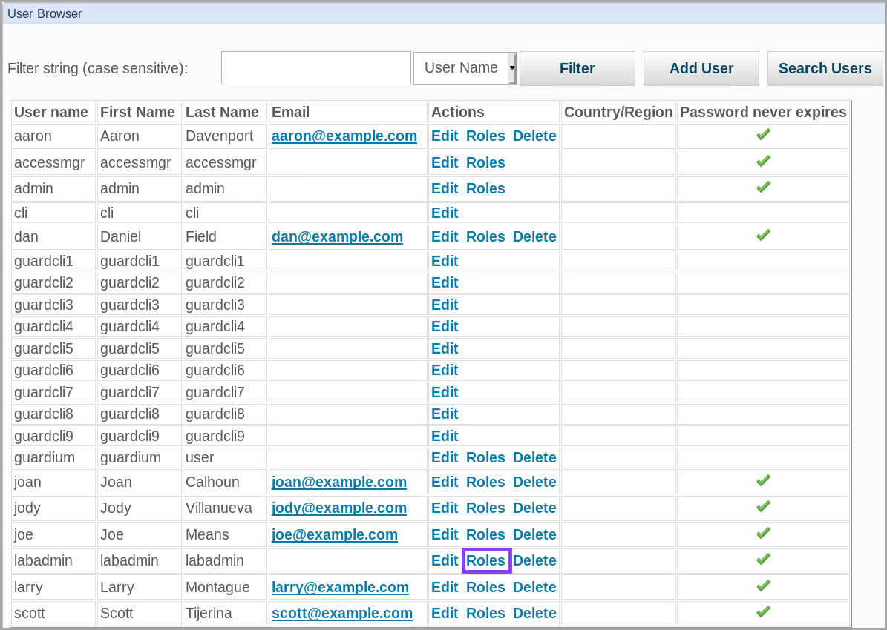
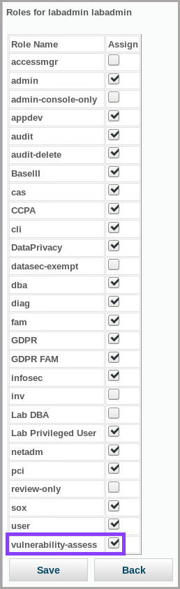
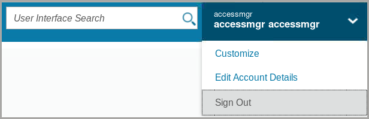
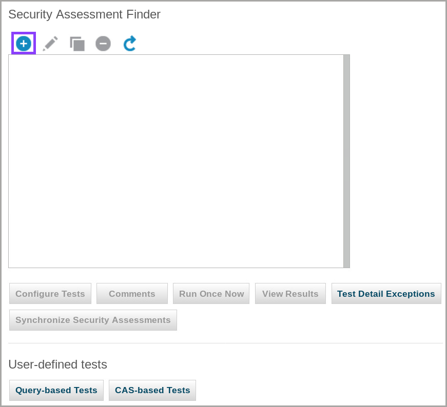
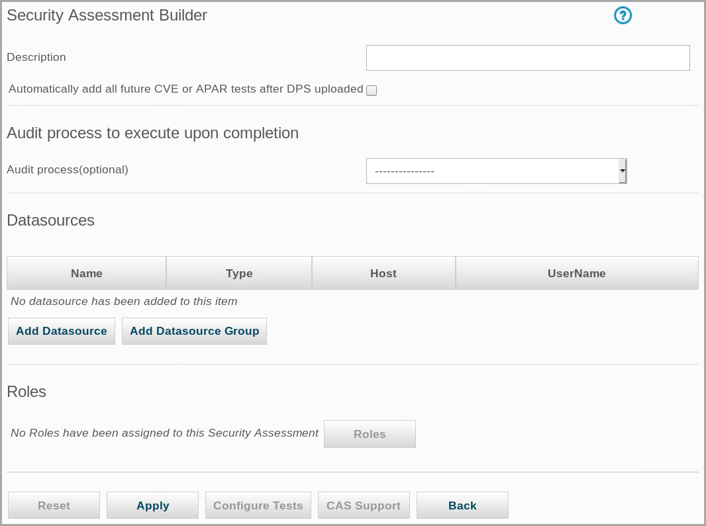

# Vulnerability Assessment

Guardium Vulnerability Assessment helps identify and address database vulnerabilities. The assessment process evaluates and suggests actions to improve the health of your database environment. Guardium provides predefined tests that you can add to security assessments, and you can define custom tests. In this exercise, you perform the following tasks:

- Grant permissions to create and run security assessments
- Create and run a security assessment
- Use the report to harden database and validate assessment
- Create an exception to test the assessment

## Running a Vulnerability Assessment

To create and run security assessments, a Guardium user must have the vulnerability-assess role. In an environment with multiple managed units and a central manager, the user role must be granted on the central manager.

In this task, you verify that the admin user has the vulnerability assessment role and access to the vulnerability assessment tools.

### Granting permissions to create and run security assessments

To create and run security assessments, a Guardium user must have the vulnerability-assess role. In an environment with multiple managed units and a central manager, the user role must be granted on the central manager.

In this lab, we verify that the `admin` user has the vulnerability assessment role and access to the vulnerability assessment tools.

1. Log in to the MA170 Guardium graphical console as user `labaccessmgr` with password `P@ssw0rd`.

> Roles are managed from the central manager, in this case MA170.

2. Click **Access** > **Access Management**

3. To view the roles for user `labadmin`, click **Roles**.

4. To enable vulnerability assessment for user `labadmin`, scroll down, ensure the **vulnerability-assess role** is selected, and click **Save**.

5. To log out as user `labaccessmgr`, from the account menu on the blue banner on the upper-right quadrant of the screen, click **Sign Out**.

### Creating and running a security assessment

After you verify that the Guardium user has the correct role, you create, configure, and run a security assessment. A security assessment is associated with a datasource or a group of datasources. Each datasource contains the connection information that Guardium uses to access and run tests on a database. Add Guardium predefined tests to control what the assessment checks.

Generally, an assessment is an iterative process. You develop an action plan that prioritizes which vulnerabilities to concentrate on. The assessment is run periodically, and assessment results detail the progress in remediating vulnerabilities. After you fix the highest priority problems, you can address the lower priority tests.

In this section of the lab, we log in to the collector to create and use the assessment

1. Log in to the Guardium collector _(C200)_ console as user `labadmin` with password `P@ssw0rd`

2. To begin the assessment, in the left navigation menu, go to **Harden** > **Vulnerability Assessment** > **Assessment Builder**.

3. To add a test, click **Create**

4. For Description, type `Lab_VA` and click **Apply**.

5. To add a classification datasource, click **Add Datasource**.

// In this lab, we learned how to use the following functionality from Guardium Data Protection:

- **Discover sensitive data**
- **Refine the discovery results**
- **Verify that information is updated**

Continue onward to [Lab 204](/guardium/level-4/204)
