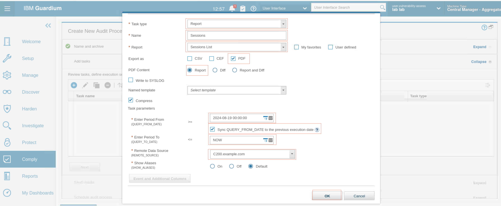
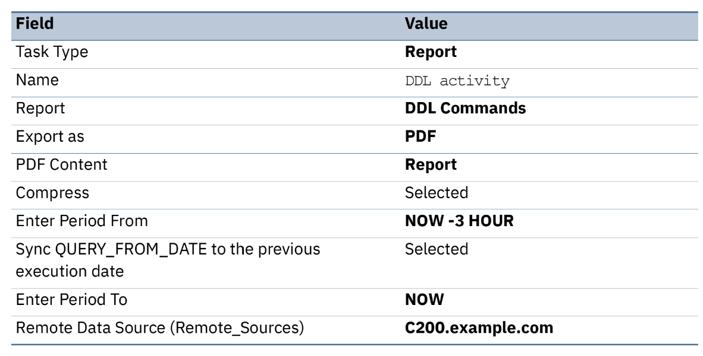
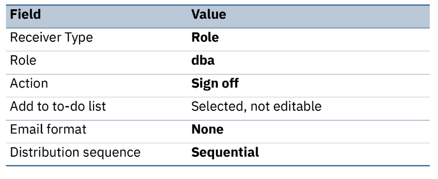
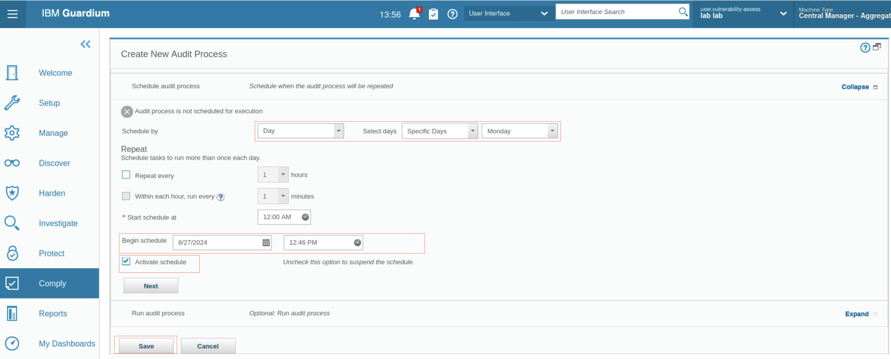
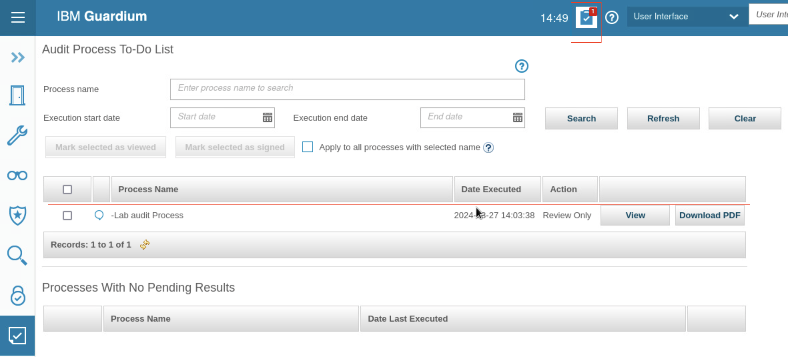
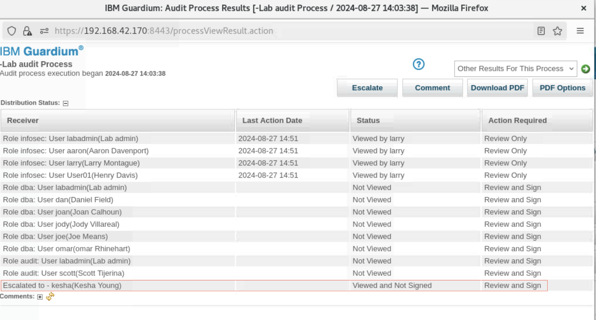
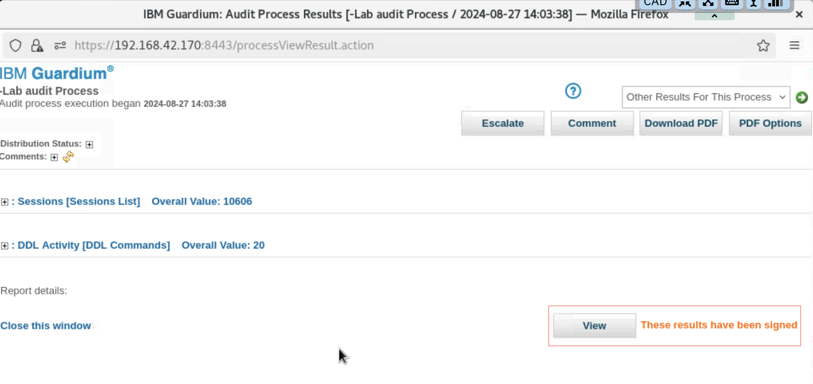
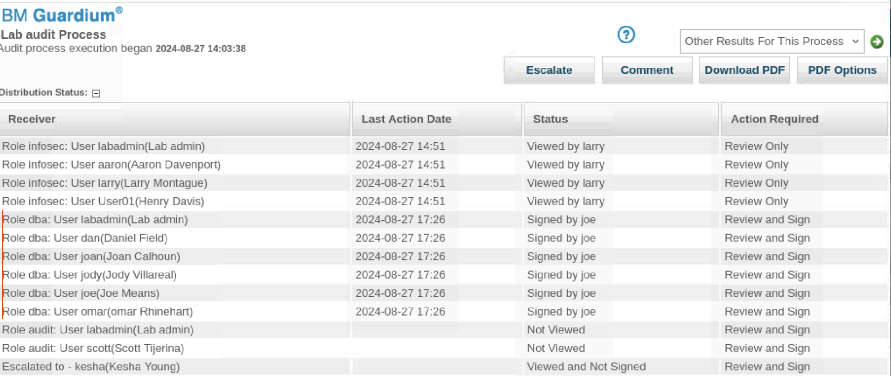
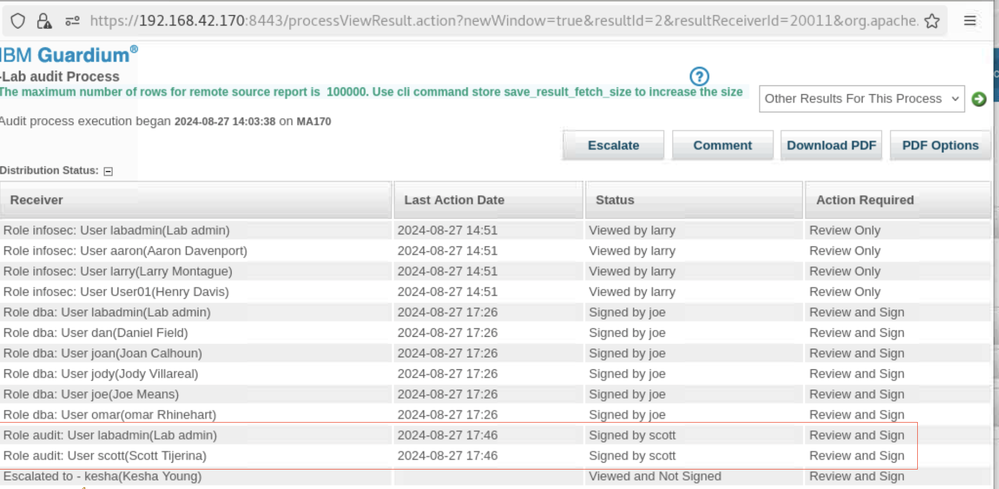
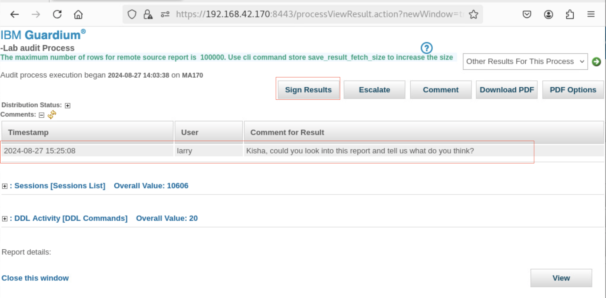

# Creación de una auditoría

En esta sección del laboratorio, exploramos la automatización del proceso de auditoría. Se crea una definición de proceso de auditoría que envía trabajo, en forma de un par de informes, a los roles infosec, dba y audit. El flujo del proceso se parece a la siguiente figura.

Una vez iniciado, el proceso de auditoría coloca el trabajo en la lista de tareas pendientes del rol infosec. Todos los usuarios con este rol ven el trabajo pero sólo uno debe hacerlo. Este trabajo está marcado como *Continuable*, lo que significa que el sistema no espera a que el usuario complete el trabajo antes de pasar al siguiente receptor.

El siguiente receptor es el rol dba. El trabajo aquí está marcado como *Revisar y Firmar*. El trabajo no avanza hasta que un usuario con el rol dba lo revisa y firma. Además, el usuario debe explícitamente *Continuar* el trabajo al siguiente receptor. El siguiente y último receptor es el rol de auditor, donde de nuevo el usuario debe *Revisar y Firmar* el trabajo y debe *Continuarlo* para seguir adelante. En este caso, el trabajo se traslada al final del proceso.

Para este laboratorio, el usuario con rol infosec escala el trabajo a un usuario específico, *kesha*, y le pide a ese usuario que *Revise y Firme* el trabajo. El escalado no es algo que se pueda diseñar en un proceso de auditoría; ocurre en tiempo de ejecución a discreción del usuario que procesa el trabajo.

Puedes ejecutar este proceso en el agregador o en el recopilador. En este ejercicio, se ejecuta en el agregador, porque el agregador tiene una visión holística del entorno de datos, y también para reducir la carga del recopilador.

## Creación de una definición de proceso de auditoría

En este ejercicio se define un proceso de auditoría.

1.  Inicie sesión en la consola gráfica **del gestor/agregador central MA170** como usuario `lab` con la contraseña `P@ssw0rd`.

> Debe iniciar sesión con el usuario `lab` y no con el usuario `labadmin` porque `labadmin` es miembro del rol infosec, y esa pertenencia interfiere con el proceso de revisión.

2.  Vaya a **Cumplir > Herramientas y vistas > Generador de procesos de auditoría**. Se abrirá el panel Generador de procesos de auditoría.
3.  Para ver los procesos que ya existen, seleccione **Todos**.

4.  Para crear un nuevo proceso de auditoría, haga clic en **Nuevo**. Se abre el panel Crear nuevo proceso de auditoría. La ventana incluye cinco secciones. Cada sección se completa una tras otra, pero puede editarlas más tarde.
5.  Introduzca el **nombre** para el proceso de auditoría, como **-Proceso de auditoría de laboratorio**, y haga clic en **Mostrar opciones avanzadas**. Se muestran las opciones avanzadas.
6.  Para garantizar que se archivan los resultados del proceso de Auditoría, seleccione la casilla de verificación Archivar.

7.  Pulse **Siguiente**. Se abre la sección Añadir tareas.
8.  Haga clic en **Nuevo**. Se abre la ventana Nueva tarea.

*   Para configurar la nueva tarea, utilice la siguiente tabla.

*   La nueva pantalla de tareas debe tener el siguiente aspecto

*   Haga clic en **Aceptar**.

La ventana Nueva tarea se cierra y la tarea **Sesiones** se añade a su proceso.

9.  Para configurar una segunda tarea, utilice la siguiente tabla.

*   La nueva pantalla de tareas debe tener el siguiente aspecto

*   Haga clic en **OK**. Ahora tiene dos tareas.

10. Haga clic en **Siguiente**. Se abre la sección Receptor. Crearemos 3 receptores.

*   Para añadir un receptor, haga clic en **Nuevo**
*   Cree el primer receptor utilizando la siguiente tabla:

*   Cree el segundo receptor utilizando la siguiente tabla:

*   Cree el tercer receptor utilizando la siguiente tabla:

*   En la sección Receptores se enumeran tres receptores.

11. Para pasar a la sección de programación del proceso de auditoría, haga clic en **Siguiente**.
12. Utilice la siguiente tabla para crear la programación.

13. En este punto, puede ejecutar el proceso, pero en su lugar, desplácese hacia abajo y haga clic en **Guardar**. Volverá al **Generador de procesos de auditoría** y su nuevo proceso aparecerá en la lista.

14. Expanda la sección **Ejecutar proceso de auditoría** y haga clic en **Ejecutar una vez ahora**. El proceso se ejecuta y proporciona los resultados. Los resultados se envían a los roles infosec y dba simultáneamente.
15. Salga ahora de la GUI de Guardium porque, para gestionar los resultados de la auditoría, necesita iniciar sesión como usuarios diferentes.

## Gestión de los resultados de las auditorías

En este ejercicio, usted desempeña varios papeles para gestionar los resultados del proceso de auditoría.

1.  Como larry, miembro del rol infosec, eres el primer usuario en ver los resultados, pero no estás obligado a aprobarlos. Añades comentarios al proceso y, a continuación, se los comunicas a tu compañera de equipo, kesha.
2.  El flujo de trabajo del proceso envía los resultados al rol dba al mismo tiempo. Como usuario joe, miembro del rol dba, firma los resultados. Joe no necesita que un miembro del rol infosec vea o firme los resultados. La firma de Joe hace que los resultados se envíen al rol de auditoría. Joe debe firmar antes de que los resultados se envíen al rol de auditoría.
3.  Como scott, miembro de la función de auditoría, usted recibe los resultados sólo después de que joe los firme. Usted firma los resultados. Este visto bueno completa el flujo del proceso para esta rama; sin embargo, todo el proceso no se completa hasta que Kesha da su visto bueno, debido a la escalada.
4.  Como usuario kesha, usted ve y firma la escalada de larry. Esto completa el proceso de flujo de trabajo.

### Revisar y escalar los informes de auditoría (Larry)

<Persona>
  For this section of lab you will be acting as `larry` a user with the `infosec` role
</Persona>

El primer paso en el proceso es revisar y luego escalar el informe. Larry forma parte de la función de infoseguridad.

1.  Inicie sesión en la **consola gráfica del MA170** como usuario `larry` con la contraseña `P@ssw0rd`.
2.  Ver la barra de herramientas. La lista de **tareas pendientes** indica que hay una tarea por completar.
3.  Haga clic en el icono **Tareas pendientes**. Se abre la lista de tareas pendientes del proceso de auditoría.

El proceso de auditoría que ha creado y ejecutado aparece en la lista de tareas pendientes. Este proceso está incluido en la lista del usuario larry porque es miembro del rol infosec. Recuerde que el informe se envió al rol infosec con los siguientes parámetros:

*   Se distribuye simultáneamente al rol dba. Es decir, un usuario infosec no debe realizar ninguna acción antes de que el proceso aparezca en las listas de tareas pendientes de los usuarios dba.
*   Sólo es necesario que el proceso sea revisado. Es decir, basta con que un miembro del rol infosec (cualquier usuario con ese rol) vea el informe.

4.  Haga clic en **Ver**. Los detalles del proceso se abren en otra ventana del navegador.

5.  Despliegue y visualice las distintas secciones.

*   **Estado de la distribución** - Se ve que el acto de ver el informe ha iniciado el proceso de revisión, y se registra una acción.

*   **Comentarios**. Actualmente no hay comentarios.
*   **Informe**: **Sesiones (Lista de sesiones)** - Este es el primer informe que se añadió al proceso de auditoría.

*   **Informe: Actividad DDL (Comandos DDL)** - Este es el segundo informe que se añadió al proceso de auditoría.

> **Nota:** Los informes pueden estar vacíos. No pasa nada, ya que este laboratorio se centra en el proceso, no en el contenido de los informes.

6.  Ahora, añades un **comentario** y **escalas** a tu compañera de trabajo **Kesha**.

*   Haga clic en **Comentar**. Se abre la ventana Comentario del usuario.
*   Haga clic en **Añadir comentarios**.
*   Añada un comentario en la ventana y haga clic en **Aplicar**. Se añade el comentario.

*   Para volver a la ventana de resultados de la auditoría, haga clic en **Atrás**.
*   Haga clic en **Escalar**. Se abre una ventana con una lista de receptores.
*   Para Receptor, seleccione **kesha**.
*   Establecer Acción Requerida para **Revisar y Firmar**.

*   Haga clic en Escalar y cierre el cuadro de diálogo de confirmación.

En la ventana de resultados, el estado de **distribución** muestra ahora **kesha**.

Los resultados aún no se distribuyen al rol de auditoría. Esta distribución se produce sólo después de que el rol dba firma los resultados porque estos receptores eran secuenciales.

7.  Para cerrar la ventana de resultados del proceso, desplácese hacia abajo y haga clic en **Cerrar esta ventana**.
8.  Sal de la consola.

### Aprobación del informe de auditoría (Joe)

<Persona>
  For this section of lab you will be acting as `joe` a user wih the `dba` role
</Persona>

Joe tiene que firmar el informe para que se envíe a la función de auditoría. Él forma parte de la función dba.

1.  Inicie sesión en la **consola gráfica del MA170** como usuario **joe** con la contraseña **P\@ssw0rd**.
2.  Abra la **lista de tareas pendientes**.
3.  Para abrir la ventana de detalles del proceso, pulse **Ver**. En esta ventana, hay un botón Firmar resultados.

4.  Haga clic en **Firmar resultados**. Desaparece el botón Firmar resultados y aparece un mensaje en la ventana del informe indicando que los resultados se han firmado.

> **Nota:** Joe normalmente ve los resultados del flujo de trabajo de distribución, incluido el estado de distribución y los dos informes.

5.  Haga clic en **Continuar**. El botón Continuar desaparece.

> **Nota:** Debe firmar los resultados y hacer clic en Continuar para que el proceso siga adelante.

6.  Abra el Estado de Distribución y observe que ahora el rol, dba, está actualizado con **Firmado por joe**.

> Sólo un miembro del rol dba debe firmar la auditoría para completar la tarea para todos los miembros. Además, el estado de la auditoría de rol se cambió a **No visto** y se enumeran todos los usuarios con esa auditoría de rol.

7.  Desplácese hacia abajo y haga clic en **Cerrar esta ventana**. Salga de la consola.

### Aprobación del informe de auditoría (Scott)

<Persona>
  For this section of lab you will be acting as `scott` a user wit the `audit` role
</Persona>

La siguiente tarea es firmar el informe como miembro de la función de auditoría. Scott forma parte de la función de auditoría.

1.  Inicie sesión en la **consola gráfica del MA170** como usuario **scott** con la contraseña **P\@ssw0rd**.
2.  Abra la **lista de tareas pendientes** y consulte el informe. Observe que el **estado de distribución** tiene un registro de todas las acciones que se han realizado hasta el momento, y las acciones que quedan pendientes. Además, la sección de comentarios incluye los comentarios de larry.

3.  **Firme** el informe y haga clic en **Continuar**.

> **Nota:** Debe firmar los resultados y hacer clic en **Continuar** para que el proceso siga adelante.

4.  **Cierre la ventana** y **cierre la sesión** como usuario scott.

### Reconciliar la escalada (Kesha)

<Persona>
  For this section of lab you will be acting as `kesha` a Guardium user with no specific role
</Persona>

Larry escaló el flujo de trabajo a Kesha, y designó que Kesha necesita ver y aprobar el flujo de trabajo. En esta tarea, usted concilia la escalación.

1.  Inicie sesión en la **consola gráfica del MA170** como usuario **kesha** con la contraseña **P\@ssw0rd**.
2.  Compruebe la notificación y abra el informe.

3.  **Firme** el informe y compruebe el **estado de distribución**. Todas las tareas se han completado.

### Ver los informes

En esta tarea, se visualizan los informes que rastrean el progreso del flujo de trabajo. Esto es algo que hace un administrador de Guardium para asegurarse de que el flujo de trabajo funcionó correctamente.

1.  Inicie sesión en la **consola de Guardium (MA170)** como usuario **labadmin** con la contraseña **P\@ssw0rd**.
2.  Vaya a **Comply > Herramientas y Vistas > Registro del Proceso de Auditoría**. El registro muestra que el usuario **lab** ejecutó el flujo de trabajo.

> **Nota:** Si el informe no muestra los datos, establezca la fecha de inicio en `NOW-3 DAYS`.

## Enhorabuena, ha completado todos los laboratorios de Guardium Data Protection Nivel 4.
