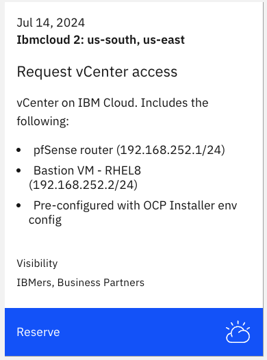
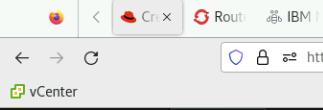
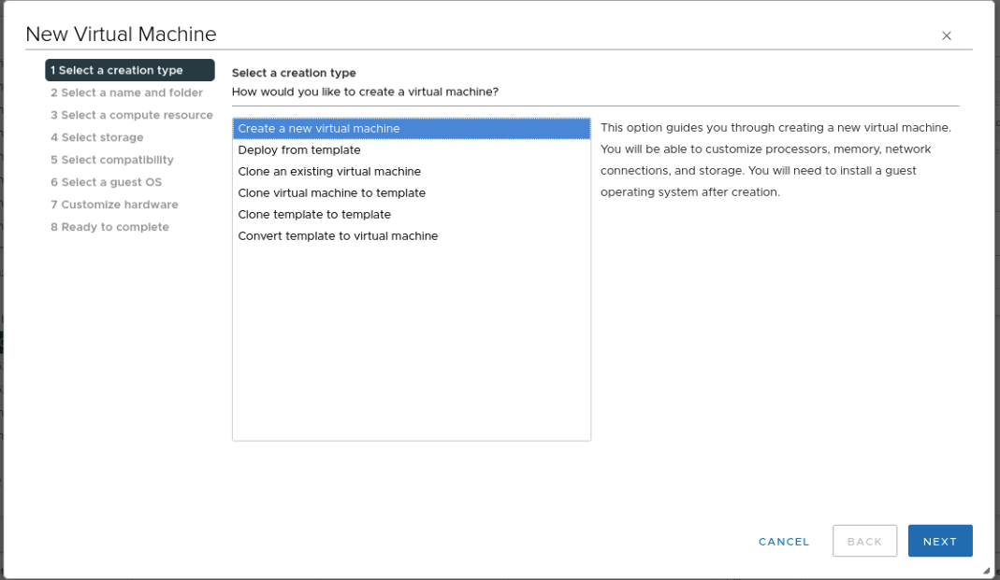
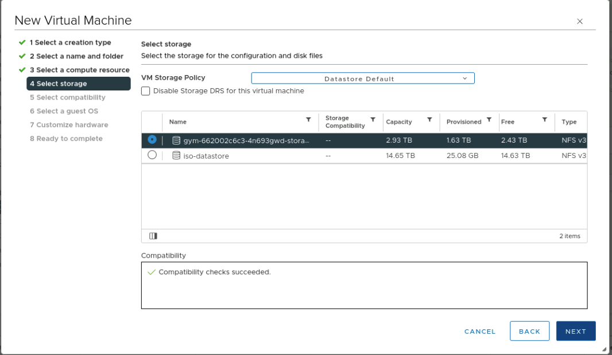
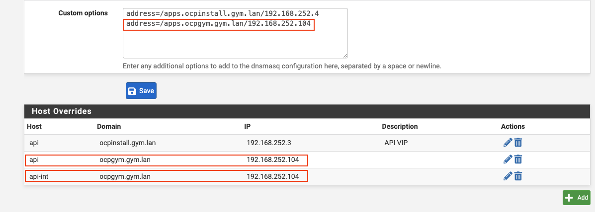
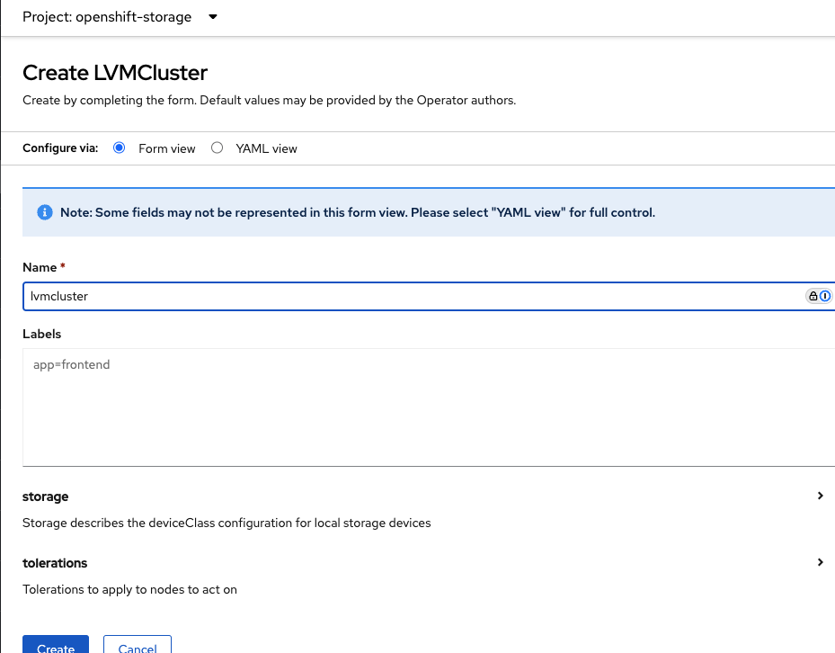
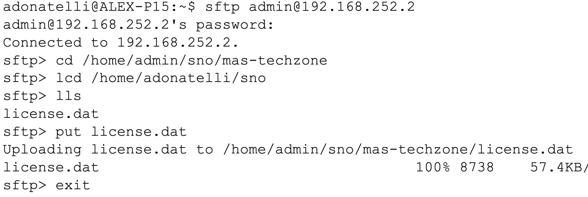
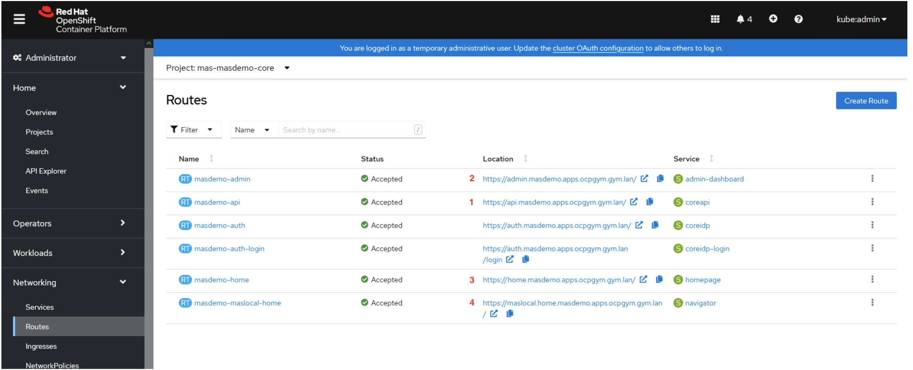

# Instalación de SNO MAS

Si es un Business Partner de IBM o un empleado de IBM, se trata de una guía skinny pero completa para crear un entorno MAS Manage en IBM TechZone.


Diagrama general de la red Gym


En el nivel superior, se describen los pasos siguientes en esta guía:

1.  Cómo crear un entorno basado en vSphere en TechZone. Este entorno incluye un servidor de base y un direccionador con DHCP, NAT y DNS.
2.  La creación de un archivo iso de SNO utilizando la consola Red Hat y su descarga en el servidor de base
3.  Cómo conectarse al entorno basado en vSphere a través de VPN
4.  La carga del archivo iso de SNO desde el servidor de base a vCenter
5.  Cómo crear una instancia de VM que ejecutará la SNO y utilizar el archivo iso cargado para arrancar
6.  Cómo clonar desde GitHub la colección Ansible que se utilizará para instalar MAS y ejecutarlo

## Crear un entorno basado en vSphere en TechZone

1.  Vaya a [https://techzone.ibm.com/collection/ocp-gymnasium/environments ](https://techzone.ibm.com/collection/ocp-gymnasium/environments)e inicie sesión utilizando su IBMId

    Verá el siguiente panel, haga clic en **Reserva** botón

    

2.  En la página Crear una página de reserva y pulse **Presentar** botón

    **Nombre:** Taller MAS SNO
    **Objeto:** Práctica/Autoeducación 
    **Descripción del propósito:** Educarme a mí mismo como instalar SNO y MAS 
    **Geografía preferida:** AMÉRICA 
    **Tamaño del almacén de datos de VMware:** 3 TB 
    **Acceso VPN:** Habilitar

También debe haber recibido un correo electrónico que **"La solicitud de entorno/acceso es de suministro"**

Cuando el entorno esté listo, recibirá otro correo electrónico con el asunto **"Su entorno está listo"**

3.  El entorno que se está creando contiene un sistema Bastion (basado en RHEL) y un direccionador (basado en pfSense). Cuando esté disponible, puede VPN en ella y acceder directamente a los equipos que se ejecutan en ella.

Configurar la VPN es muy sencillo. Cuando el entorno estará listo, puedes hacer clic en el panel y verás una página con mucha información útil. En la parte inferior de esa página, encontrará el botón para descargar la configuración VPN de Wireguard desde la página de reserva.

Descargue la configuración, instale Wireguard ( [https://www.wireguard.com/install/ ](https://www.wireguard.com/install/)) si no lo tiene ya e importe la configuración. Puedes activar la VPN según sea necesario y acceder también al clúster de OpenShift que vamos a desplegar.

## Creación de un nuevo clúster

1.  Navegue a instancia reservada en Techzone. Haga clic en el botón azul, que abrirá una nueva ventana del navegador. Haga clic en **+** signos para expandir las secciones:

    

Haga clic en la opción Escritorio remoto para abrir el escritorio remoto de Bastición. El bastión ejecuta RHEL, por lo tanto, puede utilizar el **Actividades** en la parte superior izquierda para abrir un panel y haga clic en el icono de Firefox.

2.  Inicie sesión en Red Hat Console para OpenShift ( [https://console.redhat.com/openshift ](https://console.redhat.com/openshift)). Usted debe ver un azul **Crear clúster**. Haga clic en él.

> **Nota:** Puedes registrarte, si aún no has registrado.


3.  En la siguiente pantalla, haga clic en **Datacenter** y haga clic en el azul **Crear clúster**.

    

Rellene el formulario que aparece de esta manera: 
**Nombre de clúster:** ocpgym 
**Dominio base:** gym.lan 
**Versión de OpenShift:** OCP 4.12.x 
**seleccionar** "Instalar nodo único OpenShift (SNO)" 
**Configuración de red de hosts:** Sólo DHCP


4.  Haga clic en **Siguiente**. No cambie nada en la siguiente pantalla y haga clic de nuevo **Siguiente**.

    

5.  Haga clic en **Añadir host**. En el diálogo que se mostrará, seleccione **Archivo de imagen completa: Descargar un ISO autocontenido** , cargue el **Clave pública SSH** y haga clic en el **Generar ISO de descubrimiento**.

    

> **Nota:** En caso de que nunca hayas usado SSH y necesitas generar tus claves privadas/públicas, usa la herramienta ssh-keygen. Abra una ventana de terminal en el ordenador de base, escriba ssh-keygen y acepte todos los valores predeterminados (es decir, la ubicación de los archivos, no passphrase, etc.). Cuando haya terminado, puede encontrar la clave pública SSH en la carpeta \~/.ssh. Tenga en cuenta que también puede evitar cargar la clave pública SSH, pero esto evitará que en el futuro acceda al nodo utilizando SSH.

```bash
    $ ssh-keygen
    $ cat .ssh/id_rsa.pub
```

6.  Después de que se haya generado el ISO de descubrimiento, en el diálogo siguiente, haga clic en **Descargar el ISO de descubrimiento** y guarde el archivo ISO en el sistema Bastion. Tendrá un nombre de archivo como este: **e430fdbb-8c63-4b42-b15f-62bd3d8fbef0-discovery.iso**

Cierre el diálogo. Volveremos a esta pantalla más tarde, pero ahora queremos subir el ISO al centro TechZone vCenter.

## Crear una máquina virtual en vSphere

1.  En la ventana de Firefox, observe que hay un botón predefinido para acceder al vCenter.

    

Haga clic en ese botón. Puede encontrar la credencial para vCenter en la parte inferior de la página de reserva de Techzone.

2.  Una vez que inicie sesión, en la parte superior izquierda de la pantalla debe ver un símbolo de un disco de tambor. **Pulse el botón**. Abra el menú desplegable y seleccione el almacenamiento con el nombre que empieza por " **gimnasio-** ". En la parte derecha, seleccione **Archivos**.

    

3.  Cree una carpeta iso denominada "sno" bajo el elemento de almacenamiento principal utilizando la **NUEVA CARPETA** opción mostrada en la imagen anterior. **Pulse el botón** sobre el recién creado **sno** y cargar en ella la ISO que ha descargado de Red Hat utilizando el **CARGAR ARCHIVOS**. Puede comprobar el progreso de carga desde la ventana de estado.

4.  Cuando la ISO ha subido, creamos una nueva VM que se convertirá en el Nodo Único OpenShift. **Pulse el botón** en el icono de los servidores en la parte superior izquierda de la pantalla y abrir todas las secciones

    

5.  **Haga clic derecho** en la agrupación de recursos resaltada y elegida **Nueva máquina virtual**

    

6.  En el diálogo que se mostrará, seleccione **Crear una nueva máquina virtual** y pulse **Siguiente**

    

7.  Establecer el **nombre de máquina virtual** como **ocpgym** y seleccione la carpeta la que comienza con el gimnasio-...

    

8.  Pulse el butón que díce **Siguiente**. Seleccione el recurso de cálculo que empieza por **gym-...**

    

9.  Pulse el botón **Siguiente**. Seleccione el almacenamiento que empieza por **gym-...**

    

10. Pulse el botón **Siguiente**. Seleccionar compatibilidad **ESXi 7.0 U2 y posterior**.

11. Pulse el botón **Siguiente**. Seleccionar familia de sistema operativo huésped **Linux** y **Versión RHEL 8 64 bits**

12. En el siguiente conjunto de paneles **CPU a 16** , **memoria a 64** , **disco primario 300 GB** , utilice el **AÑADIR NUEVO DISPOSITIVO** para añadir un disco duro secundario de **500 GB** , establezca la **Nueva unidad de CD/DVD a "Archivo ISO del almacén de datos"** y **seleccionar** el ISO que ha subido antes.

Asegúrese de que **seleccionar** el **Conectar** checkmark. El resultado final debería ser como la siguiente imagen.


13. En este punto, haga clic en **Opciones de VM** y abrir el **Avanzado**. Buscar el **Parámetros de configuración** y haga clic en **CONFIGURACIÓN DE EDIT**. En el panel siguiente, haga clic en **AÑADIR PARÁMETROS DE CONFIGURACIÓN**. Escriba el nombre **disk.EnableUUID** y establezca el valor en **VERDADERO**

    

Pulse el botón **OK** sobre el **Parámetro de configuración**.

14. Pulse el botón **Siguiente**. Revise una vez más todo y haga clic en **Acabado**.

La nueva VM ahora debe mostrar en su piscina bajo el bastión y el router. **Seleccione** pulsando en él e iniciarlo ya sea escribiendo **crtl + alt + b** o bien **clic derecho** y utilizando el **Alimentación-> Power ON** elemento de menú.

## Instalación del clúster de OCP

1.  Volver a la página **Ventana Redhat** donde ha creado un nuevo clúster. Si está en la página de host, debe ver aparecer un host.

    

2.  Cambiar su nombre de host a **ocpgym**. La línea debe tener este aspecto:

    

3.  Pulse el botón **Siguiente**. En la pantalla de almacenamiento, pulse **Siguiente**. En la pantalla de Networking no cambie nada y haga clic en **Siguiente**. Algunas veces se necesita un poco de tiempo para llegar a un **Listo** estado, debido a que NTP es inalcanzable. No se preocupe, tenga paciencia y espere a que el estado se convierta en **ready** y haga clic en **Siguiente**.

4.  En el **Revisar y crear** todas las validaciones deben ser buenas y puede hacer clic en **Instalar clúster**.

    

5.  La siguiente pantalla le permitirá seguir la instalación del clúster hasta su final. Tardará alrededor de 45 minutos en completarse.

    

    Puede seguir los detalles del progreso utilizando la **Ver sucesos de clúster** en la parte inferior de la página. Puede pasar al siguiente paso mientras se está realizando la instalación.

## Configuración del direccionador

Mientras estamos esperando que se instale el SNO, vamos a configurar el router.

1.  Vuelva al panel de vCenter y pulse el botón **ocpgym** VM, En el panel derecho que se mostrará, tenga en cuenta la **Dirección IP** de la VM, en este caso la dirección IP es 192.168.252.104.

    

2.  Entonces **haga clic en** sobre la **VM direccionador** en el panel izquierdo. Sobre la **panel derecho** que se mostrará, haga clic en el **VER TODAS LAS 4 DIRECCIONES IP** y escoja la de la **192.168.252.x subred**. En este caso es **192.168.252.1**.

    

3.  Abrir un nuevo **ventana del navegador** y navegar a la dirección **192.168.252.1**. Debe ver el panel de inicio de sesión pfsense. Uso **admin** como nombre de usuario y **contraseña de vCenter** se ha utilizado antes de iniciar la sesión en vCenter ( **que está en la página Reservation** ).

    

4.  En la parte superior, utilice el **Servicios** tirar hacia abajo y elegir **Reenviador de DNS**

    

5.  En la página que se mostrará, hay algunas configuraciones que hacer en la parte inferior de la página utilizando el **ocpgym** Dirección IP.

    *   Añadir **address=/apps.ocpgym.gym.lan/ 192.168.252.104** a la **Opciones personalizadas** y Save.

    *   Añadir dos **Alteraciones temporales de host** utilizando el botón Añadir:

        **Host:** api, **Dominio:** ocpgym.gym.lan, **Dirección IP:** 192.168.252.104

        **Host:** api-int, **Dominio:** ocpgym.gym.lan, **Dirección IP:** 192.168.252.104

    

        Su página se parece a esto al final:

    

6.  Vaya a la parte superior de la página y aplique los cambios utilizando el botón **Aplicar cambios**

    

    Puede finalizar la sesión desde **pfSense** utilizando el icono de puerta de salida situado en la parte superior izquierda de la página.

Esperemos que en este momento el clúster esté instalado. Vuelva a la página de instalación de Red Hat Cluster y debe ver una página que incluye:

## Configurar clúster de OCP

1.  Cambiar a **Pestaña del navegador de la consola Redhat** y compruebe si la creación del clúster OCP se ha completado.

    

2.  Usted puede **hacer clic en** el **URL de control web** para acceder al nodo único OpenShift. Utilice el **Nombre** y **Contraseña** se muestra en la página de cluter para iniciar sesión. Revisa a tu alrededor para ver si todo está en forma.

3.  El paso siguiente es proporcionar el clúster con una clase de almacenamiento y un suministrador relacionado. Ir a la **OperatorHub** (menú de la izquierda bajo Operadores) y **Búsqueda** para **LVM**.

    

4.  **Pulse el botón** sobre la **Teja LVM** e instale el operador utilizando **parámetros predeterminados**. Cuando el operador esté listo para su uso, haga clic en **Crear LVMCluster** botón

    

5.  En la página que aparecerá, deje todos los valores predeterminados y haga clic en **Crear** en la parte inferior de la página.

    

6.  Espere a que el estado de LVMCluster se convierta en **Listo**.

    

7.  En este punto tendremos que hacer algunas configuraciones, que se pueden hacer ya sea a través de la interfaz de usuario de la consola de OpenShift o a través de la línea de comandos. Permite iniciar con la interfaz de usuario de OpenShift Console para habilitar el registro de imágenes local.

    Haga clic en **Inicio-> Buscar** , escriba **config** en el **campo de búsqueda** , usted debe ver

    

    Elija la primera configuración, que es la del registro de imágenes. Usted debe ver:

    

    Haga clic en **clúster** y haga clic en el **YAML**. **Editar** el **yaml** de la siguiente manera, guardar con frecuencia de lo contrario obtendrá un error cuando el yaml ha cambiado:

    Modifique rolloutStrategy a partir de este:

    ```bash
        rolloutStrategy: RollingUpdate
    ```

    A esto

    ```bash
        rolloutStrategy: RollingUpdate
    ```

    Guarde y, a continuación, modifique managementState a partir de este:

    ```bash
        managementState: Removed
    ```

    A esto

    ```bash
        managementState: Managed
    ```

    Guarde y, a continuación, modifique el almacenamiento de este:

    ```bash
        storage: {}
    ```

    A esto

    ```bash
        storage:
          pvc:
            claim: ''
    ```

8.  **Opcional** : Para utilizar la línea de mandatos, abra un shell bash en el bastión o en un sistema que tenga una conexión VPN con el entorno TechZone.

    Utilice el menú desplegable superior derecha de la consola de OpenShift para capturar el mandato de inicio de sesión en OpenShift.

    

    Haga clic en **Mandato Copiar inicio de sesión** , la pulsación en el **Señal de visualización** palabra que se mostrará en la página que acaba de abrir, y luego copiar el comando de inicio de sesión mostrado bajo **Inicie sesión con esta señal**

    

    Utilice el mandato siguiente para editar en un editor similar a vi

    ```bash
        oc edit configs.imageregistry.operator.openshift.io/cluster
    ```

9.  Desafortunadamente el operador del registro tiene un error y ha creado un PVC equivocado, por lo tanto usted encontrará que el PVC está pendiente y no está destinado:

    

    Para resolver este problema, pulse en el **registro-imagen-almacenamiento** PVC, haga clic en el **Pestaña YAML** , **descargar** el YAML y **edit** a:

    *   Eliminar los campos de metadatos **uid, resourceVersion, creationTimestamp**
    *   Eliminar el **manageFields** Sección
    *   Eliminar el **estado** Sección
    *   Modificar el **accessModes** de **ReadWriteMany** a **ReadWriteOnce**

    Al final debería verse algo así:

    

    Volver a la página **PersistentVolumeClaim** lista y suprimir el **registro-imagen-almacenamiento** PVC utilizando el **Menú desplegable**.

    

    Utilice la opción Crear **PersistentVolumeClaim** para crear uno nuevo (el **proyecto** en la parte superior derecha todavía debe ser **openshift-image-registry** ). Haga clic en **Editar YAML** en la parte superior derecha de la pantalla.

    

    **Sustituir** el contenido de la **yaml** con el modificado que ha editado.

    

    **Pulse el botón** el **Crear** en la parte inferior. El nuevo PVC debe entrar inmediatamente en el **atado** estado.

    

## Instalar MAS

En este punto estamos listos para instalar MAS y esto tomará más o menos una hora.

Antes de comenzar este paso, asegúrese de tener dos cosas:

*   La clave Registro autorizado (ER). Con esta clave debe tener acceso a las imágenes de Maximo Application Suite y CloudPak for Data. Puede obtenerlo iniciando sesión en: **[Mi IBM](https://myibm.ibm.com/dashboard/)** y pulse en la clave de software y titularidad de contenedor
*   Un archivo de licencia de MAS. Este archivo se denomina license.dat y puede obtenerlo del Centro de claves de licencia (primer enlace de la lista en este url: **[https://www.ibm.com/support/pages/ibm-support-licensing-start-page](https://www.ibm.com/support/pages/ibm-support-licensing-start-page)**. También puede navegar a **[https://techzone.ibm.com/collection/mas-manage-sno/resources](https://techzone.ibm.com/collection/mas-manage-sno/resources)** y haga clic en **Guía de iniciación-Business Partners** para la dirección para obtener el archivo de licencia.

1.  Abrir un terminal utilizando el **Actividades** en la parte superior izquierda del escritorio de Bastión. Emita los siguientes mandatos para obtener unos pocos archivos de GitHub

    ```bash
        sudo su –
    ```

    ```bash
        dnf -y install git-all
    ```

    ```bash
        exit
    ```

    ```bash
        git clone https://github.com/evilADevil/mas-techzone
    ```

    ```bash
        cd mas-techzone
    ```

    ```bash
        chmod 755 masinst.sh
    ```

2.  En la misma **mas-techzone** debe poner el archivo license.dat que ha obtenido del servidor de claves de licencia.

    Tenga en cuenta que puede transferir archivos desde el sistema al bastión cuando la VPN está activa utilizando SFTP y su dirección IP (192.168.252.2). Las credenciales son admin y la contraseña de vCenter. Una sesión de ejemplo tiene el aspecto siguiente:

    

    También puede utilizar diferentes formas de transferir estos archivos como, subiendo a Google Drive, caja, OneDrive o correo electrónico desde su ordenador portátil y descargar desde el servidor de Bastión

3.  Antes de iniciar la instalación de MAS, es personalizar el masocpl.yml.

    *   Sustituir **su clave ER** con la tecla ER del paso 0 anterior. **Eliminar menos que y mayor que el símbolo también.**
    *   Sustituir **su ID de licencia** con el ID de licencia del archivo license.dat. Puede averiguar qué es esto abriendo el archivo de licencia en un editor y comprobar la primera línea. El ID de licencia será el segundo número. Por ejemplo, si su primera línea es SERVER sls-rlks .... 0272bc34 ... 27000 entonces su ID de licencia es 0272bc34 ....
    *   Debe tener estos 4 archivos en el directorio de mas-techzone actual: license.dat masdevops.yaml masinst.sh masocpl.yml

    Opcionalmente, también es posible que desee actualizar el mas\_channel, la versión mas\_catalog\_version y el mas\_app\_channel para Gestionar que desea instalar. Se puede encontrar una lista de versiones de catálogo de MAS en **[Catálogo estático](https://ibm-mas.github.io/cli/catalogs/#static-catalogs)**.

4.  En este punto tenemos que descargar la línea de comandos de OpenShift. Es mejor descargar la CLI de la misma versión de OCP utilizada, 4.12 en este caso. Utilice el mandato siguiente:

    ```bash
        curl -O https://mirror.openshift.com/pub/openshift-v4/x86_64/clients/ocp/stable-4.12/openshift-client-linux.tar.gz
    ```

    descomprimir el archivo descargado en un directorio de la vía de acceso:

    ```bash
        sudo tar -xf openshift-client-linux.tar.gz -C /usr/sbin
    ```

5.  Ahora queremos iniciar sesión en el clúster de OpenShift del nodo único utilizando la línea de mandatos. Haga clic en **Mandato Copiar inicio de sesión** elemento de menú. **Volver a autenticar** en caso de que se pregunte y **haga clic en** on **Señal de visualización**.

Copie el mandato de inicio de sesión y emita el mandato en la ventana de terminal.

```bash
    oc login --token=sha256~2gFkqieVhsRqtNPgUk2nsZdAvr0d8Ixk0TZGVwv563s --server=https://api.ocpgym.gym.lan:6443
```

6.  Ahora estamos listos para lanzar la instalación del MAS. Emita el mandato siguiente:

    ```bash
        ./masinst.sh
    ```

7.  Siempre puede recuperar el ID de usuario y la contraseña del MAS **superusuario** de la **masdemo-credentials-superusuario** secreto en el **mas-masdemo-core** espacio de nombres

8.  Después de que la instalación se haya completado correctamente, es posible que desee iniciar sesión en **Administración del MAS** utilizando el **Superusuario del MAS** credenciales. Puede encontrar los url a utilizar navegando en la consola del clúster de OpenShift a **Red-> Rutas** de la **mas-masdemo-core**.

    

En primer lugar, haga clic en el **masdemo-api** url (el de la columna Ubicación) y **aceptar** el **certificado autofirmado** De esta manera su navegador no tendrá ningún problema en acceder más adelante a las API del MAS. Ignore la excepción que obtendrá y cierre esa ventana.

A continuación, vuelva a la interfaz de usuario del clúster y pulse el **masdemo-admin** url. Inicie sesión en MAS.

Una vez en MAS, pulse en el panel **Usuarios**.

Debe ver la lista de usuarios que han heredado los datos de la demostración de gestión. **Filtro** por **Wilson**.


**Pulse el botón** sobre la **wilson** usuario. **Editar** este usuario mediante la utilización de **lápiz** icono en el **superior derecho**. Abra el **Detalles de conexión** y pulse **Sustituir la contraseña olvidada**. **Pulse el botón** sobre la **Personalizado** y establecer una contraseña. Guarde los cambios y cierre el diálogo de información que se indica a continuación.

Espere a que la **sincronización** termine. **Cerrar sesión** y **Iniciar sesión como Wilson**. Aceptar cualquier certificado autofirmado. En el **MAS Navigator** usted debe ver el panel **Gestionar** y usted debe ser capaz de lanzar en él. Pase el ratón(mouse) sobre él para mostrar el enlace de lanzamiento.

