# Maximo Salud

En este ejercicio aprenderá a configurar las puntuaciones de Salud de los Activos como Salud, Riesgo, Criticalidad, RUL, Edad, Próximo PM y MRR.

> **Nota de importación**: En este laboratorio, crearemos activos como XX_Asset1, XX_Asset2, etc. Asegúrese de sustituir la palabra XX por sus iniciales durante el laboratorio.

## Configuración inicial Gestionar datos

1. Abrir la aplicación Gestionar
2. Vaya a la aplicación Activos y haga clic en el icono `+` para crear un nuevo registro de Activos. Cree al menos 5 activos con nombres como `XX_ASSET1`, `XX_ASSET2`, `XX_ASSET3`, `XX_ASSET4`, `XX_ASSET5`, etc.
3. Cambie el estado de todos los activos a **Activo**.
4. Vaya a la pestaña **Lista** y filtre los activos que ha creado con una cadena como `XX%`.


5. Guarde la lista de activos utilizando la opción **Guardar consulta**.
6. Introduzca el **nombre de la consulta** y la **descripción** como `XX_Manage_Assets` y seleccione **Public** como true.

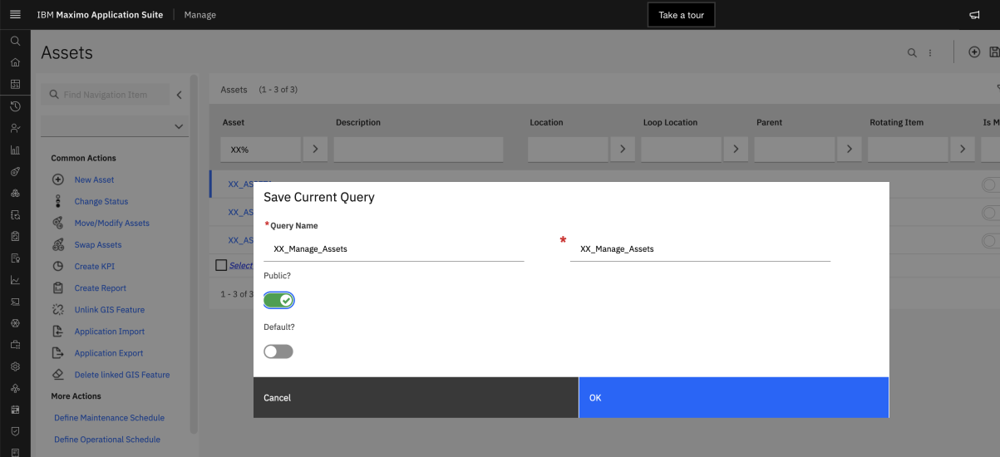

7. Vaya a la **aplicación de grupos** de contadores y cree un grupo de contadores, por ejemplo `XX_METER`.

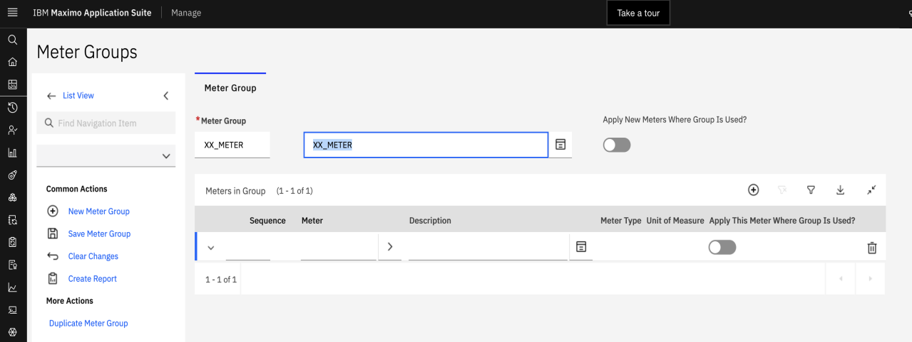

8. Añada **contadores** en el grupo como se indica a continuación


9. **Guarda** el registro.
10. Vaya a **Aplicaciones** -> **Activos** y asocie el grupo de contadores `XX_METER` a todos los activos creados anteriormente.


11. Introduzca las lecturas de **los** contadores de todos los activos mediante **Más acciones** -> **Introducir lecturas de cont**adores. Añada lecturas de contador similares para todos los activos de esta forma:


## Setup Salud

1. En la página de inicio de MAS, haga clic en el **icono Iniciar** de la **tarjeta Heath**.
2. Vaya al menú **Activos** de la parte superior izquierda. Introduzca `XX%` en la barra de **búsqueda**. Esto devolverá los 3 Activos que acabamos de crear en la última sección.


3. Haga clic en `XX_Asset1` y observe las distintas tarjetas que aparecen fuera de la caja. Por el momento están todas vacías. ¡Rellenémoslas!


4. Vaya al menú de **Puntuación** de la parte superior izquierda, luego vaya a la pestaña **Colaboradores** y cree un nuevo **Colaborador** como se indica a continuación.
5. Establezca los campos **Nombre** del colaborador y **Descripción** como `Pressure`.
6. Seleccione la **fuente de datos** como **Contador**.

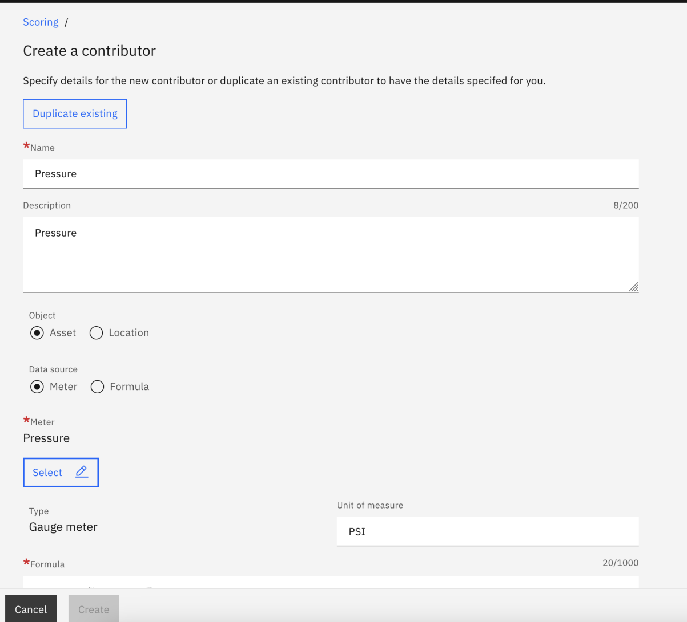

7. Haga clic en **Medidor** y seleccione la **Presión** en la ventana emergente.

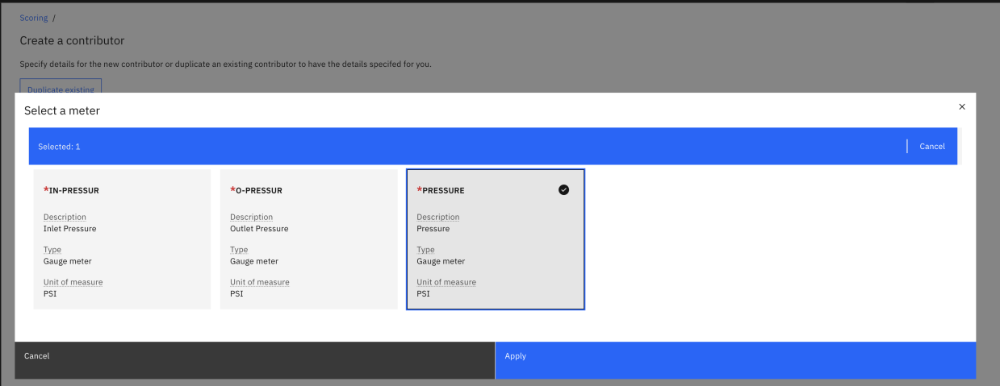

8. Introduzca los valores **Límite superior** y **Límite inferior** en la sección **Normalización de** valores como 25 y 21 respectivamente.

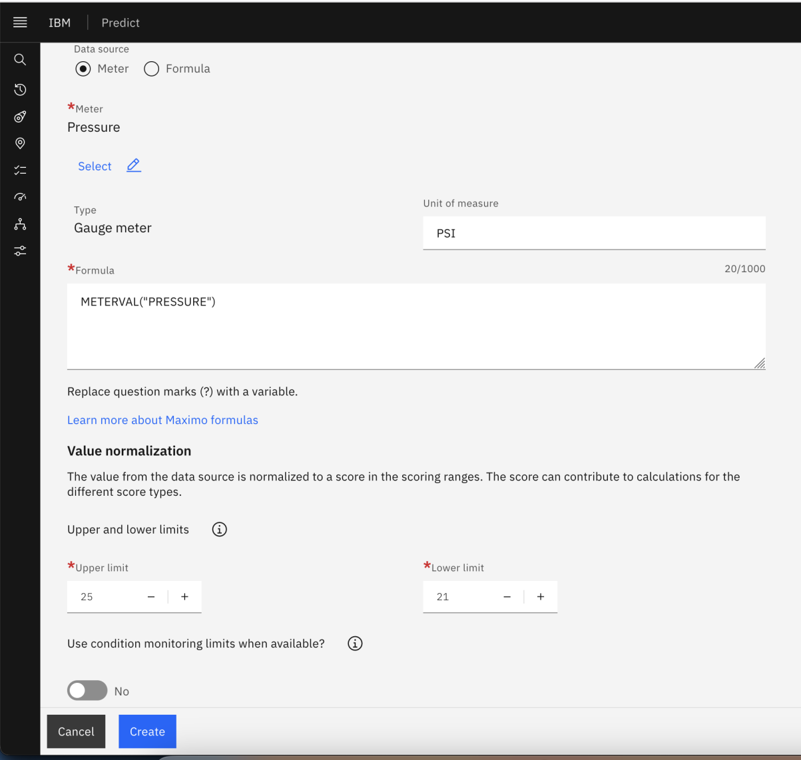

9. Haga clic en el botón **Crear**.
10. Repita los pasos anteriores (5-9) para Medidores: **Temp -c**, **VIBRATIONH**. Los contribuyentes finales se verá como a continuación:


11. Vuelva a la pestaña **Grupos** y cree un **grupo** de puntuación haciendo clic en el botón **Crear un grupo de puntuación**. A continuación, utilice estos valores:

```txt
Group name : XX_Asset_Health
Description : XX_Asset_Health
Select object as Asset and Configure Scoring as : Building Score
```

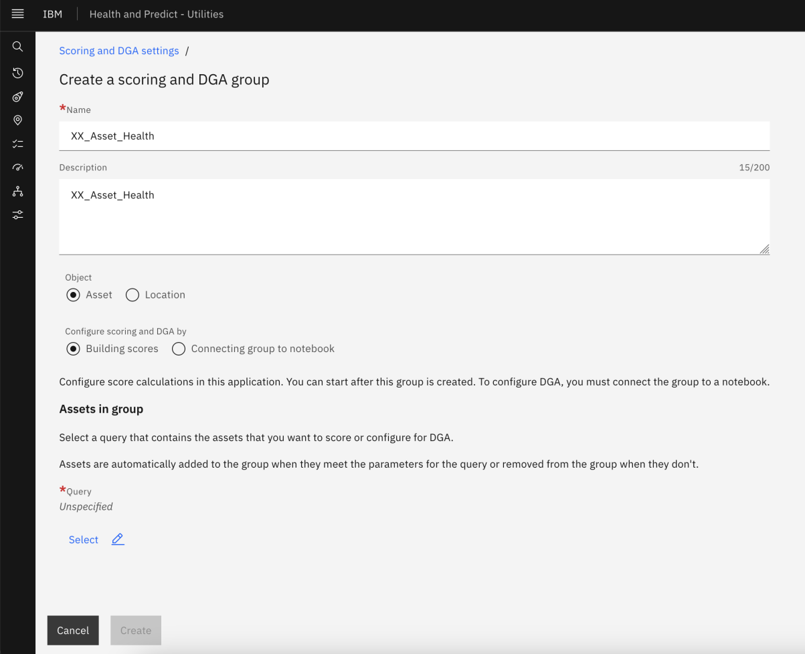

12. Haga clic en el icono del lápiz **Seleccionar** para seleccionar la consulta y filtrar con la **consulta Guardada** creada en la aplicación **Gestionar**.

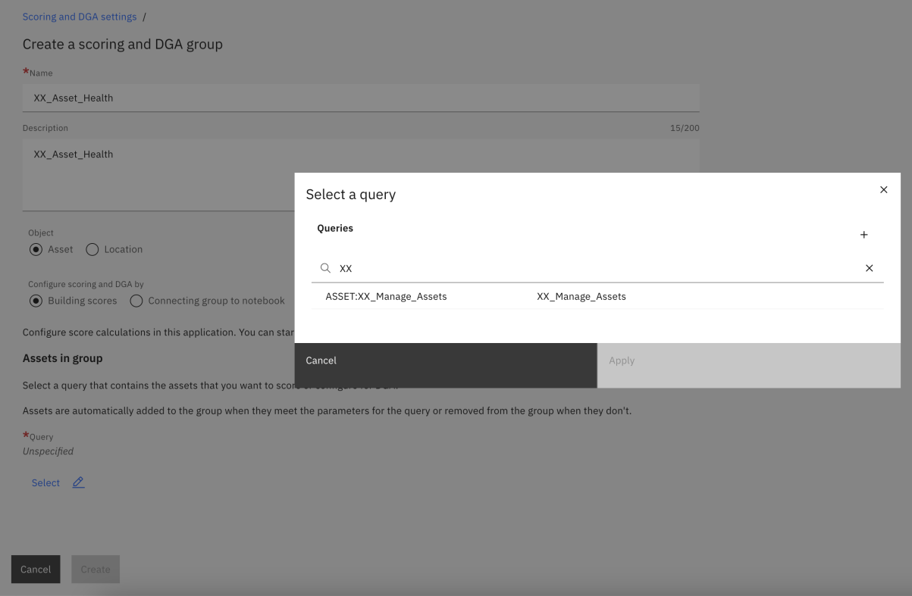

13. Haga clic en el botón **Aplicar**. A continuación, haga clic en el botón **Crear**. El **Grupo de Puntuación** se creará como se muestra a continuación:

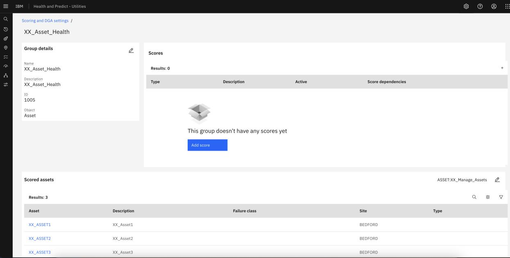

14. Haga clic en el botón **Añadir puntuación** y **seleccione** Puntuación de **salud**.

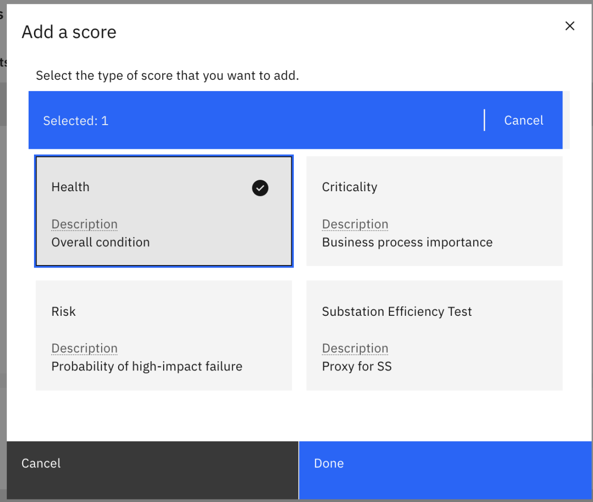

15. Haga clic en el botón **Hecho**. A continuación, haga clic en el icono `+` para añadir los **contribuyentes** a la **puntuación de Salud** y seleccione los contribuyentes como se indica a continuación.


> Añada también los otros dos contribuyentes para `VIBRATIONH` y `PRESSURE`


16. Haga clic en el icono **Lápiz** para añadir el peso de cada **Colaborador**.


> Asegúrese de que el **peso** total es del 100%.

17. Haga clic en el botón **Guardar**. A continuación, **active** la casilla **Activo**.


18. Vuelva al **Grupo de Puntuación** y haga clic en el botón **Calcular puntuaciones**.


19. Seleccione cualquier activo de la lista **de activos puntuados** y compruebe que se ha mostrado **la puntuación de Salud**.

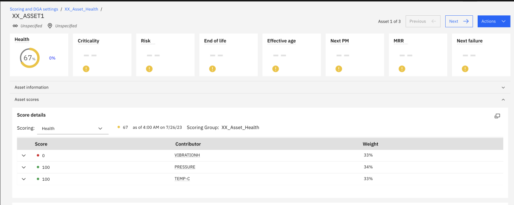

20. Siga los pasos (14-19) para calcular las puntuaciones de **Criticidad** y **Riesgo**.

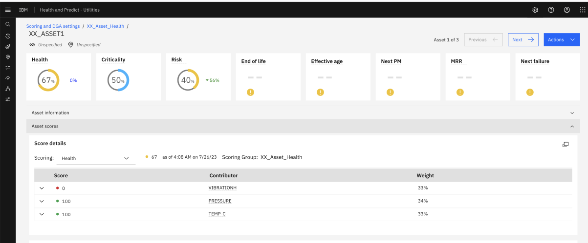

> **Nota**: La definición de **Salud**, **Riesgo** y **Criticidad** puede variar de una organización a otra, y estas puntuaciones son totalmente configurables. También puede utilizar fórmulas personalizadas para definir estas puntuaciones.

## Calcular las puntuaciones RUL y de edad

1. Abra la aplicación **Gestionar**.
2. Vaya a la **aplicación de activos** y abra el activo `XX_Asset1`.
3. Introduzca el valor en los campos **Fecha de instalación** y **Vida útil prevista** en años.
4. **Guarde** el registro de activos.
5. Indique también los valores de los activos restantes.

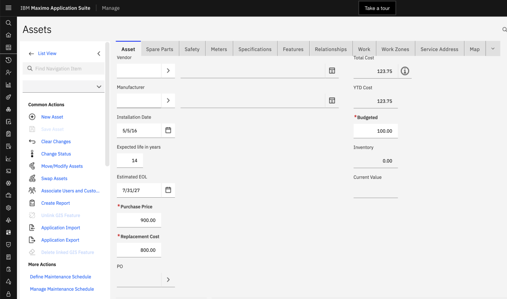

6. Vaya a la aplicación **Salud** y abra la página de **detalles del activo**.
7. Seleccione **Recalcular** puntuaciones en el menú **Acciones**.


## Calcular el próximo PM y MRR

1. Abra la aplicación **Gestionar**.
2. Vaya a la aplicación **Mantenimiento Preventivo** y cree un nuevo registro PM utilizando el activo `XX_ASSET1`.
3. Seleccione la **Frecuencia** como**Frecuencia basada en el tiempo** e introduzca `3` en **Frecuencia**, y en **Fecha estimada del próximo vencimiento**, introduzca una fecha en el futuro.
4. Cambia el estado **del PM** a **Activo**.
5. Del mismo modo, añada los registros de **PM** para los activos restantes.

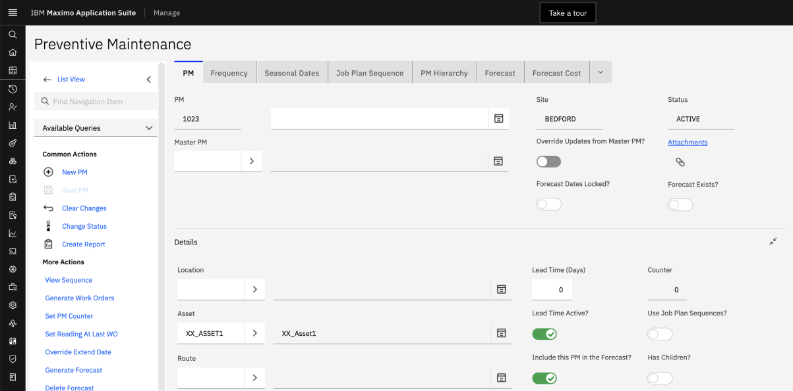

6. Vaya a la aplicación **Seguimiento de órdenes de** trabajo
7. Cree una nueva orden de trabajo utilizando `XX_Asset1` como activo.
8. Cambiar el estado de **WO** a **APPR**.
9. Vaya a la pestaña **Reales** y, en la parte inferior de esa pestaña, haga clic en el botón **Añadir mano de obra**.
10. En la sección **Detalles**, introduzca una **Fecha de inicio** en el pasado y `9` en el campo **Horas regulares**.
11. Cambiar el estado de **WO** a **cerrado**.
12. Del mismo modo, cree registros **WO** para todos los Activos restantes, por ejemplo `XX_ASSET2`, `X_ASSET3`, etc.
13. Vaya a la **aplicación Salud** y abra la página de **detalles del activo**
14. Seleccione **Recalcular puntuaciones** en el menú **Acciones**.


**Enhorabuena. Ha completado con éxito el Laboratorio Maximo Health.**
