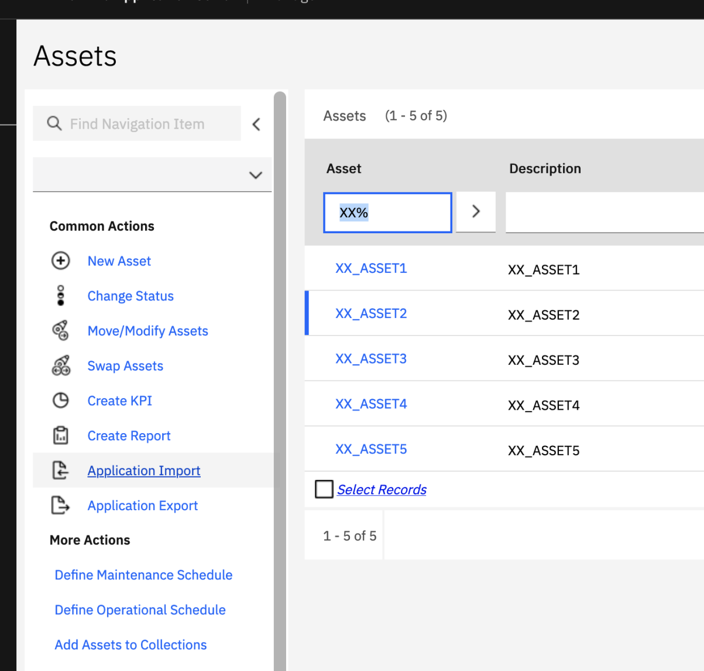
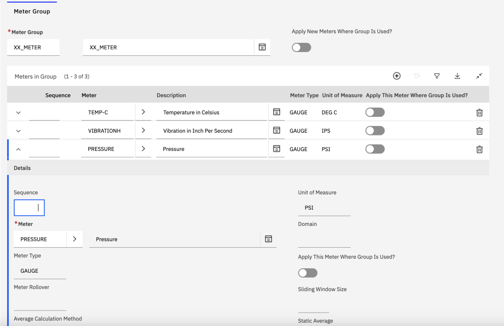
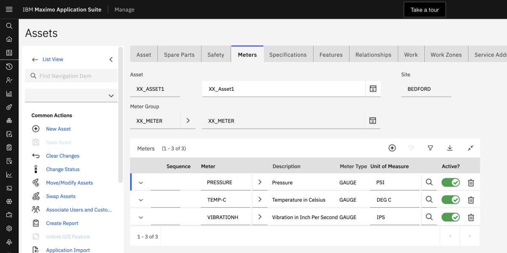

# Maximo Health

In this exercise you will learn how to setup Asset Health scores like Heath, Risk, Criticallity, RUL, Age, Next PM, and MRR.

> **Import Note**: In this lab, we'll be creating assets like XX_Asset1, XX_Asset2, etc. Please make sure you replace the word XX with your initals during the lab.

## Setup Initial Manage data

1. Open Manage application
2. Go to Assets application and click on the `+` icon to create a new Asset record. Create at least 5 assets with asset names like `XX_ASSET1`, `XX_ASSET2`, `XX_ASSET3`, `XX_ASSET4`,
   `XX_ASSET5` etc.
3. Change the status of all assets to **Active**.
4. Go to the **List** tab and filter the assets which you have created with a string like `XX%`



5. Save the Asset list by using the **Save Query** option.
6. Enter **Query name** and **Description** as `XX_Manage_Assets` and select **Public** as true


7. Go to **Meter Group Application** and create a meter group e.g `XX_METER`


8. Add **Meters** in the group as below



9. **Save** the record.
10. Go to **Applications** -> **Asset** and associate the meter group `XX_METER` to all the assets created above.



11. Enter **Meter readings** for all the assets using **More Actions** -> **Enter Meter Readings**. Add similar meter readings for all assets like so:


## Setup Health

1. From the MAS homepage, click the **Launch icon** on the **Heath card**.
2. Go to the top-left **Assets** menu. Enter `XX%` in the **Search** bar. This will return the 3 Assets we just created in the last section.


3. Click on `XX_Asset1` and observe the various cards that appear out-of-the-box. They are all empty for the moment. Let's populate them!


4. Go to the top-left **Scoring** menu, then go to the **Contributors** tab and create a new **Contributor** as below.
5. Set the contributor **Name** and **Description** fields as `Pressure`.
6. Select the **Data source** as **Meter**.


7. Click on **Meter** and select the **Pressure** in pop-up window.


8. Enter the **Upper limit** and **Lower limit** values in the **Value normalization** section as 25 and 21 respectively.


9. Click on the **Create** button.
10. Repeat the above steps (5-9) for Meters: **Temp -c**, **VIBRATIONH**. Final contributors will look like below:


11. Go back to the **Groups** tab and create a **Scoring group** by clicking the **Create a scoring group** button. Then use these values:

```txt
Group name : XX_Asset_Health
Description : XX_Asset_Health
Select object as Asset and Configure Scoring as : Building Score
```


12. Click on the **Select** pencil icon to select the query and filter with the **Saved query** created in **Manage** application.


13. Click the **Apply** button. Then click the **Create** button. The **Scoring Group** will be created as below:


14. Click on **Add Score** button and **Select Health** score.


15. Click the **Done** button. Then click the `+` icon to add the **Contributors** to the **Health score** and select the contributors as below


> Add the two other contributors as well for `VIBRATIONH` and `PRESSURE`


16. Click on **Pencil** icon to add the weight for each **Contributor**.


> Make sure the total **Weight** is 100%

17. Click on the **Save** button. Then toggle the **Active** box to **yes**.


18. Go back to the **Scoring Group** and click on the **Calculate scores** button.


19. Select any asset from **Scored Assets** list and verify that **Health score** has been displayed.


20. Follow the steps (14-19) to calculate the **Criticality** and **Risk** scores.


> **Note**: Definition of **Health**, **Risk** and **Criticality** might vary from an organization to another, and these scores are fully configurable. You can also use custom formula to define these scores.

## Calculate RUL and Age Scores

1. Open **Manage** application.
2. Go to **Asset Application** and open the `XX_Asset1` asset.
3. Enter the value in **Installation Date** and **Expected life** in years fields.
4. **Save** the asset record.
5. Similarly provide the values for remaining assets.


6. Go to **Health** application and open the **Asset detail** page.
7. Select **Recalculate** scores from **Actions** menu.


## Calculate Next PM and MRR

1. Open **Manage** application.
2. Go to **Preventive Maintenance** application and create a new PM record using the `XX_ASSET1` asset.
3. Select the **Frequency** as T**ime based Frequency** and enter `3` in **Frequency**, and in the **Estimated Next Due Date**, enter a date in the future.
4. Change the **PM** status to **Active**.
5. Similarly add the **PM** record records for remaining assets.


6. Go to the **Work Order Tracking** application
7. Create a new work order using `XX_Asset1` as the asset.
8. Change the status of **WO** to **APPR**.
9. Go to the **Actuals** tab and at the bottom of that tab, click the **Add Labor** button.
10. In the **Details** section, enter a **Start Date** in the past, and `9` in the **Regular Hours** field.
11. Change the status of **WO** to **closed**.
12. Similarly create **WO** records for all remaining Assets e.g `XX_ASSET2`, `X_ASSET3` etc.
13. Go to **Health Application** and open the **Asset detail** page
14. Select **Recalculate scores** from **Actions** menu.


**Congratulations! You have successfully completed the Maximo Health Lab.**
