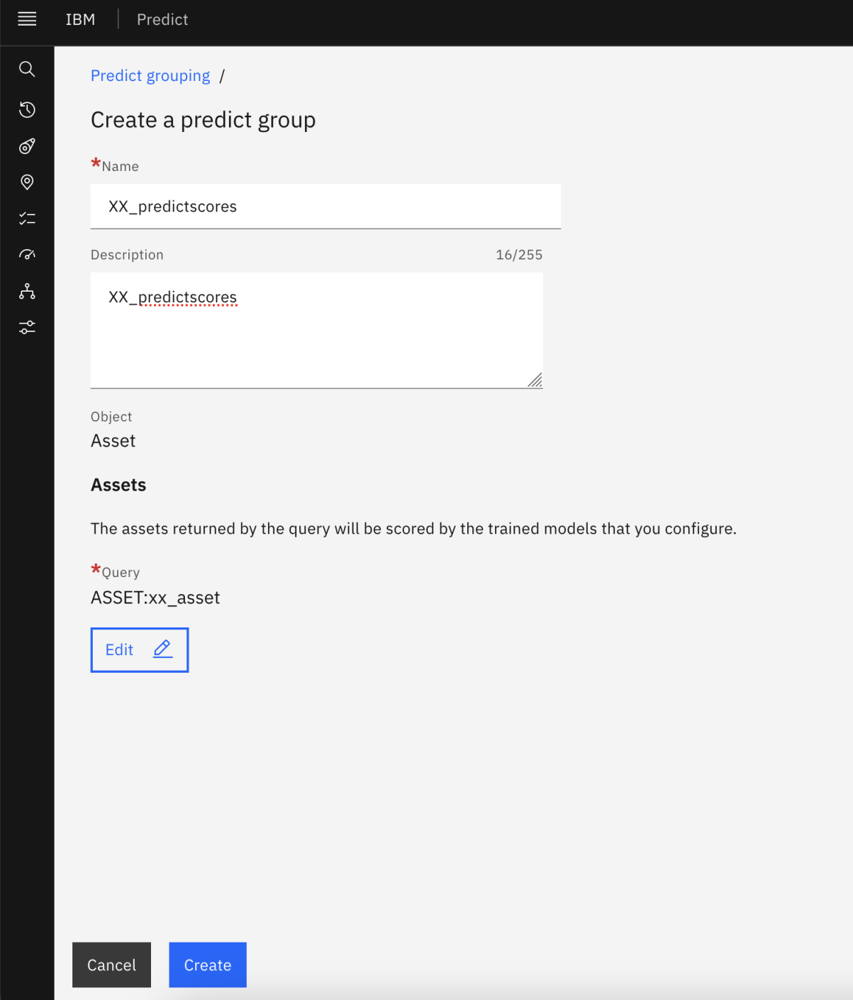
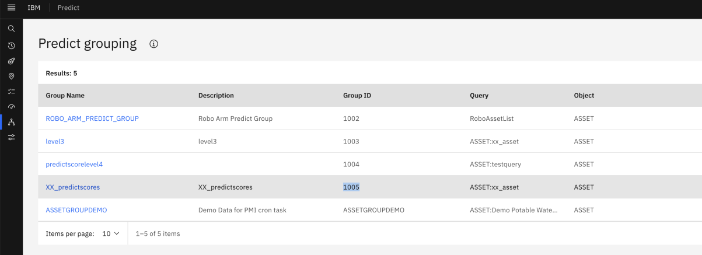
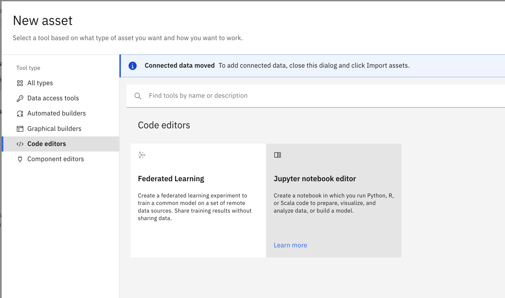
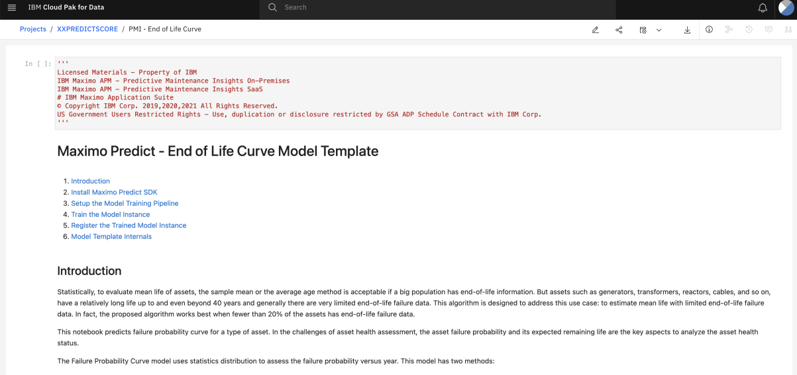
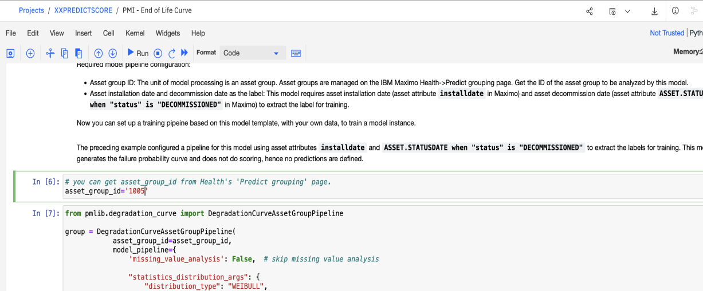
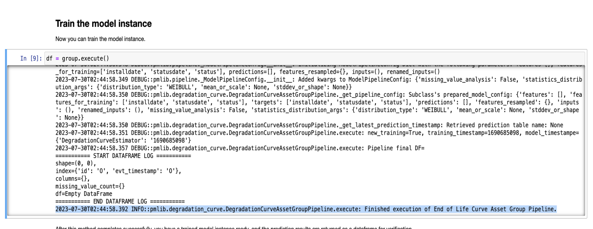
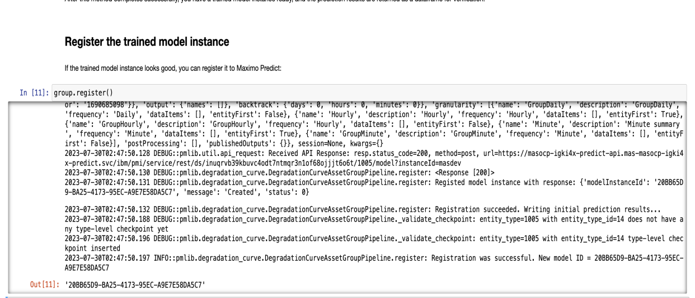
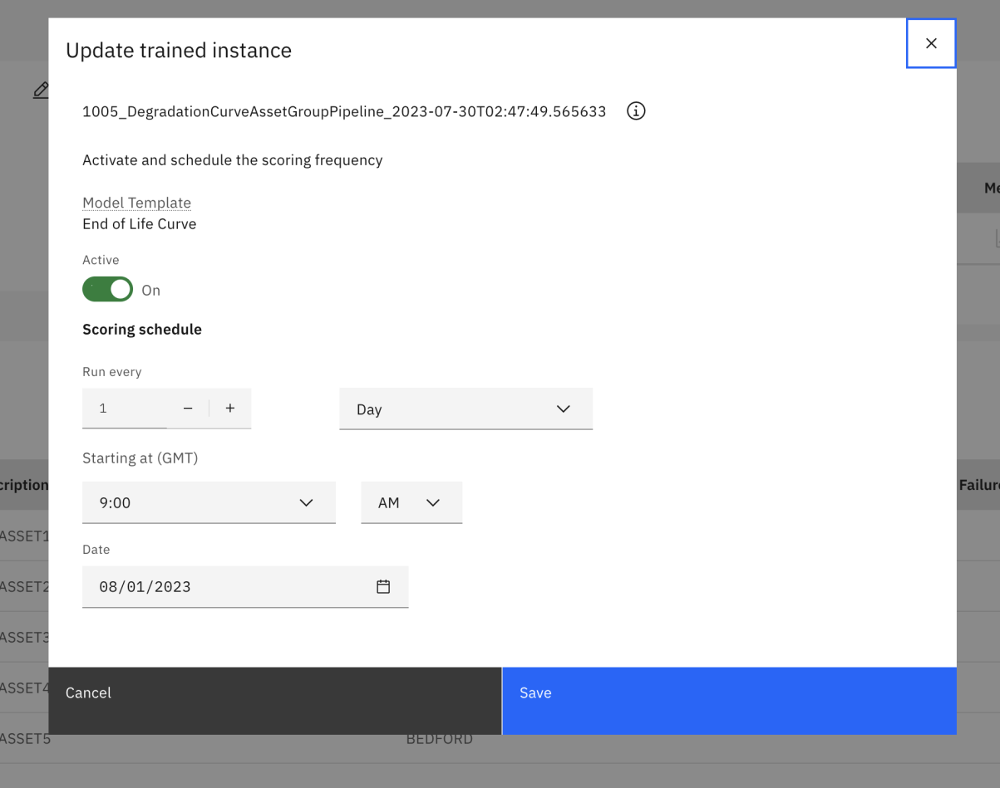

# Maximo Predict

En este Ejercicio, aprenderá a configurar una **puntuación de Predecir** para una curva de **Fin de Vida**.

> **Nota importante**: En este ejercicio de laboratorio, crearemos registros utilizando **XX** como prefijo. Asegúrese de sustituir la palabra **XX** por sus iniciales durante el laboratorio.

## Requisito previo

1.  Asegúrese de haber completado el Laboratorio práctico de **Maximo Monitor**.
2.  Asegúrese de haber completado el laboratorio práctico de **Maximo** Health

> **Nota**: Es importante comprender y disponer de conjuntos de datos de sensores en la aplicación Monitor y de datos de activos en la aplicación Manage.

3.  Tendrá que descargar el `Predict_Envs.json` disponible [aquí](https://github.com/cloud-native-toolkit/mas-workshop/blob/main/Content/Health%20%2B%20Predict/Lab%20Exercises/Predict_Envs.json).
4.  Necesitará descargar `db2_certificate.pem` disponible [aquí](https://github.com/cloud-native-toolkit/mas-workshop/blob/main/Content/Health%20%2B%20Predict/Lab%20Exercises/db2_certificate.pem).
5.  Necesitará descargar `ca_public_cert.pem` disponible [aquí](https://github.com/cloud-native-toolkit/mas-workshop/blob/main/Content/Health%20%2B%20Predict/Lab%20Exercises/ca_public_cert.pem).
6.  Cree su propio usuario en CP4D para ejecutar modelos de predicción.

## Configurar Gestionar aplicación

1.  Abra la aplicación **Gestionar**.
2.  Vaya a la aplicación **Activos** y filtre los registros de activos creados en el ejercicio de laboratorio **Maximo** Health. por ejemplo `XX_ASSET%`.
3.  Cambie el estado de dos o tres activos cualesquiera a **DECOMISADO**. Por ejemplo, puede elegir `XX_ASSET2` y `XX_ASSET4` y cambiar el estado de Activo a **DECOMISADO**.
4.  Asegúrese de rellenar los campos **Fecha de instalación**, **Vida útil esperada** en años y **EOL estimado** para cada activo, sin esto los modelos Predecir no se ejecutarán.

## Configuración Predecir aplicación

1.  Abra la aplicación **Predict** desde **Suite Navigator**.


2.  Para crear un Grupo de **Predicción** Haga clic en el menú de la izquierda y seleccione -> Predecir **agrupación**


3.  Haga clic en el botón azul **Crear grupo** `+` para crear un nuevo grupo.
4.  Proporcione el nombre y la descripción como `XX_predictscores`
5.  Seleccione la consulta que creó en **Gestionar** aplicación, por ejemplo `xx_asset`



6.  Haga clic en el botón Crear.
7.  Compruebe que se ha creado el grupo y anote el valor de la columna **Id. de grupo**. En la siguiente captura de pantalla es: **1005**



## Configurar Cloud Pak para datos

1.  Utilice la url CP4D y la credencial suministrada para acceder a la instancia

> **Nota**: Esto será suministrado por los instructores durante el taller

2.  Haga clic en el menú hamburguesa de la izquierda y seleccione **Todos los proyectos**


3.  Haga clic en el botón azul **Nuevo proyecto** `+` para crear un nuevo proyecto.


4.  Seleccione **Crear un proyecto vacío**.
5.  Introduzca el nombre y la descripción del proyecto como `XXPREDICTSCORE`


6.  Haga clic en el botón **Crear**


7.  Seleccione la pestaña **Activos** y haga clic en la sección **Soltar archivos de datos** y seleccione los siguientes archivos que guardó anteriormente.

    *   Predict\_Envs.json
    *   db2\_certificate.pem
    *   ca\_public\_cert.pem


8.  Seleccione la pestaña **Activos** y haga clic en el botón **Nuevos Activos** `+`.


9.  Seleccione **Editor de código** y, a continuación, elija **el editor de cuadernos Jupyter**



10. Haga clic en la pestaña **Desde archivo** y arrastre y suelte el `PMI – End of life curve.ipynb`. Puede descargar el cuaderno desde [aquí](https://github.com/cloud-native-toolkit/mas-workshop/blob/main/Content/Health%20%2B%20Predict/Lab%20Exercises/PMI%20-%20End%20of%20Life%20Curve.ipynb)


11. Haga clic en el botón **Crear**. Se abrirá el cuaderno `PMI – End of life curve`.



12. Cambie la variable `asset_group_id` para que coincida con la anotada anteriormente en la aplicación predict. En este caso es **1005**.



13. Selecciona la primera celda y pulsa el botón **Ejecutar**. Ejecuta cada celda una tras otra.

> **Nota**: Una celda habrá terminado de ejecutar el código que contiene cuando el valor In `In [*]` ] a la izquierda de la celda se llene con un número como `In [1]`.

14. Verifique la salida para Entrenar la instancia del modelo. Debería mostrar `"Finished execution of End of Life Curve Asset Group Pipeline."` Al final.



15. Ejecute cada celda hasta llegar a la celda **Registrar la instancia del modelo entrenado**.
16. El resultado final debería mostrar el mensaje `Registration was successful. New model ID = 20BB65D9-BA25-4173-95EC-A9E7E58DA5C7`



## Verificar las puntuaciones

1.  Vaya a la **aplicación Predict** y abra el **grupo Predict** creado anteriormente.
2.  Haga clic en el enlace Modelo de **instancia entrenado**.


3.  Elija las opciones que se indican a continuación:

```text
Active : ON
Run every : 1 Day
Starting At : 9 AM
Date : Enter future date
```



4.  Haga clic en el botón **Guardar**.
5.  Abra cualquier activo de la lista y compruebe que la **curva de fin de vida** útil aparece como se muestra a continuación:


**¡Enhorabuena! Ha completado con éxito el Laboratorio Maximo Predict.**
