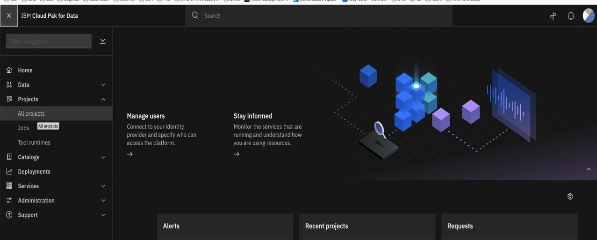
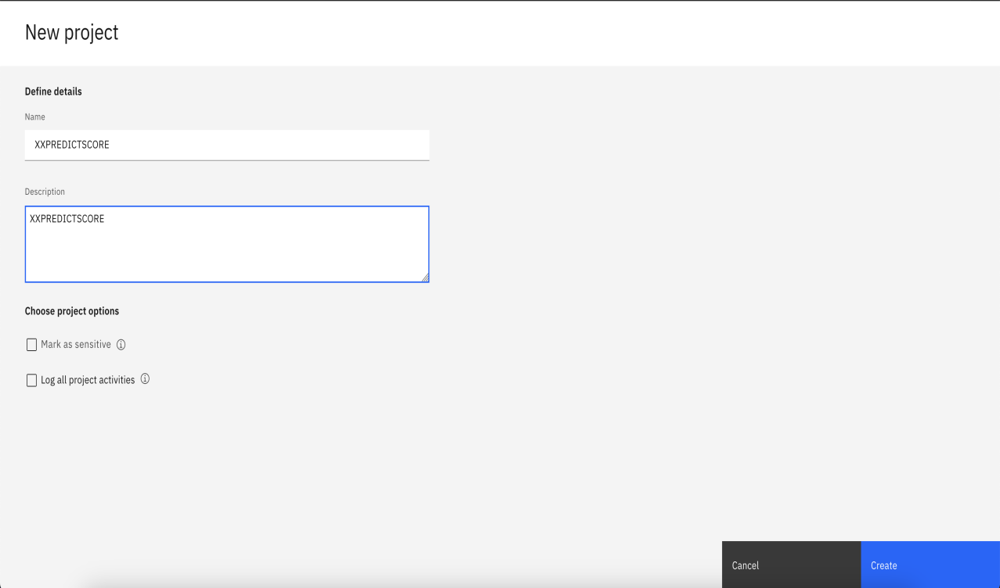
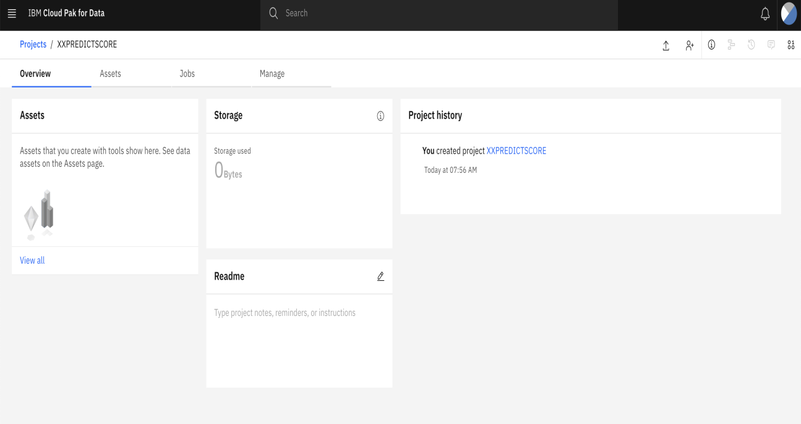
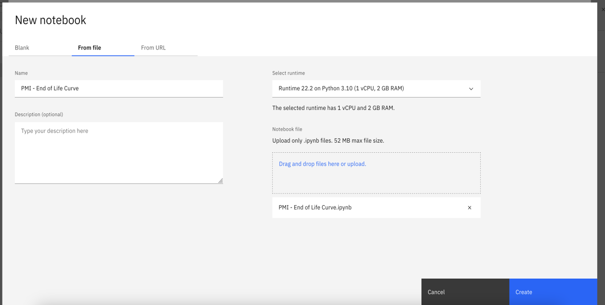
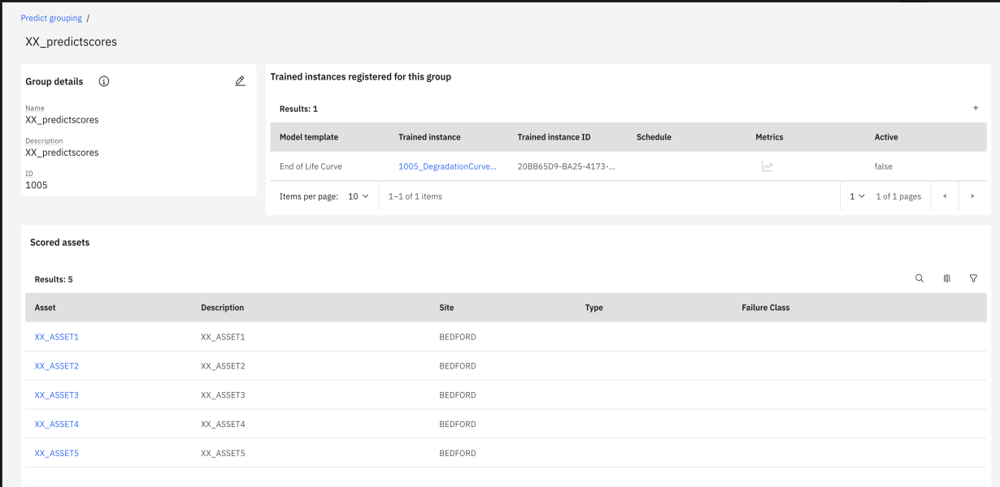

# Maximo Predict

In this Exercise, you will learn how to setup a **Predict score** for an **End of Life** curve.

> **Important Note**: In this lab exercise, we'll be creating records using **XX** as prefix, Please make sure you replace the word **XX** with your initials during the lab.

## Prerequisite

1. Ensure that you have completed the **Maximo Monitor** hands-on Lab
2. Ensure that you have completed the **Maximo Health** hands-on lab

> **Note**: Understanding & Availability of sensor data sets in Monitor application and asset data in Manage application is important.

3. You will need to download the `Predict_Envs.json` available [here](https://github.com/cloud-native-toolkit/mas-workshop/blob/main/Content/Health%20%2B%20Predict/Lab%20Exercises/Predict_Envs.json).
4. You will need the download `db2_certificate.pem` available [here](https://github.com/cloud-native-toolkit/mas-workshop/blob/main/Content/Health%20%2B%20Predict/Lab%20Exercises/db2_certificate.pem).
5. You will need the download `ca_public_cert.pem` available [here](https://github.com/cloud-native-toolkit/mas-workshop/blob/main/Content/Health%20%2B%20Predict/Lab%20Exercises/ca_public_cert.pem).
6. Create your own user in CP4D to run predict models.

## Setup Manage Application

1. Open **Manage** application.
2. Go to the **Assets** application and filter the asset records created in **Maximo Health** lab exercise. e.g `XX_ASSET%`
3. Change the status of any two to three asset to **DECOMMISSIONED** e.g you can pick `XX_ASSET2` and `XX_ASSET4` and change the status from Active to **DECOMMISSIONED**.
4. Make sure you populate **Installation Date**, **Expected life** in years and **Estimated EOL** fields populated for each asset, without this Predict models will not execute.

## Setup Predict Application

1. Open the **Predict** application from **Suite Navigator**.


2. To create a **Predict** Group. Click on left menu and select -> **Predict Grouping**


3. Click on blue **Create group** `+` button to create a new group.
4. Provide the name and description as: `XX_predictscores`
5. Select the query you created in **Manage** application e.g `xx_asset`


6. Click on Create button.
7. Verify the group has been created and note down the value for **Group Id** column. Here in below screenshot it is: **1005**


## Setup Cloud Pak for Data

1. Use the CP4D url and credential supplied to access the instance

> **Note**: This will be supplied by instructors during the workshop

2. Click on left hamburger menu and select **All Projects**



3. Click on blue button **New Project** `+` to create a new project.


4. Choose **Create an empty Project**.
5. Enter project name and description as `XXPREDICTSCORE`



6. Click on **Create** button



7. Select the **Assets** tab and click on **Drop data files** section and select the below files that you saved from earlier.
   - Predict_Envs.json
   - db2_certificate.pem
   - ca_public_cert.pem


8. Select **Assets** tab and click on **New Assets** `+` button


9. Select **Code Editor** and then choose **Jupyter notebook editor**


10. Click on **From File** tab and drag and drop the `PMI – End of life curve.ipynb`. You can download the notebook from [here](https://github.com/cloud-native-toolkit/mas-workshop/blob/main/Content/Health%20%2B%20Predict/Lab%20Exercises/PMI%20-%20End%20of%20Life%20Curve.ipynb)



11. Click on the **Create** button. It will then open the `PMI – End of life curve` notebook.


12. Change the `asset_group_id` variable to match the one noted from the predict application earlier. In this case it is **1005**.


13. Select first cell and click on the **Run** button. It executes each cell one after other.

> **Note**: A cell will be done executing the code within when the `In [*]` value to the left of the cell is filled with a number like `In [1]`.

14. Verify the output for Train the model instance. It should display `"Finished execution of End of Life Curve Asset Group Pipeline."` At the end.


15. Execute each cell until you reach the **Register the trained model instance** cell.
16. The final outcome should display the message: `Registration was successful. New model ID = 20BB65D9-BA25-4173-95EC-A9E7E58DA5C7`


## Verify the scores

1. Go to **Predict Application** and open the **Predict group** created earlier.
2. Click on the **Trained Instance** model link.



3. Choose options as below:

```text
Active : ON
Run every : 1 Day
Starting At : 9 AM
Date : Enter future date
```


4. Click on the **Save** button.
5. Open any asset in the list and verify that **End of life curve** is populated like below:


**Congratulations! You have successfully completed the Maximo Predict Lab.**
