# Maximo Visual Inspection (MVI)-Detección de acciones

En este laboratorio, utilizando la funcionalidad de Detección de acciones de Maximo Visual Inspection, usted:

*   Vea cómo las acciones fácilmente pueden ser etiquetadas como entrenadas y modeladas usando MVI a través de un video explicativo.
*   Aprenda a crear un conjunto de datos de vídeo, así como a formar y desplegar un modelo de detección de acciones en MVI en una breve cantidad de tiempo siguiendo las instrucciones de demostración de ejemplo.
*   Utilice los activos proporcionados o su propio conjunto de datos de vídeo que haya creado para hacerlo usted mismo.

Asegúrese de tener acceso a un entorno de Maximo; puede reservar uno en TechZone [**aquí **](https://techzone.ibm.com/my/reservations/create/635952829aaefe0019bea350).

Si desea ver una demostración de vídeo del laboratorio y obtener una vista previa de la funcionalidad de detección de acciones de MVI, consulte este [**vídeo **](https://livesend.ibm.com/i/6VDioBx7fI___HGis8OS42bPmSAcLVRbootOWrT25___WEE4vEqrvIUkY7FaOB3Ji2Y7IXCyw9vW3cCv5___6eS4V0ySMESNBLXObAp8dHJQgn1PLUSSIGNAEQUALSIGN).

Se pueden encontrar todos los activos para esta demostración [**aquí**](https://livesend.ibm.com/i/6VDioBx7fI___HGis8OS42bPmSAcLVRbootOWrT25___WEHDPLUSSIGNYhgVWLte2FjvAep70KOjpm5Sifx9HjW2ZZBTV2jtriODcOHyBE1ujIF___KAH1IMEQUALSIGN)

## Detección de acciones de MVI

## Creación y etiquetado de un conjunto de datos

### Configuración/Requisitos previos: Creación o descarga de un conjunto de datos de vídeos

Cree un conjunto de datos de vídeo siguiendo las instrucciones que se indican a continuación para crear su propio conjunto de datos de vídeos. Alternativamente, esto [**enlace **](https://livesend.ibm.com/i/6VDioBx7fI___HGis8OS42bPmSAcLVRbootOWrT25___WEHDPLUSSIGNYhgVWLte2FjvAep70KOjpm5Sifx9HjW2ZZBTV2jtriODcOHyBE1ujIF___KAH1IMEQUALSIGNt)también le llevará a un conjunto ya creado de vídeos listos para ser utilizados y cargados en la aplicación Maximo Visual Inspection.

Descargar activos: Para descargar y utilizar los archivos en el enlace anterior, haga clic en el botón de descarga en la esquina superior derecha. Esto descargará el **MVI-Dataset **archivo zip en el *Descargas *. Si el elemento descargado finaliza en ". zip", asegúrese de hacer doble clic en el archivo para descomprimir y acceder al contenido. Una vez descomprimido, haga clic en la descarga **MVI-Dataset **para abrir el contenido. En el interior, usted encontrará lo siguiente:

1.  Vídeos de formación clasificados por acción (sin acción, torsión, agitación, spinning)
2.  Cómo probar vídeos
3.  Un archivo zip de un modelo preformado en caso de que tenga problemas para entrenar el modelo usted mismo. (No es necesario descomprimir este archivo!) Habrá más instrucciones sobre cómo utilizar estos activos a lo largo de la demostración.

**Acciones:**

1.  Encuentre una botella de agua (plástico, metal, desechable, etc.), asegúrese de que no tiene demasiado complejo de patrones o colores. Esta demostración utilizará una botella de plástico simple de agua desechable con una etiqueta de papel simple.
2.  A continuación, encuentre un fondo de color blanco o sólido para filmar sus videos en contra.
3.  Por último, antes de comenzar el proceso de recogida de vídeo, asegúrese de utilizar un trípode o un gran elemento pesado para inclinar el dispositivo de toma de vídeo en posición vertical.
4.  Usted puede tomar sus videos en cualquier dispositivo con capacidades de video incluyendo iPhones, Androides, o cualquier otra cámara. Maximo Visual Inspection sólo permite subir vídeos formateados en .mp4, .webm o .ogg. iPhones en formato .mov por lo que tendrá que convertirlos en .mp4 -usted puede hacer esto mediante el uso de su convertidor de vídeo favorito o uno de estos-> [**opción 1 **](https://www.freeconvert.com/mov-to-mp4)(sólo permite 25 minutos de conversión libres) o [**opción 2 **](https://movtomp4.com).
5.  Configure su dispositivo y comience a grabar simples 10 segundos videos de usted realizando una acción en la botella de agua por video, torciendo la tapa dentro y fuera lentamente, sacudiendo la botella de agua, y girando la botella de agua. A continuación se muestran un par de vídeos de ejemplo. Para el propósito de esta demostración, sólo tendrá que grabar 5-6 vídeos de usted realizando cada acción con poca varianza en cada vídeo. Sin embargo, en un caso de uso real, se requerirían muchos más videos y variación de acción para crear un conjunto de datos que se puede formar.

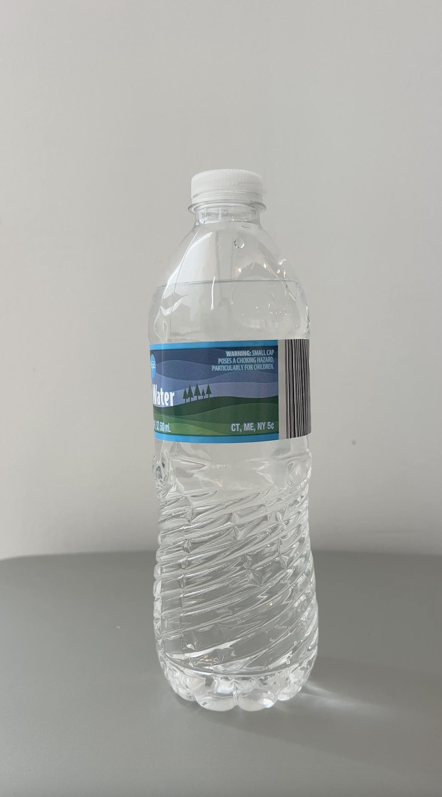

6.  Finalmente suba los videos a su computadora usando cualquier método que sea más conveniente. (Airdrop, subiendo a una nube accesible por el ordenador que está utilizando, o enchufando el dispositivo a su ordenador con un cable USB.)
7.  Asegúrese de guardar estos archivos en una carpeta en algún lugar accesible para el uso de esta demostración en su escritorio, documentos o disco duro externo. Separe un vídeo de cada acción del resto en una carpeta separada para guardar para probar el modelo formado en los pasos finales.

De nuevo alternativamente, si usted no tiene acceso a una botella de agua o tiene otras dificultades logísticas filmando y subiendo su propio conjunto de videos, por favor use el conjunto de videos de entrenamiento vinculados [**aquí **](https://livesend.ibm.com/i/6VDioBx7fI___HGis8OS42bPmSAcLVRbootOWrT25___WEHDPLUSSIGNYhgVWLte2FjvAep70KOjpm5Sifx9HjW2ZZBTV2jtriODcOHyBE1ujIF___KAH1IMEQUALSIGN).

Descargar activos: Para descargar y utilizar los archivos en el enlace anterior, haga clic en el botón de descarga en la esquina superior derecha. Esto descargará el **MVI-Dataset **archivo zip en el *Descargas *. Si el elemento descargado finaliza en ". zip", asegúrese de hacer doble clic en el archivo para descomprimir y acceder al contenido. Una vez descomprimido, haga clic en la descarga **MVI-Dataset **para abrir el contenido. En el interior, usted encontrará lo siguiente:

1.  Vídeos de formación clasificados por acción (sin acción, torsión, agitación, spinning)
2.  Cómo probar vídeos
3.  Un archivo zip de un modelo preformado en caso de que tenga problemas para entrenar el modelo usted mismo. (No es necesario descomprimir este archivo!) Habrá más instrucciones sobre cómo utilizar estos activos a lo largo de la demostración.

### Paso 1: Iniciar sesión en Maximo Application Suite Navigator

**Acciones:**

1.  Haga clic en este [**Entorno de demostración de Maximo Application Suite **](https://wwdemo.home.wwdemomas8.gtm-pat.com/)Enlace de URL para iniciar IBM Maximo Application Suite y abrir la página de inicio de sesión.
2.  **IBM Maximo Application Suite **inicia sesión en la página se abre
3.  Introduzca MVI **Nombre **y pulse **Continuar**
4.  Introduzca MVI **Contraseña **y pulse **Iniciar sesión**
5.  Una vez que haya iniciado sesión, en la pantalla del navegador de MAS Suite, pulse en el   **Mosaico de inspección visual **.

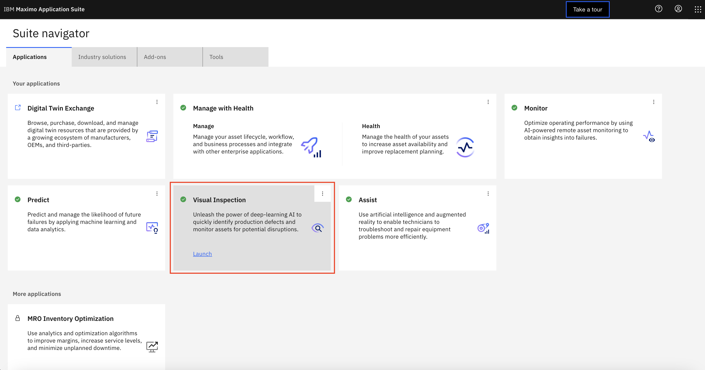

### Paso 2: Crear un conjunto de datos para la formación de modelos en Maximo Visual Inspection

**¿Qué es un conjunto de datos MVI y por qué necesita crear uno?**

Como primer paso hacia la construcción de su modelo de inspección de IA, debe crear un conjunto de datos en MVI que contenga vídeos de torsión y apagado de las tapas de las botellas de agua, agitar las botellas de agua, y hacer girar las botellas de agua, para enseñar el modelo de lo que se ve cada acción como.

Los datos están en el corazón del aprendizaje automático (ML). En el caso de los modelos basados en la visión, estos datos toman la forma de imágenes o videos. Los modelos MVI ML incorporados detectan y aprenden de forma inteligente patrones en el conjunto de datos subido y analizan estos datos repetidamente hasta que pueden discernir distinciones y, en última instancia, reconocen objetos de interés en las imágenes o vídeos. Por ejemplo, para entrenar una computadora para reconocer los neumáticos del automóvil, es necesario alimentarlo con grandes cantidades de imágenes de neumáticos y artículos relacionados con los neumáticos para aprender las diferencias e identificar un neumático, especialmente uno con defectos. Para este modelo de caso de uso, creará un conjunto de datos con un número limitado de vídeos de botellas de agua tomados por usted mismo para la brevedad y la accesibilidad; sin embargo, en los escenarios del mundo real, un modelo de visión por computadora requeriría muchos más videos y tiempo de procesamiento. que esta demostración ofrece.

En esta demostración, puede cargar manualmente vídeos guardados desde la máquina local al panel de control de aplicaciones MVI, sin embargo, los modos de captura de imágenes incorporados en las aplicaciones MVI Mobile y MVI Edge (partes de la solución MVI) también se pueden utilizar para recopilar y copiar imágenes. y vídeos automáticamente en la aplicación MVI. Ahora es el momento de empezar a crear un conjunto de datos.

**Acciones:**

1.  Pulse en **Cómo empezar **sobre la **MVI Bienvenido a IBM Maximo Visual Inspection **pantalla.

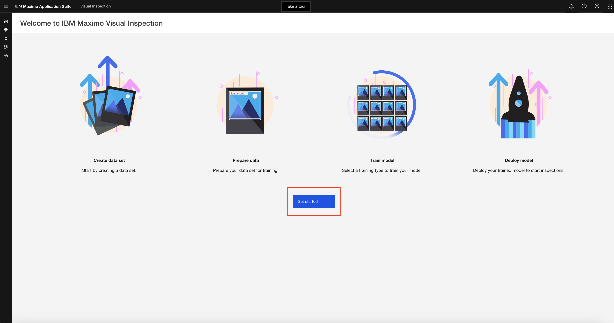

2.  El **Conjuntos de datos **abre la ventana.
3.  Sobre el MVI **Conjuntos de datos **pantalla, haga clic en **azul Crear + **en la esquina superior derecha.

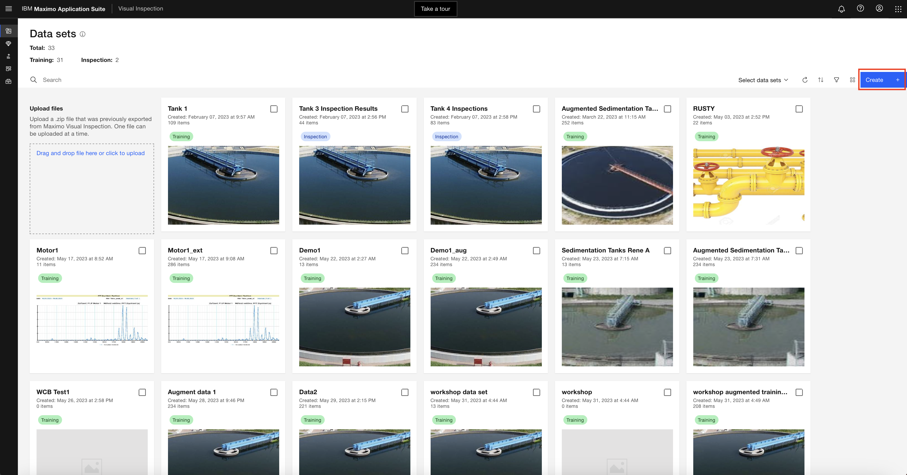

4.  Introduzca **"Conjunto de datos de detección de acción de botellas de agua \[sus iniciales]" **para el campo de nombre de conjunto de datos en la   **Crear conjunto de datos ** . Para el tipo de conjunto de datos, seleccione *Formación *.

\*\* *IMPORTANTE: Por favor, asegúrese de añadir sus iniciales al nombre de los conjuntos de datos, modelos de entrenamiento y modelos desplegados, ya que será útil realizar un seguimiento de sus activos, ya que la demostración se lleva a cabo en un entorno compartido.*

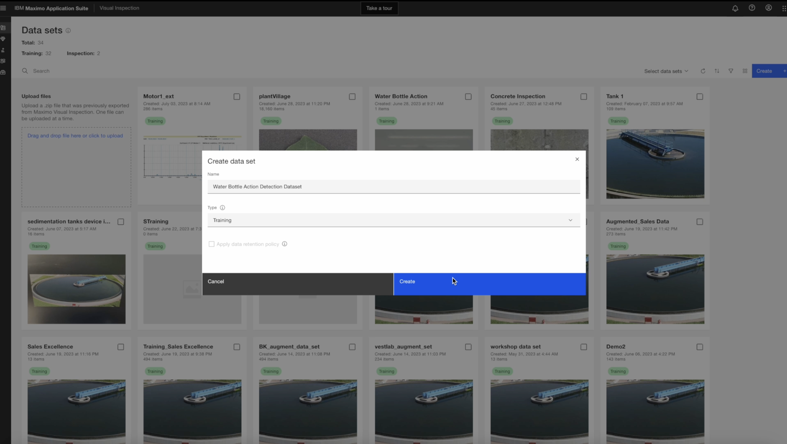

5.  Pulse en   **Crear **.
6.  Pulse el conjunto de datos recién creado y pulse el hiperenlace azul en la esquina superior izquierda de la **Cargar archivos **que le permitirá subir archivos.

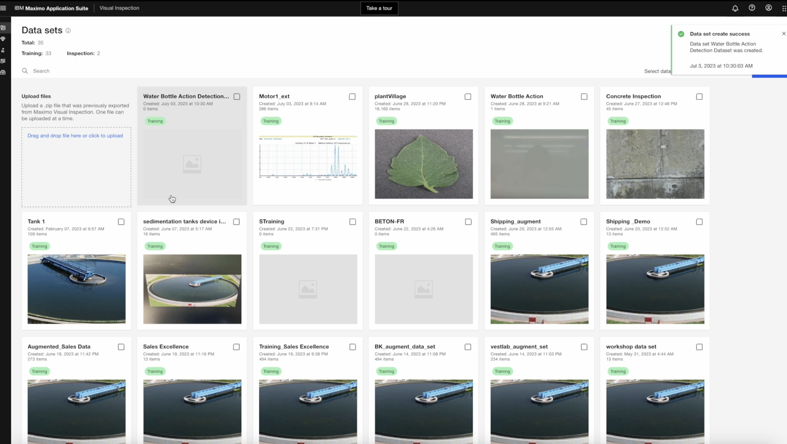 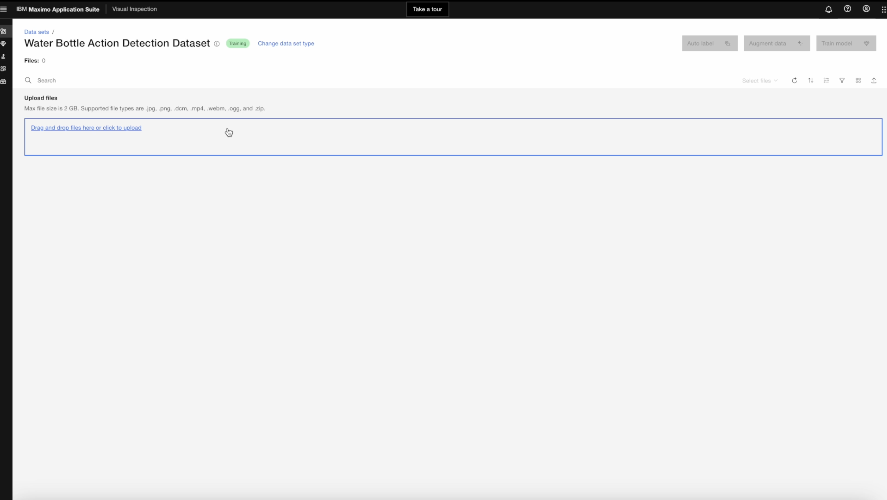

7.  Vaya a la ubicación del directorio donde ha guardado sus vídeos de diferentes acciones de botellas de agua y seleccione todos los vídeos que desea añadir al conjunto de datos para la formación (no seleccione los vídeos de prueba que ha separado anteriormente en un archivo diferente.) Si ha descargado el conjunto de datos anterior en la demostración en este enlace [**aquí **](https://livesend.ibm.com/i/6VDioBx7fI___HGis8OS42bPmSAcLVRbootOWrT25___WEHDPLUSSIGNYhgVWLte2FjvAep70KOjpm5Sifx9HjW2ZZBTV2jtriODcOHyBE1ujIF___KAH1IMEQUALSIGN)en lugar de crear sus propios vídeos, seleccione todos los vídeos en cada una de las carpetas con la etiqueta "Training\_Dataset\_Noaction", "Training\_Dataset\_Shaking", "Training\_Dataset\_Spinning" y "Training\_Dataset\_Twisting" para subir al conjunto de datos.

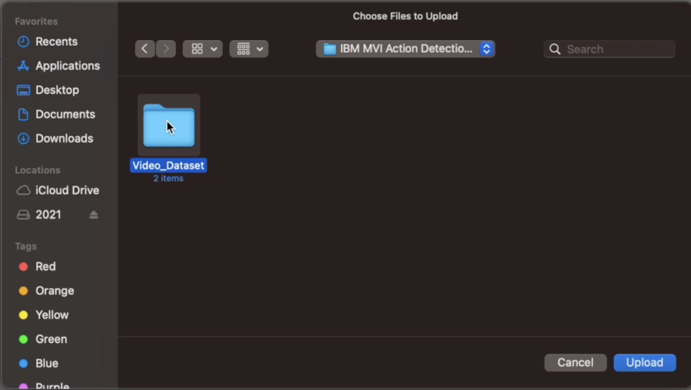 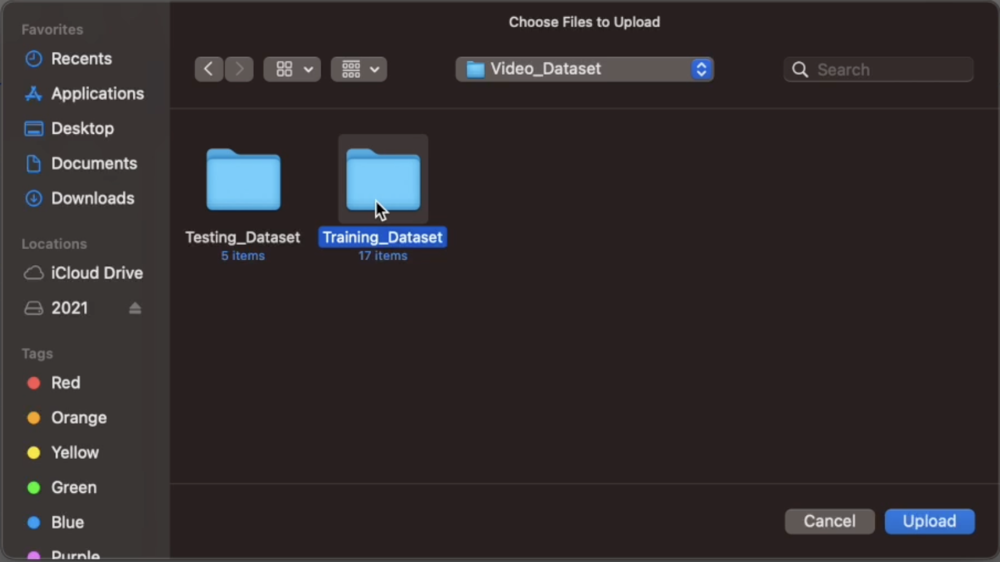 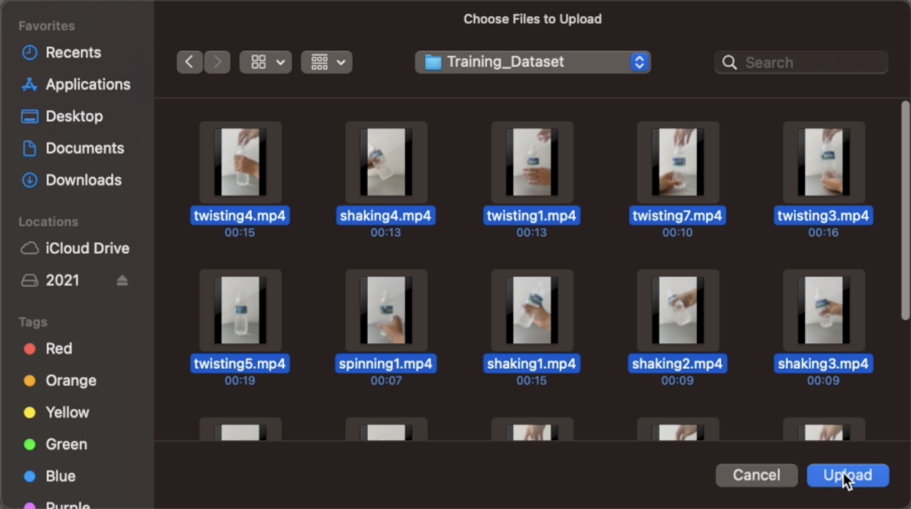

8.  Pulse en   **Carga **para cargar los vídeos de formación del modelo desde el directorio.
9.  Después de unos segundos, las imágenes se cargan en el conjunto de datos recién creado. Ahora está listo para etiquetar estos videos.

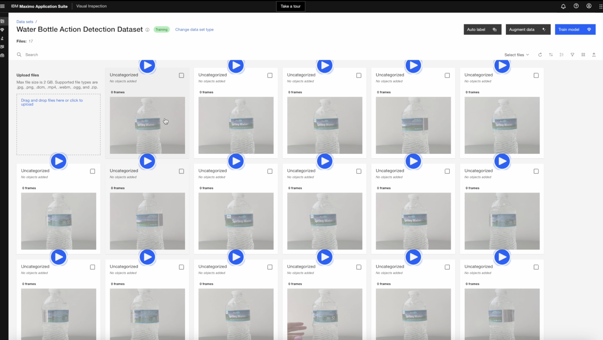

### Paso 3: Etiqueta del conjunto de datos

En este paso, aprenderá a etiquetar los vídeos de botellas de agua. El etiquetado marca los vídeos de entrada con información sobre su contenido. En la detección de acciones, esto implicaría resaltar el tiempo de inicio y finalización de la aparición de la acción dentro de los vídeos. En el caso de esta demo, pasará por cada uno de los vídeos subidos y entrará en la hora de inicio y hora de finalización adecuadas de cada acción que se haya producido durante el vídeo. Durante la fase de entrenamiento, estas imágenes etiquetadas permitirán que su modelo aprenda qué parte de los videos representan torcer la tapa en una botella de agua, agitar una botella de agua o girar una botella de agua.

Como puedes imaginar, etiquetar correctamente los videos es fundamental para la precisión del modelo que estás creando porque impacta directamente en la calidad general del modelo entrenado. Simplemente, cuando se trata de identificar acciones, usted quiere un experto en el dominio de casos de uso-la persona con la experiencia relevante en la materia (SME)-para estar etiquetando estas imágenes. Esto asegurará la máxima calidad de entrada en el modelo de formación. Tradicionalmente, los científicos de datos han sido el punto focal de las iniciativas de IA y han desperdiciado sus valiosos datos de etiquetado de tiempo. Con MVI, un experto de dominio-sin experiencia en ciencia de datos-puede etiquetar las imágenes y posteriormente construir un modelo basado en esas imágenes.

Este enfoque reduce la barrera a la entrada y empodera a los expertos de dominio con limitado a ningún entrenamiento de IA la capacidad de crear y desplegar modelos de IA de trabajo en cuestión de horas, no de días o semanas.

**Acciones:**

Una vez que todas las fotos se suben en MVI, realice los siguientes pasos:

1.  Haga clic en **Seleccione **para seleccionar automáticamente todas las imágenes del conjunto de datos.
2.  Haga clic en **Etiqueta **menú desplegable y luego seleccionar **Acciones **.

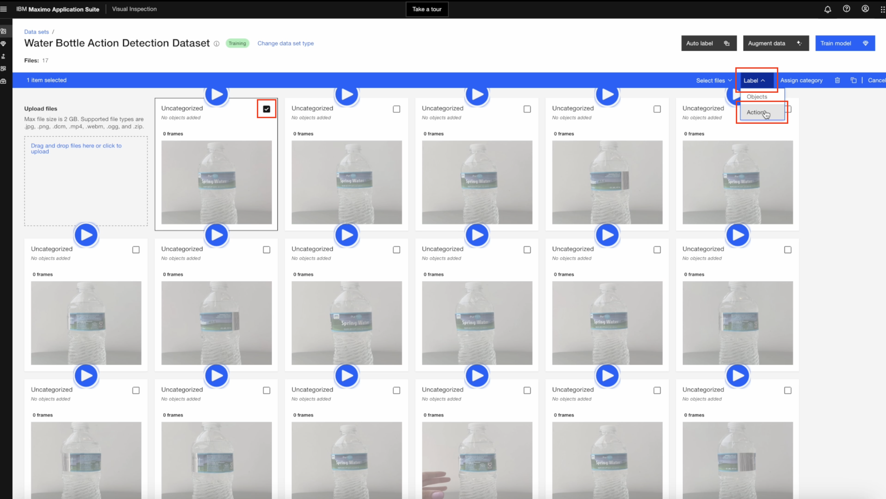

3.  El   *Acciones de etiqueta * se abre. Aquí es donde crea etiquetas para cada acción y las asigna a la parte relevante de cada vídeo en el conjunto de datos.
4.  Cree una nueva etiqueta para cada tipo de acción pulsando en el color azul **Añadir etiqueta **en la esquina superior derecha.

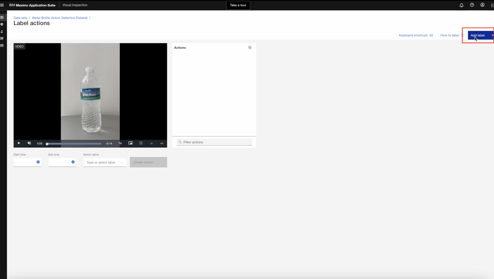

5.  Cree etiquetas para cada una de las acciones que tiene previsto etiquetar en el conjunto de datos de vídeos (en este caso, *Torsión, Shaking y Spinning *) escribiendo el nombre de la acción y pulsando el botón azul **Añadir **.

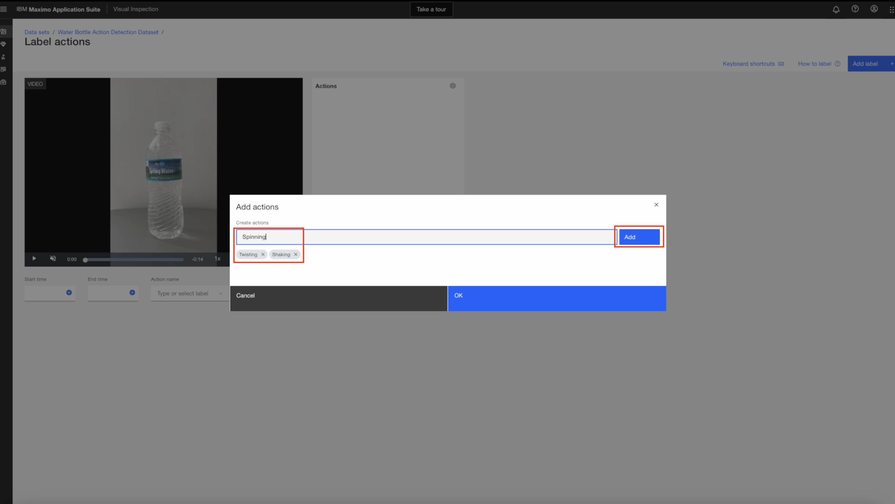

6.  A continuación, defina la *hora de inicio *y *hora de finalización *donde la acción se lleva a cabo en el vídeo y selecciona de la lista desplegable el nombre de acción correspondiente que corresponde a esa sección del vídeo. (Si la etiqueta de acción ya está creada, podrá especificar la hora de inicio y finalización y seleccionar la acción en el menú desplegable del nombre de acción.)

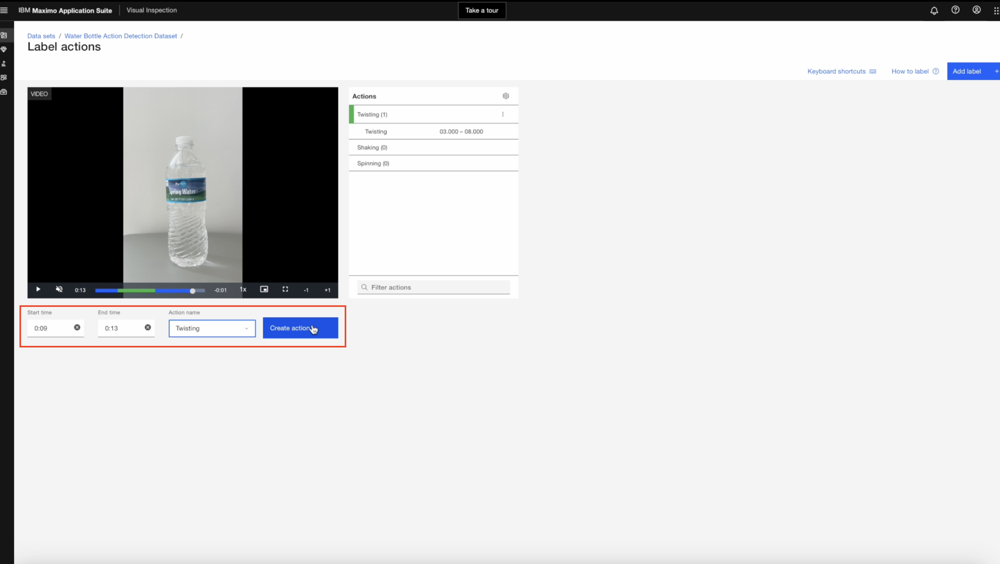

7.  A continuación, haga clic en el botón azul **Crear acción **.
8.  Verá la etiqueta emergente en la barra lateral derecha bajo la correspondiente categoría de acción con un color correspondiente. La sección correspondiente de la línea de tiempo de vídeo también se rellenará en el color correspondiente.

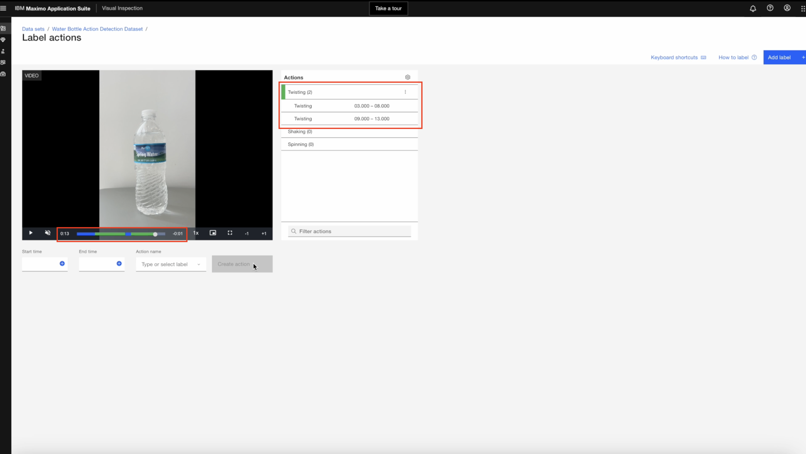

9.  Si es necesario, puede editar o suprimir etiquetas pulsando en la etiqueta específica del **Acciones **y haga clic en el icono de la pluma para editar y el icono de la papelera para eliminar. Haga clic en   **Conjunto de datos de detección de acciones de agua **Hiperenlace en el directorio de vía de acceso que se muestra en la parte superior izquierda para etiquetar otro vídeo.

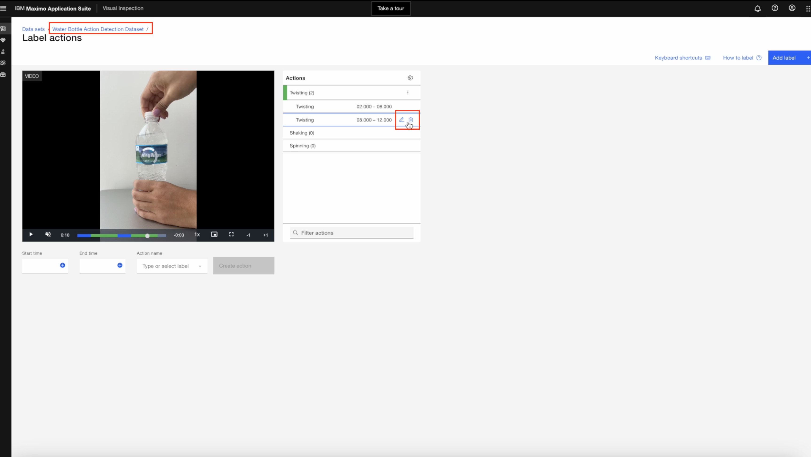

10. Repita y etiquete todos los vídeos del conjunto de datos como se ha indicado anteriormente. Una vez que todos los vídeos en el Navegador de imágenes estén correctamente etiquetados, los que tengan una acción etiquetada tendrán un icono de cuadrado negro como se describe en rojo en la imagen siguiente.

### Paso 4: Crear y formar un modelo de detección de acciones en Maximo Visual Inspection

Ahora que usted tiene un conjunto de datos factibles de videos, como el analista de activos, es el momento de aprender a entrenar un modelo de detección de acción en MVI usando estos videos etiquetados. La formación es el proceso de ajustar un modelo a los datos de entrada de manera que pueda ser utilizado para hacer predicciones sobre datos que no ha visto antes en el futuro.

Ahora es el momento de iniciar el proceso de entrenamiento de su modelo de detección de acción utilizando el poder de la MVI de IA y facilidad de uso.

**Acciones:**

1.  Pulse en **Modelo ferroviario **para iniciar el proceso de formación de detección de acciones.

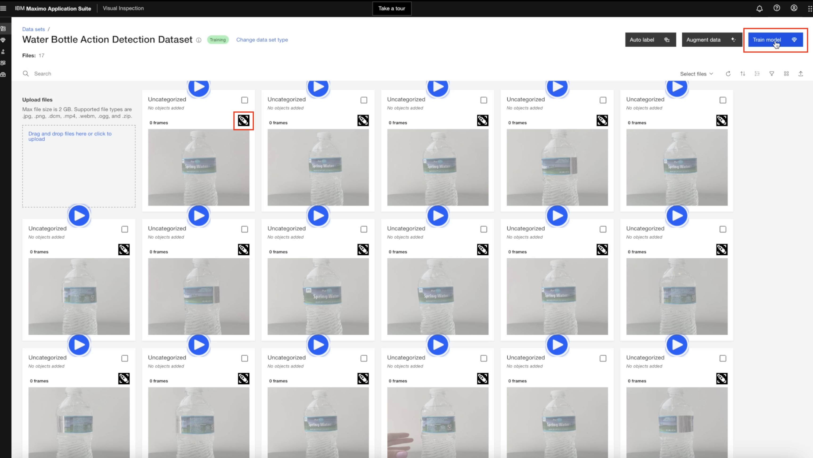

2.  El **Modelo de tren **se abre. **(1) **En primer lugar, asegúrese de tener al menos una GPU disponible para poder entrenar el modelo. De lo contrario, le solicitará que añada la formación a la cola y la tarea se pondrá en cola hasta que se disponga de una. **(2) **A continuación, seleccione   **Detección de acciones ** de la sección Seleccionar tipo de formación. **(3) **Seleccione la única opción para seleccionar el tipo de optimización de modelo a partir de ahora, **Red de segmentos estructurados (SSN) **. **(4) **Finalmente, haga clic en el azul **Modelo de tren **en la esquina superior derecha. Recordatorio para añadir las iniciales al final de todos los activos que cree en el espacio de demostración.

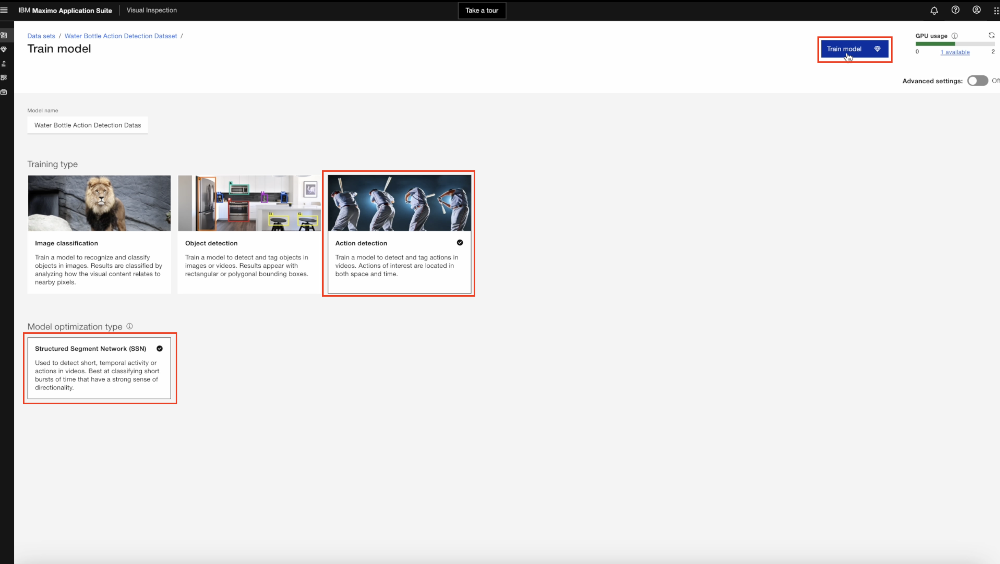

3.   Una vez que comience el entrenamiento, dependiendo de la cantidad de un conjunto de datos que esté entrenando con cuántas iteraciones, varianza y otros factores, el tiempo que tarda en completarse variará. En nuestro caso de demostración, con alrededor de diez a veinte 10-20 segundos videos, por lo general tomará alrededor de \~ 25 minutos.

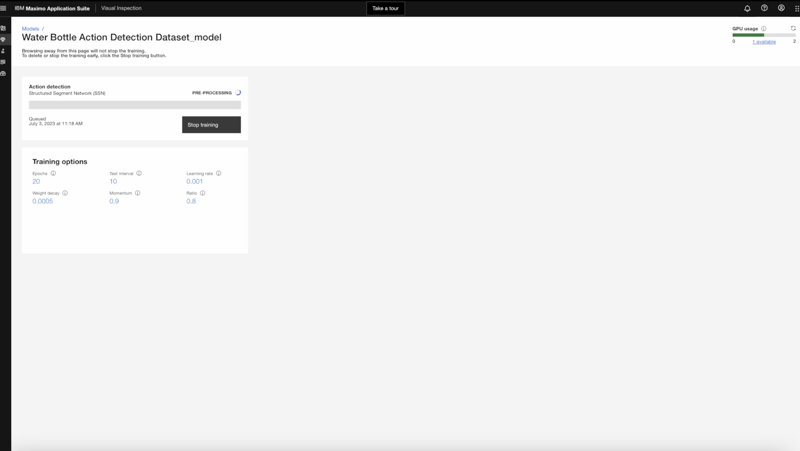 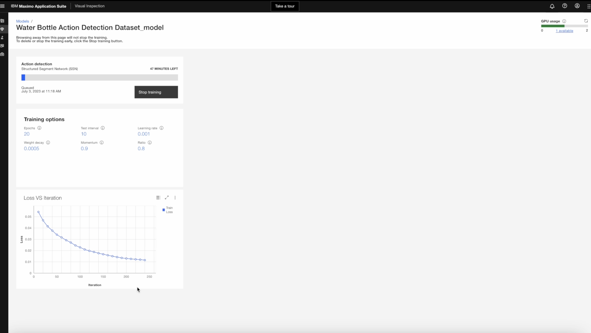

4.  Una vez realizado el entrenamiento, verá los detalles sobre la precisión, precisión y otras características sobre el modelo.
5.  También puede hacer clic en   **Hamburguesa ** icono (una barra apilada) en la parte superior izquierda para ver la lista de opciones de navegación de páginas. Seleccione   **Modelos **de la lista para ver el modelo formado en la lista de modelos formados. El clic en el **Modelo de detección de acción de botellas de agua **usted acaba de entrenar para ver más detalles

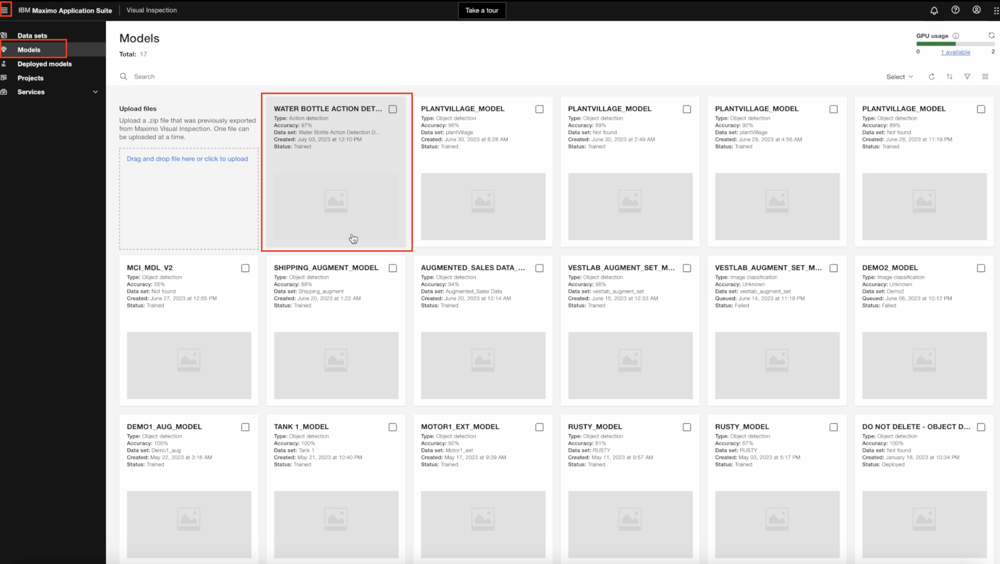

*Nota: Si está en una configuración de demostración en directo, teniendo problemas para entrenar su modelo o no hay suficientes GPU abiertas en el entorno para entrenar el conjunto de datos y crear un modelo, [**aquí **](https://livesend.ibm.com/i/6VDioBx7fI___HGis8OS42bPmSAcLVRbootOWrT25___WEHDPLUSSIGNYhgVWLte2FjvAep70KOjpm5Sifx9HjW2ZZBTV2jtriODcOHyBE1ujIF___KAH1IMEQUALSIGN)es una carpeta de todos los activos de esta demostración que contiene un archivo zip del modelo de detección de acciones que se muestra en esta guía de aprendizaje que puede descargar y cargar para utilizar (No es necesario descomprimir el archivo!). Una vez descargado, vaya al **Modelos **y haga clic en el **Cargar archivos **y seleccione el archivo zip que acaba de descargar.*

### Paso 5: Prueba de modelo

**Acciones:**

Una vez que el entrenamiento del modelo es completo y a una precisión deseada (si usted hizo su propio conjunto de datos y su exactitud es menor de lo deseado, intente agregar más videos a su conjunto de datos con la menor variación posible), el modelo debe ser probado antes de hacerlo generalmente disponibles. En la fase de validación, pasará vídeos de botellas de agua adicionales en acción al modelo que no formaban parte del conjunto de datos de entrenamiento (denominados imágenes de validación o de prueba) y permitirá que el modelo detecte automáticamente la acción que se está realizando en el vídeo. Esto asegurará que el modelo que hemos formado sea capaz de comprender y detectar la acción correcta que se está realizando en el vídeo.

La utilización de un conjunto de datos que no formaba parte de la fase de creación de modelos es un proceso estándar para comprobar el rendimiento del modelo (precisión). Esto ayuda a asegurar que los patrones detectados durante el entrenamiento del modelo son generalizables (también existen en los videos nunca antes vistos) y pueden ser usados en el mundo real para predecir nuevos videos "invisibles".

1.  Para probar su modelo, una vez en los detalles de su modelo entrenado, haga clic en el azul **Modelo de despliegue **en la esquina superior derecha. *Recordatorio: Asegúrese de volver a añadir sus iniciales al nombre del modelo desplegado.*

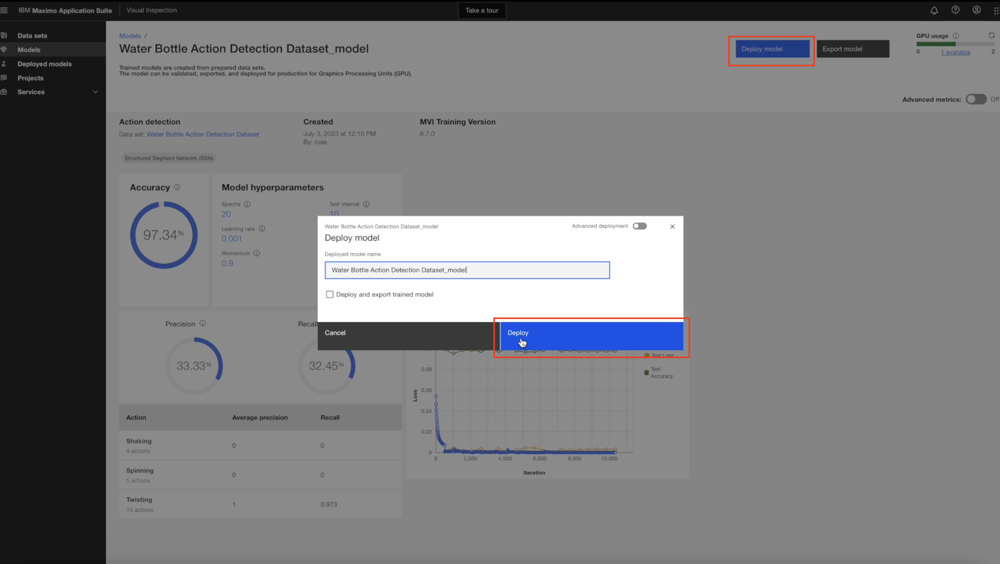

2.  Pulse de nuevo en el **Hamburguesa **en la parte superior izquierda, y luego en el **Modelos desplegados **. Sobre la   **Modelos desplegados ** , en la columna Nombre, haga clic en el hipervínculo azul **Conjunto de datos de detección de la acción **.

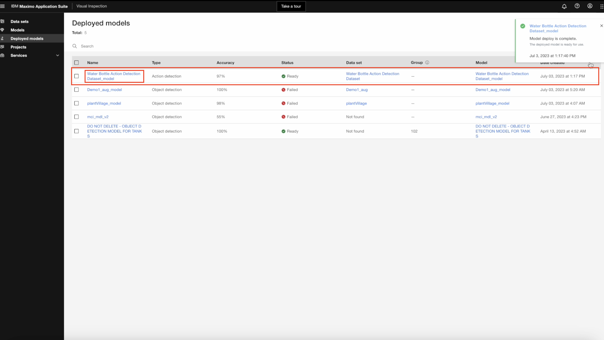

3.  En esta sección, verá algunos de los detalles e información sobre el modelo desplegado y el punto final de la API para cualquier posible integración futura de aplicaciones. Sube tus nuevos videos de prueba en el cuadro delineado en rojo en la siguiente captura de pantalla. Si ha descargado el **MVI-Dataset **y utilizó los videos de entrenamiento para entrenar su propio modelo o el archivo zip preformado, subir todos los videos encontrados en el "Testing\_Dataset".

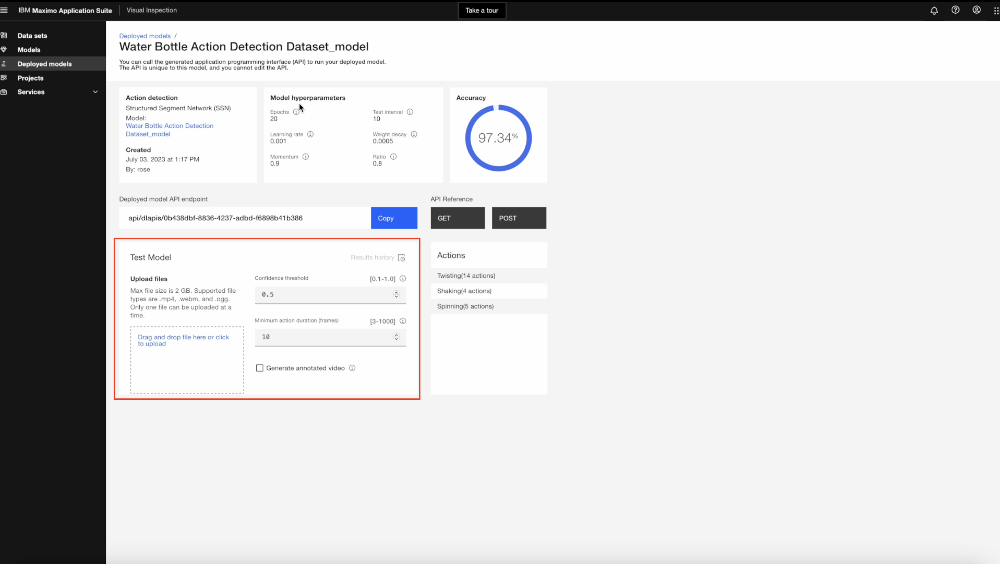

4.  En primer lugar, subir un video de torcer la tapa en la botella de agua.

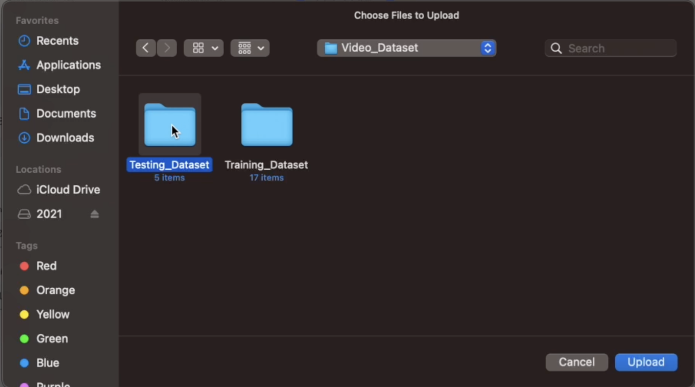

5.  Después de un par de momentos, el vídeo debería tener etiquetas de colores en su línea de tiempo correspondientes a las acciones denotadas en la barra lateral con detalles adicionales sobre la confianza de la etiqueta y el marco de tiempo específico en el que se prevé que se ha producido la acción.

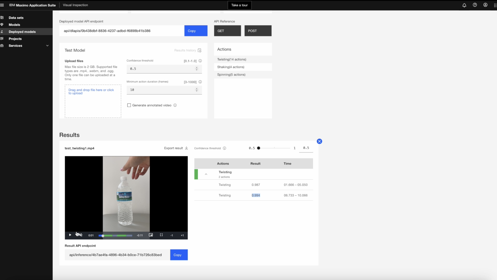

6.  A continuación, repite el proceso con un vídeo de sacudir la botella de agua, y otros vídeos que te gustaría probar.
7.  Por último, una vez realizado con esta demostración y experimentando con sus modelos y conjuntos de datos, asegúrese de suprimir sus conjuntos de datos en la sección de conjunto de datos seleccionando el conjunto de datos y pulsando el botón de la papelera en la esquina superior derecha, los modelos desplegados por seleccionar el modelo desplegado y pulsar el **-despliegue **en la esquina superior derecha, y modelos entrenados seleccionando su modelo entrenado y haciendo clic en **Papelera **en la esquina superior derecha, ya que se trata de un entorno de demostración compartido y también será utilizado por otros.

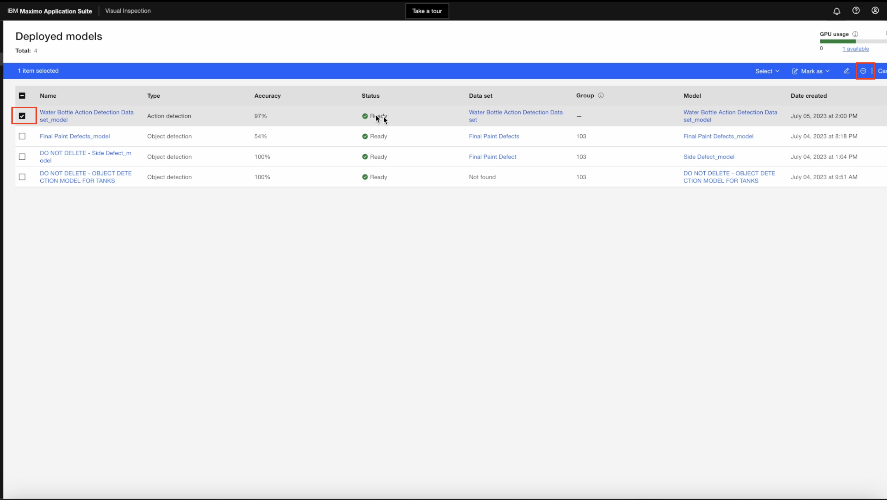 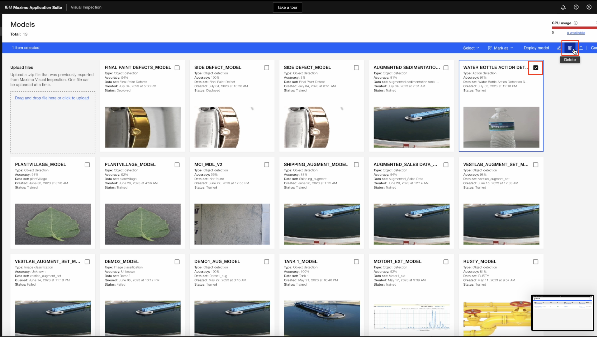

Si desea ver una demostración de vídeo del laboratorio, por favor vea esto [**vídeo **](https://livesend.ibm.com/i/6VDioBx7fI___HGis8OS42bPmSAcLVRbootOWrT25___WEE4vEqrvIUkY7FaOB3Ji2Y7IXCyw9vW3cCv5___6eS4V0ySMESNBLXObAp8dHJQgn1PLUSSIGNAEQUALSIGN).

¡Felicidades Acaba de utilizar IBM Maximo Visual Inspection para crear un modelo de visión de sistema que pueda identificar diferentes acciones realizadas en una botella de agua.

Si desea incrustar MVI en su solución, póngase en contacto con su IBM Seller para colaborar con IBM Build Labs y cocrear una solución conjuntamente.
