# Maximo Inspección Visual (MVI) - Parte 1

En este laboratorio verá primero la conexión entre Maximo Monitor y MVI.

A continuación, creará su propio conjunto de datos, etiquetará y aumentará utilizando una instancia de IVM.

<QuizAlert text="¡Aviso! ¡El material del cuestionario se marcará así!" />

## Maximo Monitor y MVI

## Paso 1: Inicie sesión en Maximo Application Suite Navigator

**Acciones:**

1. Haga clic en el enlace **URL MVI** del correo electrónico que recibió con las instrucciones para utilizar el entorno de demostración.
2. Se abre la página de inicio de sesión de IBM Maximo Application Suite. Introduzca **el nombre de usuario MVI (A)** y la **contraseña (B)** y haga clic en **Iniciar sesión**.

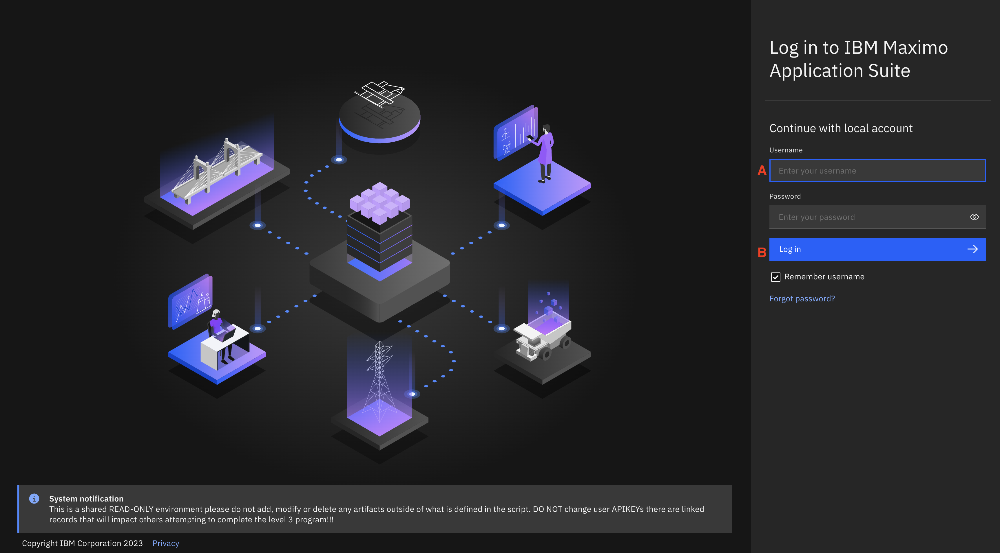

Una vez aceptadas las credenciales de acceso, se abre la ventana **del navegador** MAS Application Suite. Se muestran varias aplicaciones que componen el paquete de aplicaciones Maximo. En esta demostración, la atención se centrará en la aplicación Maximo Visual Inspection; sin embargo, la primera parte de esta demostración, examina brevemente los resultados de la inspección del modelo MVI AI en la aplicación MAS Monitor. (Nota: en este entorno de demostración, sólo están disponibles las aplicaciones necesarias para completar MVI L3).

> Nota: Si es la primera vez que inicia sesión en la aplicación MAS, es posible que se le pida que vea un recorrido rápido por la aplicación (tutorial práctico). Por favor, descarte cualquier recorrido de este tipo para los fines de esta demostración.

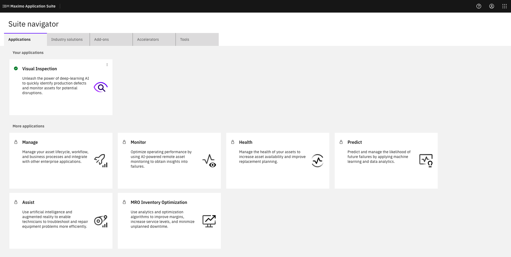

3. En la página de **navegación** de MAS **Suite**, haga clic en la ficha **Inspección visual (A)**.

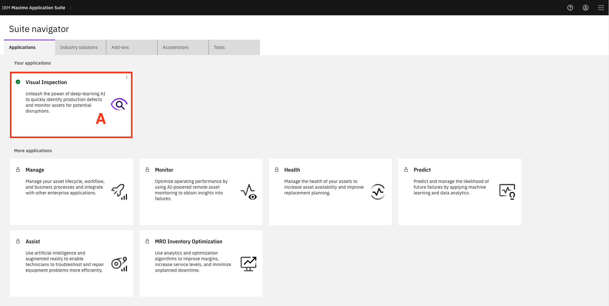

4. Haga clic en **Get started (A** ) en la pantalla MVI **Welcome to IBM Maximo Visual Inspection**.

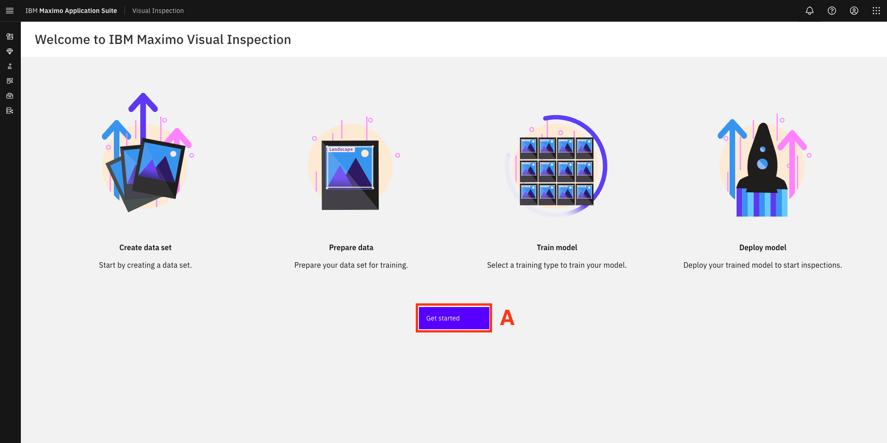

Se abre la página **Conjuntos de datos**.

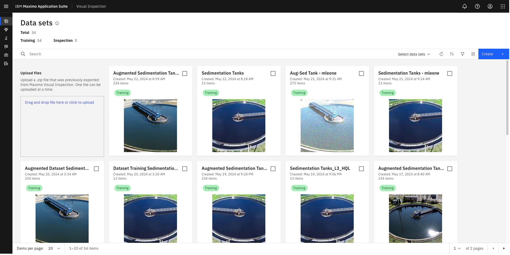

 

 

## Paso 2: Crear un conjunto de datos para el entrenamiento del modelo en Maximo Visual Inspection

**¿Qué es un conjunto de datos IVM y por qué es necesario crearlo?**

Como primer paso hacia la construcción de su modelo de inspección de IA, debe crear un conjunto de datos en MVI que contenga imágenes de tanques limpios y sucios para enseñar al modelo cómo es cada clase.

Los datos son el núcleo del aprendizaje automático (AM). En el caso de los modelos basados en la visión, estos datos adoptan la forma de imágenes o vídeos. Los modelos MVI ML incorporados detectan y aprenden de forma inteligente patrones en el conjunto de datos cargados y analizan estos datos repetidamente hasta que pueden discernir distinciones y, en última instancia, reconocer objetos de interés en las imágenes. Por ejemplo, para entrenar a un ordenador en el reconocimiento de neumáticos de automóvil, es necesario alimentarlo con grandes cantidades de imágenes de neumáticos y objetos relacionados con ellos para que aprenda las diferencias e identifique un neumático, especialmente uno con defectos.

Para este modelo de caso de uso, se creará un conjunto de datos con un número limitado de imágenes de tanques limpios y sucios por motivos de brevedad; sin embargo, en escenarios del mundo real, un modelo de visión por ordenador requeriría muchas más imágenes y tiempo de procesamiento del que ofrece esta demostración.

En esta demostración, usted carga manualmente las imágenes de tanques guardados desde su máquina local al tablero de instrumentos de la aplicación MVI, sin embargo, los modos de captura de imágenes incorporados en las aplicaciones MVI Mobile y MVI Edge (partes de la solución MVI) también se pueden utilizar para recoger y copiar imágenes automáticamente en la aplicación MVI. Ahora es el momento de empezar a crear un conjunto de datos.

**Acción:**

5. En la pantalla **Conjuntos de datos** MVI, haga clic en el icono azul **Crear + (A)** situado en la parte superior derecha.

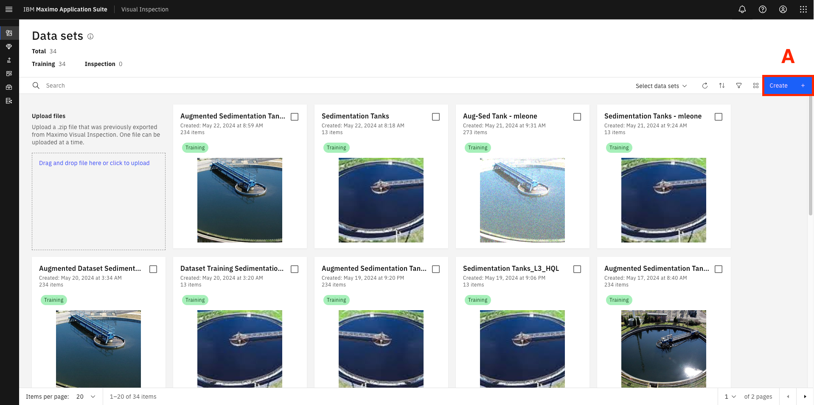

6. Introduzca `Sedimentation Tanks <YOUR INITIALS>` para el campo **Name** en la ventana **Create data set** (ya que está compartiendo el entorno de demostración de Maximo Visual Inspection con otras personas se requiere un identificador único para evitar conflictos de nombres) **(A).**
7. Haga clic en **Crear (B)**.

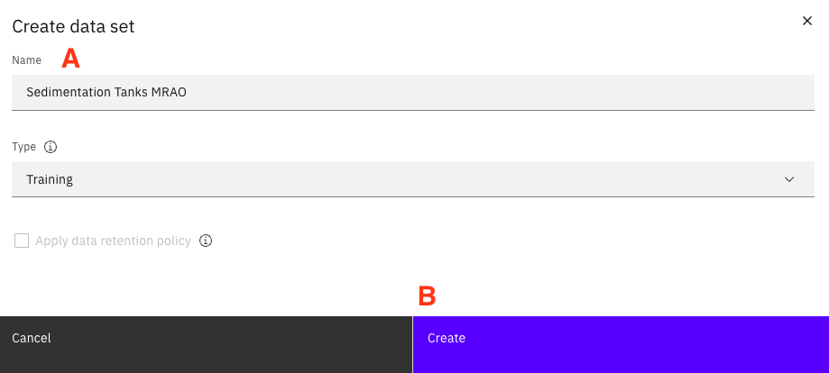

**Importante:** Este script de demostración no trata los nombres de los conjuntos de datos con ningún identificador único. Por lo tanto, a modo de ejemplo, si se le indica que haga clic en el conjunto de datos ***Tanques de sedimentación***, deberá hacer clic en el conjunto de datos ***Tanques de sedimentación \<SUS INICIALES>***, es decir, el conjunto de datos que usted nombró junto con su identificador único.

8. Haga clic en la mitad inferior del mosaico de **Tanques de Sedimentación** recién creado (donde se muestra un icono de imagen gris claro).

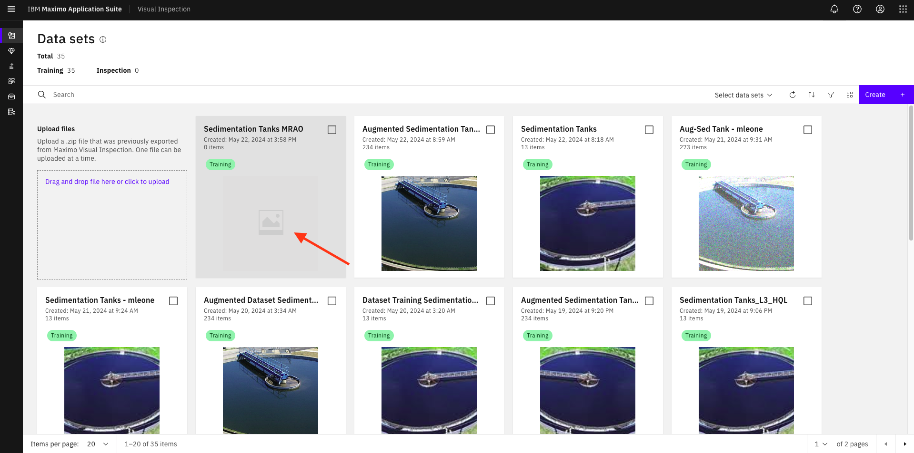

Una vez que haga clic en este mosaico, se abrirá una ventana para el conjunto de datos que acaba de crear. Como se muestra en los siguientes pasos, puedes realizar varias operaciones clave en esta página, como cargar imágenes, etiquetar objetos, aumentar datos y entrenar tu modelo.

9. Haga clic en **Importar archivos** para importar las imágenes del tanque de entrenamiento del modelo desde el directorio donde descomprimió los archivos de muestra.

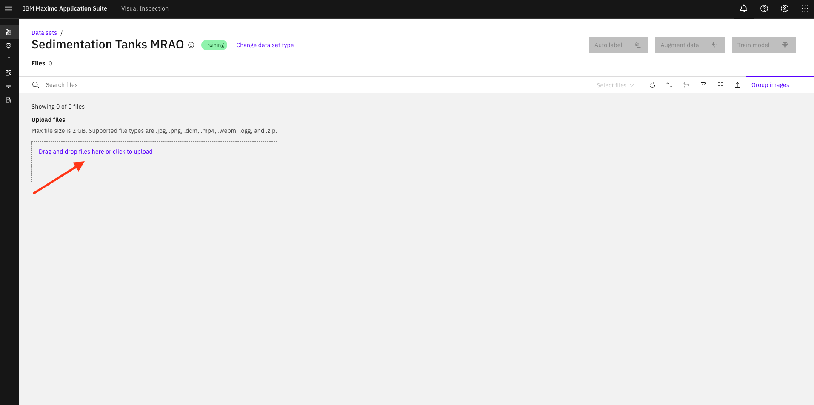

10. Navegue hasta la ubicación del directorio donde descomprimió la carpeta **Images of Sedimentation Tanks for training (Imágenes de tanques de sedimentación para formación** ), descargada y extraída en el[ Paso 2 del trabajo previo.](/maximo/mvi-prereq#step-2-download-the-training-and-validation-tank-images-for-the-ai-model)
11. Seleccione todas las imágenes de tanques de la carpeta y haga clic en **Abrir**.

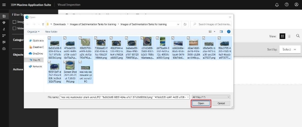

Tras unos segundos, las imágenes se cargan en el conjunto de datos recién creado. Este conjunto de datos incluye varias fotos de tanques de sedimentación limpios y sucios. Ahora está listo para etiquetar estas imágenes.

## Paso 3: Etiquetar el conjunto de datos

En este paso, etiquetará las imágenes del tanque. Etiquetar es marcar las imágenes de entrada con información sobre su contenido. En la detección de objetos, esto implicaría resaltar las apariciones de elementos de interés. En el caso de esta demostración, revisará cada una de las imágenes del tanque cargadas y resaltará la parte de la imagen que representa un tanque limpio o sucio. Durante la fase de entrenamiento, estas imágenes etiquetadas permitirán a su modelo aprender qué parte de la imagen representa un tanque y, a continuación, si esa parte de la imagen contiene un tanque limpio o sucio.

Como puede imaginar, etiquetar correctamente las imágenes es fundamental para la precisión del modelo que está creando, ya que influye directamente en la calidad general del modelo entrenado. Sencillamente, cuando se trata de identificar objetos o clasificar imágenes, lo mejor es que sea un experto en el caso de uso, es decir, una persona con los conocimientos pertinentes en la materia, quien etiquete las imágenes. Esto garantizará la máxima calidad de la información que se introduzca en el entrenamiento del modelo. Tradicionalmente, los científicos de datos han sido el punto central de las iniciativas de IA y han malgastado su valioso tiempo etiquetando datos (a pesar de no ser ni siquiera expertos en la materia; por ejemplo, ¿podría un científico de datos etiquetar mejor un tanque sucio que el ingeniero de inspección in situ?) Con la IVM, un experto en la materia -sin conocimientos de ciencia de datos- puede etiquetar las imágenes y, a continuación, construir un modelo basado en ellas.

Este enfoque reduce la barrera de entrada y permite a los expertos en la materia con poca o ninguna formación en IA crear e implantar modelos de IA operativos en cuestión de horas, no de días o semanas.

### Acciones

Una vez que todas las imágenes se cargan en MVI realizar los siguientes pasos:

1. En el menú desplegable Seleccionar archivos, haga clic en **Todos (A)** para seleccionar automáticamente todas las imágenes del conjunto de datos.

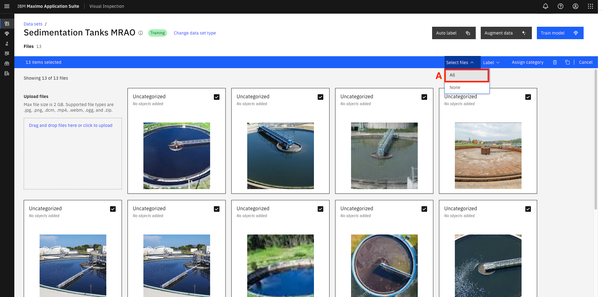

2. Haga clic en **Etiquetar objetos (B)**.

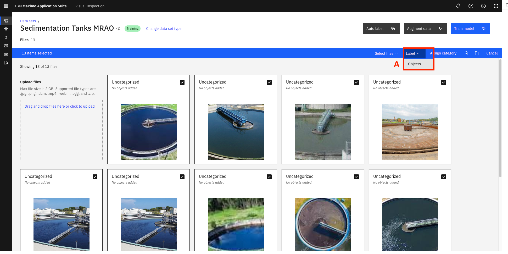

Se abre la página **Etiquetar objetos / Tanques de sedimentación**. Aquí es donde se crean las etiquetas para los tanques limpios y sucios y se asignan a la parte correspondiente de las imágenes en el conjunto de datos. A continuación se destacan varias secciones de la interfaz de usuario de la página Objetos de etiqueta para referencia de diseño.

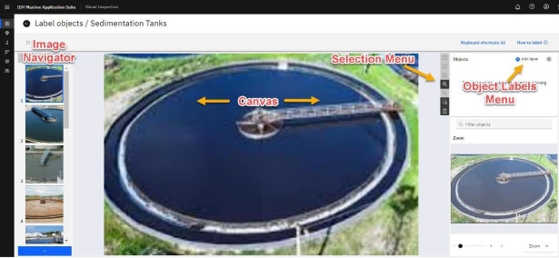

3. Para iniciar el proceso de etiquetado, debe definir las etiquetas (limpias y sucias). Haga clic en **+ Añadir etiqueta** en la ventana **Objetos** del extremo derecho.

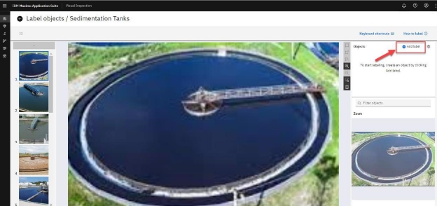

4. En la ventana **Añadir objetos** que se abre, escriba "clean" en el campo **Crear objeto** **(A)** y haga clic en el botón **Añadir** **(B).**

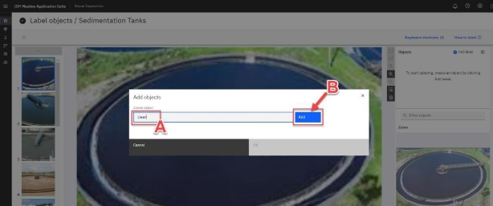

5. Ahora, escribe "dirty" en la ventana **Añadir objetos** y haz clic en **Añadir**.

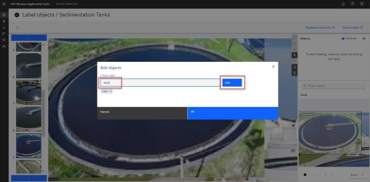

6. Haga clic en **Aceptar** para completar el proceso de Añadir etiqueta.
7. Una vez definidas las etiquetas, puede comenzar el proceso de etiquetar los objetos del tanque adecuadamente. Asegúrese de que la primera imagen del tanque está seleccionada en el Navegador de Imágenes (verá un recuadro azul oscuro alrededor de la imagen seleccionada en el Navegador de Imágenes de la izquierda). Seleccione el nombre de la etiqueta **limpia** en la ventana **Objetos** de la derecha **(A).**
8. Haga clic en el icono **Cuadro** del menú de selección **(B)** y dibuje un cuadro alrededor de una porción de la imagen que denote el tanque limpio o sucio **(C)**.

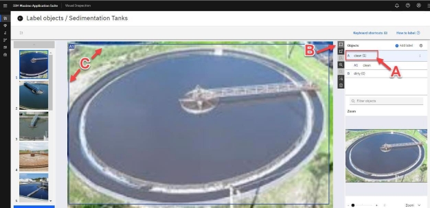

Debido a la posible clasificación aleatoria de imágenes, es posible que la primera imagen que vea en el navegador de imágenes sea la de un tanque sucio. En este caso, elija la etiqueta **sucio** en lugar de **limpio** y etiquete la primera imagen en el paso 7 de esta sección adecuadamente.

En caso de que te equivoques al dibujar la casilla, selecciona la casilla errónea y haz clic en el icono de **la papelera** situado junto a la etiqueta. También puedes pulsar **CTRL + Z** o **Comando + Z** en el teclado de Windows y Mac, respectivamente, para deshacer la última acción.

9. Etiquete todas las imágenes en el Navegador de Imágenes siguiendo las instrucciones de los pasos anteriores. Puede hacer clic en el botón **azul de flecha hacia abajo** para desplazarse y seleccionar las imágenes en secuencia para etiquetarlas.

**Consejos para el etiquetado de imágenes:**

- Los tanques con agua azul están limpios.
- MVI recuerda su selección anterior de etiquetas, por lo que no necesita hacer clic en las etiquetas **limpio** o **sucio** cada vez para etiquetar cada nueva imagen. Sólo tiene que seleccionar la etiqueta adecuada la primera vez que inicie el etiquetado de objetos y seguir utilizándola hasta que sea necesario cambiar a otra etiqueta de objeto, por ejemplo, pasar de etiquetar una imagen de tanque limpio a una imagen de tanque sucio y viceversa.

Para su comodidad, una barra azul claro resalta la etiqueta que está actualmente en selección, como se muestra en la siguiente captura de pantalla.

- Si hay más de un depósito (o porción de depósitos) en una imagen, dibuje recuadros de etiqueta separados alrededor de cada depósito, como se muestra en la captura de pantalla siguiente.

1. Una vez que todas las imágenes de tanques del Navegador de imágenes estén debidamente etiquetadas, haga clic en el icono **Atrás** (no en el botón Atrás de su navegador) para volver a la página **Conjunto de datos / Tanques de sedimentación**.

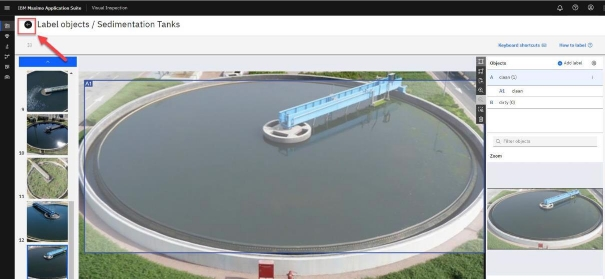

Se abre la página del conjunto de datos Tanques de Sedimentación. Observe cómo se muestran las etiquetas recién creadas junto con cada imagen de tanque correspondiente (en la captura de pantalla siguiente se resaltan algunas etiquetas)

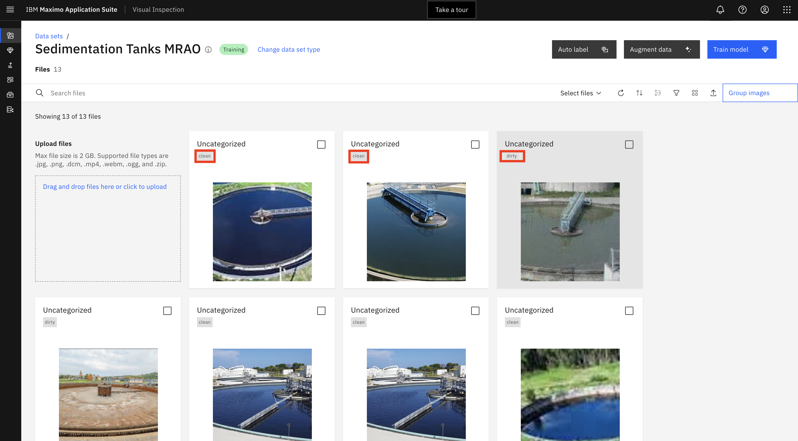

## Paso 4: Aumento de datos

MVI ofrece una manera fácil y rentable de aumentar los conjuntos de datos. Llegados a este punto, ya ha etiquetado todas las imágenes de tanques del conjunto de datos cargado.

Cuando se construye un modelo de visión por ordenador de aprendizaje profundo, cuantas más imágenes se añadan al conjunto de datos, más preciso será generalmente el modelo. Sin embargo, puede haber ocasiones en las que no se disponga de un conjunto de datos tan variado o lo suficientemente grande como para crear un modelo preciso y generalizado, y el coste de adquirir nuevos datos sea demasiado elevado.

Para solucionar este problema, el IVM ofrece funciones de aumento de imágenes, que permiten aplicar filtros para realizar operaciones como voltear, desenfocar, enfocar y recortar, con el fin de crear imágenes adicionales, aumentando así el rendimiento del modelo y reduciendo el coste de adquisición de más datos. Este proceso de aumento multiplica varias veces el número original de imágenes. Y lo bueno es que cualquier etiquetado que se haya hecho en las imágenes originales se mantiene en las nuevas imágenes aumentadas para evitar tener que volver a trabajar.

Para esta demostración, es justo suponer que es poco probable que una cámara de campo fija tome imágenes de los tanques en las mismas condiciones todas las veces. La iluminación variará en función del tiempo y la hora del día. Si la cámara es giratoria, su orientación respecto al tanque y el enfoque de la imagen también pueden variar. En lugar de intentar proporcionar imágenes para todos los escenarios posibles, el aumento de imágenes puede ayudar a simular estas diferentes condiciones. Así es como, el aumento de datos ayuda a añadir datos adicionales a su conjunto de datos para mejorar el rendimiento del modelo (precisión). Utilizará algunas de las opciones disponibles de aumento de datos MVI para añadir volumen y variedad a su conjunto de datos de imágenes de tanques.

### Acciones

1. Haga clic en **Aumentar datos**.

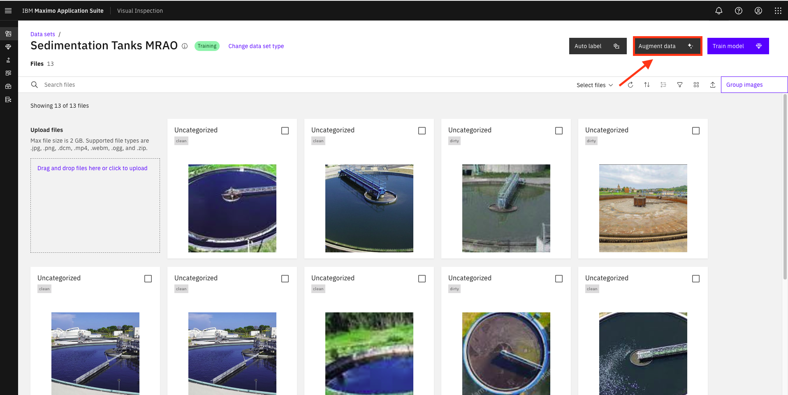

2. La ventana **Aumentar datos** se abre y muestra todos los filtros de aumento de datos disponibles de MVI. Seleccione los filtros **Sharpen**, **Crop**, **Rotate**, **Vertical flip** y **Horizontal flip** para generar imágenes adicionales **(A)**. Observe que el número de imágenes bajo las etiquetas **Nuevas creaciones** y **Nuevo total** aumenta a medida que se seleccionan más filtros.
3. Haga clic en **Continuar (B).**

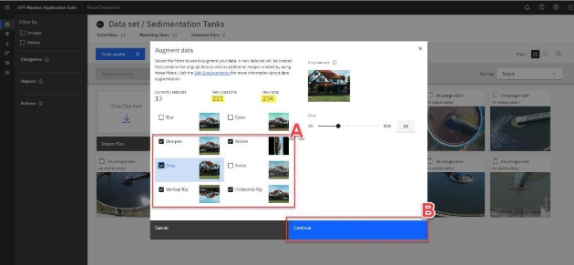

4. Se abre la ventana Aumentar **datos**. Nombre el nuevo conjunto de datos escribiendo `Augmented Sedimentation Tank <YOUR INITIALS>` **(A)**
5. Haga clic en **Crear conjunto de datos** para crear su nuevo conjunto de datos aumentados **(B)**

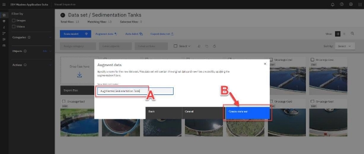 Una vez que haga clic en **Crear conjunto de datos**, podrá seguir el progreso del proceso de aumento de datos en una pequeña ventana que aparece en la parte superior derecha de la pantalla.

En esta ventana;

- Una barra de progreso azul indica que el aumento de datos está en curso.
- Un mensaje de confirmación de finalización y una marca de verificación verde indican que el proceso se ha completado.

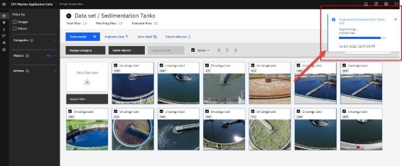

6. Haga clic en el enlace **Conjunto** de datos para volver a la página principal de **Conjuntos de datos**, donde podrá ver el conjunto de datos aumentado que acaba de crear.

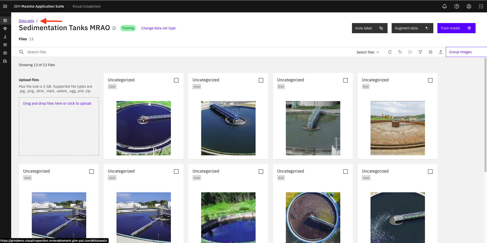

7. Se abre la página principal de **Conjuntos de datos**, que muestra tanto el conjunto de datos original como el aumentado. Observe el mayor número de imágenes en el conjunto de datos aumentado en comparación con el conjunto de datos original (el número de imágenes en cada conjunto de datos se muestra justo debajo de su nombre en el mosaico). Haga clic en la mitad inferior (la imagen del tanque de agua) de su recién creado mosaico de **Tanques de Sedimentación A** umentados.

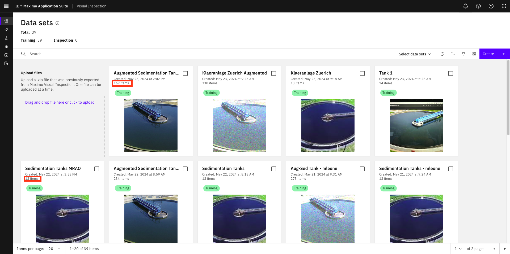

8. Una vez abierta la página del conjunto de datos aumentado, observe cómo todas las imágenes aumentadas generadas por el IVM tienen un pequeño icono negro ("mágico") en la parte inferior derecha de la imagen. Observe también cómo las etiquetas de las imágenes se transfieren automáticamente de las imágenes originales a sus correspondientes imágenes aumentadas.

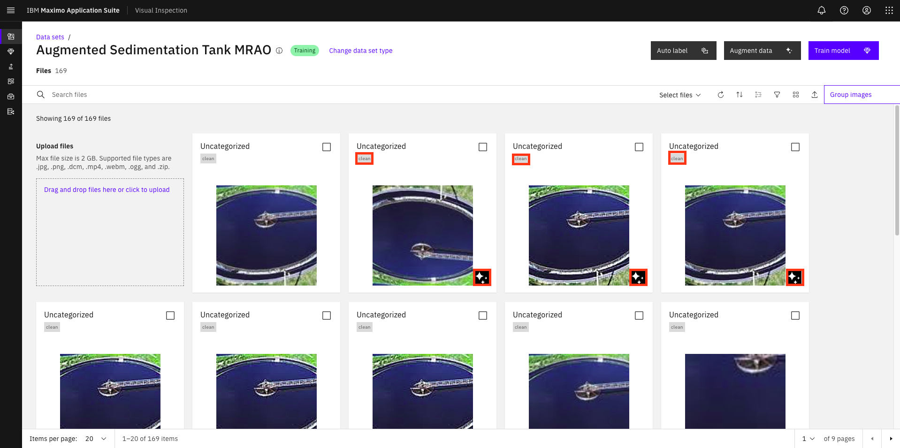

Enhorabuena, has creado un nuevo conjunto de datos aumentado a partir del original que está listo para ser entrenado. Ahora es el momento de crear el modelo de detección de objetos utilizando este conjunto de datos aumentado.

La segunda parte del laboratorio de IVM está disponible [aquí](/maximo/visual-inspection2).
