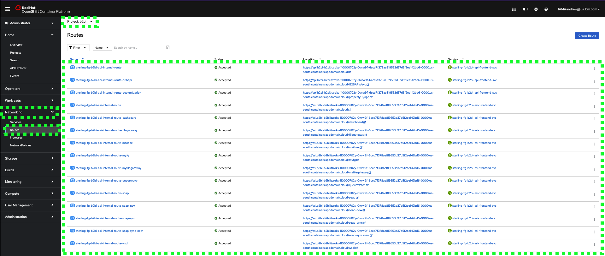
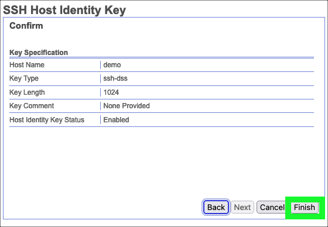
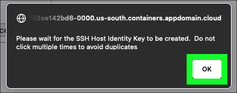
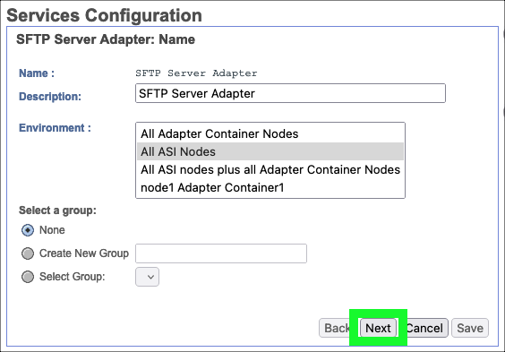
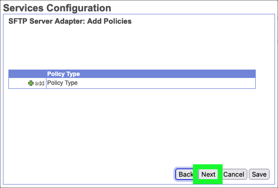
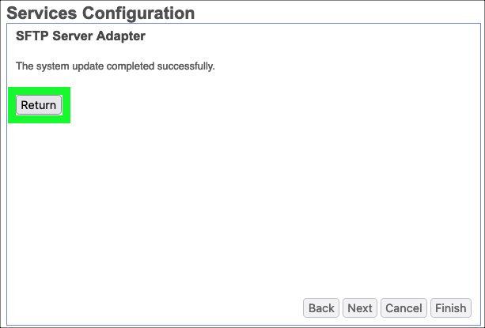

# 103: Configuración B2Bi Parte 1

En este capítulo, aprenderá a configurar un adaptador del protocolo de transferencia segura de archivos (SFTP) mediante la implantación de B2Bi en contenedores.

:red\_circle: **POR FAVOR TENGA EN CUENTA QUE ESTE PRIMER LABORATORIO SERÁ DIRIGIDO Y COMPLETADO ÚNICAMENTE POR EL INSTRUCTOR**:red\_circle:

Este será un ejercicio grupal para completar la Configuración B2Bi Parte 1 ya que sólo se necesita 1 identidad de Host SSH y 1 adaptador de Servidor SFTP para el taller completo. Sin embargo, puede seguir los pasos que se muestran a medida que los realiza el líder del taller. Cuando repita esta configuración para una demostración de cliente por su cuenta, complete **tanto la Configuración B2Bi Parte 1 como la** Configuración B2Bi Parte 2.

## Abra el panel B2Bi

El tablero B2Bi se ejecuta como una aplicación en Red Hat OpenShift. Estos pasos le guiarán en la consola OpenShift para encontrar e iniciar el panel B2Bi desde la ruta OpenShift.

1.  En la consola web de OpenShift, haga clic en **Rutas** en la sección **Red** del panel izquierdo.

    

2.  Haga clic en el menú desplegable **Todos los proyectos** y haga clic en el proyecto **b2bi**.

    

    <QuizAlert text="Several BP quiz questions will come from the OpenShift web console. When taking the BP quiz make sure the environment is still active and keep this demonstration script open." />

3.  Fíjese en todas las rutas que hay definidas actualmente en el proyecto b2bi, son 15

    

4.  Para iniciar la configuración del adaptador SFTP, inicie el panel IBM Sterling B2Bi haciendo clic en la ruta **sterling-fg-b2bi-asi-internal-route-dashboard** en la columna **Ubicación**. No haga clic en el nombre de la ruta, sino en el enlace Ruta de la columna **Ubicación** de la tabla.

    

    > Como se trata de una nueva instalación, en esta demostración se utilizarán identificadores de usuario y contraseñas administrativas simples. Para mantener las cosas simples en esta demostración, todas las contraseñas se establecerán en **password#**. No es seguro, pero será un entorno de demostración de corta duración.

5.  Introduzca **admin** en el campo **ID de usuario** y **password#** en el campo **Contraseña** y, a continuación, haga clic en **Iniciar sesión**.

    

## Crear una clave de identidad de host SSH

En primer lugar, es necesario crear una **identidad de host SSH**. La clave de identidad del host es un par de claves privada/pública que se utiliza para identificar el servidor SFTP de la aplicación ante clientes remotos. Tenga en cuenta que, para esta demostración, se utilizarán los valores predeterminados siempre que sea posible, pero las implementaciones de producción pueden utilizar otros valores en función de los requisitos del cliente.

<QuizAlert text="Several BP quiz questions will come from the B2Bi dashboard. When taking the BP quiz make sure the environment is still active and keep this demonstration script open." />

1.  Haga clic en la opción de menú **Despliegue de** la barra de menús de la izquierda.

    

2.  Haga clic en el elemento de menú **Clave de identidad de host SSH** de la barra de menús de la izquierda.

    

3.  Haga clic en el botón **¡Vamos!** del cuadro **Crear: Nueva clave de identidad de host**.

    

4.  Introduzca **demo** en el campo **Nombre de host:** del formulario "Nueva clave de identidad de host" y, a continuación, haga clic en el botón **Siguiente**.

    

5.  Haga clic en **Finalizar**.

    

6.  Haga clic en **OK**

    

7.  Espere a recibir el mensaje completo y pulse el botón **Volver**.

    

## Crear un adaptador SFTP

A continuación, debe crearse un adaptador SFTP que utilizará el puerto de servicio de OpenShift para B2Bi.

1.  En la barra de menús de la izquierda, haga clic en la opción **Servicios** del menú **Despliegue**.

    

2.  Haga clic en el menú **Configuración**, en **Servicios**.

    

3.  Introduzca **sftp** en el campo **Nombre del servicio** y pulse el botón **Ir** en el cuadro **Buscar**.

    

4.  Localice la entrada **Adaptador de servidor SFTP** en la tabla y haga clic en el botón **Editar**.

    

5.  Revise la configuración predeterminada y haga clic en **Siguiente**.

    

6.  Revise la configuración en el **adaptador de servidor SFTP:** Formulario de **configuración**.

    

    El **puerto de escucha del servidor SFTP** predeterminado debe cambiarse al puerto del servicio B2Bi configurado en OpenShift.

7.  Vuelva a la ventana o pestaña del navegador de la consola web de OpenShift y haga clic en **Servicios** en la sección **Redes** de la barra de menús de la izquierda.

    

8.  Busque y haga clic en el enlace **sterling-fg-b2bi-asi-backend-svc**.

    

9.  Localice y copie el número de **puerto de nodo** para **adaptadores-1** en la tabla de **asignación de puertos de servicio**.

    

10. Anote el número de **puerto del nodo**, se utilizará varias veces durante esta demostración.

11. Vuelva a la ventana o pestaña del navegador **B2Bi Dashboard**.

    

12. Introduzca o copie el número de **puerto de servicio** registrado en el campo de entrada **Puerto de escucha del servidor SFTP** y haga clic en **Siguiente**.

    

13. Revise la configuración por defecto del **Adaptador del Servidor SFTP: Configuración: Almacenamiento de documentos** y haga clic en **Siguiente**.

    

14. Revise la configuración predeterminada en la página **SFTP Server Adapter: Agregar directivas** y haga clic en **Siguiente**.

    

15. Revise la configuración predeterminada en la página **SFTP Server Adapter: Configuración** y haga clic en **Siguiente**.

    

16. Revise la configuración predeterminada en la página **Adaptador de servidor SFTP: Extractabilidad** y haga clic en **Siguiente**.

    

17. Revise la página **SFTP Server Adapter:** Página de **confirmación** y haga clic en **Finalizar**.

    

18. Haga clic en **Volver** una vez creado el nuevo adaptador SFTP.

    

19. Haga clic en la **casilla** situada junto al **Adaptador de servidor SFTP** para iniciar el adaptador.

    

20. Haga clic en el icono  situado junto al **adaptador del servidor SFTP**.

    

21. Compruebe que el **adaptador del servidor SFTP** está **en ejecución**.

    

22. Cierre la ventana emergente **Información del adaptador**.

    

23. Haga clic en el enlace **Cerrar sesión** para salir del **panel B2Bi**.

    

Ahora que el adaptador SFTP está funcionando, es hora de pasar al siguiente paso en la configuración de B2Bi.
