# 104: Configuración B2Bi Parte 2

En este capítulo, aprenderá a crear una comunidad de socios B2Bi, añadir socios a la comunidad, crear un grupo con estos usuarios, crear una plantilla de enrutamiento para el grupo y crear canales de enrutamiento.

Para que este taller resulte interesante, pondremos en marcha una colección de redes de socios comerciales, en la que cada uno compartirá archivos dentro de su red. Para ello, cada participante en el taller dará un nombre único a los recursos utilizando un prefijo de sus iniciales en los recursos. Todos los ejemplos que siguen son los que usaría Bilbo Bolsón (bb).

## Crear una comunidad de socios

1.  Vuelva a la consola web de OpenShift y haga clic en el enlace de **ruta** a la interfaz de usuario (UI) de IBM Sterling File Gateway: **sterling-fg-b2bi-asi-internal-route-filegateway**.

    

2.  Introduzca **fg\_sysadmin** en el campo ID de usuario, **password#** en el campo Contraseña y, a continuación, haga clic en el botón **Iniciar sesión**.

    

3.  Haga clic en el menú desplegable **Participantes** de la barra de menús superior.

    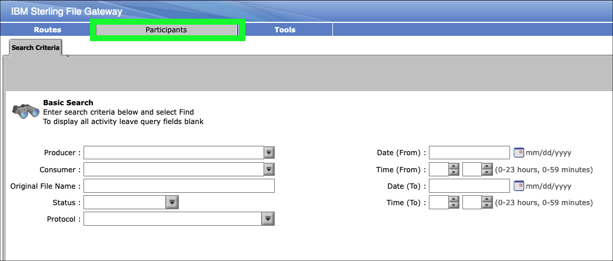

4.  Haga clic en **Comunidades** en el menú **Participantes**.

    

5.  En la ventana emergente **Comunidades**, haz clic en el enlace **añadir**.

    

6.  Anteponga sus iniciales y un guión bajo al nombre de la comunidad. Por ejemplo, Bilbo Bolsón introduciría **bb\_sftp\_community** en el campo de entrada **Nombre de la comunidad** y haría clic en **Siguiente**.

    

7.  Seleccione las casillas de verificación **Partner Initiates Protocol Connections to Mailbox** y **Partner Listens for Protocol Connections**.

    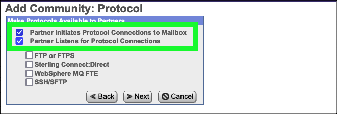

8.  Seleccione la casilla **SSH/SFTP** y haga clic en **Siguiente**.

    

9.  Haga clic en **Siguiente** en el formulario **Añadir comunidad: Notificaciones**.

    

10. Haga clic en **Finalizar** para confirmar la creación de la nueva comunidad.

    

11. Haga clic en **Volver** en la pantalla de confirmación de la comunidad.

    

## Añadir socios a la comunidad de socios

A continuación, añade 2 socios a la recién creada **bb\_sftp\_community**.

1.  Haz clic en el enlace de **edición** de la comunidad que tiene tus iniciales como prefijo (siguiendo el mismo ejemplo para Bilbo): **bb\_sftp\_community** en la ventana emergente **Comunidades**.

    

2.  En **Socio**, haga clic en el enlace **Añadir**.

    

3.  Utilice sus iniciales seguidas de un **guión** como prefijo para el primer identificador de socio. Introduzca **bb-partner1** en el campo **Nombre de socio**, 10 dígitos en el campo **Teléfono**, **[bb-partner1@localhost.com](mailto:bb-partner1@localhost.com)** en el campo **Dirección de correo electrónico** y, a continuación, haga clic en **Siguiente**.

    

4.  Introduzca **bb-partner1** en el campo **Nombre de usuario**, **contraseña** en el campo **Contraseña**, **contraseña** en el campo **Confirmar contraseña**, **BB Partner** en el campo **Nombre**, **Uno** en el campo **Apellido** y, a continuación, haga clic en **Siguiente**. Técnicamente, puede utilizar la contraseña que prefiera, pero será necesaria más adelante en el laboratorio de demostración del cliente.

    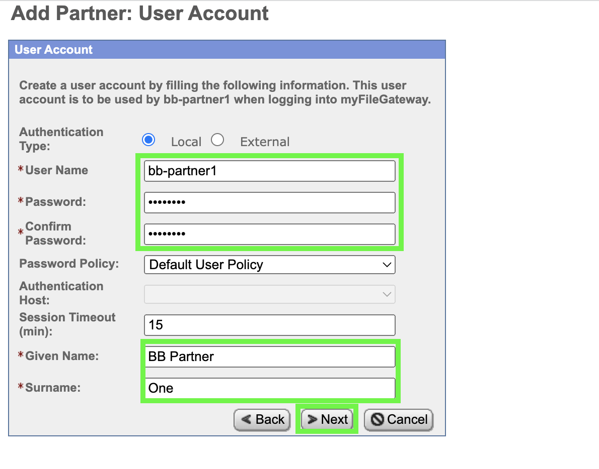

5.  Haga clic en **bb-socio1 es un Productor de Datos** y luego haga clic en **Siguiente**.

    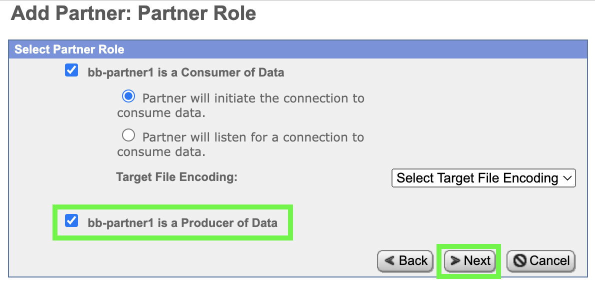

6.  Revise la configuración predeterminada en la pantalla **Iniciar configuración de conexiones** y, a continuación, haga clic en **Siguiente**.

    

7.  Revise la configuración predeterminada en la pantalla **Configuración PGP** y, a continuación, haga clic en **Siguiente**.

    

8.  Revise la configuración de **bb-partner1** y haga clic en **Finalizar**.

    

9.  Haga clic en **Volver** en la pantalla **Socio añadido con éxito**.

    

10. Repita los pasos 13 a 20 para crear un segundo interlocutor llamado **interlocutor2** utilizando la misma configuración.

    

11. Haga clic en **Volver** en la pantalla **Editar comunidad: bb\_sftp\_community** después de crear ambos interlocutores.

    

12. Cierre la ventana emergente **Comunidades**.

    

13. Haga clic en **Socios** en el menú **Participantes**.

    

14. Haga clic en el botón **Actualizar** si **socio1** y **socio2** no aparecen en la tabla **Socios**.

    

## Crear un grupo

A continuación, añadirá un grupo para que la asignación de la selección de usuarios a un canal de enrutamiento sea más sencilla y escalable.

1.  Haga clic en **Grupos** en el menú **Participantes**.

    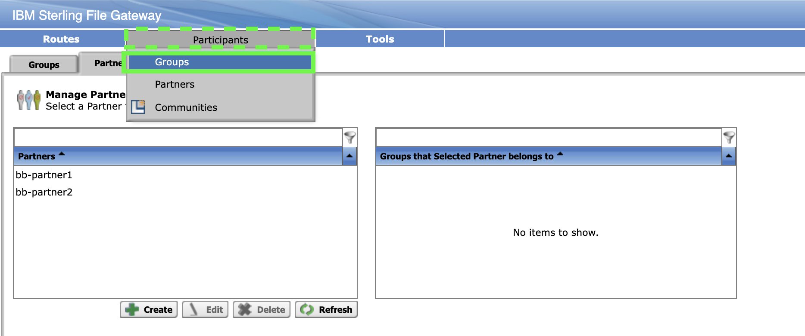

2.  Haga clic en **Crear** para añadir un nuevo Grupo.

    

3.  Introduzca sus iniciales mayúsculas seguidas de un espacio y luego **Socios**, siguiendo con el ejemplo, sería **BB Socios**. A continuación, haga clic en **Guardar**.

    

    Haga clic en **Ok** para borrar la confirmación.

    

4.  Con el Grupo que ha añadido seleccionado, haga clic en **Añadir Socios....**

    

5.  Seleccione las identidades que ha añadido y el grupo (utilice Cmd-Clic para selecciones múltiples) y, a continuación, haga clic en **Ejecutar.**

    

6.  Revise los cambios propuestos para mover los usuarios al grupo y haga clic en **Ok**

    

7.  Haga clic en **Atrás** para volver a la página anterior.

    

8.  Seleccione el grupo para confirmar que los interlocutores aparecen como pertenecientes al grupo.

    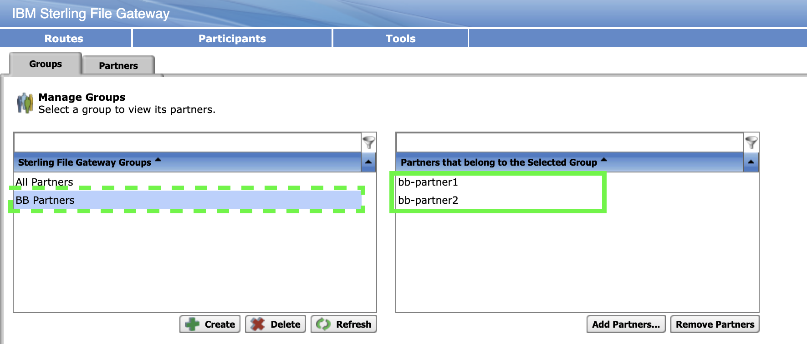

## Crear una plantilla de enrutamiento

1.  Haga clic en **Plantillas** en el menú **Rutas**.

    

2.  Haga clic en el botón **Crear** situado en la parte inferior de la página **Plantillas de canal de enrutamiento**.

    

3.  Introduzca **BB Passthrough** en el campo **Nombre de plantilla** y haga clic en **Siguiente>>**.

    

4.  Revise la configuración de **Caracteres especiales** y haga clic en **Siguiente>>**.

    

5.  Añada sólo **BB Partners** a las tablas **Grupos** **de** **productores** y **Grupos de consumidores**.

    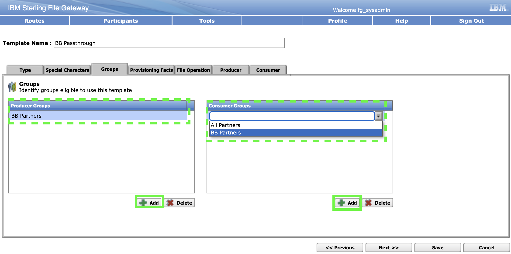

6.  Haga clic en **Siguiente>>** después de añadir **BB Partners** a ambos grupos.

    

7.  Revise la página **Provisioning Facts** y haga clic en **Next>>**.

    

8.  Revise la página **Operación de archivo** y haga clic en **Siguiente>>**.

    

9.  Haga clic en el botón **Añadir** de la página **Productor**.

    

10. Haga clic en el menú desplegable **Tipo de archivo del productor** y seleccione **Desconocido**.

    

11. Introduzca .+ en el campo **Patrón de nombre de archivo como expresión regular** y, a continuación, haga clic en **Guardar**.

    

    Establecer el patrón de archivo con la expresión regular .+ permite nombres de archivo de uno o más caracteres.

12. Haga clic en **Siguiente>>** en la página **del Productor**.

    

13. Haga clic en el botón **Añadir** de la página **Consumidor**.

    

14. Haga clic en el botón **Añadir** de la ventana emergente **Nuevo canal de distribución**.

    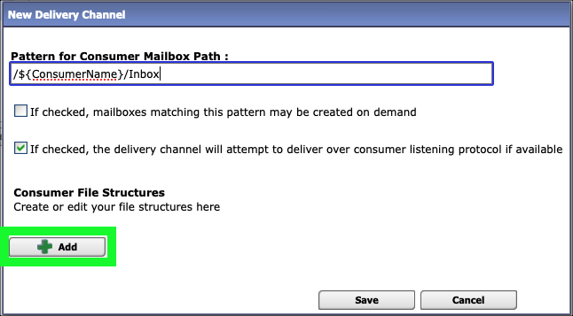

15. Haga clic en **Desconocido** en el menú desplegable **Tipo de archivo de consumidor**.

    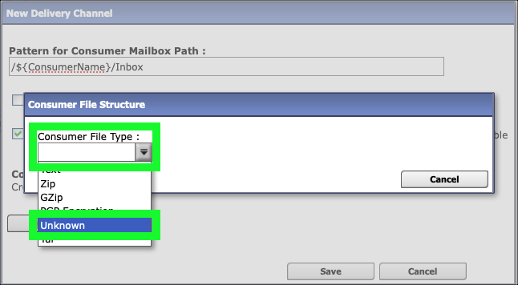

16. Introduzca **$\{ProducerFileName}** en el campo **Formato de nombre de archivo**.

    ```text
    ${ProducerFileName}
    ```

    <br />

17. Revise la información de ayuda relativa a los formatos de **nombre de** archivo pasando el ratón por encima del campo de entrada **Formato de nombre de archivo** y, a continuación, haga clic en **Guardar**.

    

18. Haga clic en **Guardar** en la ventana emergente **Nuevo canal de distribución**.

    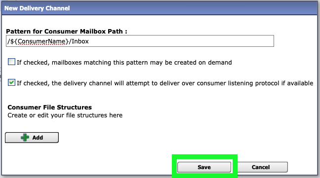

19. Haga clic en **Guardar** en la página **Consumidor**.

    

20. Haga clic en **Aceptar** en el mensaje emergente **Plantilla de canal de enrutamiento creada correctamente.**

    

21. Revise la configuración de la nueva plantilla de canal de enrutamiento **BB Passthrough**.

    

## Crear canales de enrutamiento

1.  Haga clic en la opción **Canales** del menú **Rutas**.

    

2.  Pulse el botón **Crear** en la parte inferior derecha para crear un nuevo **Canal**.

    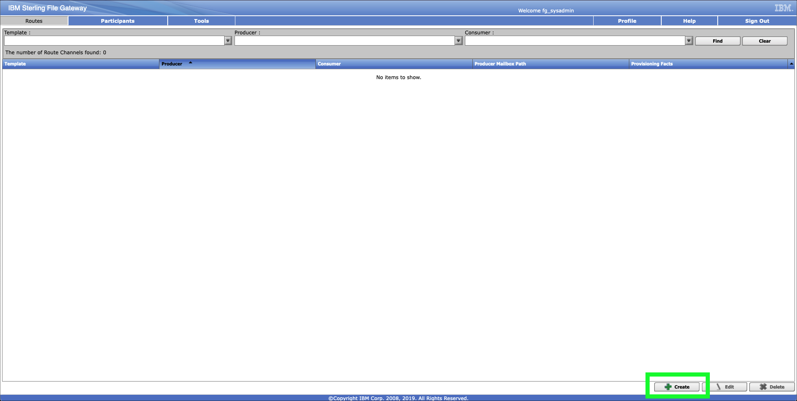

3.  Seleccione **BB Passthrough** para la **Plantilla de canal de enrutamiento**, **bb-partner1** para el **Productor** y **bb-partner2** para el **Consumidor** y, a continuación, haga clic en **Guardar** para crear el nuevo canal.

    

4.  Haga clic en **Aceptar** en la ventana emergente **Éxito**.

    

5.  Repita los pasos anteriores para crear un canal de bb-socio2 a bb-socio1.

    

6.  Haz clic en **Cerrar sesión**.

    

En el capítulo siguiente, comienza la diversión cuando los socios empiezan a intercambiar archivos de forma segura.
