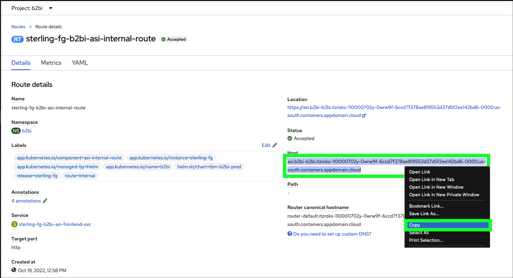
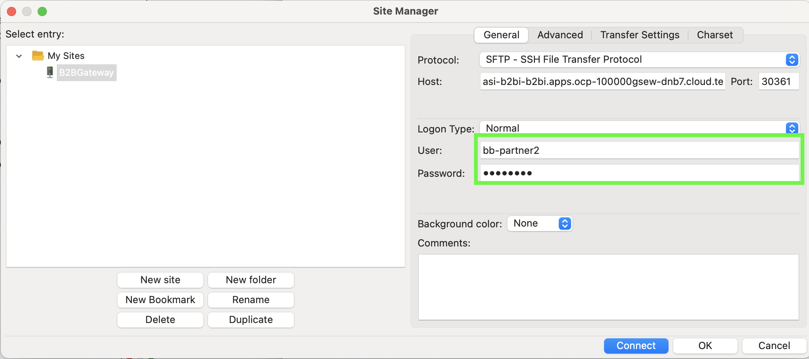
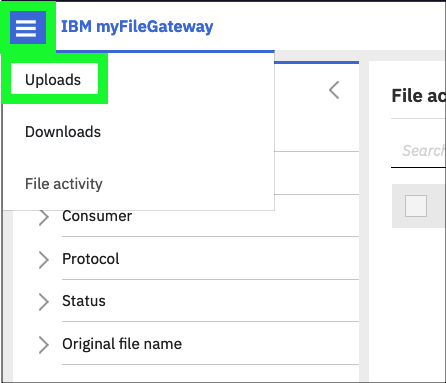
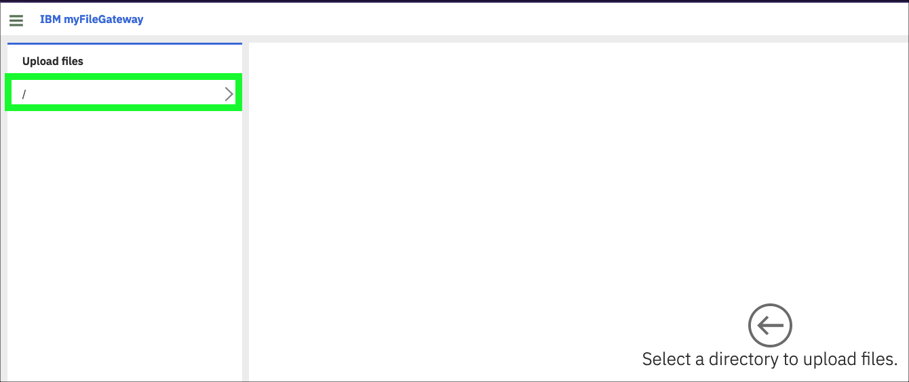
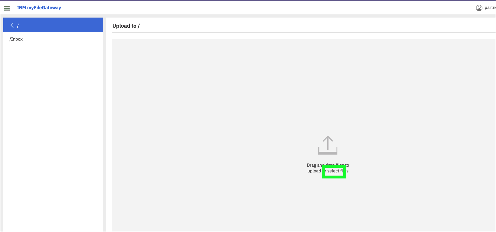
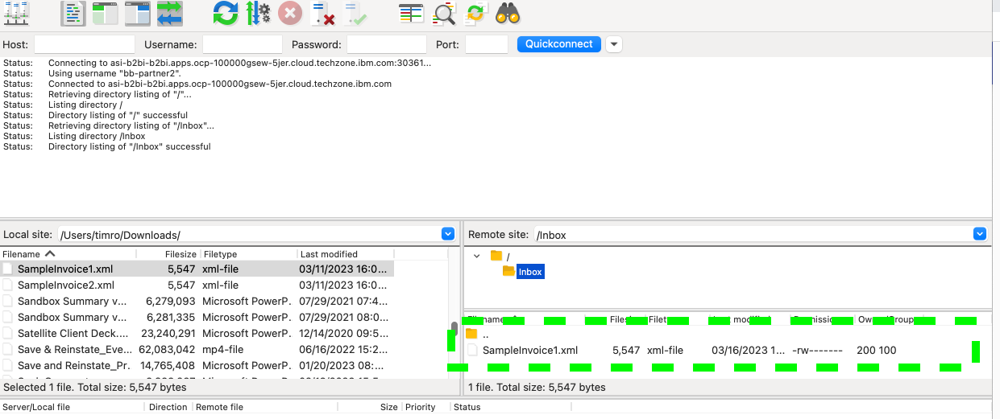
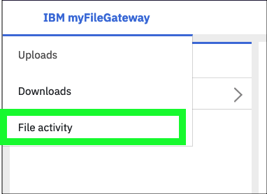
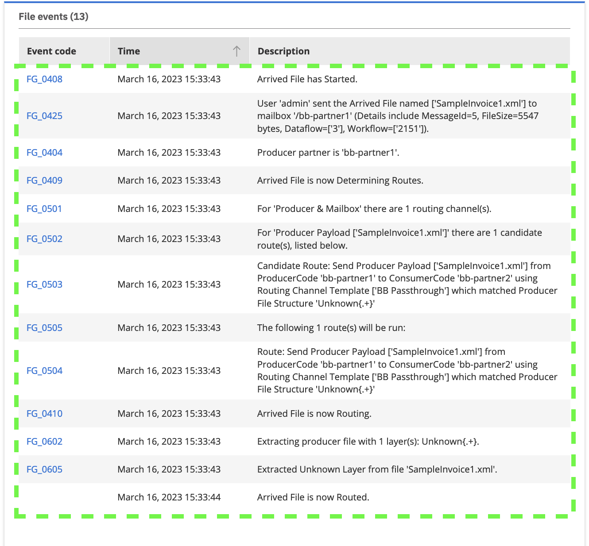

# 105: Demostración a clientes

Ahora es el momento de que los socios se transfieran archivos entre sí utilizando el adaptador B2Bi SFTP recién creado, pero antes hay que realizar un último paso de configuración para que la demostración sea visualmente más emocionante.

En esta demostración se utilizará la aplicación FileZilla. FileZilla es una aplicación FTP multiplataforma, gratuita y de código abierto, que consta de FileZilla Client y FileZilla Server. Los clientes están disponibles para Windows, Linux y macOS. Más información sobre FileZilla [aquí](https://filezilla-project.org/).

Si los usuarios aún no tienen FileZilla instalado, háganlo ahora. Los empleados de IBM pueden descargar FileZilla de la tienda Mac\@IBM. Para Business Partners e IBMers en Microsoft Windows, los enlaces de descarga están disponibles en el enlace anterior.

Si los usuarios no pueden utilizar FileZilla, se recomienda utilizar los clientes de IBM Sterling File Gateway para ambos usuarios en el escenario siguiente. Para evitar tener que iniciar y cerrar sesión entre las acciones de los usuarios, se recomienda utilizar dos navegadores diferentes (por ejemplo, Chrome y Firefox) para cada usuario o ventanas privadas/de incógnito para cada usuario al acceder a IBM Sterling File Gateways.

Al hacer una demostración a un cliente, se recomienda dividir las ventanas de FileZilla y del navegador en la misma pantalla para evitar cambiar de una a otra durante la demostración.

Para este escenario, **el socio1** utilizará los clientes IBM Sterling File Gateway, y **el socio2** utilizará FileZilla.

A modo de introducción, vea este breve vídeo sobre los pasos a seguir.

## Configurar FileZilla para partner2

Para configurar FileZilla para **partner2** se necesitarán tanto la dirección de ruta como el número de puerto de File Gateway.

1.  Vuelva a la consola web de OpenShift y haga clic en la ruta **sterling-fg-b2bi-asi-internal-route** en la página **Rutas**.

    

2.  Seleccione el campo **Host**, haga clic con el botón derecho y haga clic en **Copiar**.

    Nota, el ejemplo de abajo fue capturado usando Firefox en MacOS. Las opciones de los menús de otros navegadores pueden estar etiquetadas de forma diferente.

    

3.  Abra la aplicación FileZilla en el ordenador local.

    

4.  Haga clic en el icono de **FileZilla Site Manager** .

    

5.  Haga clic en el botón **Nuevo sitio**.

    

6.  Introduzca **B2BGateway** como nombre **del nuevo sitio** y pulse Intro.

    

7.  Seleccione **SFTP - Protocolo Seguro de Transferencia de Archivos** en el menú desplegable **Protocolo**.

    

8.  Pegue el **nombre de host** copiado de OpenShift Route en el paso 2 en el campo **Host**.

    

9.  Introduzca el **número de puerto** del servicio **sterling-fg-b2bi-asi-backend-svc** en el campo **Puerto**.

    

    > "¿No recuerda el número de puerto?" El número de puerto se puede encontrar en los detalles del servicio **sterling-fg-b2bi-asi-backend-svc** (en Redes -> Servicios) en la consola web de OpenShift - utilice **el** **puerto Node** **de adapters-1**.

10. Introduzca **bb-partner2** en el campo **Usuario** y **la contraseña** en el campo **Contraseña** y haga clic en el botón **Conectar**.

    

    > Si le has dicho a FileZilla que no guarde contraseñas, verás una advertencia sobre el cambio del proceso de inicio de sesión de 'Normal' a 'Pedir contraseña'. Esto está bien y sólo se le pedirá la contraseña para **bb-partner2** cuando se conecta al servidor SFTP.

11. Marque la casilla **Confiar siempre en este host, añadir esta clave a la caché** y haga clic en **Aceptar** en la ventana emergente **Clave de host desconocida**.

    

12. Observe que la conexión se ha establecido y que el **sitio remoto** no muestra ningún archivo.

    

13. En este momento, se recomienda tener tanto FileZilla como la consola web de OpenShift visibles al mismo tiempo (ya sea divididos en una sola pantalla o utilizando varios monitores).

    

14. Cree o descargue los 2 archivos de ejemplo que se transferirán entre partner1 y partner2. Dado que las plantillas creadas anteriormente permiten transferir cualquier nombre de archivo, no importa qué archivos se utilicen. Se recomienda utilizar archivos pequeños para que las transferencias se realicen rápidamente. No dude en descargar estos dos archivos de factura de muestra. En la mayoría de los navegadores, seleccione los nombres de los enlaces que aparecen a continuación, haga clic con el botón derecho en los enlaces y haga clic en **Guardar enlace como** en el directorio de descargas local.

    *   [EjemploFactura1.xml](https://raw.githubusercontent.com/IBM/SalesEnablement-SterlingDataExchange-L3/main/tools/SampleInvoice1.xml)
    *   [EjemploFactura2.xml](https://raw.githubusercontent.com/IBM/SalesEnablement-SterlingDataExchange-L3/main/tools/SampleInvoice2.xml)

## Transfiera un archivo del interlocutor1 al interlocutor2 utilizando IBM Sterling My File Gateway 2.0

1.  En la consola web de OpenShift, haga clic en el enlace para abrir el enlace a la ruta **sterling-fg-b2bi-asi-internal-route-myfg**.

    

2.  Introduzca **bb-partner1** en el campo **Nombre de usuario**, **contraseña** en el campo **Contraseña** y, a continuación, haga clic en **Iniciar sesión**.

    

3.  Haga clic en el icono de menú de hamburguesa  en la parte superior izquierda y haga clic en **Subidas**.

    

4.  Haga clic en el directorio **/** del panel izquierdo.

    

5.  Haga clic en el enlace de **selección** en el panel **Cargar en /**.

    

6.  Haga clic en el archivo **SampleInvoice1.xml** del directorio **Descargas** y haga clic en **Abrir**.

    > Navegue hasta el directorio donde se descargaron los archivos de facturas de muestra o elija otro archivo para transferir. No transfiera ningún archivo con información confidencial o personal. La imagen de arriba fue capturada usando Firefox en MacOS, otros navegadores y combinaciones de sistemas operativos pueden verse diferentes.

    

7.  Compruebe en la aplicación **myFileGateway** que el archivo se ha transferido correctamente.

    

8.  Verifique en **FileZilla** que **bb-partner2** ha recibido el archivo.

    

    > El tamaño del archivo mostrado en **IBM Sterling My File Gateway 2.0** está en kilobytes (KB) y en **FileZilla** el tamaño del archivo se muestra en bytes, pero son iguales y la transferencia de archivos se ha realizado correctamente.

    Es importante darse cuenta de que el archivo se ha transferido al repositorio de **B2Bi Gateway**. En un entorno de producción, **bb-partner2** tendría que descargar el archivo. FileZilla está mostrando el contenido del almacén de datos en la puerta de enlace que **bb-partner2** tiene permisos para ver.

## Ver los detalles de la transferencia de archivos en **IBM Sterling My File Gateway 2.0**

1.  Haga clic en **Actividad de archivo** bajo el icono del menú hamburguesa .

    

2.  Haga clic en el enlace del archivo cargado recientemente: **EjemploFactura1.xml**.

    

3.  Revisa los eventos ocurridos durante la transferencia de archivos.

    

    Observe que los eventos **FG\_0503** y **FG\_0504** muestran que se utilizó la plantilla de canal **BB Passthrough** para enrutar correctamente el archivo transferido a **bb-partner2**.

<QuizAlert text="There is a quiz question related to the events of a successful file transfer. A screen capture of all the events and event numbers will help answer the question." />

Para demostraciones adicionales, considere lo siguiente:

*   Transfiere un archivo de **bb-socio2** a **bb-socio1**.
*   Verifique las transferencias de archivos mediante la aplicación **IBM Sterling File Gateway**.
*   Transfiera un archivo mediante la versión anterior de **IBM Sterling My File Gateway** utilizando la ruta **sterling-fg-b2bi-asi-internal-route-myfilegateway** que se encuentra en la consola web de OpenShift.
