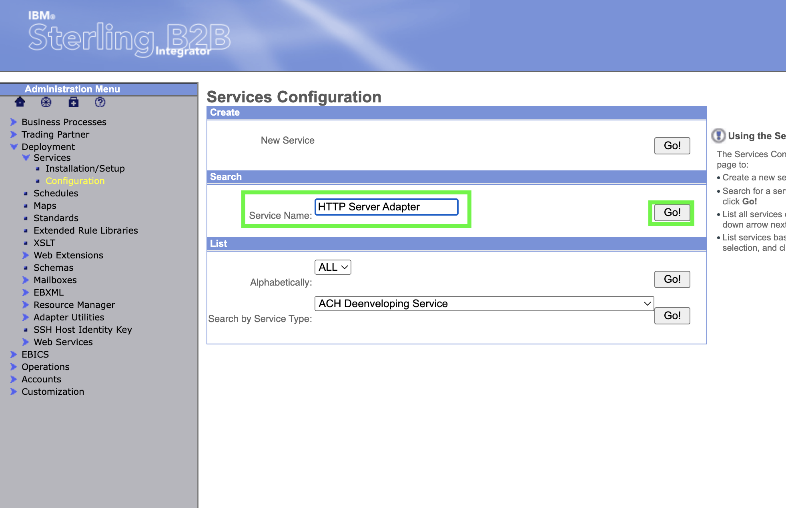
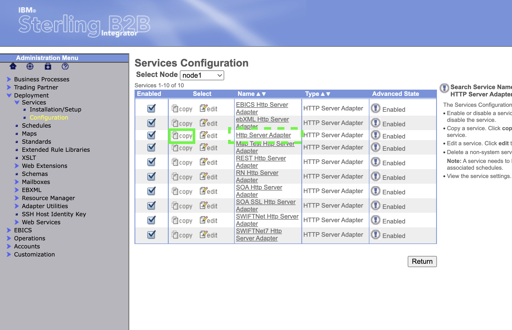
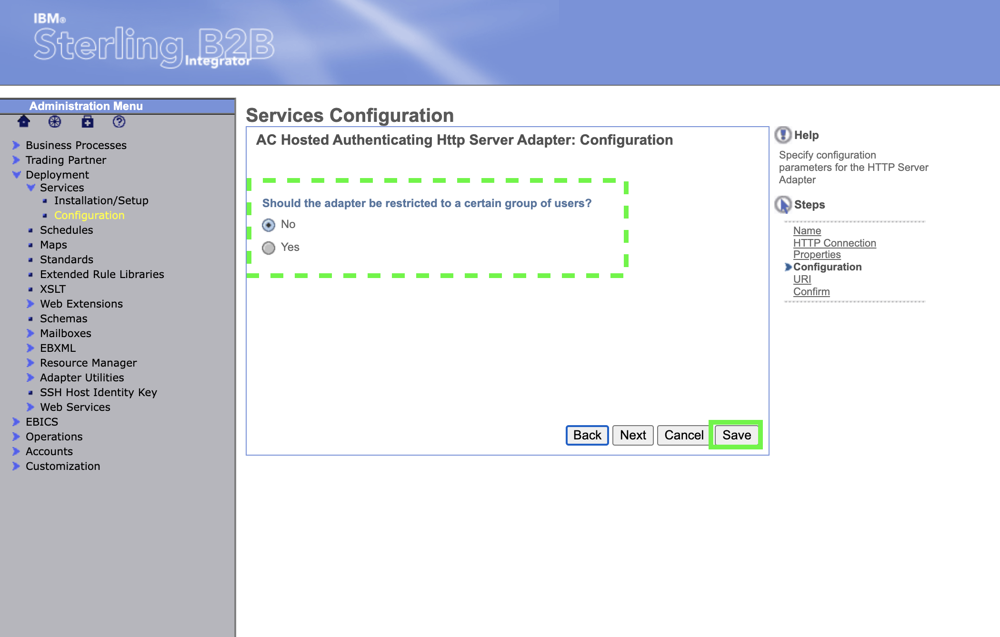
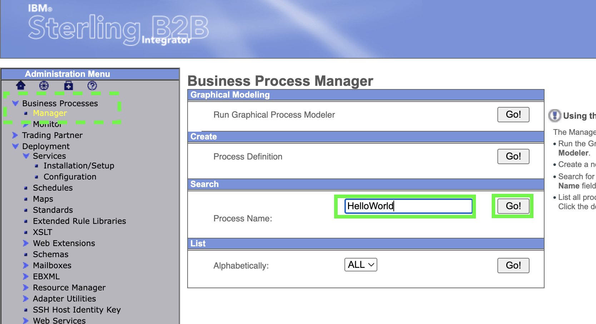
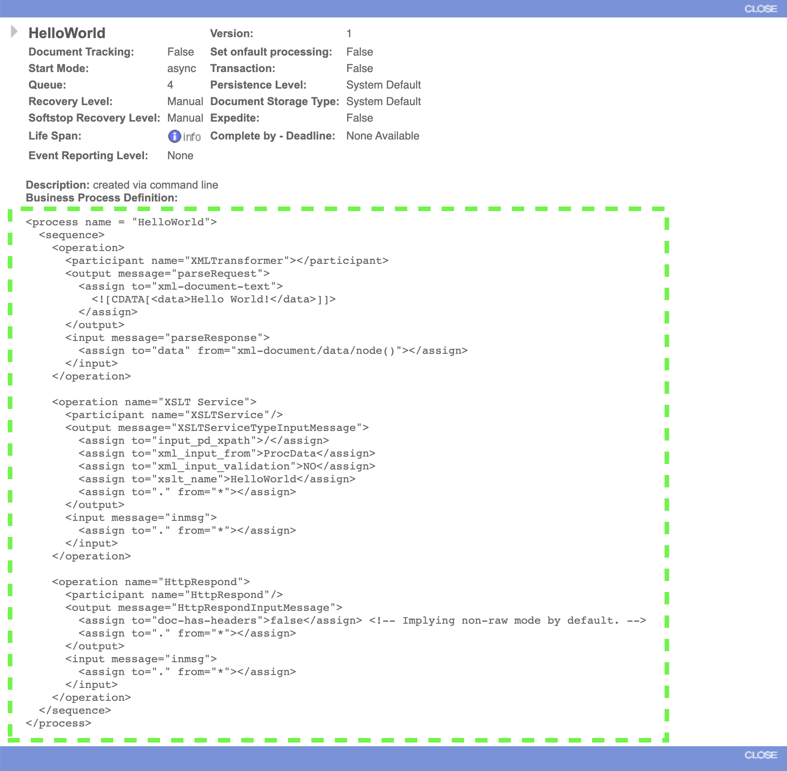
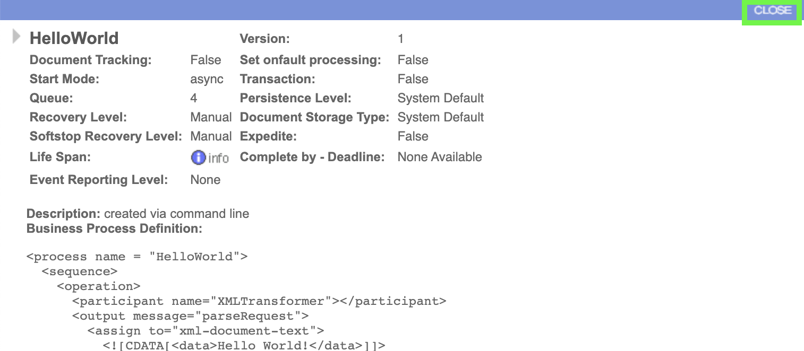
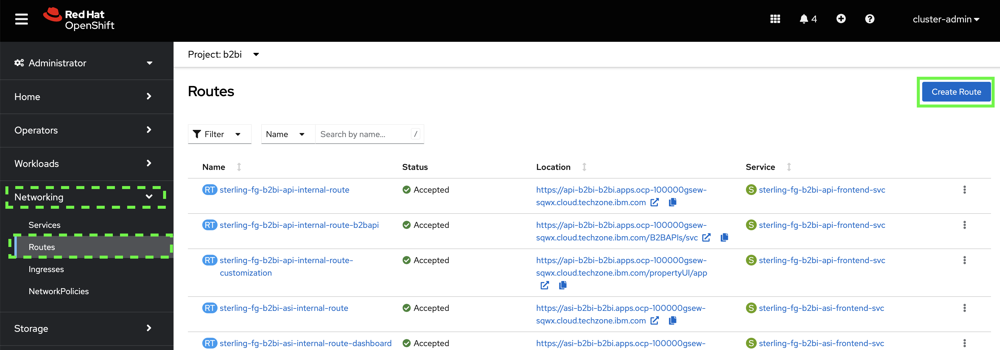
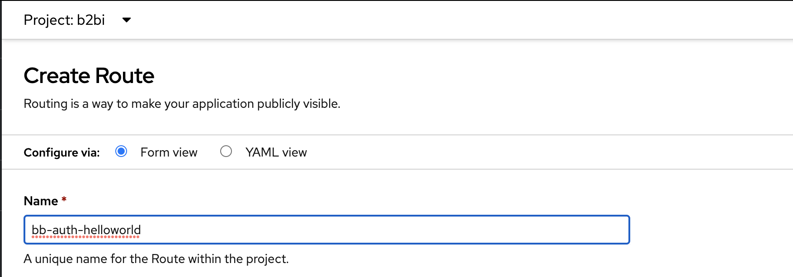
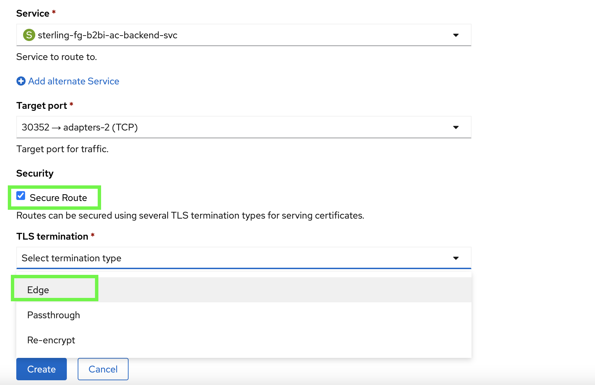
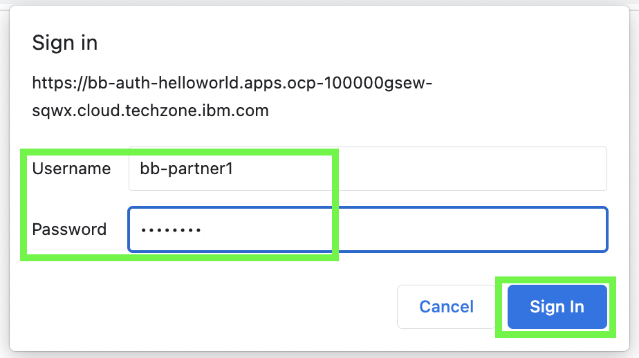

# 107: Bonus - Configurar un endpoint HTTP seguro

En esta actividad, aprenderá más sobre cómo se pueden configurar los servicios y adaptadores en Sterling B2B Integrator. Al igual que en la actividad Configuración Parte 1, dado que los pasos de este laboratorio desplegarán un nuevo servicio en el clúster, la primera sección en la que se configura el servicio se realizará una vez por clúster.

Para la última sección, cada usuario del laboratorio podría configurar su propia ruta en el proyecto `b2bi` si lo desea.

## Añadir un adaptador de servicio HTTP

Sterling B2B Integrator incluye una serie de adaptadores preinstalados que pueden configurarse para enviar y recibir datos. Para que esta sección sea un poco diferente de la Parte 1 de configuración, en lugar de configurar el Adaptador de servicio HTTP para el nodo ASI (independiente del servidor de aplicaciones), se configurará en el nodo Contenedor de adaptadores (AC). El nodo AC es un nodo suplementario al ASI y permite distribuir Adaptadores de Servicio fuera del ASI.

1.  Vuelva a la lista de **rutas de** OpenShift y abra la ruta **sterling-fg-b2bi-asi-internal-route-dashboard**. Cuando se le solicite, inicie sesión con el usuario **admin**. A continuación, expanda **Despliegue** -> **Servicios** y haga clic en **Configuración**.

    

2.  Escriba **HTTP Server Adapter** para el nombre del servicio en el panel de búsqueda y haga clic en **Ir.**

    

3.  Busque la fila con **Adaptador de servidor Http** en la columna de nombre y haga clic en el texto/icono de **copia**.

    

4.  Cambie el nombre a **AC Hosted Authenticating Http Server Adapter**, desplácese en el panel **Environment** para seleccionar el **nodo 1 Adapter Container1** resource. A continuación, haga clic en **Siguiente**.

    

5.  Para encontrar un puerto que utilizar para la instancia del adaptador de servidor Http, vuelva a la consola de OpenShift y a la lista **Servicios**. Esta vez, seleccione el servicio **sterling-fg-b2bi-ac-backend-svc** y anote el puerto utilizado para el `adapters-2` Puerto de servicio.

    

    Observe que el servicio Kubernetes y el puerto del nodo son idénticos. Técnicamente, no es necesario que coincidan. La parte importante a tener en cuenta es el número de puerto asociado con el servicio, o el puerto pod si se da. Dado que el nombre del puerto del pod coincide con el nombre del mapeo del puerto del servicio, el puerto correcto a elegir es `30352`.

6.  Introduzca el puerto del servicio en **HTTP Listen Port**, cambie **User Authentication Required** a **Yes**. A continuación, haga clic en **Siguiente**.

    

    > Hay una advertencia en esta página de que no habilitar SSL resultaría en una configuración de seguridad débil. Esto es generalmente cierto, pero vamos a mitigar la exposición de seguridad de las credenciales que van a través de Internet en texto claro cuando creamos la **Ruta** para exponer el servicio utilizando OpenShift.

7.  Revise la opción para especificar un grupo concreto para el acceso al servicio, pero no realice cambios. Haga clic en **Guardar**.

    

8.  En la página de confirmación, desplácese hacia abajo hasta encontrar la entrada **URI: /hola** entrada. Observe que el Proceso de Negocio a ejecutar se llama **Hola Mundo**

    

9.  Continúe desplazándose hasta el final de la página de confirmación y haga clic en **Finalizar**.

    

10. Pulse en **Volver** para regresar al panel de Configuración de Servicios.

    

11. Compruebe el estado del nuevo adaptador. Usando **Seleccionar Nodo**, cambie a **nodo1AC1**.

    

12. Haga clic en el signo de exclamación del adaptador de servicio para comprobar el estado de ejecución (se habilitará automáticamente, ya que se copió de un adaptador de servicio habilitado).

    

13. Observe la progresión en las marcas de tiempo que terminan con **REGISTER\_JNDI**, esto muestra que el adaptador de servicio está funcionando. Haga clic en **CERRAR** en la parte superior derecha para cerrar el panel.

## Explore el ejemplo de Proceso de Negocio

Antes de configurar una ruta OpenShift para acceder al servicio, dedique un momento a revisar el proceso de negocio de ejemplo que se invocará cuando se acceda al punto final `/hello`.

1.  En la barra de navegación principal a la izquierda de B2Bi, expanda **Proceso de negocio** -> **Gestor**. A continuación, escriba **Hello World** como nombre del proceso en el panel de búsqueda. Por último, haga clic en **Ir.**

    

2.  Haga clic en el nombre del proceso para abrir una vista del mismo.

    

3.  Expanda la ventana para que se muestre el proceso de negocio completo.

    

    Sin ponernos demasiado técnicos, está claro que la secuencia de este proceso de negocio tiene tres operaciones. La primera operación genera un documento xml con un elemento de datos que contiene `Hello World!` La segunda operación invoca una transformación XSL utilizando una hoja de estilo llamada "HolaMundo". Si buscara esta hoja de estilo XSL en el panel B2Bi vería que toma los datos del documento xml y los envuelve con algunas etiquetas html básicas. La última operación crea una respuesta http enviando los datos de la transformación XSL. En efecto, cuando este proceso de negocio es invocado generará una respuesta como esta para el llamador:

    ```html
    <html>
      <body>
        Hello World!
      </body>
    </html>
    ```

4.  Cierre la vista del proceso de negocio haciendo clic en **CERRAR** en la esquina superior derecha o inferior derecha.

    

## Configure una ruta OpenShift para exponer el adaptador de servicios HTTP y sus puntos finales.

Red Hat OpenShift tiene un tipo de recurso llamado `Route` que es muy similar al recurso `ingress` Kubernetes. En OpenShift, las rutas permiten al administrador del cluster (o proyecto) exponer un servicio en el proyecto para acceso sobre http o https. Al crear una ruta que implemente https, se pueden seleccionar tres opciones: **edge**, **reencrypt** y **passthrough**. En aras de la simplicidad, este laboratorio utilizará una ruta de **borde** para terminar de forma segura la conexión entrante en un pod de enrutamiento en el clúster.

Como se hizo anteriormente en el laboratorio, si usted está trabajando en un entorno multi-tenant, la ruta que se crea debe hacerse única prefijando el nombre con sus iniciales en minúsculas con un `-` inmediatamente después.

1.  Vuelva a la consola de OpenShift y vaya al panel **Rutas** con el proyecto **b2bi** seleccionado. A continuación, haga clic en el botón **Crear ruta**.

    

2.  Para el nombre de la ruta, utilice el nombre base de `auth-helloworld`. Si trabaja en grupo, anteponga sus iniciales seguidas de un guión. Siguiendo el ejemplo del laboratorio anterior, Bilbo Bolsón introduciría `bb-auth-helloworld`.

    

3.  Para el nombre de host, coloque este nombre a la izquierda del nombre de dominio de las aplicaciones de clúster en la URL del navegador, dejando fuera cualquier elemento de ruta. Por ejemplo, para esta URL de consola:

    

    Bilbo utilizaría el **nombre de host** de `bb-auth-helloworld.apps.ocp-100000gsew-sqwx.cloud.techzone.ibm.com`

4.  Mantenga la **Ruta** por defecto y para el **Servicio**, seleccione **sterling-fg-b2bi-ac-backend-svc**. Para el **Puerto de destino** seleccione **30352 -> adaptadores-2 (TCP)**.

    

5.  Marque la casilla situada junto a **Ruta segura** y seleccione **Edge** en el desplegable de **terminación TLS**.

    

6.  Las partes restantes del formulario para **Tráfico inseguro** y **Certificados** pueden dejarse por defecto. Haga clic en el botón **Crear** para crear la ruta.

    

7.  OpenShift mostrará una página de estado con la **ubicación** recién creada. Copie la URL.

    

8.  Abra una nueva pestaña del navegador, pegue la URL y añada `/hello` como punto final.

    

9.  En el cuadro de diálogo, introduzca el nombre de usuario y la contraseña de uno de los socios comerciales creados en el laboratorio anterior y haga clic en **Iniciar sesión**.

    

10. El proceso de negocio devuelve la respuesta esperada.

    

## Resumen

En esta actividad, se añadió otro adaptador de protocolo al entorno de B2B Integrator. Además del proceso de negocio muy sencillo HelloWorld, este adaptador también admite un gran número de otros procesos de negocio relevantes para escenarios de integración B2B y puede personalizarse según las necesidades del negocio.

Cuando se configuró el adaptador de servicio HTTP, se estableció para que coincidiera con un puerto definido en un **servicio** de Kubernetes. Esto hizo que fuera muy sencillo exponer el adaptador de servicio HTTP de forma segura en el clúster OpenShift mediante una ruta. Tenga en cuenta que en este ejemplo simplificado, no había ninguna agrupación de acceso establecida con el adaptador de servicio HTTP. Esto significa que cualquier nombre de usuario y contraseña válidos del socio comercial funcionarían para la autenticación. En un entorno de producción, sería común una mayor organización en torno al acceso basado en grupos.
