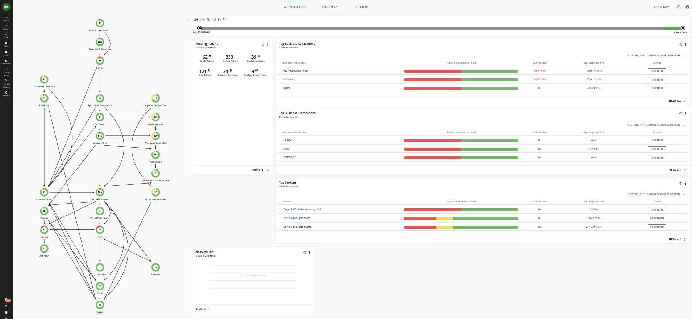
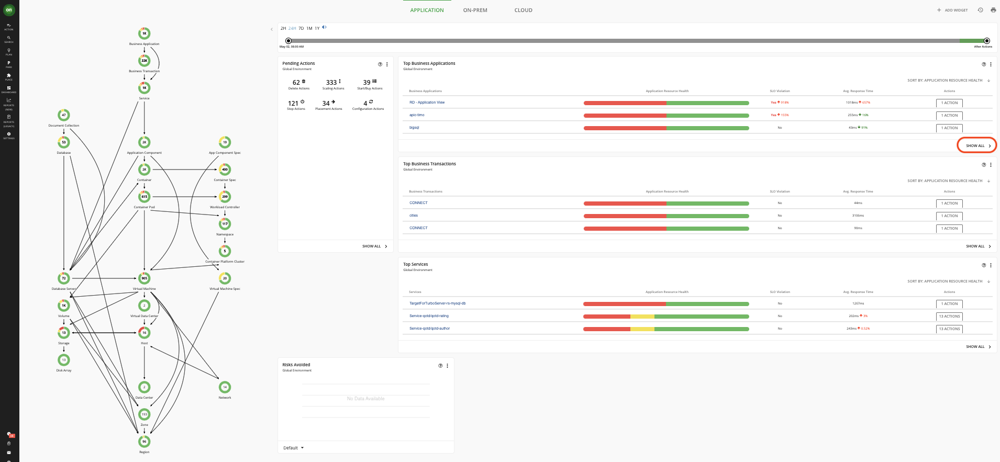

# 102: Optimización de costes

Turbonomic puede ayudar a varias personas en una organización cliente típica en sus tareas diarias. Empecemos con Mark, el director de ingeniería de fiabilidad de sitios empresariales (SRE). Mark gestiona un equipo de SRE y es responsable del rendimiento de las aplicaciones empresariales clave, pero también de optimizar los costes de su funcionamiento.

Vaya a la página de inicio de Turbonomic (se abre por defecto). Si desea volver allí, haga clic en el icono verde **ON** en la esquina superior izquierda de la ventana.

Cuando se despliega el ARM de Turbonomic y se seleccionan los entornos, Turbonomic descubre todas las entidades de los entornos seleccionados. A continuación, construye "la cadena de suministro" (el gráfico de la izquierda), uniendo todas las entidades desde la aplicación empresarial de nivel superior hasta la infraestructura de apoyo.

Esto muestra las relaciones entre las distintas entidades y le proporciona una visibilidad completa de todo su entorno híbrido, lo cual es muy potente.

En este ejemplo, Turbonomic está tirando:

*   aplicaciones empresariales a partir de herramientas de supervisión del rendimiento de las aplicaciones (APM) como Instana, AppDynamics, Dynatrace o New Relic
*   sus transacciones, servicios y componentes de aplicación asociados
*   contenedores, pods y nodos (representados como máquinas virtuales) de cualquier entorno Kubernetes, ya sea local o en la nube
*   máquinas virtuales y almacenamiento desde entornos locales como VMWare vCenter y entornos de nube pública como AWS y Azure
*   hosts físicos, almacenamiento, red con muchos más objetivos disponibles.

No es necesario instalar agentes, ya que Turbonomic no tiene agentes. Descubre todas estas entidades automáticamente a través de las API de los entornos de destino y las integra en un modelo de datos común.

Unos 30 minutos después del descubrimiento, Turbonomic determina las acciones necesarias para poner este entorno híbrido en el estado óptimo que he mencionado anteriormente. En este estado óptimo, la demanda de las aplicaciones se satisface con la oferta subyacente de recursos de TI.

En esta página de inicio, hay widgets para las Aplicaciones Empresariales Principales, las Transacciones Empresariales Principales y los Servicios Principales que le permiten evaluar rápidamente el riesgo de las aplicaciones en ejecución. No sólo puede ver rápidamente las aplicaciones con mayor riesgo, sino que también puede hacer clic en Mostrar todo para ver la lista completa de aplicaciones empresariales y las métricas relevantes. Esto ayuda a priorizar el esfuerzo del equipo de SRE.

Haga clic en Mostrar todo en el widget Top Business Applications.

> Nota: La lista de las aplicaciones así como los valores para las métricas pueden ser diferentes de los mostrados arriba. Sin embargo, esto no debería afectar al flujo de la demostración.

Por ejemplo, si mira el widget Top Business Applications, puede ver la aplicación específica, cualquier riesgo de recursos de la infraestructura subyacente, si hay una violación de un Objetivo de Nivel de Servicio (SLO) **(1)** como exceder las transacciones deseadas por segundo, los promedios y picos de tiempo de respuesta **(2)** y transacciones **(3)** y todas las acciones **(4)** necesarias para poner esta aplicación en un estado saludable. Las acciones de la infraestructura subyacente se propagan hasta la aplicación, de modo que cuando haga clic en "Acciones", verá todas las acciones que afectan a la aplicación específica.

Haga clic en el icono **DASHBOARD** del menú **(1)**. Haga clic en **Panel ejecutivo On-Prem (2)**.

> Nota: Dependiendo del interés de su cliente, puede empezar con los cuadros de mando de la nube o del contenedor. Adapte su narración en consecuencia.

Un gestor de SRE empresarial suele querer comprender el estado general de la infraestructura y las tendencias de utilización a largo plazo. Turbonomic ofrece varios paneles de control listos para usar y puede crear fácilmente otros personalizados.

Por ejemplo, **On-Prem Executive Dashboard** ofrece un resumen del estado y los riesgos relacionados con los recursos de virtualización locales. En la parte superior de la pantalla, puede seleccionar el tiempo para el que desea ver los datos. Debajo, hay detalles de las plataformas de virtualización, un resumen del rendimiento, los riesgos y las medidas adoptadas. En la parte inferior, puede encontrar métricas importantes relacionadas con la densidad de máquinas virtuales en hosts y almacenamiento, y cómo están cambiando con el tiempo. Del mismo modo, hay un panel dedicado para la infraestructura de nube (Cloud Executive Dashboard) y la infraestructura Kubernetes (Container Platform Dashboard).
