# 100: Cómo empezar

## Preparación técnica de laboratorio

Esta sección le indica cómo preparar la **IBM Cloud** y **Cloud Pak for Data as a Service** entornos para realizar los datos y la IA **Laboratorios de tejido de datos**.

Estas tareas son un requisito previo para realizar **cualquier** de la **Laboratorios de tejido de datos** con éxito. Estos laboratorios son **no** hecho en el multiusuario compartido, preconfigurado **Datos e IA Live Demos** ambiente. Este entorno, que requiere una solicitud de reserva, es principalmente un entorno de sólo lectura que se utiliza exclusivamente para la **Demostraciones de entramado de datos**. Estos laboratorios técnicos requieren más flexibilidad y es por esto que usted tiene que preparar su propio Cloud Pak para cuentas de datos para hacer estos laboratorios.

Usted necesitará un **IBM Cloud** y **IBM Cloud Pak for Data as a Service** tener en cuenta estos aspectos técnicos **Laboratorios de tejido de datos** En función del estado de su cuenta, siga los pasos que se indican a continuación para que pueda utilizar sus datos personales de IBM Cloud y Cloud Pak for Data como cuenta de servicio. Esto asegura que habrá cero conflictos con otros usuarios y servicios, que tiene el cloud y el cloud Pak adecuados para los datos como privilegios de servicio, y que no será necesario ningún convenio o proceso de denominación especial para que usted pueda completar estos laboratorios técnicos.

Para preparar sus entornos personales de IBM Cloud y Cloud Pak for Data para estos laboratorios técnicos, realizará los pasos siguientes:

1.  Configure su cuenta personal de IBM Cloud.
2.  Configure su personal de IBM Cloud Pak for Data como una cuenta de servicio.
3.  Suministrar a IBM Cloud y Cloud Pak for Data como un servicio **Lite** servicios.
4.  Crear el Cloud Pak para datos **Catálogo de activos de plataforma**.
5.  Crear el **Conexiones de plataforma** a las fuentes de datos de Datos e IA Live Demos.

**Advertencia:** Cloud Pak for Data no da soporte a Apple **Safari** navegador. Debe utilizar uno de los siguientes navegadores soportados:

*   Mozilla Firefox (recomendado)-Versión 69 y superior
*   Google Chrome-Versión 80 y superior
*   Microsoft Edge-Versión 95 y superior

## Obtener una cuenta de IBM Cloud

**Si tiene una cuenta de IBM Cloud, puede saltarse este paso.**

Si usted **no** tener una cuenta de IBM Cloud, [Pulse este enlace](https://cloud.ibm.com/registration) para crear uno. Después del registro, se le enviará un correo electrónico para activar su cuenta. Esto puede tardar unas horas en procesarse. Una vez que reciba el correo electrónico de confirmación, siga las instrucciones que se proporcionan en el correo electrónico para activar su cuenta.

## Regístrate para Cloud Pak for Data

El **Datos e IA Live Demos** utilizar Cloud Pak for Data Services que se suministran en la nube de IBM **Dallas** región de servicio. Esto significa que debe utilizar Cloud Pak for Data en el **Dallas** región, y registra su cuenta para un Cloud Pak for Data como una cuenta de servicio en el **Dallas** región para hacer los laboratorios de Data Fabric, **incluso** si tiene una cuenta en otra región.

**Si tiene una cuenta de IBM Cloud Pak for Data como servicio en la** Dallas **puede saltarse este paso.**

Si usted tiene **no** se ha firmado para un IBM Cloud Pak for Data como cuenta de servicio en la **Dallas** región, [Pulse este enlace](https://dataplatform.cloud.ibm.com/registration/stepone?context=cpdaas\&apps=all) para inscribirse en uno de los **Dallas** región.

Siga las siguientes instrucciones para completar el proceso de registro de la cuenta y configurar su cuenta en la región de Dallas:

1.  Utilice el **Seleccione una región** desplegable para seleccionar el **Dallas** para la instancia de Cloud Pak for Data.
2.  Seleccione la opción **casilla de verificación** de acuerdo con los términos.
3.  Haga clic en **Inicie sesión con su IBMId**.

4.  Introduzca su **IBMID**. Este debe ser el ID de IBM Cloud.

    Si ha iniciado sesión anteriormente en Cloud Pak for Data y ha comprobado la **Recuerde que IBMid** en el recuadro de selección, puede que ya se haya rellenado para usted. Si tiene varias cuentas de Cloud Pak for Data, puede hacer clic dentro del **IBMID** superficie superior a la **Continuar** y se mostrará una lista de los ID de IBM disponibles para que pueda elegir.

5.  Haga clic en **Continuar**.

**Nota:** Si se le solicita, y en función del método de autenticación con el que se presenta, especifique IBMId o IBM w3id **contraseña**.

Si no ha iniciado sesión en Cloud Pak for Data en un tiempo, es posible que se le presente una Declaración de privacidad de IBM con la que tiene que estar de acuerdo. Si es así, siga estos pasos:

6.  Desplácese **Abajo** en la parte inferior de la página de la declaración de privacidad.
7.  Haga clic en **Proceda**.

Usted verá el **Suministro de los servicios principales de IBM Cloud Pak for Data** con una barra de progreso.

Cuando **¡Hecho!** aparece encima de la barra de progreso con un mensaje de: **Sus aplicaciones de IBM Cloud Pak for Data están listas para su uso** :

8.  Haga clic en **Vaya a IBM Cloud Pak for Data**.

Si se le presenta un **Bienvenido a Cloud Pak for Data!** diálogo:

9.  Haga clic en **Omitir por ahora**.

Ahora que tiene una cuenta de IBM Cloud activada y se ha registrado para una cuenta de Cloud Pak for Data en la **Dallas**, puede continuar con el paso siguiente para solicitar una reserva.

## Prestación de los Servicios

Este paso le indica cómo suministrar el **Libre** IBM Cloud y Cloud Pak para datos **Lite** servicios que usted tendrá que realizar la técnica **Laboratorios de tejido de datos** Estas instrucciones se han creado utilizando una cuenta vacía de IBM Cloud y Cloud Pak for Data sin servicios suministrados en beneficio de aquellos que nunca han configurado sus cuentas con servicios suministrados. Por lo tanto, el entorno puede verse diferente de las capturas de pantalla en estas instrucciones, pero el resultado final debe ser el mismo.

No todas las **Lite** los planes de servicio están en cada región de servicio de nube. Por ejemplo, los servicios IBM Match 360 con Watson y Watson OpenScale sólo están disponibles en la **Dallas** región. DataStage sólo está disponible en el **Dallas** y **Fráncfort** regiones. Por lo tanto, como se puede imaginar, se trata de una matriz caótica de disponibilidad de servicios. Por lo tanto, para garantizar la inclusión, la coherencia, la simplicidad y la previsibilidad, **Laboratorios de tejido de datos** requiere que **todos** de la **Lite** servicios se suministran en el **Dallas** región.

Algunos servicios tardan más que otros en suministrar, por lo que no se alarmen si un estado de servicio no aparece al instante después de haberlos previsto, o tienen un estado de **Aprovisionamiento**. Para el momento en que se realiza el suministro de todos los servicios necesarios, todos deben estar en un **Activo** estado.

Por último, si comete un error y elige un plan de precios distinto del **Lite** o ha asignado un servicio al grupo de recursos incorrecto, puede **suprimir** el servicio de Cloud Pak for Data **Instancias de servicios** y vuelva a suministrar el servicio. Todos los demás cambios, como el cambio de nombre de un servicio, deben gestionarse desde la cuenta de IBM Cloud.

### 1. Servicios requeridos

Para los laboratorios técnicos, tendrá que prestar los siguientes servicios:

| Categoría de catálogo de servicios | Servicio de catálogo de servicios   |
| ---------------------------------- | ----------------------------------- |
| AI/Machine Learning                | Watson OpenScale                    |
| AI/Machine Learning                | Watson Studio                       |
| AI/Machine Learning                | Catálogo de conocimientos de Watson |
| AI/Machine Learning                | IBM Match 360 con Watson            |
| AI/Machine Learning                | Watson Machine Learning             |
| Bases                              | Db2                                 |
| Bases                              | Consulta de Watson                  |
| Bases                              | DataStage                           |
| Análisis                           | Panel de instrumentos de IBM Cognos |
| Almacenamiento                     | Almacenamiento de objetos de nube   |

**Nota:** Si ya tiene alguno de los servicios listados anteriormente ya suministrados en su cuenta de nube en el **Dallas** región, puede **Omitir** suministro de ese servicio.

Todos los servicios listados en la tabla anterior se pueden suministrar y mantener directamente desde el **Servicios** de su cuenta de Cloud Pak for Data. Después de suministrar estos servicios, permanecerá en la cuenta de Cloud Pak for Data **excepto** cuando se suministre el **Almacenamiento de objetos de nube** servicio (que es el motivo por el que usted lo prevé). Desde la **Almacenamiento de objetos de nube** service es un servicio global en la nube, Cloud Pak for Data le llevará a su cuenta de IBM Cloud en una nueva pestaña (o ventana) en su navegador para suministrarla.

### 2. Servicio de DataStage

Las siguientes instrucciones le guiarán por el suministro de la **DataStage** como ejemplo. Las restantes instrucciones de suministro de servicio **no** proporcionar capturas de pantalla detalladas. Sólo se proporcionarán las propiedades de servicio necesarias y los nombres sugeridos para suministrar el resto **8** servicios requeridos. Con eso en mente, tómese el tiempo para seguir el detalle **DataStage** instrucciones para que los demás servicios sean fáciles de suministrar.

1.  En la pantalla de inicio de Cloud Pak for Data, seleccione la **Navegación** (las 4 líneas horizontales apiladas en la esquina superior izquierda).

2.  Seleccione la opción **Servicios > Catálogo de servicios** elemento de menú.

3.  Seleccione la opción **Bases** de la izquierda.
4.  Haga clic en **DataStage** teja de servicio (es probable que en la parte inferior).

5.  Utilización de la **Seleccione una región** desplegable, seleccione la opción **Dallas** de la lista.
6.  Desplácese **Abajo** la página de servicio.

7.  Seleccione la opción **Lite** haciendo clic en el mosaico de este plan. Verá una marca de verificación que aparece a la derecha del plan Lite.

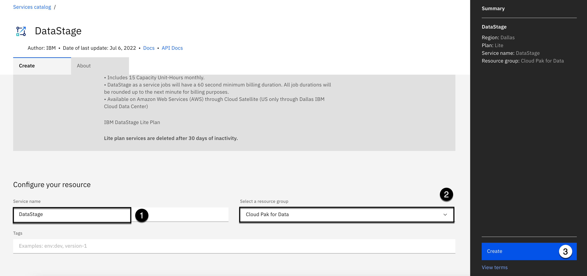

8.  Para la **Nombre del servicio**, especifique cualquier nombre que desee o acepte el valor predeterminado proporcionado.

    **Nota:** Este ejemplo elimina el **-- xx** caracteres predeterminados al final del nombre de servicio y simplemente los nombra **DataStage**. Usted puede nombrar el servicio lo que quiera, o tomar el nombre por defecto.

9.  Utilización de la **Seleccionar un grupo de recursos** desplegable, seleccione un grupo de recursos de la lista o tome el valor predeterminado visualizado.

    **Nota:** Los servicios deben asignarse a un grupo de recursos de cuenta de nube. IBM Cloud crea automáticamente un grupo de recursos cuando se registra para una cuenta de IBM Cloud. Este grupo de recursos se denomina **Valor predeterminado**. Si no ha creado ningún grupo de recursos adicional, o ha cambiado el nombre del **Valor predeterminado** grupo de recursos, sólo tendrá un grupo de recursos y se elegirá automáticamente para usted y aparecerá en gris.

    Este ejemplo muestra un grupo de recursos denominado **Cloud Pak for Data** de la lista porque la cuenta de nube, en la que se han tomado estas capturas de pantalla, tiene varios grupos de recursos definidos.

10. Haga clic en **Crear**.

El **Crear** el botón será gris y se convertirá en **Creación**.

Una vez que haya finalizado correctamente, se le llevará a la cuenta de Cloud Pak for Data **Instancias de servicio**. **Asegúrese de que** (ver el **columnas resaltadas** en la captura de pantalla) ha desplegado un **Lite** servicio **Plan**, que se colocó en el **Grupo de recursos** ha especificado, y que el servicio **Estado** is **Activo**.

11. Haga clic en **Añadir servicio +** botón para crear cualquier necesidad adicional **Laboratorio de tejido de datos** servicios en el [Servicios requeridos](https://vest.buildlab.cloud/es/wkc/getting-started#1-required-services) arriba.

Repita el proceso que acaba de seguir para desplegar el **DataStage** para todos los servicios necesarios restantes utilizando la información de cada servicio. El **Nombre del servicio** proporcionado en la información para cada servicio es sólo una recomendación. Puede nombrar estos servicios como desee y asignarlos al grupo de recursos que desee. Sin embargo, **asegurarse de que** usted elige el **Lite** plan para que no se le cobre por los servicios que usted proporciona.

### 3. AI/Servicios de aprendizaje automático

Creará 5 servicios a partir del **AI/Machine Learning** categoría. Se listan en el orden tal como aparecen en esta categoría en la interfaz de Cloud Pak for Data. Siga las instrucciones anteriores para los siguientes servicios en esta categoría:

#### Watson OpenScale

1.  Seleccione la opción **AI/Machine Learning** de la izquierda.
2.  Haga clic en **Watson OpenScale** mosaico de servicio.
3.  Utilización de la **Seleccione una región** desplegable, seleccione la opción **Dallas** de la lista.
4.  Haga clic en **Lite** mosaico del plan.
5.  Especifique un nombre de servicio de **Watson OpenScale** o el nombre que prefieras.
6.  Seleccione la opción **Grupo de recursos** de su elección o tomar el valor predeterminado.
7.  Haga clic en **Crear**.
8.  Verifique que el servicio se ha creado satisfactoriamente con el **Lite** plan.
9.  Seleccione la opción **Añadir servicio** para añadir el siguiente servicio.

#### Watson Studio

1.  Seleccione la opción **AI/Machine Learning** de la izquierda.
2.  Haga clic en **Watson Studio** mosaico de servicio.
3.  Utilización de la **Seleccione una región** desplegable, seleccione la opción **Dallas** de la lista.
4.  Haga clic en **Lite** mosaico del plan.
5.  Especifique un nombre de servicio de **Watson Studio** o el nombre que prefieras.
6.  Seleccione la opción **Grupo de recursos** de su elección o tomar el valor predeterminado.
7.  Haga clic en **Crear**.
8.  Verifique que el servicio se ha creado satisfactoriamente con el **Lite** plan.
9.  Seleccione la opción **Añadir servicio** para añadir el siguiente servicio.

#### Catálogo de conocimientos de Watson

1.  Seleccione la opción **AI/Machine Learning** de la izquierda.
2.  Haga clic en **Catálogo de conocimientos de Watson** mosaico de servicio.
3.  Utilización de la **Seleccione una región** desplegable, seleccione la opción **Dallas** de la lista.
4.  Haga clic en **Lite** mosaico del plan.
5.  Especifique un nombre de servicio de **Catálogo de conocimientos de Watson** o el nombre que prefieras.
6.  Seleccione la opción **Grupo de recursos** de su elección o tomar el valor predeterminado.
7.  Haga clic en **Crear**.
8.  Verifique que el servicio se ha creado satisfactoriamente con el **Lite** plan.
9.  Seleccione la opción **Añadir servicio** para añadir el siguiente servicio.

#### IBM Match 360 con Watson

1.  Seleccione la opción **AI/Machine Learning** de la izquierda.
2.  Haga clic en **IBM Match 360 con Watson** mosaico de servicio.
3.  Utilización de la **Seleccione una región** desplegable, seleccione la opción **Dallas** de la lista.
4.  Haga clic en **Lite** mosaico del plan.
5.  Especifique un nombre de servicio de **IBM Match 360 con Watson** o el nombre que prefieras.
6.  Seleccione la opción **Grupo de recursos** de su elección o tomar el valor predeterminado.
7.  Haga clic en **Crear**.
8.  Verifique que el servicio se ha creado satisfactoriamente con el **Lite** plan.
9.  Seleccione la opción **Añadir servicio** para añadir el siguiente servicio.

#### Watson Machine Learning

1.  Seleccione la opción **AI/Machine Learning** de la izquierda.
2.  Haga clic en **Watson Machine Learning** mosaico de servicio.
3.  Utilización de la **Seleccione una región** desplegable, seleccione la opción **Dallas** de la lista.
4.  Haga clic en **Lite** mosaico del plan.
5.  Especifique un nombre de servicio de **Aprendizaje automático** o el nombre que prefieras.
6.  Seleccione la opción **Grupo de recursos** de su elección o tomar el valor predeterminado.
7.  Haga clic en **Crear**.
8.  Verifique que el servicio se ha creado satisfactoriamente con el **Lite** plan.
9.  Seleccione la opción **Añadir servicio** para añadir el siguiente servicio.

### 4. Servicios de Base de

Creará 2 servicios a partir del **Bases** categoría. Se listan en el orden tal como aparecen en esta categoría en la interfaz de Cloud Pak for Data. Siga las instrucciones para los siguientes servicios en esta categoría:

#### Db2

1.  Seleccione la opción **Bases** de la izquierda.
2.  Haga clic en **Db2** mosaico de servicio.
3.  Utilización de la **Seleccione una región** desplegable, seleccione la opción **Dallas** de la lista.
4.  Haga clic en **Lite** mosaico del plan.
5.  Especifique un nombre de servicio de **Db2** o el nombre que prefieras.
6.  Seleccione la opción **Grupo de recursos** de su elección o tomar el valor predeterminado.
7.  Introduzca su trabajo **Correo electrónico** o déjelo en blanco. Este es un **optativo**.
8.  Haga clic en **Crear**.
9.  Verifique que el servicio se ha creado satisfactoriamente con el **Lite** plan.
10. Seleccione la opción **Añadir servicio** para añadir el siguiente servicio.

#### Consulta de Watson

1.  Seleccione la opción **Bases** de la izquierda.
2.  Seleccione la opción **Consulta de Watson** servicio.
3.  Utilización de la **Seleccione una región** desplegable, seleccione la opción **Dallas** de la lista.
4.  Seleccione la opción **Lite** plan.
5.  Especifique un nombre de servicio de **Consulta de Watson** o el nombre que prefieras.
6.  Seleccione la opción **Grupo de recursos** de su elección o tomar el valor predeterminado.
7.  Dejar todo el **Nodo** a los valores predeterminados (no puede cambiarlos de todos modos).
8.  Haga clic en **Crear**.
9.  Verifique que el servicio se ha creado satisfactoriamente con el **Lite** plan.
10. Seleccione la opción **Añadir servicio** para añadir el siguiente servicio.

### 5. Servicio de almacenamiento

Creará el archivo **Almacenamiento de objetos de nube** servicio desde el **Almacenamiento** categoría:

1.  Seleccione la opción **Almacenamiento** de la izquierda.

#### Almacenamiento de objetos de nube

Es muy probable que usted ya tenga un **Almacenamiento de objetos de nube** en su cuenta de IBM Cloud porque cuando se inicia la sesión en Cloud Pak for Data as a Service, se supone que debe suministrar automáticamente un **Almacenamiento de objetos de nube** servicio para usted. Pero, no siempre es así. Si tiene este servicio, puede omitir esta sección. De lo contrario, siga las instrucciones siguientes:

1.  Haga clic en **Almacenamiento de objetos de nube** mosaico de servicio.

**Nota:** Recuerde que esta creación de servicio abrirá una nueva pestaña (o ventana, en función de la configuración de su navegador) en su navegador y le llevará a su cuenta de IBM Cloud. Usted tendrá que volver a esto **Cloud Pak for Data** Pestaña (o ventana) en el navegador cuando se completa la creación del servicio (así que no lo cierre):

2.  Haga clic en **IBM Cloud** teja bajo el **Elegir una infraestructura**.
3.  Haga clic en **Lite** mosaico del plan.
4.  Especifique un nombre de servicio de **Almacenamiento de objetos de nube** o el nombre que prefieras.
5.  Seleccione la opción **Grupo de recursos** de su elección o tomar el valor predeterminado.
6.  Haga clic en **Crear**.

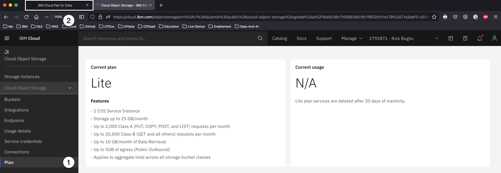

**Nota:** A veces el **Almacenamiento de objetos de nube** el servicio tarda un tiempo en la provisión. Si está en la página de servicio con un **spinning** rueda, espere un minuto y, a continuación, renueve la página utilizando el método de renovación del sitio web del navegador. Finalmente se mostrará, así que sea paciente. Cuando aparezca, complete los pasos siguientes:

Después de las disposiciones de servicio correctamente, se le llevará a la página de inicio de la **Almacenamiento de objetos de nube** servicio. Antes de volver a su cuenta de Cloud Pak for Data, que aún debe estar abierto en una pestaña (o ventana) en su navegador, es **Crítico** para verificar que este servicio se ha creado con **Lite** plan.

7.  Seleccione la opción **Plan** del menú del lado izquierdo.

    **Asegúrese de que** ha suministrado el **Lite** plan (el tipo de plan se visualiza de forma destacada en la página web).

8.  Volver a la **Cloud Pak for Data** (o ventana) en su navegador para volver a su cuenta de Cloud Pak for Data.

## Validar los servicios

La pestaña del navegador todavía debe estar en el **Catálogo de servicios** donde ha elegido crear el **Almacenamiento de objetos de nube** antes de ser llevado a su cuenta de IBM Cloud.

1.  Seleccione la opción **Navegación** (las 4 líneas horizontales apiladas en la esquina superior izquierda).

2.  Seleccione la opción **Servicios > Instancias de servicio** elemento de menú.

Usted debe ver su **9** suministro **Lite** en su cuenta de Cloud Pak for Data por orden alfabético por nombre. Asegúrese de que todos son **Lite** servicios con un **Activo** estado antes de proceder a la siguiente sección. Si no ve todos los servicios que ha recibido instrucciones de suministrar, es posible que se suministren en diferentes ubicaciones o en grupos de recursos diferentes. Si ese es el caso, utilice los filtros que se proporcionan en la parte superior de la **Instancias de servicio** y seleccionar la cuadrícula **Ubicaciones** y **Grupos de recursos** que los haya suministrado.

**Nota:** Asegúrese de seleccionar el recuadro de selección junto a la **Global** ubicación en el **Ubicaciones** filtro porque el **Almacenamiento de objetos de nube** service es un servicio global y no aparecerá en la lista de servicios si no selecciona **Global** ubicación en el **Ubicaciones** filtro. Esto es **Crítico** porque si no lo selecciona de **Ubicaciones** filtro **no** aparecen en la interfaz de Cloud Pak for Data como opción de almacenamiento cuando intenta crear un proyecto o catálogo.

Si ha utilizado Cloud Pak for Data como servicio antes, puede que tenga muchas otras instancias de servicio. También puede utilizar el área de búsqueda en la parte superior de la cuadrícula para filtrar dinámicamente las instancias de servicio.

**Permanecer en las instancias de servicio** para comenzar las instrucciones en la siguiente sección!

## Crear catálogo de activos de plataforma

En esta sección creará el **Catálogo de activos de plataforma** que es necesario para el **Tejido de datos** laboratorios para albergar a todo el mundo **Conexiones de plataforma**. Usted no podrá crear **Conexiones de plataforma** en la siguiente sección hasta que cree el **Catálogo de activos de plataforma**.

Los pasos siguientes verificarán qué **Catálogos** usted tiene en su entorno, y asegura que el **Catálogo de conocimientos de Watson** El servicio en su cuenta se inicializa correctamente, por lo que puede tomar las acciones apropiadas si es necesario.

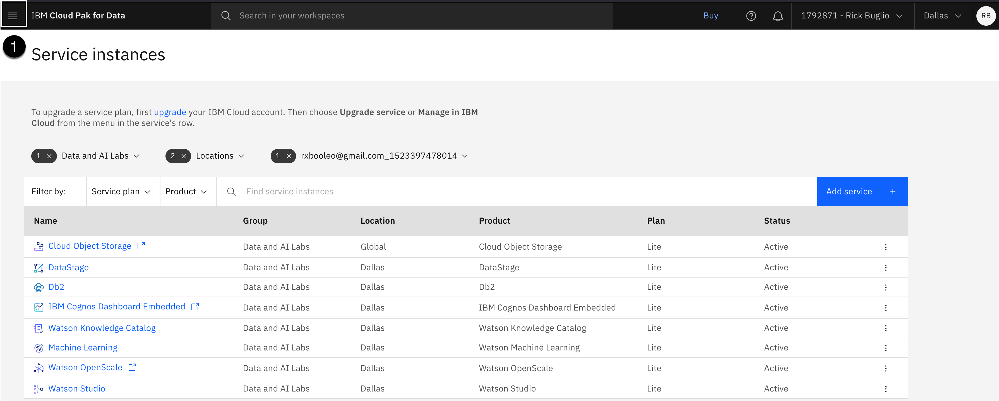

1.  Seleccione la opción **Navegación** (las 4 líneas horizontales apiladas en la esquina superior izquierda).

2.  Seleccione la opción **Catálogos > Ver todos los catálogos** elemento de menú.

Si usted está en un nuevo y fresco Cloud Pak for Data como cuenta de servicio, la sección de catálogo en el entorno de Cloud Pak for Data probablemente se verá como la captura de pantalla anterior.

Es muy posible que usted ya tenga un **Catálogo de activos de plataforma** o que usted tiene un **Catálogo de activos de plataforma** desde otra cuenta de la nube y tener otros catálogos en su entorno similares a la pantalla de arriba.

Si usted tiene un **Catálogo de activos de plataforma** como la captura de pantalla anterior, es decir **propiedad de usted** con **Administrador** autoridad, y **para su cuenta** (no para otra cuenta de nube como la **Resultados de Techzone** uno visualizado), ya tiene un **Catálogo de activos de plataforma** y no tienen que crear uno. Puede continuar con el paso siguiente para crear conexiones de plataforma.

Si no tiene ningún catálogo, o no tiene un **Catálogo de activos de plataforma**, siga estos pasos para crear un **Catálogo de activos de plataforma** :

3.  Seleccione la opción **Navegación** (las 4 líneas horizontales apiladas en la esquina superior izquierda).

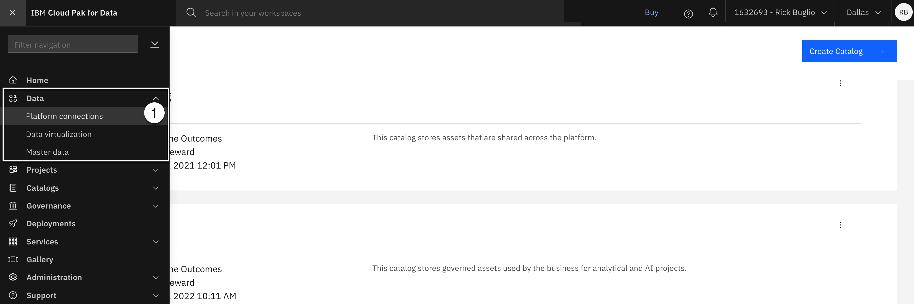

4.  Seleccione la opción **Datos > Conexiones de plataforma** elemento de menú.

5.  Haga clic en **Crear catálogo**.

6.  Seleccione la opción **X** en el mensaje de ayuda que aparece en la parte superior derecha para cerrarlo.

7.  Seleccione la opción **Actualizar activos originales** botón de selección para la opción de manejo de activos.

    **Nota:** Esta es la opción recomendada. Puede elegir la opción que mejor funciona para su entorno. Esta opción mantiene los activos originales y sólo actualiza los valores perdidos o nuevos. Este valor es dinámico para que siempre pueda cambiarlo en cualquier momento.

8.  Utilice el **Instancia de almacenamiento de objetos** desplegable y seleccione una instancia de almacenamiento de objetos en la que desee crear el catálogo.

9.  Haga clic en **Crear**.

Se muestra un mensaje que le notifica que Cloud Pak for Data está creando el catálogo de activos de plataforma y que puede tardar un minuto.

Una vez completado el proceso de creación:

10. Haga clic en **X** sobre la **Catálogo de activos de plataforma creado correctamente.** mensaje en la parte superior para cerrarlo.
11. Haga clic en **X** sobre la **Añada los usuarios de la plataforma al catálogo** mensaje para cerrarlo.
12. Seleccione la opción **Conexiones**.

## Crear conexiones de plataforma

En esta sección creará el **Conexiones de plataforma** que son utilizados por el **Tejido de datos** laboratorios. Tómese el tiempo para definir estas conexiones **ahora** porque se le indicará que los utilice en los laboratorios. Si no los crea ahora, no se mostrarán cuando usted haga los laboratorios y tendrá que volver a esta sección para definirlos porque es el **solo** place this information is proved.

Añadirá 3 conexiones de plataforma, que también se utilizan en la **Datos e IA Live Demos**, para alojar datos de Employee, Customer y Warehouse:

| Nombre                            | Tipo de conexión         |
| --------------------------------- | ------------------------ |
| Almacenamiento de objetos de nube | IBM Cloud Object Storage |
| Depósito de datos                 | IBM DB2 Warehouse        |
| Datos de terceros                 | PostgreSQL EDB           |

Las capturas de pantalla de esta sección se han capturado en un nuevo Cloud Pak for Data como una cuenta de servicio que no tiene ninguna conexión de plataforma. Si ya tiene conexiones de plataforma, su entorno puede parecer diferente, pero los resultados deben ser los mismos.

### 1. Almacenamiento de objetos en la nube

Cree una conexión con el grupo de almacenamiento de objetos de nube que contenga los archivos necesarios para los laboratorios de Data Fabric.

1.  Haga clic en **Nueva conexión +**.

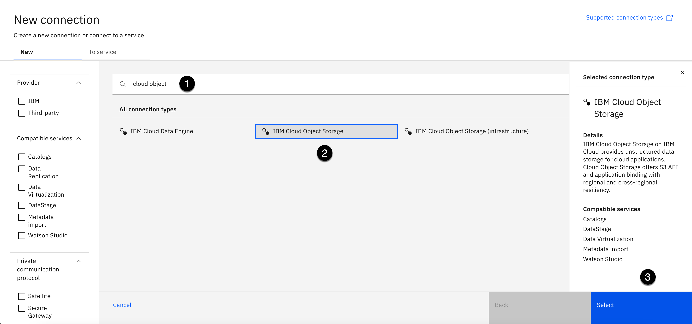

1.  Tipo **objeto de nube** en el área de búsqueda.
2.  Seleccione la opción **IBM Cloud Object Storage** conector.
3.  Haga clic en **Seleccione**.

Realice los pasos siguientes para completar la creación de la **Almacenamiento de objetos de nube** conexión:

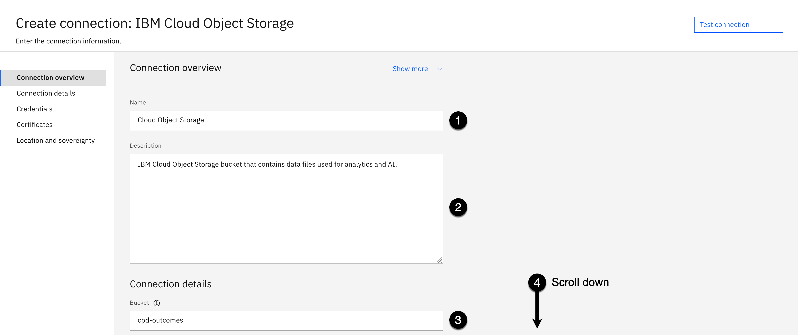

4.  Copie el texto siguiente y péguelo en el **Nombre** :

<CopyText text="Cloud Object Storage"/>

2.  Copie el texto siguiente y péguelo en el **Descripción** :

<CopyText text="Cubeta de IBM Cloud Object Storage que contiene archivos de datos utilizados para la analítica y la IA."/>

3.  Copie el texto siguiente y péguelo en el **Cubeta** :

<CopyText text="Cpd-resultados"/>

4.  Desplácese **Abajo** la página hasta el **URL de conexión** está en la parte superior de la página.

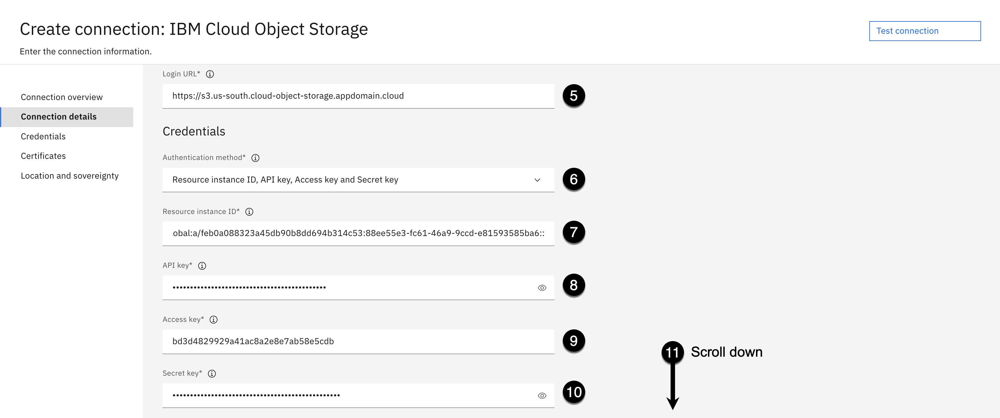

5.  Copie el texto siguiente y péguelo en el **URL de conexión** :

<CopyText text="https://s3.us-south.cloud-object-storage.appdomain.cloud"/>

6.  Utilización de la **Método de autenticación** desplegable, seleccione **ID de instancia de recurso, clave de API, clave de acceso y clave secreta** como método de autenticación de la lista.

El **ID de instancia de recurso** y **Clave de acceso** Los campos aparecerán.

7.  Copie el texto siguiente y péguelo en el **ID de instancia de recurso** :

<CopyText text="crn:v1:bluemix:public:cloud-object-storage:global:a/feb0a088323a45db90b8dd694b314c53:88ee55e3-fc61-46a9-9ccd-e81593585b6::"/>

El **Clave de API** aparecerá bajo el campo **ID de instancia de recurso**.

8.  Copie el texto siguiente y péguelo en el **Clave de API** :

<CopyText text="_-W6DMVd3cQV7YrWIdmExhX29ApoDIBAu4y0C07dCMPB"/>

9.  Copie el texto siguiente y péguelo en el **Clave de acceso** :

<CopyText text="bd3d4829929a41ac8a2e8e7ab58e5cdb"/>

El **Clave secreta** El campo aparecerá debajo de la **Clave de acceso**.

10. Copie el texto siguiente y péguelo en el **Clave secreta** :

<CopyText text="6f3fafc225b2c8527f22d13e2c67034f4da989dc08adffac"/>

11. Desplácese **Abajo** la página hasta que vea la **Localización y soberanía** valores.

12. Haga clic en **Seleccionar ubicación**.

13. Seleccione **IBM-Dallas** de la lista de ubicaciones.
14. Haga clic en **Seleccione**.

**Estados Unidos de América** se rellenará automáticamente como **Soberanía**.

15. Haga clic en **Confirmar** enlace de confirmación entre el **Ubicación** y el **Soberanía** campos.

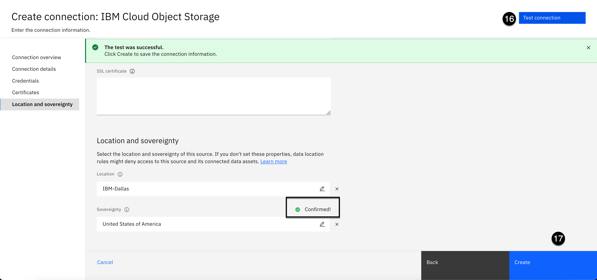

Verá una marca de selección verde con un **¡confirmado!** estado.

16. Haga clic en **Conexión de prueba** en la esquina superior derecha.
17. Cuando la prueba sea satisfactoria, desestime **La prueba ha sido satisfactoria** y haga clic en el **Crear**. Si la prueba es **no** éxito, bucle de vuelta a través de todos los pasos anteriores y asegúrese de que ha entrado todo correctamente y vuelva a intentar la prueba. Cuando tenga éxito, seleccione el **Crear**.

### 2. Almacén de datos

Cree una conexión a la base de datos de Db2 Warehouse que contenga los datos necesarios para los laboratorios de Data Fabric.

1.  Haga clic en **Nueva conexión +**.

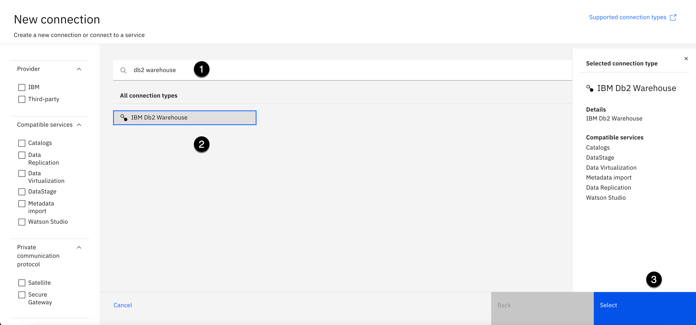

2.  Tipo **depósito de db2** en el área de búsqueda.
3.  Seleccione la opción **IBM DB2 Warehouse** conector.
4.  Haga clic en **Seleccione**.

Realice los pasos siguientes para completar la creación de la **Depósito de datos** conexión:

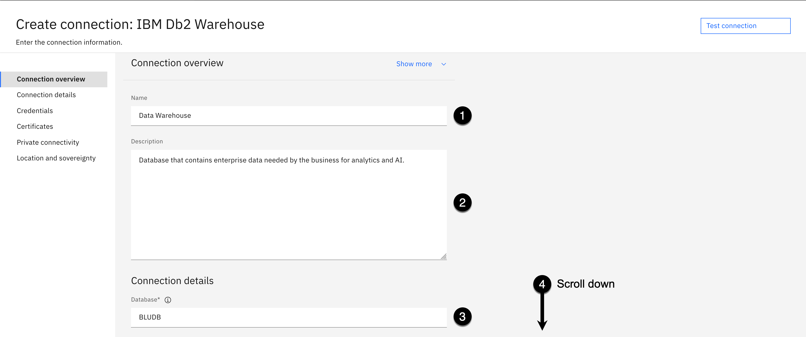

5.  Copie el texto siguiente y péguelo en el **Nombre** :

<CopyText text="Depósito de datos"/>

6.  Copie el texto siguiente y péguelo en el **Descripción** :

<CopyText text="Base de datos que contiene datos de empresa necesarios para el negocio para la analítica y la IA."/>

7.  Copie el texto siguiente y péguelo en el **Datos** :

<CopyText text="BLUDB"/>

8.  Desplácese **Abajo** la página hasta el **Nombre de host o dirección IP** está en la parte superior de la página.

9.  Copie el texto siguiente y péguelo en el **Nombre de host o dirección IP** :

<CopyText text="db2w-ovqfeqq.us-south.db2w.cloud.ibm.com"/>

10. El **Puerto** debe establecerse en **50001** de forma predeterminada. Deje el valor predeterminado.
11. Utilización de la **Método de autenticación** desplegable, seleccione **Nombre de usuario y contraseña** de la lista.
12. Copie el texto siguiente y péguelo en el **Nombre** :

<CopyText text="cpdemo"/>

13. Copie el texto siguiente y péguelo en el **Contraseña** :

<CopyText text="C!oudP@k4DataDem0s"/>

14. El **El puerto está habilitado para SSL** debe comprobarse de forma predeterminada. Déjelo comprobado.
15. Desplácese **Abajo** la página hasta que vea la **Localización y soberanía** valores.

16. Haga clic en **Seleccionar ubicación**.

17. Seleccione **IBM-Dallas** de la lista de ubicaciones.
18. Haga clic en **Seleccione**.

**Estados Unidos de América** se rellenará automáticamente como **Soberanía**.

19. Haga clic en **Confirmar** enlace de confirmación entre el **Ubicación** y el **Soberanía** campos.

Verá una marca de selección verde con un **¡confirmado!** estado.

20. Haga clic en **Conexión de prueba** en la esquina superior derecha.
21. Cuando la prueba sea satisfactoria, desestime **La prueba ha sido satisfactoria** y haga clic en el **Crear**. Si la prueba es **no** éxito, bucle de vuelta a través de todos los pasos anteriores y asegúrese de que ha entrado todo correctamente y vuelva a intentar la prueba. Cuando tenga éxito, seleccione el **Crear**.

### 3. Datos de terceros

Cree una conexión a la base de datos PostgreSQL que contenga los datos necesarios para los laboratorios de Data Fabric.

1.  Haga clic en **Nueva conexión +**.

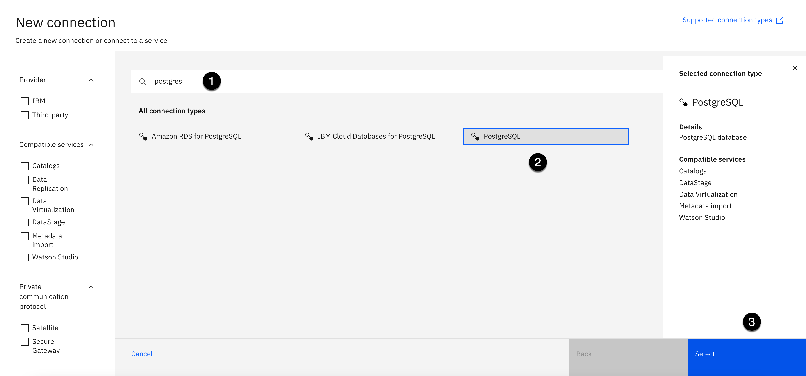

2.  Tipo **postgres** en el área de búsqueda.
3.  Seleccione la opción **PostgreSQL** conector.
4.  Haga clic en **Seleccione**.

Realice los pasos siguientes para completar la creación de la **Datos de terceros** conexión:

5.  Copie el texto siguiente y péguelo en el **Nombre** :

<CopyText text="Datos de terceros"/>

6.  Copie el texto siguiente y péguelo en el **Descripción** :

<CopyText text="Base de datos que contiene datos de terceros necesarios para la analítica y la IA."/>

7.  Copie el texto siguiente y péguelo en el **Datos** :

<CopyText text="3RDPARTY"/>

8.  Desplácese **Abajo** la página hasta el **Nombre de host o dirección IP** está en la parte superior de la página.

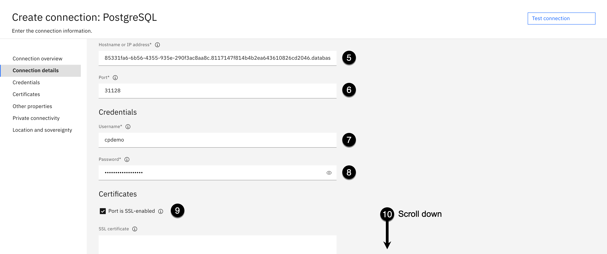

9.  Copie el texto siguiente y péguelo en el **Nombre de host o dirección IP** :

<CopyText text="85331fa6-6b56-4355-935e-290f3ac8aa8c.8117147f814b4b2ea643610826cd2046.databases.appdomain.cloud"/>

10. Copie el texto siguiente y péguelo en el **Puerto** :

<CopyText text="31128"/>

11. Copie el texto siguiente y péguelo en el **Nombre** :

<CopyText text="cpdemo"/>

12. Copie el texto siguiente y péguelo en el **Contraseña** :

<CopyText text="C!oudP@k4DataDem0s"/>

13. Seleccione la casilla de verificación junto a la **El puerto está habilitado para SSL**.
14. Desplácese **Abajo** la página hasta que vea la **Localización y soberanía** valores.

15. Haga clic en **Seleccionar ubicación**.

16. Seleccione **IBM-Dallas** de la lista de ubicaciones.
17. Haga clic en **Seleccione**.

**Estados Unidos de América** se rellenará automáticamente como **Soberanía**.

18. Haga clic en **Confirmar** enlace de confirmación entre el **Ubicación** y el **Soberanía** campos.

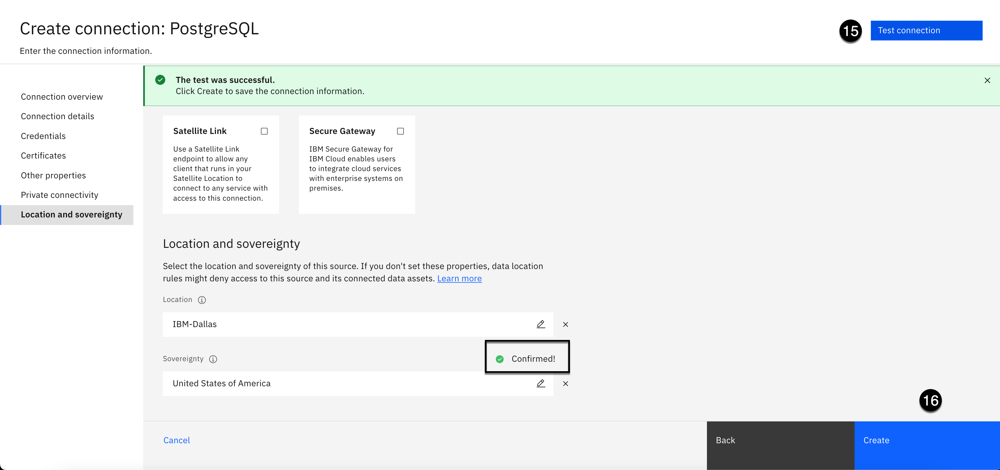

Verá una marca de selección verde con un **¡confirmado!** estado.

19. Haga clic en **Conexión de prueba** en la esquina superior derecha.
20. Cuando la prueba sea satisfactoria, desestime **La prueba ha sido satisfactoria** y haga clic en el **Crear**. Si la prueba es **no** éxito, bucle de vuelta a través de todos los pasos anteriores y asegúrese de que ha entrado todo correctamente y vuelva a intentar la prueba. Cuando tenga éxito, seleccione el **Crear**.

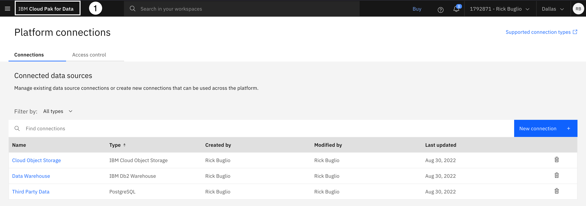

Ahora debería ver el **3** nuevas conexiones en su **Conexiones de plataforma** lista.

21. Haga clic en **IBM Cloud Pak for Data** en la barra de herramientas para ir a la página de inicio de Cloud Pak for Data.

¡Felicidades Ha completado todos los pasos de preparación y está preparado para iniciar los laboratorios de Data Fabric.
