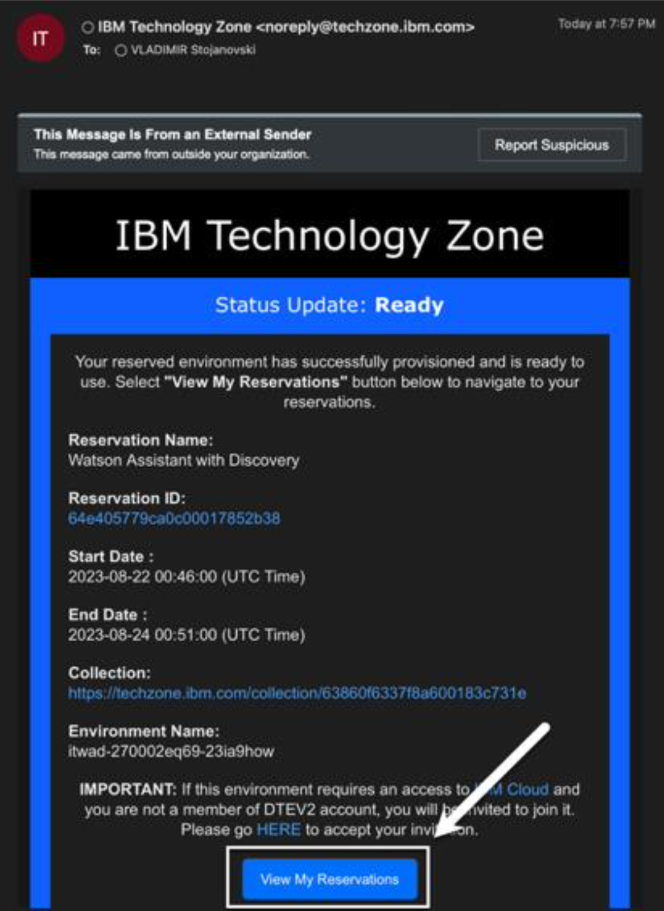
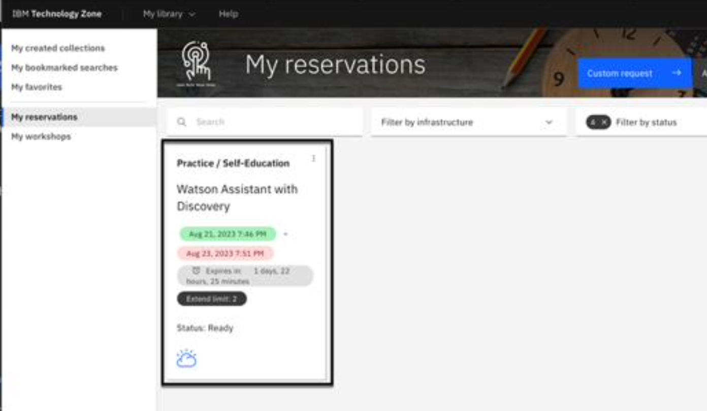
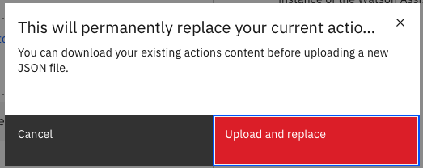

# 101: IBM watsonx Assistant Hands-on Lab

## In this section

Explore what a virtual assistant built with watsonx Assistant looks like from various persona
perspectives.

## End user's perspective

Imagine you are an end user. Let's explore the Lendyr Bank virtual assistant, built with watsonx Assistant: [Lendyr.com](http://lendyr.com/).

Click on the **Tell, Do, & Show** tile and then click on the assistant in the bottom-right corner. Work through the Tell, Do, & Show tour.

You can also try running through some of these conversations with the assistant:

| Conversation #1                                                                                                                       | Conversation #2                                                                                                    | Conversation #3                                                                                                                          | Conversation #4            |
| ------------------------------------------------------------------------------------------------------------------------------------- | ------------------------------------------------------------------------------------------------------------------ | ---------------------------------------------------------------------------------------------------------------------------------------- | -------------------------- |
| **Send:** I want to apply for a student loan **Send:** What's the limit on loan amount? **Send:** I'm coming from high school | **Send:** Hey, I want to use the mortgage calculator **Send:** 400,000 **Send:** actually make it $300,000 | **Send:** hey I want to send a million dollars to myself **Send:** tomorrow **Send:** ugh just let me talk to a real person!!!!! | **Send:** loan application |

Take note of the features and functionality you see in the assistant:

- Asking questions as an end user
- Identifying the question that the end user is asking, or the action they want to take
- Allowing the end user to interrupt the conversation
- Doing something different if the end user answers "yes" versus answering "no"
- Starting over when something goes wrong
- A panel where the end user has the conversation with the assistant
- Synonyms and context (loan coming from high school = will be an undergraduate
  student)

## Setting up watsonx Assistant

### Option 1: IBM TechZone

If you are an IBMer or an IBM business partner, you should provision watsonx Assistant on IBM TechZone. Navigate to the [Watson Enterprise collection](https://techzone.ibm.com/collection/watson-enterprise/environments) on TechZone, and click on the **watsonx Assistant, Discovery with watsonx.ai** tile to reserve an environment. Sections 1-6 of this lab will only use watsonx Assistant. However, in Section 7, you will also need Watson Discovery and watsonx. That’s the reason you are selecting the environment with these three products:

This will take you to the reservations page.
1. Enter a **name** for the reservation that is meaningful to you.
2. Under **Purpose**, select the **Practice / Self-Education** tile.
3. Enter a **Purpose description**.
4. Select a **Preferred geography**.
5. You can leave **End date and time** as-is, as it defaults to the maximum of 2 days. 
6. Accept the **Terms & Conditions**.
7. Click **Submit**.

You will soon receive an email that your environment is provisioning. It usually takes between 10 and 15 minutes for the provisioning to finish. Once you receive an email notifying you that your TechZone environment is ready, open it and click **View My Reservations**:

This will take you to the **My reservations** page on TechZone. Click on your newly provisioned instance tile:

Your TechZone instance is shown, along with the links to your Assistant, Discovery, and watsonx.ai instances. Click the **watsonx Assistant URL**:

Then, as shown on the image below, click the **Launch watsonx Assistant** button to open the watsonx Assistant home page:

Next, you can skip forward to the **Configure your Assistant** section below. An onboarding wizard will walk you through creating your first assistant.

### Option 2: IBM Cloud

If you are not an IBMer or IBM Business Partner, or if you prefer to use your personal IBM Cloud account to provision watsonx Assistant, start by navigating to [IBM Cloud](https://cloud.ibm.com).

If you already have a Trial, Plus, or Enterprise instance of watsonx Assistant, open it up and
create a new assistant. If you don’t have an instance of watsonx Assistant, follow these
instructions to create a free Trial instance.

To create a free Trial instance, Search for "watsonx Assistant" in the top search bar and click
**watsonx Assistant** under **Catalog Results**.

Now we can create our assistant by:

1. Select the region that's closest to your location.
2. Select the **Trial** pricing plan. (This is the trial version of the Plus pricing plan.)
3. Agree to the **Terms and Conditions**.
4. Click on the **Create** button in the lower-right area of the page.

Now let's validate the creation of our new assistant:

1. Click the **Resource list** icon on the left-side navigation.
2. Expand the **AI/Machine Learning** section
3. You should now be able to see your newly created watsonx Assistant

> Note: The service you create may have a suffix, like “watsonx Assistant-hu.” These names are
> identifiers for you to distinguish between the multiple services you may create. You can change
> them if you like.

To launch watsonx Assistant, click on the new service you created. From here, clicking the **Launch watsonx Assistant** button will launch to the watsonx Assistant homepage.

## Configure your Assistant

1. Input any name you like into the **Assistant name** field.
2. Provide a short description in the **Description field** (this is optional).
3. Click the **Next** button in the top-right corner of the page.

On the following screen, make these selections:

1. Select **Web** as this assistant will be accessed via a web browser channel.
2. Select **Banking and financial services** as the industry.
3. Select **Developer** as our builder persona.
4. Select **I want to provide confident answers to common questions** as the main purpose of the assistant.
5. Click the **Next** button in the top-right.

The next screen will now allow you to customize the look and feel of your assistant. Customize now or feel free to just click the **Next** button again in the top-right.

This screen allows you to preview the web chat of the assistant. Click the **Create** button in the top-right.

Finally, as shown in the image below, you will see the **Home** page of your new assistant.

## Builder's perspective

Let's explore the persona of a Builder. A conversation builder is responsible for writing and maintaining existing conversational flows. They have likely worked in customer service, market research, or a relevant focus area that led into this role.

To explore their perspective, you will create a copy of the Lendyr demo assistant in the new assistant that's been created.

From the Home page, click on the **Actions** tab on the left-side. This is where a builder writes the content that a virtual assistant will be trained to answer.

> Actions are a representation of the tasks you want your assistant to help your customers with.
> Each action contains a series of steps that represent individual exchanges with a customer.
> Actions allow you to build an Assistant that can easily converse with a customer with **no
> coding** knowledge needed!

Click the **Global settings** cog icon in the top-right. Let's add some predefined actions:

1. Click the **Upload/Download** tab.
2. Download [this json file](https://raw.githubusercontent.com/CloudPak-Outcomes/Watson-Asst-Lab/main/action-skills/LendyrActions_v17_Live_lastchecked03Jan2023.json) and select it for upload.
3. Click the **Upload** button.

If a modal window displays, click **Upload and replace**.

A toast notification should now display confirming your upload. Finally, close the global settings window.

Your assistant is now a copy of the Lendyr.com assistant! Feel free to spend a few minutes exploring the Actions page.

Note that the builder’s background is not technical. What does this mean for watsonx Assistant?
watsonx Assistant is purposefully designed to be accessible to anyone, whether they have 
technical skills or not. It is organized around a simple yet powerful conceptual model for 
conversations. This model makes it easy for non-technical builders to author conversational 
flows, and it scales well into large and complex use cases.

## Developer's perspective

Let's explore the perspective of a Developer. A developer is responsible for supporting technical solutions and innovation with a focus on customer care. They likely have a background in or were asked to explore new AI technology, leading into this project.

Developers can work in the Actions page too, but they often focus on more technical features. From the **Home** page, open the left menu and click **Integrations** on the bottom-left.

watsonx Assistant Integrations add various channels, extensions, and third-party integrations to easily configure and deploy your assistant. Spend a few minutes exploring the Integrations page.

Developers spend more time on technical features than on the Actions page, where builders create new conversational flows. Why is that? Since watsonx Assistant is purposefully designed to make it easy for non-technical builders to author conversational flows, developers can focus in on the parts of a virtual assistant that require their technical expertise, like integrations with other applications.

## Product manager's perspective

Finally, let's explore the perspective of a product manager. A product manager is responsible for the overall success of the assistants deployed by the organization. They track assistant performance, lead assistant builder and developer teams, and collaborate with all assistant stakeholders.

Product managers can work in the Actions and Integrations pages, but they typically focus on overall success, continuous improvement, and expansion. Using the left menu explore the **Publish**, **Environments**, and **Analyze** pages.

**Publishing** is a way to maintain a healthy lifecycle management process. You can create 
incremental versions of your content over time, making it easier to manage deployment of 
changes and roll back (revert) to prior versions if necessary.

**Environments** are spaces that contain a version of your content and settings. All assistants come 
pre-set with a Draft and a Live environment. The Draft environment lets you make changes and 
test your assistant, while the Live environment holds the current published version.

The **Analyze** page provides a summary of the interactions between users and your assistant. This 
will give you an in-depth view of what your customers are looking for from your assistant as 
well as how well your assistant is currently solving their needs.

## Conclusion

As you explored watsonx Assistant through these different personas, you noted that developers 
spend more time on technical integrations, and builders spend more time on the non-technical 
authoring experience.

The product manager really likes that watsonx Assistant encourages this specialization of labor. 
Why? Because it’s *expensive* to staff a large technical team to maintain a virtual assistant! With 
watsonx Assistant, a product manager can staff a team with both non-technical builders, which
focus on conversational flows, and developers, which focus on the technical implementation and 
integrations. In this way, the product manager can build, maintain, and scale a great solution with 
a smaller team, driving down their total cost of ownership.

As you learn more about watsonx Assistant in this lab, you will also notice that watsonx 
Assistant makes it easy for builders and developers to collaborate. For example, developers can 
hand off the conversation flow work to builders, who can then build the flows without any code. 
This removes the dependencies between builders and developers, allowing them to work together 
*faster*. Teams collaborate more effectively with watsonx Assistant, accelerating everyone’s time 
to value.

