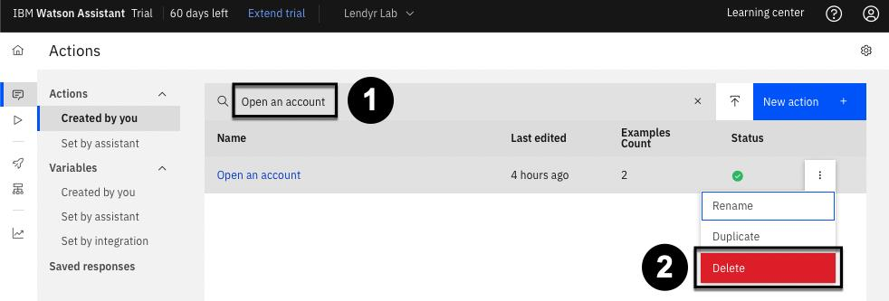
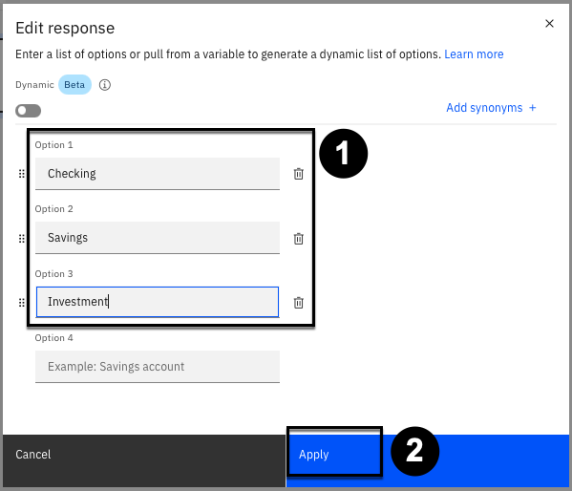
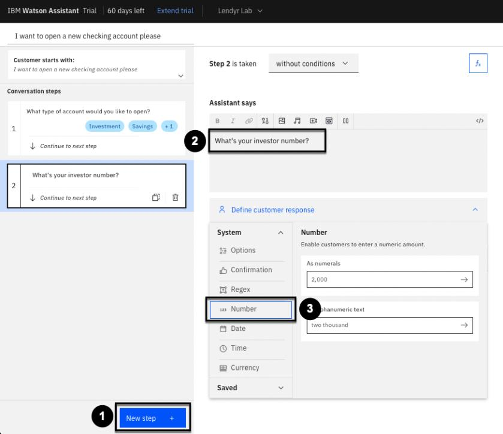
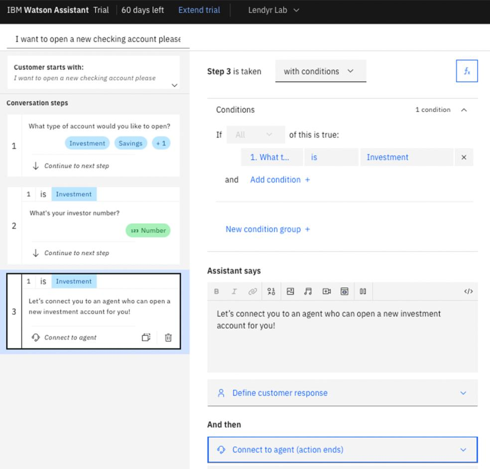
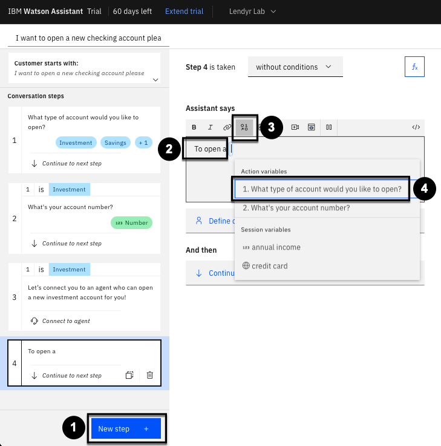
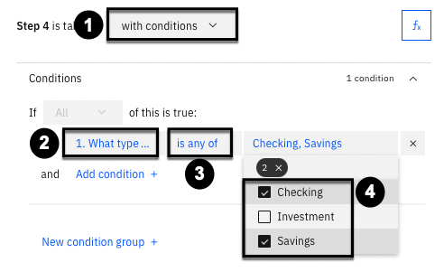
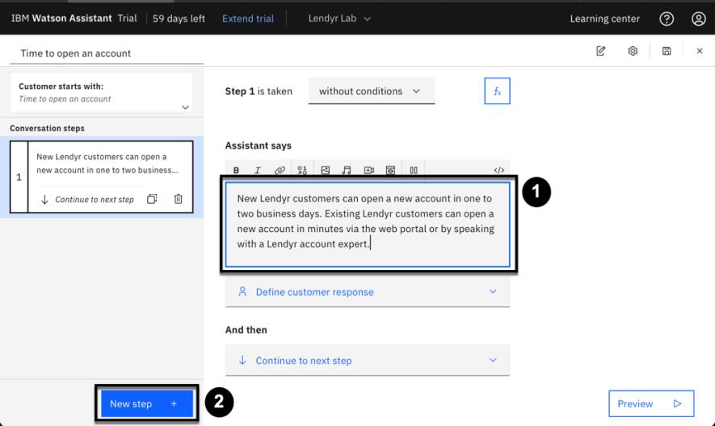
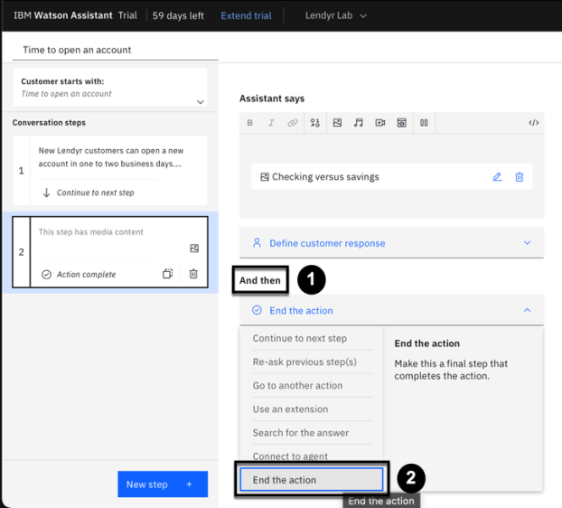

# 102: Acciones

## En esta sección

<QuizAlert text='Atención! Partes de esta sección estarán en el cuestionario.'/>

Conozca los componentes fundamentales de un asistente virtual y cómo colaborar en un
asistente con colegas.

## Requisitos previos

Completa esta sección con el asistente que utilizaste en la sección 101 **o** con tu propio asistente. Si desea utilizar su propio asistente, debe [cargar](https://cloud.ibm.com/docs/watson-assistant?topic=watson-assistant-admin-backup-restore#backup-restore-import) la siguiente [habilidad Acción](https://raw.githubusercontent.com/CloudPak-Outcomes/Watson-Asst-Lab/main/action-skills/LendyrActions_v17_Live_lastchecked03Jan2023.json) que refleja la habilidad después de completar la sección 101, pero tenga en cuenta que esto sobrescribirá sus acciones existentes.

## Construir su primera acción

Empecemos creando una nueva acción. Para ello, haga clic en la opción **Acciones** de la barra de navegación de la izquierda para acceder a la página Acciones. Una vez allí debería ver una larga lista de acciones actuales si ha importado el archivo JSON de antes a su asistente.

Haciendo clic en el **icono Buscar** podrá utilizar una entrada de texto para consultar la lista. Empiece escribiendo `Abrir una cuenta` en el campo de búsqueda para encontrar la acción correspondiente.

Ahora, imagina que trabajas en el equipo de asistentes virtuales de Lendyr, y que has recibido el mensaje de que esta automatización va a dejar de funcionar. Tienes que sustituir esta Acción por una nueva para que los clientes no se encuentren con un "callejón sin salida" cuando intenten abrir una cuenta nueva.

Para eliminar la acción:

1.  Haga clic en **el icono de la elipsis** para mostrar las opciones de la acción.
2.  Seleccione **Borrar** en el menú de desbordamiento.
3.  Confirme la eliminación de esta acción haciendo clic de nuevo en **Eliminar** en el modal.

Ahora vamos a construir un nuevo flujo de conversación que comience con la pregunta "Quiero abrir una nueva cuenta corriente por favor". Algo como:

Para construirlo:

1.  Haga clic en el botón **Nueva acción +**.
2.  En el menú resultante, seleccione **Empezar de cero**
3.  Dale el nombre `Quiero abrir una nueva cuenta corriente por favor` y pulsa **Guardar**

Hemos creado nuestra acción y debería ver un primer paso vacío a su disposición. Ahora a rellenar el Paso 1:

1.  Añada la pregunta aclaratoria en el cuadro de texto **Los asistentes dicen**, por ejemplo: "¿Qué tipo de cuenta desea abrir?".
2.  A continuación, haga clic en **Definir respuesta del cliente**.
3.  Pase el ratón sobre **Opciones**.
4.  Haga clic en **Como una lista** para introducir las opciones de la cuenta.
5.  En la ventana emergente resultante, introduzca tres opciones: **Cuenta corriente**, **Ahorro** e **Inversión**.
6.  Haga clic en **Aplicar** para guardar los cambios.

Ya ha terminado con el primer paso. Haga clic en el **icono Guardar** en la parte superior derecha para guardar los cambios en su nueva acción.

> Aparte del botón Guardar, el Asistente Watson guarda automáticamente los cambios cuando haces clic en un nuevo paso o abres la vista previa. No hay "deshacer", pero el guardado automático puede desactivarse. Para más detalles, consulta la documentación del producto [aquí](https://cloud.ibm.com/docs/watson-assistant?topic=watson-assistant-save-actions).

## Previsualice su acción

Fíjese en el botón **Vista previa** situado en la parte inferior derecha, que está presente en prácticamente todas las pantallas en las que construye sus Acciones. Este botón te da la posibilidad de previsualizar instantáneamente cómo funciona el asistente, en cualquier momento. Haga clic en Vista **previa**:

Esto abrirá el panel de **Vista Previa**. Pruebe la acción recién añadida introduciendo algo similar a "¿Cómo puedo abrir una nueva cuenta?".

> Tenga en cuenta que, aunque no haya entrenado al asistente en esa pregunta específica, éste ha sido capaz de dar la respuesta correcta a la acción que acabamos de crear.

Ahora seleccione uno de los tipos de cuenta, y observe que la acción se ha completado; no hay pasos adicionales que deba realizar el asistente.

Haga clic en el icono de actualización e intente formular la pregunta de otra manera, por ejemplo, "Necesito una cuenta nueva". Ten en cuenta que el asistente no reconoce esta entrada:

Ampliemos la acción para poder entender esta fase:

1.  Haga clic en la sección **El cliente empieza por:** de la parte izquierda.
2.  Introduzca la frase `Necesito una cuenta nueva`.
3.  Ahora debería tener 2 frases disponibles para que el cliente comience.

Inicie de nuevo la vista previa y utilice esta frase para asegurarse de que nuestro asistente es ahora capaz de entenderla.

## Crear otro paso de clarificación

Con tu primer paso creado y probado, vamos a terminar esta Acción creando otro paso:

1.  Haga clic en el primer paso del menú lateral.
2.  Añada **el Paso 2** haciendo clic en **Nuevo paso +**.
3.  Introduzca `¿Cuál es su número de inversor?` en la casilla **Asistente dice**.
4.  Haga clic en **Definir respuesta del cliente** y seleccione **Número**.

A continuación, hay que añadir algo de lógica al flujo. Dado el modo en que se pretende que funcione este flujo, un número de inversor sólo debe recogerse en el caso de que el cliente desee abrir una cuenta de inversión. Para ello

1.  Cambiar **sin condiciones** por **con condiciones**.
2.  Asegúrese de que la primera pregunta era **Inversión** seleccionándola en el menú desplegable.
3.  Haga clic en el **icono Guardar** para asegurarse de que se guardan estos cambios.

## Crear un paso de traspaso de agente

Ahora, añadirá los pasos 3 y 4, cada uno de los cuales proporciona un resultado final al usuario. Para crear el paso 3:

1.  Agregue el **Paso 3** haciendo clic en **Siguiente paso +**.

2.  Ingrese "¡Vamos a conectarlo con un agente que puede abrirle una nueva cuenta de inversión!" en el cuadro **El asistente dice**.

3.  Seleccione **con condiciones** para que este paso sea condicional. De forma predeterminada, la condición se completará con el Paso 2, por lo que debemos seleccionar la variable del Paso 1.

4.  Haciendo clic en el cuadro **Variable**.

5.  Haga clic en **Variables de pasos de acción** en el menú desplegable.

6.  Seleccione **1. Qué tipo de cuenta…** en el menú desplegable de dependientes.

7.  Seleccione **Inversión** como valor variable para la condición, como se muestra a continuación.

Finalmente, para este paso, no necesita recopilar ninguna información del usuario, por lo que puede dejar vacía la sección **Definir respuesta del cliente**. Sin embargo, debe configurar el asistente para que dirija esta conversación a un agente humano. Para agregar eso, cambie la configuración **Y luego** para conectarse a un agente humano:

En la ventana emergente **Conectar con el agente** que se muestra a continuación, tenga en cuenta que las dos primeras entradas ya están completadas **Respuesta si los agentes están en línea (1)** y **Respuesta si los agentes están fuera de línea (2)**. Puede reformular estas dos respuestas precargadas si lo desea. En la tercera entrada, **Mensaje al agente (Opcional)(3)**, inserte el contexto que reunió para que el agente humano lo revise: el número de inversionista del cliente y el hecho de que desea abrir una cuenta de inversión. Para hacer esto, escriba "El cliente desea abrir una cuenta de inversión y su número de inversionista es `$`".
 
Tenga en cuenta que a medida que escribe el signo `$`, aparece un cuadro de selección rápida; seleccione **Variables de pasos de acción → 2. ¿Cuál es su número de inversor? (4)**
 
Esto transmitirá la respuesta del cliente con su número de inversionista al agente. la ventana emergente
ahora debería verse como la imagen de abajo; haga clic en **Aplicar (5)**.

El paso 3 ahora debería estar completo y verse así:

## Crear un paso de respuesta final

Por último, vamos a crear el paso final de esta acción. Este debe devolver un enlace al usuario basado en el tipo de cuenta que desea abrir. Para crear este paso:

1.  Asegúrese de que está seleccionado el **paso 3**.

2.  Haga clic en **Siguiente paso +** para añadir el **Paso 4**.

3.  En **Asistente dice** escriba `Para abrir un`.

4.  Ahora haga clic en el botón **Variable**.

5.  Introduzca la respuesta del paso 1 como variable de acción **(1. ¿Qué tipo de cuenta desea abrir?)**.

6.  Ahora completar la línea con la `cuenta, visite nuestro portal en línea`.

7.  Convierta el texto del `portal` en línea en un enlace seleccionándolo y haciendo clic en el icono de la barra de herramientas **Enlace**.

    - En la sección **URL** introduzca `lendyr.com/open-a-new-account?account_type=$`.
    - El `$` invocará de nuevo nuestras variables de Acción, y podrá seleccionar el tipo **de cuenta** (Nota: esto no creará una URL que funcione; es sólo una ilustración de cómo se pasa un parámetro a través de un enlace).

8.  Haga clic en **Aplicar** para crear el enlace.

Ahora vamos a aplicar algunas condiciones por:

1.  Cambio de **sin condiciones** a **con condiciones**.
2.  Seleccione **1. Qué tipo de cuenta....**
3.  Cambiar **es** a **es cualquiera de**.
4.  Asegúrese de que tanto la **cuenta corriente** como la **cuenta de ahorro** están seleccionadas.

Por último, asegúrese de que la opción **Y entonces** está establecida en **Finalizar la acción** para finalizar la acción después de este paso.

¡Boom! Tus pasos deberían estar completos. Abra la vista previa y pruebe algunos de los pasos de esta acción.

## Vista previa de su asistente

<QuizAlert/>

Vuelva a la página de inicio de su asistente. A continuación, compruebe cómo aparecerá su asistente ante los usuarios en la web. Para ello

1.  En la parte izquierda, haga clic en **Vista previa**.
2.  Observe la vista previa en línea para que pueda probar el asistente.
3.  El botón **Personalizar chat web** le permitirá cambiar el aspecto de su asistente.
4.  Asegúrese de que se encuentra en la pestaña **Estilo** del menú resultante.
5.  Cambia el **nombre** del **Asistente conocido por los clientes** a "Asistente Lendyr".
6.  Haga clic en **Añadir una imagen de avatar** y señale [este enlace de imagen](https://web-chat.global.assistant.watson.appdomain.cloud/assets/Lendyr-Avatar.png).
7.  Cambie el **color primario** a `#004144`. Este es el color de la cabecera del canto.
8.  Cambie el **color secundario** a `#3D3D3D`. Esto colorea la burbuja de mensaje.
9.  Cambie el **color de acento** a `#004144`. Esto acentúa ciertas respuestas e iconos.

Ahora vas a personalizar la pestaña de la pantalla de inicio. Comience por:

1.  Haz clic en la pestaña **de la pantalla de inicio**.
2.  Cambiar **Saludo** a: "¡Hola, soy el asistente de Lendyr! ¿En qué puedo ayudarte?"
3.  Cambia **Starter 1** a: "Conoce a Lendyr"
4.  Cambia **Starter 2** a: "Pagar facturas"
5.  Cambia **Arranque 3** por: "Encontrar las sucursales más cercanas"

Ahora has personalizado tu asistente para que sea similar a la demo de Lendyr.

## Previsualice su asistente en el sitio web de Lendyr Bank

Ahora, ¡incrustarás tu asistente en el sitio web del Banco Lendyr! Para ello:

1.  Haga clic en la pestaña **Incrustar**.
2.  Copie el valor del **ID de integración** de su asistente y péguelo en un documento de texto. Utilizará el valor en breve
3.  Copie el valor de la **región** de sus asistentes y péguelo en un documento de texto.
4.  Copie el valor del **serviceInstanceId** de sus asistentes y péguelo en un documento de texto.
5.  Por último, haga clic en **Guardar y salir**.

Ahora toma esos tres valores e introdúcelos en esta URL:

`https://www.ibm.com/products/watson-assistant/demos/lendyr/demo.html?integrationID=ID_HERE&region=REGION_HERE&serviceInstanceID=ID_HERE`

Abra esta URL y explore la Acción "Abrir una nueva cuenta" en su asistente. Ha creado y utilizado con éxito su primera acción en el sitio web de Lendyr Bank. Bien hecho.

## Acción simple de preguntas y respuestas

<QuizAlert/>

Construyamos una segunda Acción. Esta Acción responderá simplemente a la pregunta de un usuario final sobre cuánto tiempo se tarda en abrir una cuenta. En primer lugar, vuelva a la pantalla **Acciones (** 1) haciendo clic en la opción **Acciones** del menú de la izquierda. A continuación, haga clic en **Nueva acción + (2)**:

Como antes, seleccione la opción **Empezar desde cero** (veremos las plantillas más adelante en este laboratorio). Para el enunciado del cliente, introduzca "Hora de abrir una cuenta"**(1)** y haga clic en **Guardar (2)**:

En el primer paso, en **Asistente dice (1)**, introduzca: "Los nuevos clientes de Lendyr pueden abrir una nueva cuenta en uno o dos días laborables. Los clientes existentes de Lendyr pueden abrir una nueva cuenta en cuestión de minutos a través del portal web o hablando con un experto en cuentas de Lendyr." A continuación, haz clic en **Nuevo paso +**:

En este segundo paso, haga clic en el icono de **tipo de respuesta Imagen** en **Asistente dice**:

A continuación, añada una imagen con las siguientes propiedades:

- **URL de origen:** [https://img.money.com/2020/10/checking-vs-savings-revised-1.gif](https://img.money.com/2020/10/checking-vs-savings-revised-1.gif)
- **Texto alternativo:** Cuenta corriente frente a cuenta de ahorro
- **Título:** Cuenta corriente frente a cuenta de ahorro
- **Descripción:** Obtenga más información sobre cuentas corrientes, de ahorro y otros tipos de cuentas en nuestro sitio web.

Compruebe que su pantalla tiene el aspecto de la imagen siguiente y haga clic en **Aplicar**:

Este será el último paso de esta Acción, así que cambie **Y entonces (1)** por **Finalizar la acción (2)**:

Haga una lluvia de ideas y añada algunas frases de ejemplo más a esta Acción: empiece con "¿Cuánto se tarda en abrir una cuenta nueva?". (Recuerda que puedes introducirlas haciendo clic en la ventana **El cliente empieza por:** ). Ahora, guarda y previsualiza tu nueva Acción utilizando tu URL personalizada de Lendyr.

¡Felicidades! Ha completado esta práctica de laboratorio. Puede pasar al siguiente laboratorio aquí: - **[Módulo 103: Inteligencia artificial fuera de la caja](/watsonx/assistant/103)**
