# 104: Analytics

## In this lesson

<QuizAlert text='Heads up! Parts of this section will be on the quiz.'/>

Learn about watsonx Assistant’s analytics, a powerful capability that takes the guesswork out of
improving your assistant’s performance.

## Prerequisites

Complete this section with the assistant you used in the 103 section **or** your own assistant. If you
want to use your own assistant, you must [upload](https://cloud.ibm.com/docs/watson-assistant?topic=watson-assistant-admin-backup-restore#backup-restore-import) the following [Action skill](https://raw.githubusercontent.com/CloudPak-Outcomes/Watson-Asst-Lab/main/action-skills/begin-104-action-skill.json) which reflects the skill after completing section 103, but note that this will overwrite your existing actions.

## Introducing Analytics

Welcome back to the watsonx Assistant hands-on lab! In this section, you will play the role of a
builder or a product manager for a virtual assistant, exploring its Analyze page.

### Landing on the Analytics page

Unless you thoroughly tested or experimented with your assistant as you completed previous sections of this lab, your assistant will not have a lot of data to populate its analytics. To see them:

1. Click the **Analyze (1)** option in the left-hand menu.
2. Once there ensure you looking at the **Draft (2)** environment.

The Analyze page displays high-level metrics on the performance of your assistant. These metrics and their underlying data are populated in real time. Take a moment to look around – you will see metrics such as number of unique users, conversations, and requests handled by the assistant in the specified date range.

A **request** is a message from an end user. A request might be recognized, in which case the assistant would have used it to trigger an action. A request might also be unrecognized, in which case the assistant would have fallen back to disambiguation, escalation to a live agent, or asking the end user to try again.

As you saw above, you can filter by environment. The Trial and Plus plans of watsonx Assistant offer two environments called Draft and Live. The Enterprise plan offers five environments, including Draft, Live, and up to three test environments, which more closely correlates to typical enterprise product lifecycle management situations, with their multiple staging areas.

**Industry tips:**
1. **Requests** are known as **utterances** in the field of conversational AI.
2. The **Draft** and **Live** environments are analogous to **dev** and **prod** environments.

### Adding data to the Analyze page via Lendyr

Conversation data is added to the Analytics page when your assistant engages in conversation with end users.

Open your assistant on the Lendyr website (consult the **Preview your assistant on Lendyr Bank’s website** portion of section 2. Actions to open your assistant on the Lendyr website if you do not know how to do this) and try out a few conversations. To engage in an additional separate conversation with your assistant, you can restart the assistant by opening your custom Lendyr URL in a new tab or by following these instructions:

1. Open a **Accessible and Scalable AI** tile from the splash screen on your custom Lendyr.com website.

<QuizAlert text='Heads up! Parts of this section will be on the quiz.'/>

2. Follow the instructions to complete the tour. Then, type **RESTART_SESSION (1)** to the virtual assistant **(2)**. (This is same as clicking the **Refresh icon** in the watsonx Assistant’s Preview window.)

**Pro tip:** Restarting your assistant's session on the Lendyr website is also useful when the assistant doesn’t reflect the latest changes you have saved in the build experience. In other words, restart the assistant’s session if you need to force a sync to pull in your latest changes.

Now return to the Analyze page. Click the **Refresh** button in the top right corner of the Analyze
page to pull in the latest data from the conversations you just had with the assistant.

When the page refreshes, you should now see a slightly higher request and conversation count.

### Adding data to the Analyze page via Preview

Imagine you are a builder who has finished writing a set of actions that address a new use case. Or imagine you are a product manager overseeing a virtual assistant project, and a subject-matter expert has just let you know that they fine-tuned a few conversational flows in the assistant.

You need a way to share your assistant with a testing or quality assurance (QA) team, so they can go test the updated actions before you deploy them to a live or production environment. 

1. Go the the **Preview (1)** page for your assistant.
2. Then click the **Copy link to share (2)** button.

3. Open this link in a new tab.
   - As a builder or product manager, you can copy this shared link and send it to a testing team. The testing team can then use this shared link to access and test the assistant.

Once the testers access the system, you will be able to see the testing team’s conversation data appear in the Analyze page. Since you opened a new tab, imagine you are one of the testers. Go ahead and have a conversation with the assistant. Then, return to the Analyze page in your assistant, then refresh it again to pull in the data from your latest conversation.

> Note that conversations with the assistant via a Preview link generate data in the Draft environment. You can change the Analyze page to filter between Draft and Live environment data. The Draft environment data comes from the Preview page, and the Live environment data comes from the assistant in front of real end users.

## Assistant Success Metrics

IBM watsonx Assistant tracks two key outcome-oriented success metrics: Action completion and Recognition.

### Action Completion
Completion measures how often users successfully reach the final step of an action. 

Recall that, as a builder, you can designate a step to end the action. 

Some actions have a single step that is also the final step, like in the following example:

Other actions may have multiple final steps, where the end user’s path to a final step depends on the conditions attached to each step. A good example is the action you created earlier in the lab, where the final step varies according to whether the end user wants to open an investment account or a checking or savings account:

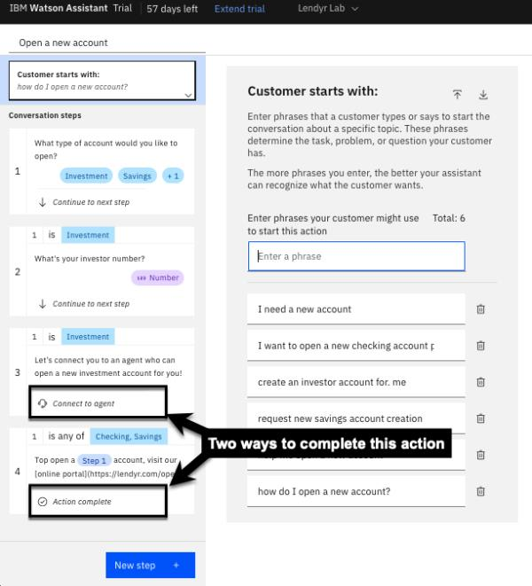

Now, return to the **Overview** tab of the **Analyze** page. As you scroll down, you can see a graph of action completion over a specified **date range (1)**. In the bottom right, note the table of actions with the lowest completion rates **(2)**. Next, click either the **View action completion (3)** button or the **Action completion** tab **(4)** in the left menu of the Analyze page to go to the Action completion dashboard:

The **Action Completion** dashboard is now displayed. The line graph (“How often are your recognized actions completed?”) shows % complete; click on the # **button** (or **Volume chart**, as shown below), to switch to the volume bar graph:

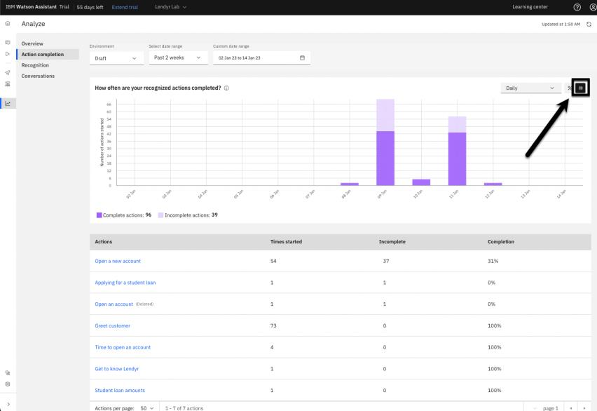

Take a moment to understand your screen (as shown above) – both the bar graph and the more detailed table below it. This view shows how many times actions were started by the end user, and how many times they were completed, versus not completed. (Your numbers will look different based upon how many times you have been engaging your assistant, what questions you asked, and whether you completed the conversation each time.)

Click an action to see the detailed action completion data. Most likely, your **Open a new account** action has the most data (as can also be seen on the screenshot above). Go ahead and click on it, which will take you to the screen below.

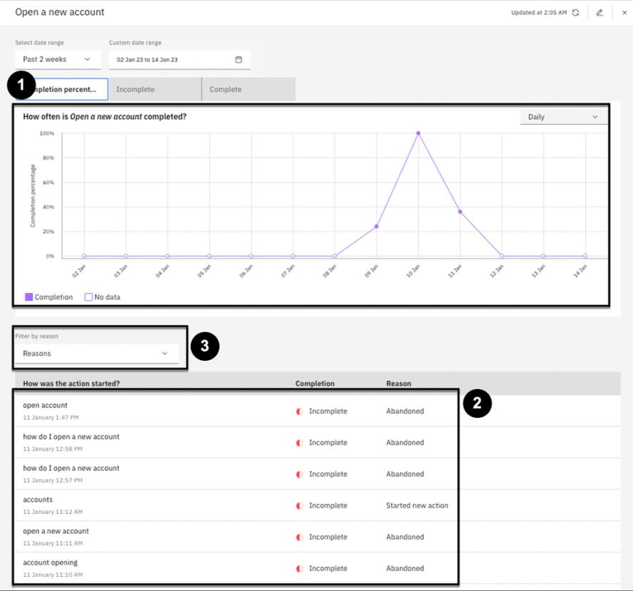

Again, take a moment to understand what is displayed above. There’s a graph showing **Completion percentages (1).** There’s also a list—or a log—of all the instances showing how your **action was started (2).** This log gives you the customer's phrase, the date and time, the completion status, and why it was completed or not. This is powerful information for a product manager or a builder! But there are even more insights to be gleaned. ager, imagine that you need to understand why an action was abandoned. Click on **Filter by reason (3),** and select “Incomplete: Abandoned:”

Now, your list of actions is filtered by **Incomplete: Abandoned (1).** Next, you would want to understand what happened exactly during a given interaction. Click on one of your **incomplete and abandoned actions (2)** and see the full **conversation history (3).** Displayed are the date and time of the interaction, its duration, the number of end-user requests, how many of these requests were recognized, and the full flow, including the conversation's conclusion.
An action is incomplete when an end user does any of the following before reaching a final step:
   • Escalates to a live agent
   • Starts a new action
   • Gets stuck on a step
   • Abandons the action (without starting a new action)

You can learn more about action completions [here](https://us-south.assistant.watson.cloud.ibm.com/docs/watson-assistant?topic=watson-assistant-analytics-overview#completion)

Next, click on the **Incomplete (4)** tab to see the following view:

> Some browsers prevent you from scrolling up with an open conversation history window. If so, close it by clicking the x in the upper-right corner of its **popup window (3)** in the image above.

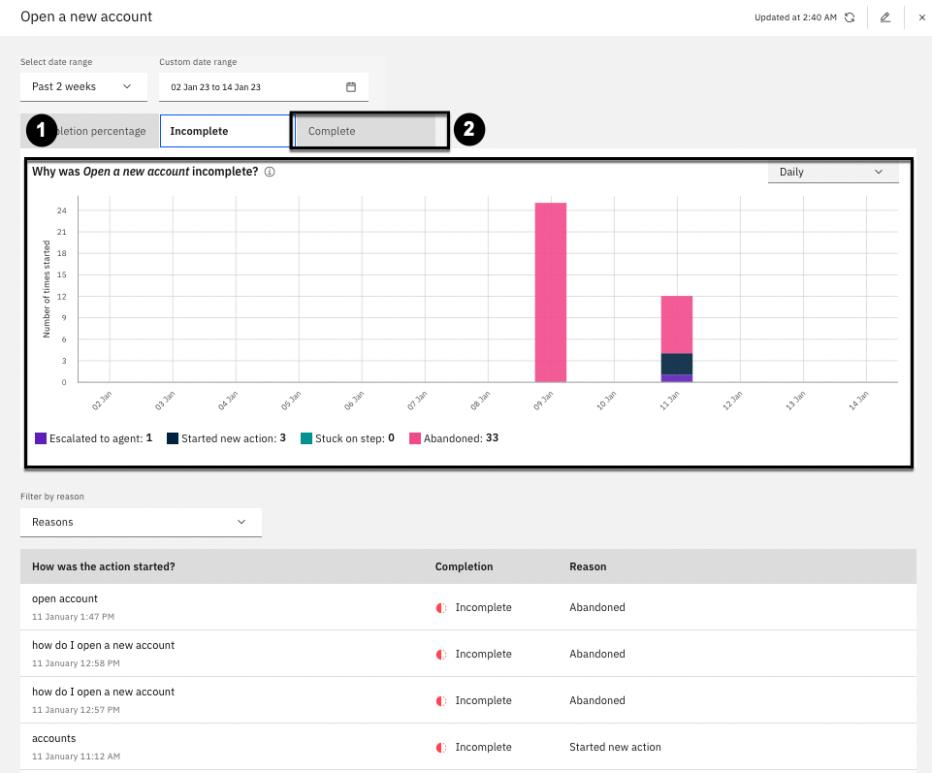

Note that the graph above **(1)** now displays the reasons why your actions were not completed. In the example above, most actions were abandoned, followed by starting a different action, and thirdly due to escalations to a live agent. Note that not a single interaction resulted in an end user being stuck on a step. Next, click on the **Complete (2)** tab.

Note how the **Complete** tab allows you to understand whether an action completes in-assistant or by handing off to a live agent:

Click on the **“x”** button in the upper right to return to the Action completion dashboard.

### Recognition

Recognition measures how often your assistant successfully funnels a user into an action.

Click on the **Overview (1)** tab to return to the Analyze Overview dashboard (shown below), then click on the **Recognition (2)** tab in the middle of the screen. The graph updates to show the average rate of recognition, which is **98% (3)** in the example displayed (yours may be different).

> Note: The Recognition tab is not available in the Lite plan of watsonx Assistant. It is only available in the Plus Trial, Trial, and Enterprise plans.

To get more detail, click on **View unrecognized requests (4)** to review the requests that are not being recognized by the assistant, so that you can create new actions that address questions and issues that aren't being answered.

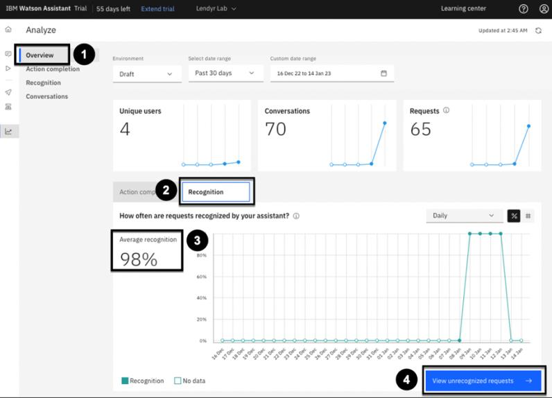

### Clustering of unrecognized requests

When you click **View unrecognized requests** from the Overview tab, it opens the **Recognition** tab, shown below. Your **Recognition** tab will look similar to the image below if you do not have enough conversation data to generate groups of recommendations:

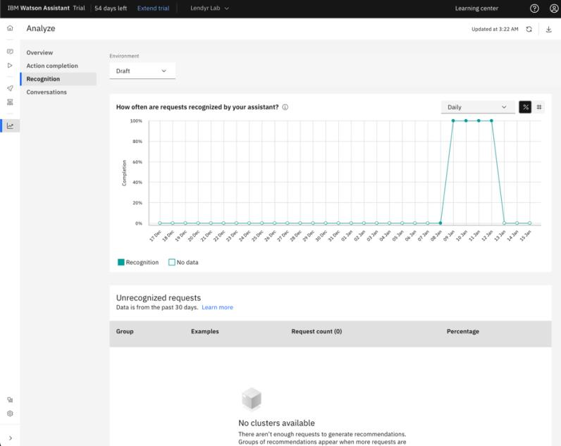

This tab allows you to see groups of unrecognized requests. If you had enough conversation data to generate groups of unrecognized requests, your **Recognition** tab might look like the image below, which is a list of recommendations for new actions, or updates to existing actions:

These recommendations are created with intelligent clustering algorithms, and let you quickly identify example phrases that should be added to an existing action or that could form the foundation of a new action.

Clustering of unrecognized requests is one of watsonx Assistant’s many out-of-the-box artificial intelligence features, which make it significantly easier for non-technical teams to **maintain** and **scale** virtual assistants.

### Why do action completion and recognition matter?

In late 2021, IBM launched a new watsonx Assistant experience that centers the build experience around Actions, with the goal to empower builders, developers, and product managers to work on virtual assistants from build to deployment in a way that is intuitive, frictionless, and fast.

After an assistant is deployed, a healthy lifecycle for a virtual assistant includes continuous improvement. Just as the build interface evolved to make creating an assistant easier, the **Analyze** page contains these built-in analytics features that present builders and product managers with data that is easy to interpret, and easy to act on.

With action completion and recognition, and the Conversations tab to see a full record of the assistant’s conversations with end users, you don’t need to guess what’s working and what isn’t.

**Action completion** allows you to:

• Understand how well end users are progressing through the action steps you have created
• Identify problem areas within actions
• Investigate why users are having issues where they might escalate to a live agent, start a new action, get stuck on a step, or stop the conversation

**Recognition** allows you to identify and understand unrecognized requests. Builders use this information to create new actions or add new example phrases that address questions and issues that aren't being answered by your assistant.

## Iterate with Analytics

Let’s walk through an example where an end user converses with your assistant. You will play the role of the builder or product manager, who reviews analytics data periodically to identify areas for improvement.

First, engage in the following conversation with your assistant. Remember to have this conversation on your Lendyr website or on the Preview page, and not the Preview panel within the Actions page, as it will not register for analysis purposes.

1. Hey I want to open a new account 4. How do I find my investor number?
2. IRA 5. Speak to a live agent
3. Investment I mean

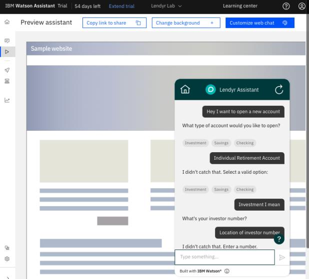

Now, return to watsonx Assistant’s **Analyze (1)** page. Open the **Conversations (2)** tab and see this conversation appear in the logs (your last conversation will be at the very top). Click it **(3)** to see it displayed on the right **(4)**:

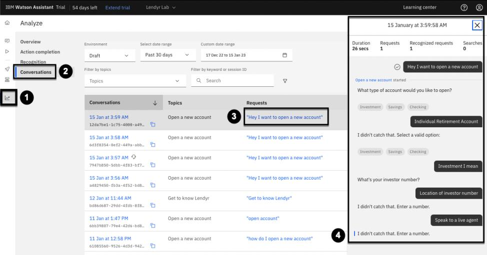

> Note that as watsonx Assistant’s AI learns from conversations, your interaction may look somewhat different than what is displayed above.

Imagine you are the builder or product manager, and you identify a few areas for improvement:

   • Individual Retirement Accounts (which most people would just abbreviate to IRAs) are a type of investment account. The assistant did not recognize this response as the end user’s attempt to select the investment account option.
   • The assistant does not recognize the “How do I find my investor number?” or “Location of investor number” request.
   • This conversation would have escalated to a live agent because the customer was not able to find the solution to their problem via the virtual assistant. However, note that you also do not have an action that recognizes the request to talk to an agent.

You can iterate on your assistant to address these areas for improvement. For example, add **IRA** and **individual retirement account** as synonyms to the **Investment** option in the **Open a new account** action. You can begin immediately from the current view, by clicking on the action **(5)**:

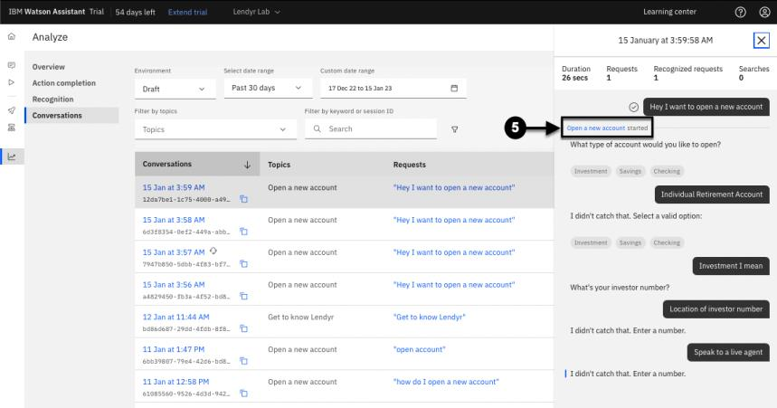

This will open the **Open a new account** action. Click on **Step 1 (1)**. This is the step that asks whether the end user needs to open an investment account. Click **Edit response (2)**:

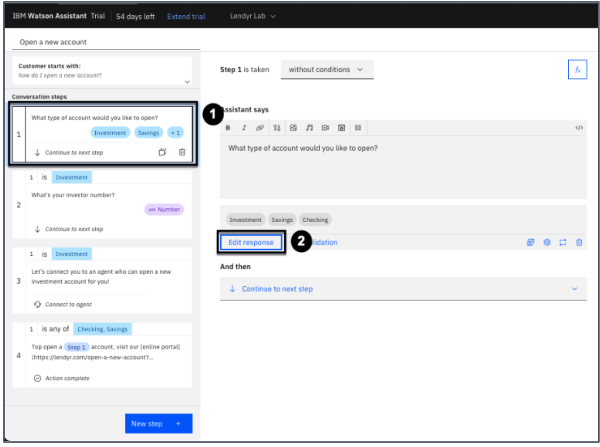

In the **Edit response** popup, click **Add synonyms** + (not shown), and then, as shown in the image below, add the appropriate synonyms to the **Investment option (1)**, then click **Apply (2)**:

> **Note**: Pay attention that you are adding the synonyms to the Investment option and not one of the other options, as your order of options may differ from the image below.

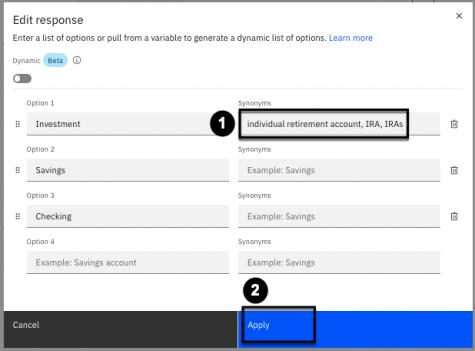

Now, try using the new synonyms. You can do this without leaving the action build window:

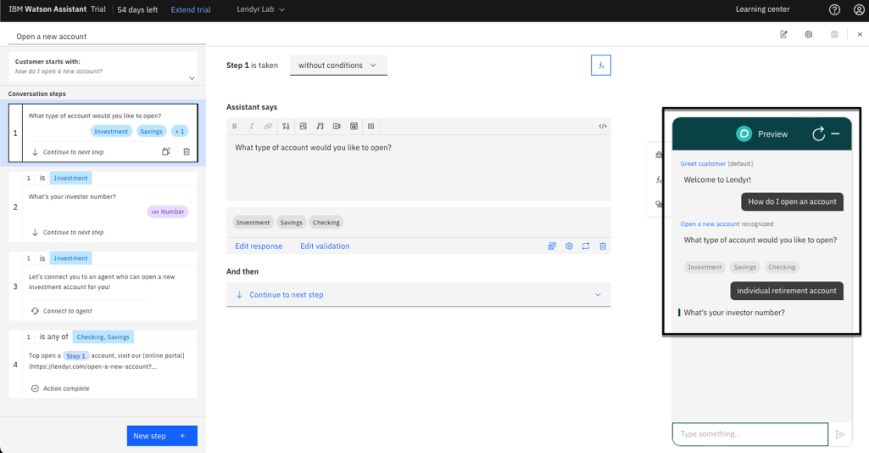

Next, create a brand-new action called **How do I find my investor number?** Add **location of investor number** as one of the additional phrases. Invent your own brief answer to the question, either text or image. (You can easily find stock image URLs using Google Images.)

Congratulations! You've reached the end of lab 104: Analytics.

Great work! That concludes this section of the lab. In the next section, you will learn about **Custom Extensions**, a core feature in watsonx Assistant that enables builders and developers to watsonx Assistant Lab Walkthrough Guide collaborate effectively to build and use no- or low-code integrations with third-party tools, like
CRM platforms, ticketing systems, databases, search engines, and more.

Interested in reading more about analytics? The watsonx Assistant team has a blog describing the latest and greatest of the product. Here are two interesting blog entries that are worth reading:

   • [IBM watsonx Assistant’s Analyze page: putting data to work](https://medium.com/ibm-watson/watson-assistants-analyze-page-putting-data-to-work-74c4f77afe6b)

   • [Getting started with the new IBM watsonx Assistant III: test and deploy](https://www.ibm.com/blogs/watson/2022/01/getting-started-with-the-new-watson-assistant-part-iii-test-and-deploy/)
