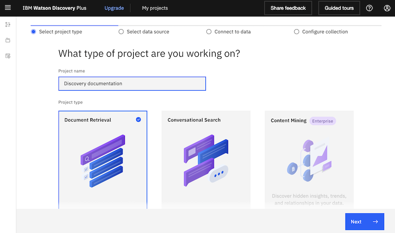
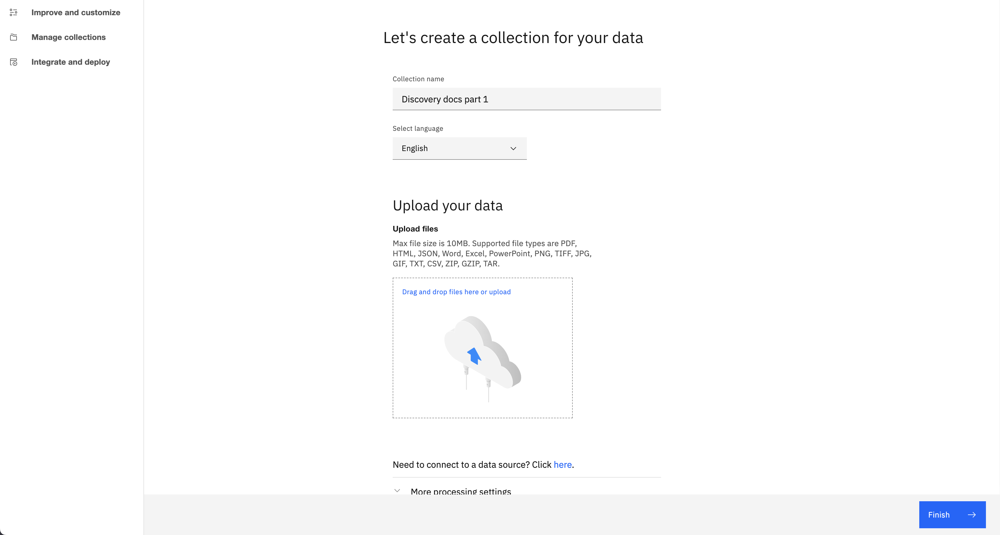
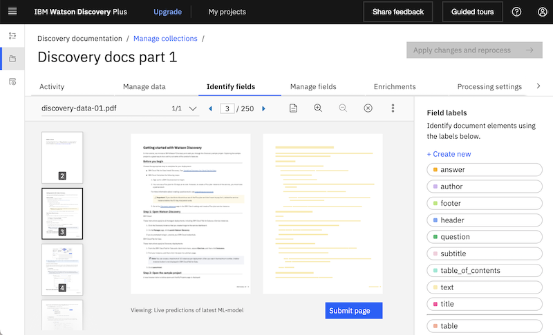
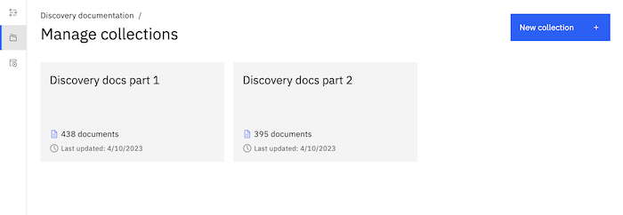
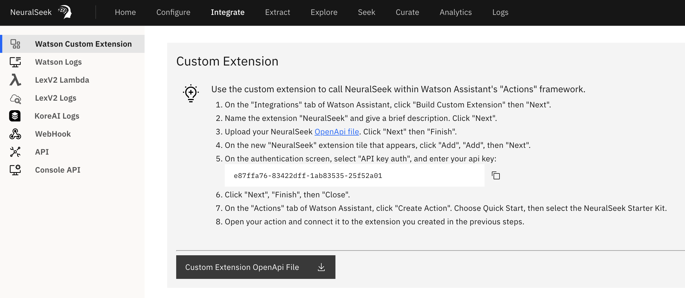
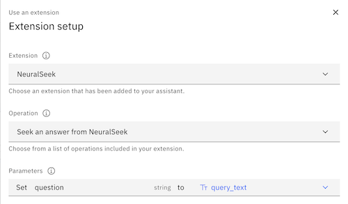
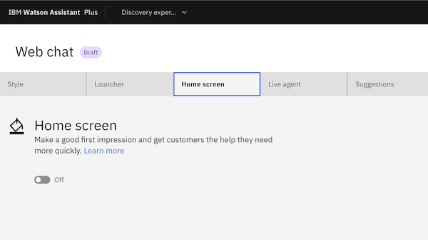
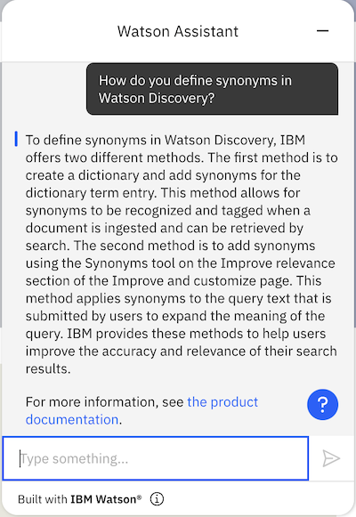

# 204: Deploy NeuralSeek with watsonx Assistant and Watson Discovery

In this tutorial, you will use the Watson Discovery, watsonx Assistant, and NeuralSeek services that are available from the IBM Cloud catalog to create a virtual assistant that can answer questions about Watson Discovery. The assistant will generate answers by using the existing Watson Discovery product documentation as its knowledge base.

By the time you finish the tutorial, you will understand how to:

* Create a Document Retrieval project in Discovery.
* Upload PDF documents to your project, and apply a user-trained Smart Document Understanding model to your PDFs.
* Connect your Discovery project to a NeuralSeek service instance. NeuralSeek is an AI-powered answer generation engine.
* Create an assistant in watsonx Assistant and apply a NeuralSeek integration to it.
* Add an action to your watsonx Assistant that connects to NeuralSeek for answers.
* Use your assistant to answer questions about Discovery.

## Prerequisites

The following steps assume that you already have an IBMid. If this is not the case, create an IBMid first.

Follow [this link](https://techzone.ibm.com/my/reservations/create/64e6866b41bf2a0017d986ad) to reserve a *Customer Care - GenAI* TechZone environment. This environment will provision watsonx Assistant, Watson Discovery, and NeuralSeek services that are required for this lab.

1. Select **Reserve Now** and **Practice / Self-Education**.
2. Enter ```watsonx Assistant L4``` in the **Purpose description** field.
3. Select *us-south* as your **Preferred Geography**.
4. Check the box to agree to the terms and conditions and click **Submit**.

You should get an email informing you that your environment is being provisioned. Shortly afterward, you should receive a second email informing you that your environment is ready:


5. Click **View My Reservations** and then click on your reserved enviroment.

At the bottom of this page, you will find links to the *Watson Discovery service instance page* and the *watsonx Assistant service instance page*. When these pages are mentioned in the lab below, you can navigate to them via these links (they will be different for your environment):


Alternatively, you can open the Navigation Menu in IBM Cloud, click **Resource List**, open the **AI / Machine Learning** menu, click on a service there, and click **View full details**. This is also how you can navigate to the *NeuralSeek Lite service instance page* (```...neuralseek-lite```).

6. Go to **Notifications** in IBM Cloud (the bell icon in the top-right) and accept the invitation to the TechZone environment by clicking **Join now**.

## Step 1: Get the product documentation

To use the Discovery product documentation as our knowledge base, we will download the product documentation as two PDF files. The documentation has been split across two files so that it can be enriched faster in Discovery.

Go [here](https://github.com/ibm-build-lab/VAD-VAR-Workshop/blob/main/static/watsonx-assistant/discovery-data-1.pdf) and click **Download raw file** to download *discovery-data-1.pdf*.

Go [here](https://github.com/ibm-build-lab/VAD-VAR-Workshop/blob/main/static/watsonx-assistant/discovery-data-2.pdf) and click **Download raw file** to download *discovery-data-2.pdf*.

## Step 2: Create a Document Retrieval project

Now that you have the latest copy of the product documentation, add it to a Discovery project as your data source.

In Discovery, you will create a *Document Retrieval* project type. Documents that you add to a project of this type are automatically enriched in the following ways:

* Entities, such as proper nouns, are identified and tagged.
* Parts of speech are identified and tagged.

This tagged information is used later when a natural language phrase is submitted as a search query to return an accurate response.

1. Open a new web browser tab and navigate to IBM Cloud.
2. From the *Watson Discovery service instance page* in IBM Cloud, click **Launch Watson Discovery**.
3. From the *My Projects* page, click **New Project**.
4. Name your project ```Discovery documentation```, and then click the **Document Retrieval** tile.



5. Click **Next**.

You'll configure the data source for the project in the next step.

## Step 3: Upload data to the project

Add the documentation PDFs to your Discovery project.



1. Name the collection *Discovery docs part 1*.
2. Click **Drag and drop files here or upload**, and then browse to add the first PDF file that you created earlier.
3. Click **Finish**.

   Your file is processed as it is added to the collection.

4. From the navigation panel, click **Manage collections**, and then click **New collection**.


5. Repeat the previous steps to add the second PDF file as a collection named *Discovery docs part 2*.

After the data is uploaded, it is processed and indexed by Discovery. While the data is being processed, let's create our virtual assistant.

## Step 4: Create an assistant

For this tutorial, you will create an assistant with a single action.

1. Open a new web browser tab and navigate to IBM Cloud.

2. From the *watsonx Assistant service instance page* in IBM Cloud, click **Launch watsonx Assistant**.

   The watsonx Assistant product user interface is displayed where you can create your first assistant.

3. Add ```Discovery expert``` as the assistant name, and then click **Next**.
4. If you are asked to share information about you and your assistant, complete the required fields, and then click **Next**.

   When you create an assistant, a web chat application is created for you automatically.

5. Click **Create** to create the assistant and the corresponding web chat app.

After a congratulatory message, the home page for your new assistant is displayed.


Before we add anything to our new assistant, let's check on the status of our data.

## Step 5: Prepare your data for retrieval

To improve the retrievability of the information in your PDF files, you will split the PDF files into many smaller documents. To do so, you will first teach Discovery about the structure of your PDF files, so it understands how subsections are formatted and can split the document by subsection.

1. Return to the web browser tab where your Discovery project is displayed.

   The *Improve and customize* page for the last PDF file that you uploaded is displayed.

2. From the *Improvement tools* panel, expand *Define structure*, and then click **New fields**.


3. Choose the *Discovery docs part 1* collection.

   The Identify fields tab is displayed, where you can choose the type of Smart Document Understanding model that you want to use.

4. Click **User-trained models**, and then click **Submit**.


5. Click **Apply changes and reprocess**.

   After some processing occurs, a representation of the document is displayed in the Smart Document Understanding tool. The tool shows you a view of the original document along with a representation of the document, where the text is replaced by blocks. The blocks represent field types.

   Initially, the blocks are labeled as ```text``` because all of the document content is considered to be standard text by default, and is indexed in the ```text``` field.

   We want to label all first- and second-level headings as subtitles instead of text.

6. From the thumbnails view, click the thumbnail for the first full-text page from the document to open the first page with real content.



7. To annotate the document, click the ```subtitle``` label from the *Field* labels list. Then, click each block in the representation of the PDF page that represents a heading to change its label from ```text``` to ```subtitle```.


8. After every subtitle on the current page is labeled, click **Submit page**.

   The next page of the PDF file is displayed.


9. Repeat this process until the tool is able to label the headings correctly for you in a consistent way when new pages are loaded into the tool. At that point, click **Apply changes and reprocess**.

   Congratulations! You have successfully trained a Smart Document Understanding (SDU) model that can recognize subtitles in your documents. Let's apply the same model to the other PDF file that you added to the project.

10. From the SDU editor toolbar, click the *Export model* icon (down arrow), and then click **Export**.
11. Save the ```.sdumodel``` file to your system in a location where you can access it again shortly.
12. From the navigation panel, click **Manage collections**, and then open the *Discovery docs part 2* collection.
13. Open the *Identify fields* tab.
14. Click **User-trained models**, and then click **Submit**.
15. Click **Apply changes and reprocess**.
16. From the SDU editor toolbar, click the *Import model* icon (up arrow), and then click **Upload**.
17. Select the ```.sdumodel``` file that you downloaded earlier, and then click **Select model**.
18. Click **Apply changes and reprocess** to apply the same SDU model to the first collection.

Discovery reprocesses the data in its index to identify subtitles in the documents. While the data is being reprocessed, let's create our answer generator.

## Step 6: Create a NeuralSeek service instance

You can use a search extension in watsonx Assistant to connect your assistant directly to Discovery and return passages straight from the data source. However, we will add the NeuralSeek service between watsonx Assistant and Discovery in this tutorial. NeuralSeek retrieves the passages from Discovery and then converts them into answers that sound more conversational.

1. Open a new web browser tab and navigate to IBM Cloud.
2. From the *NeuralSeek Lite service instance page* in IBM Cloud, click **Launch NeuralSeek**.
3. Click the **Configure** tab and click the **Show Advanced Options** button.
4. Under **KnowledgeBase Connection**:
   * Set **KnowledgeBase Language** to English.
   * Specify the **Discovery Service URL** and **Discovery API Key** (both found on the **Watson Discovery service instance page**).
   * Specify the **Discovery Project ID** (in Watson Discovery, click **Integrate and deploy** from the navigation panel, open the *API Information* page, and copy the *Project ID*).
5. Under **KnowledgeBase Tuning**:
   * Set **Document Score Range** to 50%.
   * Set **Snippet size** to 400 characters.
6. Under **Company / Organization Preferences**, provide the name of your company.
7. Under **Governance & Guardrails**, set **Minimum Confidence %** to 30%.
8. Click **Save**.

## Step 7: Split your PDF documents

Now that subtitles are indexed properly in Discovery, use them as the basis for splitting the PDF files into many smaller documents.

1. Return to the web browser tab where your Discovery project is displayed.
2. Open the **Manage fields** tab for the current collection.
3. Under *Improve query results by splitting your documents*, click **Split document +**.
4. In the *Split document on each occurrence of* field, choose **subtitle**, and then click **Apply changes and reprocess**.


4. From the navigation panel, click **Manage collections**, and then open the other collection.
5. Go to the *Manage fields* page, and then choose **subtitle** in the *Split document on each occurrence of* field.
6. Click **Apply changes and reprocess**.

The collections start to be reprocessed. After reindexing is finished, instead of containing one document each, the collections will contain several hundred documents each.



While the index is being rebuilt, let's get our assistant ready.

## Step 8: Add an extension to your assistant

Connect your assistant to your NeuralSeek service instance.

1. From your NeuralSeek tab, click the *Integrate* tab and follow the instructions to set up the NeuralSeek custom extension for your assistant. When you finish step 6 of the procedure in NeuralSeek, continue to next step of the procedure here.



2. From the watsonx Assistant navigation panel, click **Actions**, and then click **Create action +**.
3. Choose **Quick start from templates**, and then scroll to find and click the **NeuralSeek Starter kit**.


4. Click **Select this starter kit**, and then click **Add templates**.
5. Click to open the *NeuralSeek search* action that you just added to the assistant.
6. Add the following user example queries:

   ```What Watson Discovery project types are available and what do they do?```

   ```What external data sources are supported by Watson Discovery?```

   ```Can I add a custom dictionary to Watson Discovery?```

   ```How do I use the Content Mining application?```

   ```When should I add query expansions to my project?```

   ```Which file types support Smart Document Understanding models?```

   ```Can I enable optical character recognition for all file types?```

   ```Does my data have to be written in English?```

watsonx Assistant uses the sample questions to recognize the types of user questions it should route to this action.

7. Click *Step 3* to open it for editing.

   In the *And then* section, click **Edit extension**.

   Set the variables as shown below (```query_text``` is under *Session variables*):

   

   Click **Apply**.

8. Click *Step 6* to open it for editing.

   This step shows a link that users can click to get more information. We want this link to go directly to the product documentation on the IBM Cloud Docs site.

   Change the hypertext reference in the anchor HTML element to contain the following URL:

   ```<a href="https://cloud.ibm.com/docs/discovery-data?topic=discovery-data-about" target="_blank">```


9. Save your changes, and then click the X to close the step.

Congratulations! You successfully created an action that recognizes questions about Discovery, and gets its answers from the connected NeuralSeek extension.

## Step 9: Configure the web chat for your assistant

To preview your assistant, you will use the built-in web chat as the chat user interface for interacting with the assistant.

1. From the navigation panel in watsonx Assistant, click **Environments**.

   The draft environment is displayed. It shows that a web chat is connected to your assistant. You also can see that the web chat is connected to the NeuralSeek extension.


2. Click the *Web chat* tile to edit the web chat.

   We don't want to add multiple starter questions, so we're going to turn off the home screen for the web chat. Click the **Home screen** tab. Set the switcher to **Off**, and then click **Save and exit**.



You're ready to preview your assistant!

## Step 10: Preview the assistant

To preview an assistant that connects to data that is stored in Discovery, you must preview the assistant from the *Environments* page. When you preview the web chat independently, the assistant is not able to retrieve data from Discovery; it needs the environment resources to be able to connect to Discovery.

1. From the *Environments* page, click **Preview this environment**.

   A sample web page is displayed that includes a chat icon.

2. Click the chat icon to open the web chat window.


3. Enter the following text question:

   ```What project types are available?```

   The correct answer is returned and it includes a link to the product documentation.


4. Submit a question that wasn't used as a query example when you created the action.

   ```How do you define synonyms in Watson Discovery?```

   A detailed answer is returned.



5. Optionally ask the assistant other questions.

   If the assistant doesn't know the answer, reword the question to include “in Watson Discovery” to make it clearer that you are asking about how something works in Discovery specifically.

Congratulations! You successfully created an assistant that can answer questions about Discovery by retrieving information from the product documentation by way of the NeuralSeek service.

## Summary

In this tutorial, you created a Watson Discovery Document Retrieval project with uploaded PDF files that contain the Discovery product documentation. Separately, you created a watsonx Assistant virtual assistant with a single action that can recognize user questions about Discovery. You added a custom extension to your assistant that connects to a third-party service called NeuralSeek that gets the correct answer from Discovery and rewords the response. Finally, you tested your virtual assistant by asking a question and getting an accurate and well-written response.

