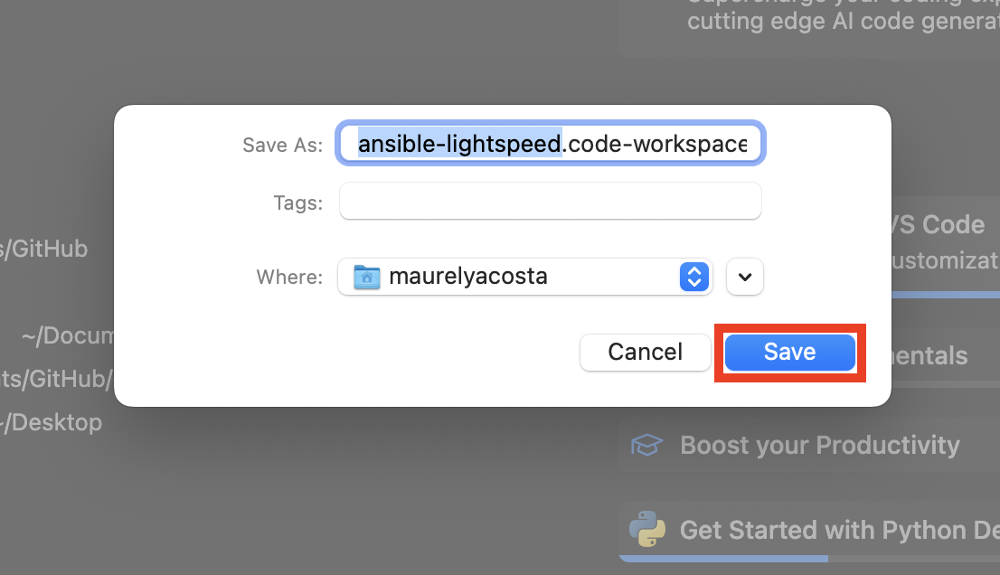

# 104: Asistente de código IBM watsonx

## Objetivo

El objetivo de este laboratorio es ayudarle a explorar/familiarizarse con algunas capacidades clave disponibles en IBM watsonx Code Assistant (WCA).

## Introducción

IBM watsonx Code Assistant utiliza un modelo de base gestionado por el equipo de IBM Research y formado en [Ansible Galaxy](https://galaxy.ansible.com/), [GitHub](https://github.com/) y otras fuentes de datos abiertas.

El modelo ofrece acceso a recomendaciones de contenido de Ansible mediante el uso de descripciones de automatización en lenguaje natural.

El modelo está disponible a través de una extensión de Visual Studio Code (VS Code) llamada **Ansible Lightspeed** with [IBM watsonx Code Assistant](https://www.ibm.com/products/watsonx-code-assistant).

## Cómo obtener una recomendación de Ansible Lightspeed

1.  Abra o cree un nuevo espacio de trabajo.

    a. Puede crear un nuevo espacio de trabajo seleccionando **Archivo > Guardar espacio de trabajo como**...

    

    b. Nombre el espacio de trabajo `ansible-lightspeed`. A continuación, haga clic en el botón **Guardar**.

    

2.  Crea un nuevo playbook de Ansible creando un nuevo archivo llamado `lightspeed-demo.yml`.

    a. Seleccione **Archivo > Nuevo archivo de texto**

    

    b. Haga clic en **Seleccionar un idioma** en el nuevo archivo y aparecerá un menú desplegable, a continuación, seleccione **Ansible**

    

    c. Guarde el archivo y nómbrelo `lightspeed-demo` con una extensión YAML (`.yml` o `.yaml`)

3.  En la esquina inferior derecha, debería ver **Lightspeed**. Ansible Lightspeed está listo para que escribas playbooks.

    **Nota:** *Compruebe que su entorno Python también está seleccionado.*

    

4.  Añade una nueva tarea Ansible con un nombre en inglés sencillo que diga `Print debug message that says "Hello World!"`.

    Una vez pulsada la tecla *Intro*, la sugerencia aparecerá como texto difuminado.

    Lightspeed recomendará código basado en el texto que has escrito en el campo nombre en la sección playbook.

    

5.  Puede aceptar la recomendación pulsando la tecla *Tab*.

    

6.  Añadamos una segunda tarea a nuestro Playbook. Escribe una frase en un nuevo campo de `name` que diga `Print today's date and time`.

    

7.  Pulse la tecla *Esc* para rechazar la recomendación. La recomendación difuminada debería desaparecer.

8.  Puede ver lo sencillo que es aceptar y rechazar una recomendación. Intentemos añadir una tarea más avanzada. Crea una nueva tarea con esta oracíon `HTTP GET request to the url https://bam-api.res.ibm.com/v1/models with bearer token with variable name bam_bearer_token`.

    

9.  Pulse la tecla *Intro* y acepte la recomendación pulsando la tecla *Tabulador*.

    

10. Puedes copiar y pegar tu token de acceso [BAM](https://bam.res.ibm.com/) en lugar del `{{ bam_bearer_token }}` o puedes recuperar tu token de acceso de tu entorno local y asignarlo a una variable en tu ansible playbook añadiendo el siguiente código:

    ```yml
      vars:
        bam_bearer_token: "{{ lookup('env','bam_bearer_token') }}"
    ```

    

11. Añada otra tarea con la frase `Print the result`. Pulse la tecla *Intro* y acepte la recomendación pulsando la tecla *Tabulador*.

    

    **Nota**: *Lightspeed también ofrece recomendaciones sobre el código fuente en la ventana de depuración situada junto al terminal. Muestra más información si la amplías.*

    

12. Puedes ejecutar tu Ansible Playbook con el siguiente comando de terminal. Debería ver cómo se ejecutan las tareas que hemos creado.

    ```bash
    ansible-playbook lightspeed-demo.yml
    ```

    

    Puede seguir experimentando con la creación de nuevas tareas. Si no obtiene una recomendación que se ajuste a la intención del nombre de su tarea, puede reformular su enunciado para proporcionar más información sobre lo que desea y obtener mejores recomendaciones.

    Las acciones que se llevan a cabo cuando se proporciona una recomendación influyen en el proceso de formación del modelo.

    Si se acepta una recomendación y luego se realizan ediciones adicionales, el acto de cambiar la recomendación por otra cosa se considerará una modificación de la recomendación. Esto indicará a Ansible y a IBM watsonx Code Assistant que la recomendación requería una edición adicional para satisfacer el uso previsto. Esta información se utilizará como contexto en el entrenamiento del modelo para indicaciones similares en el futuro.
