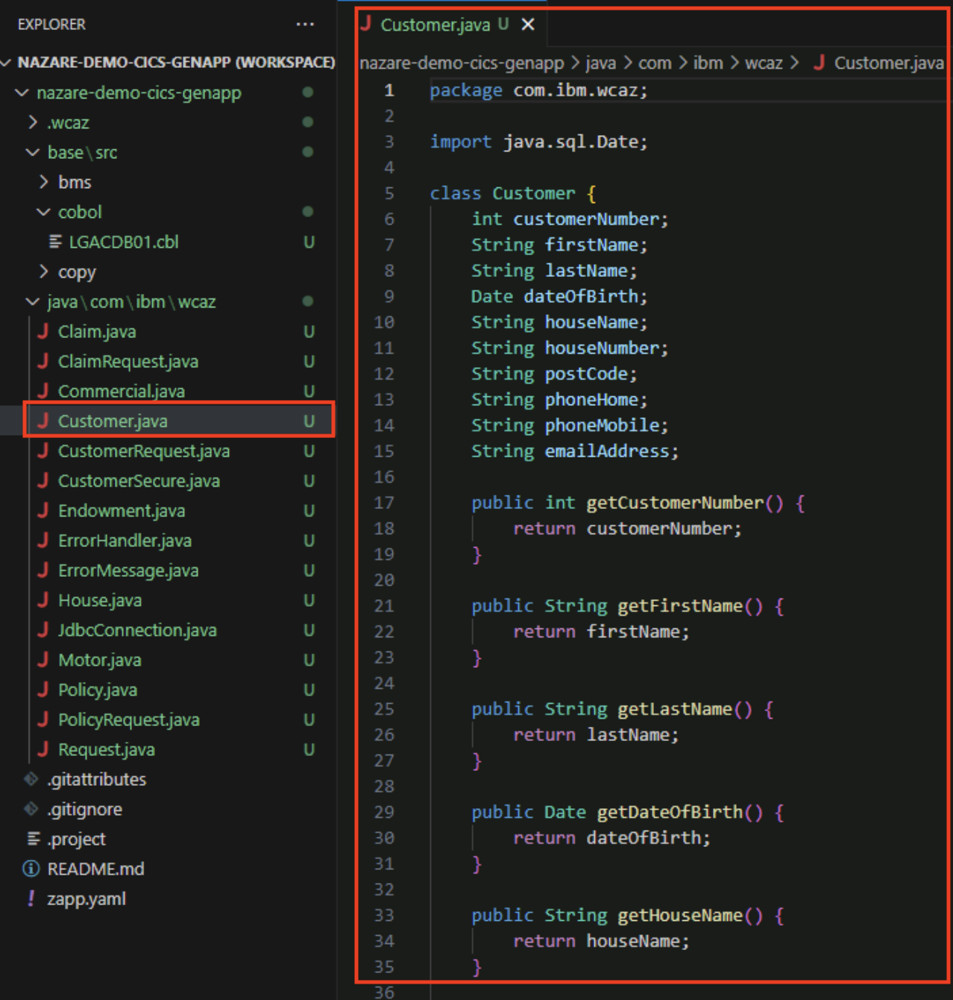
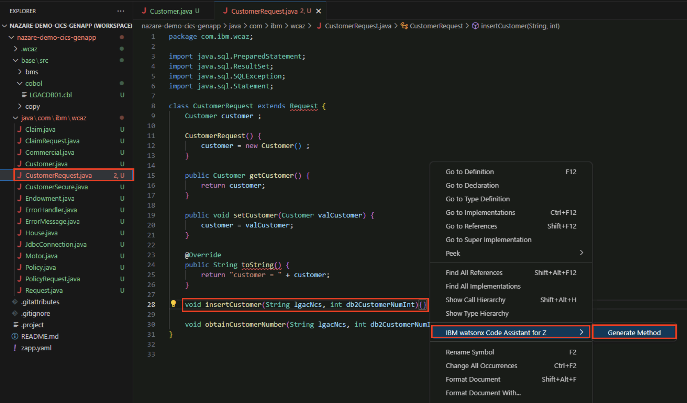
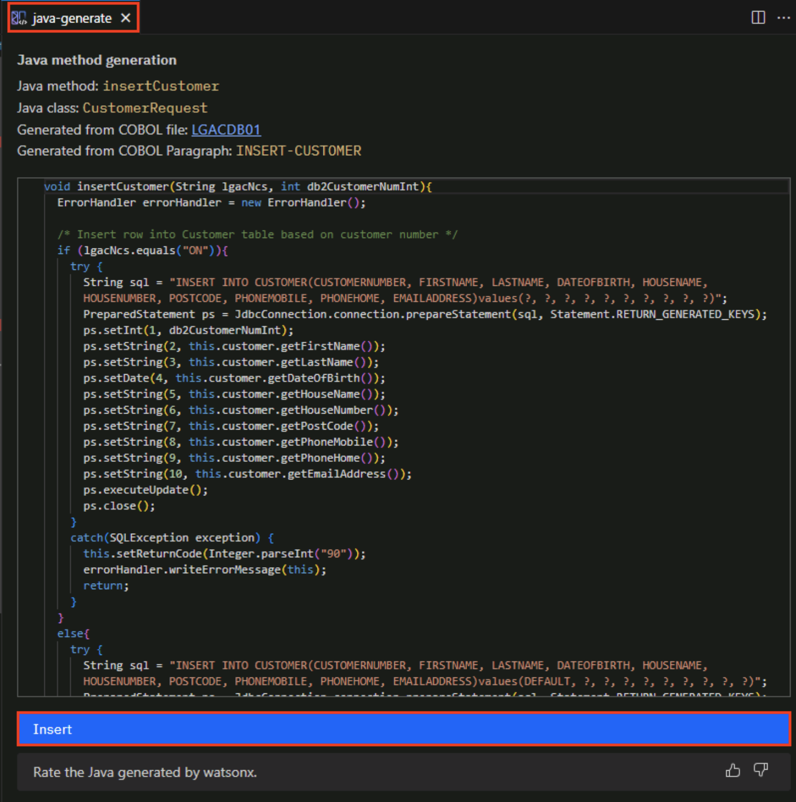
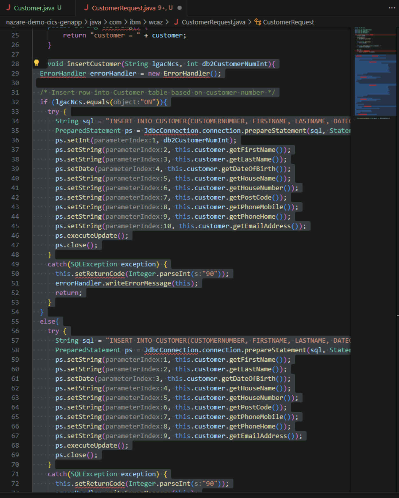

<QuizAlert text='Heads Up! Quiz material will be flagged like this!' />

# 114: IBM watsonx Code Assistant (WCA) for Z Transform COBOL Code to Java

### Goal

The goal of this lab is to focus on the **Transform** phase of the mainframe application modernization lifecycle for z/OS applications. Converting the code from COBOL to Java harnesses the generative AI capabilities that are part of the Code Assistant for Z to generate Java code from the refactored COBOL code. The Java code produced is a well architected object-oriented Java that has been optimized for IBM Z runtimes and qualities of service with the required interoperability, integration, and standardization.

## Transform COBOL Code to Java

1. Click the Windows **Start** button (the Microsoft Windows logo in the bottom left corner of the demo screen), and select the **Visual Studio Code** integrated development environment (IDE).

  

2. Expand the **New: IBM watsonx Code Assistant for Z in Z Open Editor** twistie, and select **Enable the IBM watsonx Code Assistant for Z integration with Z Open Editor (requires an account)** checkbox, if not selected already. Then close the **Welcome to Z Open Editor** window by clicking the **X** at the top of the tab’s name.

  

3. In the **Explorer** panel on the left, expand **IBM WATSONX CODE ASSISTANT FOR Z** at the bottom. You will see a warning that the IDE is missing an API key. Click the **Missing watsonx API key** warning (the yellow text).

  

4. The **Enter watsonx API key (Press ‘Enter’ to confirm or ‘Escape’ to cancel)** box appears at the top of the IDE - Visual Studio Code screen. Enter `ABCDEFGH` and press the **Enter** key on your keyboard.

  > **Note:** **ABCDEFGH** is a fake API only for this demo. In a real environment, a real API key must be used.

5. In the **Explorer** panel on the left, expand the **NAZARE-DEMO-CICS-GENAPP (WORKSPACE)** twistie, and click **LGACDB01.cbl** under the cobol section. A new tab opens to the right displaying the COBOL code. Scroll down to **line 151** to view the **INSERT CUSTOMER** part of the code. You will notice this is the COBOL code that was exported from the workbook from the **Refactor** phase of the previous lab.

  

6. In the **Explorer** panel on the left, right-click on **LGACDB01.cbl**, and select on **Import COBOL program**. **Note:** The COBOL program is imported to **IBM WATSONX CODE ASSISTANT FOR Z** as **base\LGACDB01.cbl**.

  

7. In the **Explorer** panel, under **IBM WATSONX CODE ASSISTANT FOR Z**, expand the **base\LGACDB01.cbl** twistie. You will see two entries: **Generate Java Identifiers** & **Generate Java Methods**. Click **Generate Java Identifiers**.

  

8. A **Generate Java Classes** input bar appears at the top middle of the IDE - Visual Studio Code screen. Enter `java` as the relative directory within the workspace to generate the java classes, and press the **Enter** key on your keyboard.

  

9. A new input bar opens in the same location. Enter `com.ibm.wcaz` as the Java package name used by the generated Java classes, and press the **Enter** key on your keyboard.

  

10. A new **Java identifiers** tab appears on the right-hand side of the window. Click the twisties to expand the **LGACDB01** and **CUSTOMER** artifacts. You can see the variables that are used in the **LGACDB01** and **CUSTOMER** artifacts. Next, click on **Generate Java classes**.

  

  In the **Explorer** panel, you will notice the newly generated java classes under the **java\com\ibm\wcaz** directory.

  

11. Double-click on the **Customer.java** class to open it. **Customer.java** opens in a new tab. In the **Customer.java** class, you can see the getter, setters, and variable overrides (You might have to scroll to see all of the code).

  

12. Now double-click on the **CustomerRequest.java** class to open it. **CustomerRequest.java** opens in a new tab. At the bottom of **CustomerRequest.java** (You might have to scroll to see all of the code), right click on the **insertCustomer** method name. Then click **IBM Watsonx Code Assistantfor Z** and select **Generate Method**.

  

13. A new **java-generate** tab opens to the right. Click **Insert** at the bottom right of the **java-generate** tab to insert the Java method into the **CustomerRequest.java** code file.

  

  Notice that the Java method details are added to **CustomerRequest.java** class file in the **insertCustomer** method.

  

You have successfully completed the **Transform** phase of the mainframe application modernization lifecycle. In this lab:

  <QuizAlert text='There is a quiz question on the Transform phase.' />

  - You used the **LGACDB01** workbook that you exported in the **Refactor** phase to insert customer functionality

  - You imported this workbook using IBM watsonx Code Assistant for z

  - You generated Java classes and Java methods

### Congratulations, you've reached the end of lab 114 using IBM watsonx Code Assistant (WCA) for Z Transform COBOL Code to Java.

You can now **[complete the quiz](https://learn.ibm.com/course/view.php?id=16039)** for IBM watsonx Code Assistant for Z for Technical Sales Level 3 Quiz.

Once the quiz is completed, click, **[IBM watsonx Code Assistant for Z](/watsonx/codeassistant/z)** to go to the IBM watsonx Code Assistant for Z home page.
