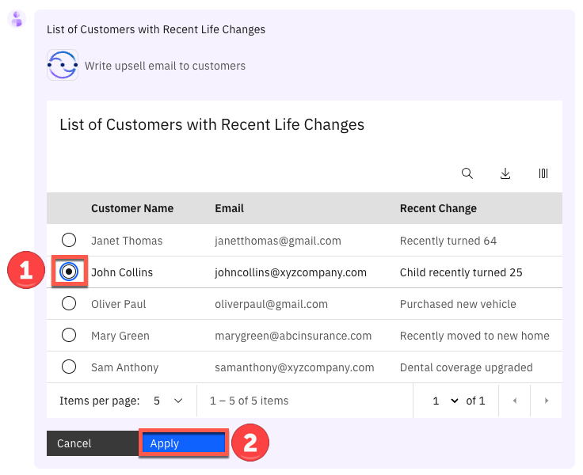
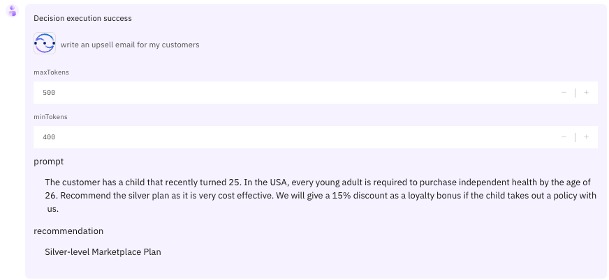
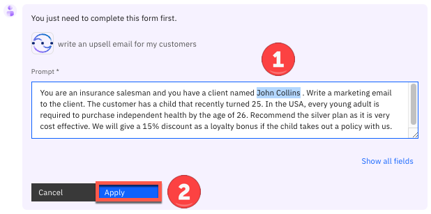
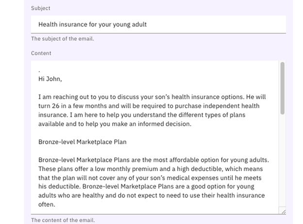

# 101: Potenciar la productividad de las ventas

Por lo general, los agentes de ventas de seguros pasan su tiempo en muchas tareas mientras cambian constantemente de contexto entre varias aplicaciones para realizar sus trabajos. Una gran parte del tiempo de cualquier vendedor de seguros debe ser empleado en el servicio de los clientes existentes, pero una parte importante de ser un gran agente de ventas es encontrar nuevos negocios y construir un gasoducto.

Antes de watsonx Orchestrate, los agentes de esta oficina de seguros dedicaron unas horas por semana a enviar correos electrónicos de prospección para oportunidades de venta cruzada y venta cruzada, así como la construcción de un gasoducto. Para ello, un vendedor de seguros típico:

1.  Busque en Salesforce clientes que cumplan determinados criterios de venta cruzada.
2.  Determinar los mejores productos de venta cruzada para ofrecer a cada cliente.
3.  Enviar un correo electrónico personalizado a cada cliente.

Desafortunadamente, los agentes de esta oficina se enfrentan a una serie de desafíos que les impiden actuar en su mejor momento:

*   La búsqueda efectiva de su sistema de Salesforce para las oportunidades de ventas requiere mucho tiempo y requiere mucha habilidad ... habilidades que no todo el mundo en el equipo posee.
*   La coincidencia de las circunstancias de los clientes con los productos más óptimos y competitivos requiere mucho tiempo y requiere un conocimiento experto del producto. La información sobre productos, clientes y políticas se difunde en varios sistemas y hojas de cálculo.
*   Se utilizan varios sistemas y aplicaciones; toma tiempo cambiar entre estos sistemas para encontrar la información necesaria. Los datos se copian y se pegan entre aplicaciones e inevitablemente se cometen errores.
*   No hay tiempo para crear un correo electrónico personalizado para cada cliente por lo que en su lugar utilizan plantillas, pero saben que los correos electrónicos que se producen de esta manera a menudo son ignorados por sus clientes.

Veamos cómo se puede hacer este trabajo de prospección de manera más efectiva con watsonx Orchestrate.

*   Utilizaremos una interfaz de chat para extraer datos de SalesForce que aprovecha una búsqueda preconfigurada para encontrar clientes con eventos de vida recientes.
*   Emparejaremos a estos clientes con los productos más adecuados y competitivos utilizando una automatización que representa el conocimiento empresarial digitalizado de un experto en productos.
*   En lugar de utilizar una plantilla de correo electrónico, alimentaremos la información del cliente y los detalles de los productos en un modelo de IA generativo. Este modelo elaborará un correo electrónico de prospección que un humano en el bucle puede revisar y editar con cualquier información específica para este cliente.
*   Por último, automatizaremos la creación y el envío del correo electrónico, pero no tendremos que abrir Outlook y copiar sobre las direcciones de correo electrónico y la información del producto.

Vamos a empezar.

## Recuperar una lista de clientes de Salesforce

Una tarea común para un agente de seguros es buscar periódicamente su sistema de Salesforce para clientes con eventos de vida recientes que sean buenos candidatos para recibir ofertas de venta cruzada/venta cruzada. Por ejemplo, el nacimiento de un niño trae el foco a la cobertura de seguro de vida, y así sucesivamente. Tradicionalmente, esta tarea implica la creación de informes personalizados de Salesforce y su descarga para una revisión manual y fuera de línea por un agente de ventas.

¿Cómo se juega esto con una compañía de seguros usando watsonx Orchestrate? El agente invoca la búsqueda de Salesforce utilizando la frase de lenguaje natural simple: "Escriba un correo electrónico de upsell a mis clientes". IBM watsonx Orchestrate utiliza IA para comprender el intento del agente de ventas y realiza la acción correcta, incluso cuando la frase de solicitud es ambigua.

1.  Escriba el mandato de lenguaje natural **Escriba un correo electrónico de upsell a mis clientes** (1) y haga clic en **Enviar flecha** (2) en la ventana de chat.

**Nota:** Si se obtiene **Ninguna habilidad coincide con su solicitud** , trate de reformular su pregunta. Asegúrese de que ha seleccionado **Competencias de equipo** de la barra de menús.

IBM watsonx Orchestrate ejecuta la tarea de Salesforce conectándose a una API de fondo que recupera una lista de clientes con sucesos de vida recientes. Los datos de cliente recuperados se muestran claramente en una tabla dentro de la interfaz de conversación de watsonx Orchestrate.

El agente revisa la lista de clientes y persigue una oportunidad de venta cruzada con John Collins, quien tiene un hijo que recientemente cumplió veinticinco años. Para este producto, cumplir veinticinco años es un hito que requiere que los niños adquieran cobertura de seguro de salud independiente. (Otros estados y países establecen límites de edad diferentes para varios hitos de la familia).

2.  Seleccione el botón de selección asociado con **John Collins** (1) de la tabla y haga clic en **Aplicar** botón (2) en la ventana de conversación.

## Automatización de la recomendación del producto

A continuación, el agente necesita determinar qué productos recomendar para John en función de sus circunstancias y del reciente evento de vida.

Los detalles del cliente de Salesforce se envían automáticamente al motor de decisiones incorporado de watsonx Orchestrate y se muestran las recomendaciones de upsell. Tras bambalinas, el motor de decisión aplicó lógica empresarial que tuvo en cuenta muchos atributos diferentes específicos de este cliente (John Collins), como la edad de su hijo, las condiciones preexistentes y la cobertura actual. Entonces la IA aplicó el conocimiento del producto para determinar los mejores productos para recomendar.

En este caso, el motor de decisión recomendó el Plan de Mercado a nivel de Plata, también ha creado la solicitud que se someterá al modelo de IA generativa para crear el correo electrónico, y establecer el tamaño del correo electrónico para estar entre 400 y 500 tokens.

1.  Resalte la solicitud creada por la habilidad de decisión para el cliente seleccionado, en función de sus circunstancias.

## Generar y enviar un correo electrónico personalizado

Los correos electrónicos personalizados aumentan la probabilidad de conversión. IBM watsonx Orchestratate utiliza uno de los modelos de lenguaje grande (LLM) de IBM, construido en la plataforma watsonx.ai. Este modelo genera un correo electrónico personalizado para el cliente seleccionado. El perfeccionamiento de la solicitud de IA para generar un correo electrónico correctamente formateado suele ser una actividad que consume mucho tiempo. Para hacer esto más rápido y repetible para los vendedores de seguros, watsonx Orchestrate utiliza una solicitud de IA de plantilla a la que añade el cliente dinámico y los datos del producto.

1.  En el **Solicitud** campo, **resaltar** (1) el indicador actualizado que ahora incluye instrucciones para el modelo de IA generativo, incluido el nombre del cliente, combinado con la solicitud generada por el motor de decisiones. Haga clic en **Aplicar** (2) y la solicitud se presentará en el modelo de IA generativo. Nota: la generación de correo electrónico tardará 30 segundos en completarse.

IBM watsonx Orchestrate lanza su habilidad de Outlook fuera de la caja y rellena un correo electrónico con los datos de contacto del cliente y el correo electrónico generado que contiene la propuesta. El vendedor de seguros puede ahora revisar el contenido generado para la exactitud y agregar cualquier otra información para asegurar que la propuesta sea relevante para John. Los modelos de IA generativos proporcionados por IBM están específicamente formados en datos curados para producir resultados adecuados para fines empresariales, pero todavía es importante que el agente lo revise. Este enfoque 'humano en el bucle' es vital, queremos ahorrar tiempo aprovechando la IA para generar el grueso del contenido, pero todavía queremos que el agente tenga el control general.

Puesto que estamos utilizando una habilidad incorporada para manejar el correo electrónico de Outlook, el agente no necesita abrir su cliente de Outlook, el **A** y **Asunto** los campos se han rellenado previamente y el texto generado por IA se ha insertado en el **Contenido**.

2.  Revise el correo electrónico generado (edite si es necesario) y discuta el texto generado por watsonx.ai que se insertó automáticamente en el **Contenido**.

**Nota:** Una LLM es no determinista, para la misma entrada puede generar una salida ligeramente diferente. Los modelos están constantemente reformando y evolucionando, por lo que su salida puede diferir de esta imagen.

3.  Cambie la dirección de correo electrónico en el **A** (1) campo a su propio email.

4.  Desplácese hacia abajo y pulse **Aplicar** (2) en la ventana de conversación de watsonx Orchestrate.

IBM watsonx Orchestrate le indicará que el correo electrónico se ha enviado.

## Resumen

Utilizando un ejemplo de upsell/cross-sell, este laboratorio mostró cómo watsonx Orchestrate proporciona una interfaz conversacional para que los agentes de ventas de seguros realicen sus tareas repetitivas y reduzcan el tiempo necesario para completar las tareas de negocio comunes, como la búsqueda a través de informes CRM para oportunidades de ventas.

La experiencia del producto se utilizó para crear una automatización que proporcionaba recomendaciones óptimas del producto y se utilizó un LLM para generar el borrador de propuesta para que el agente revisara.

Al proporcionar un catálogo de habilidades, watsonx Orchestrate eliminó la necesidad de que el agente de seguros mueva manualmente los datos entre diferentes aplicaciones de fondo. Watsonx Orchestrate racionalizó el trabajo del agente secuenciando una serie de habilidades dentro de una única interfaz unificada, impulsando la productividad de este agente, reduciendo los errores y permitiéndoles enfocarse en el trabajo de mayor valor.
