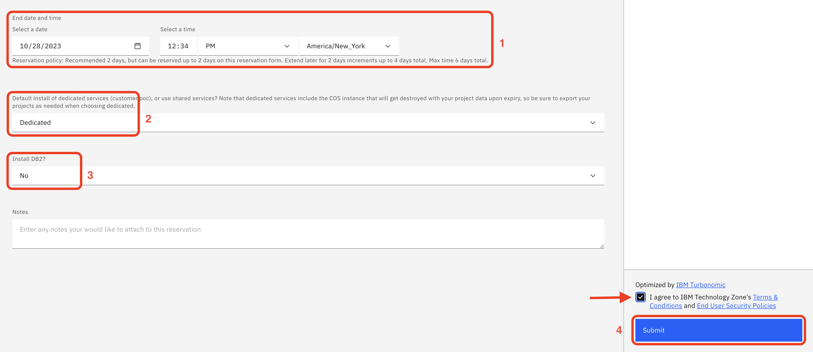
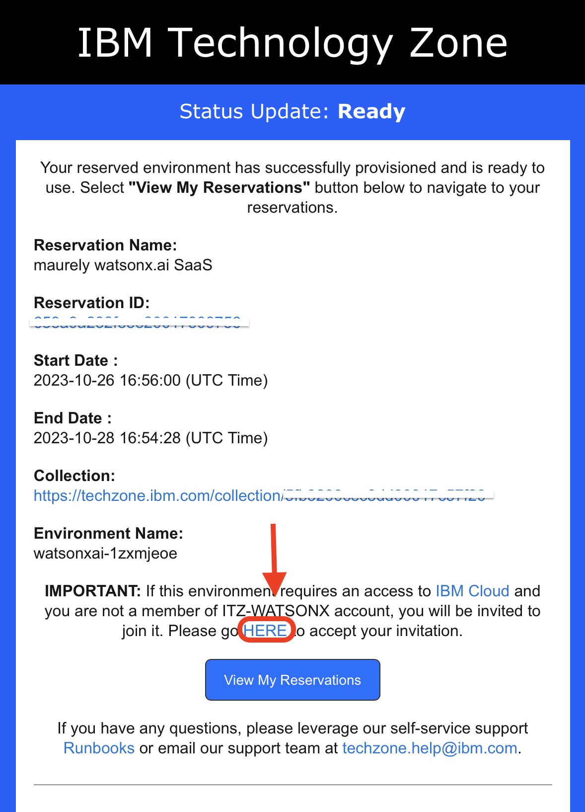
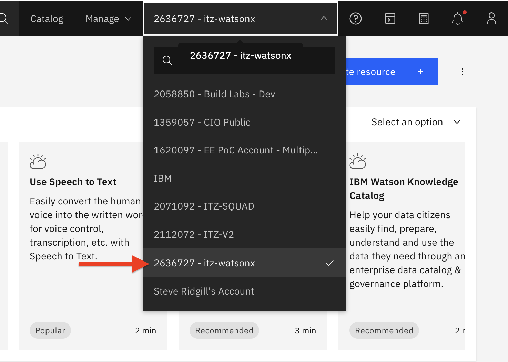
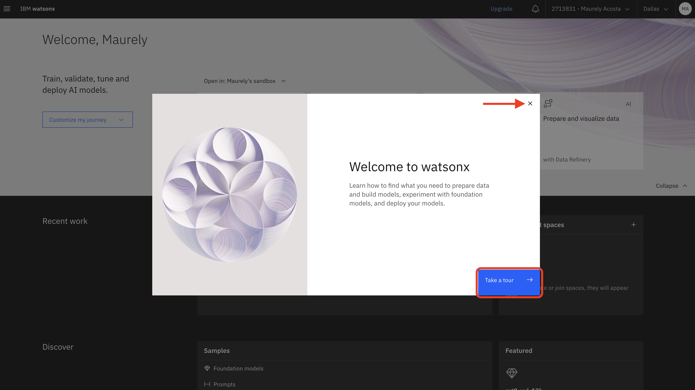
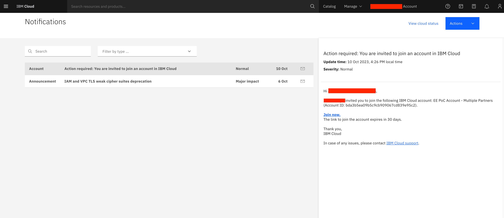
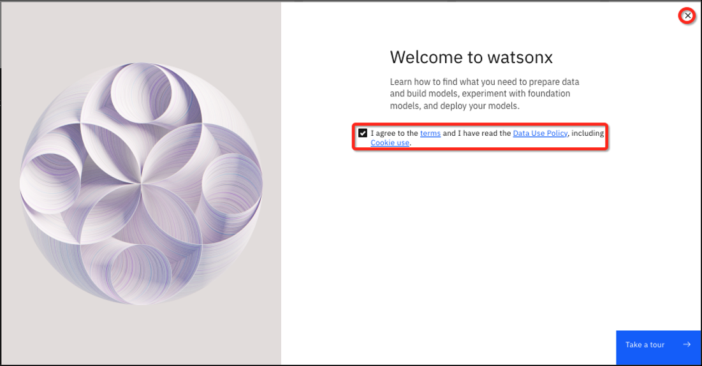
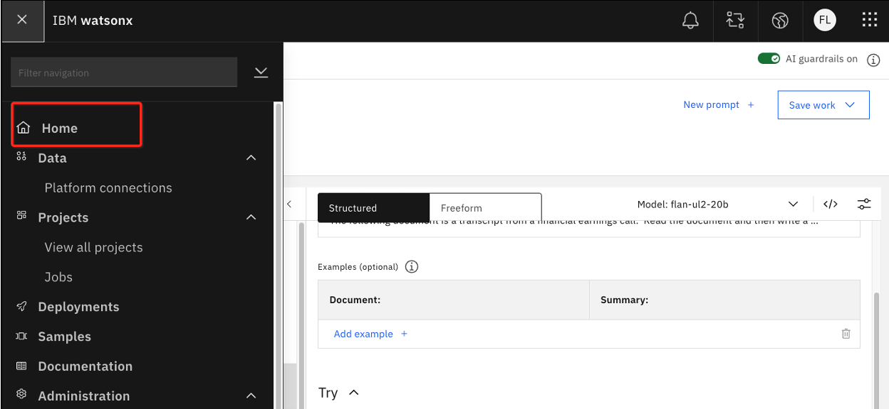
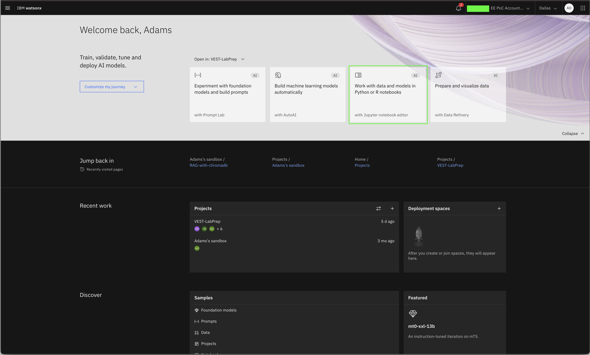

# Resources and FAQs

## Tech Zone Resources

- **[watsonx.ai certified base images](https://techzone.ibm.com/collection/tech-zone-certified-base-images/journey-watsonx)**

- **[watsonx.ai with Assistant and Discovery options](https://techzone.ibm.com/collection/watson-enterprise/environments)**

- **[watsonx.ai with watsonx.governance](https://techzone.ibm.com/my/reservations/create/64b8490a564e190017b8f4eb)**

## How do I access a watsonx.ai instance?

### How to acquire a watsonx.ai instance from Techzone (TZ)

To gain access to a watsonx.ai instance from TZ, navigate to this link [here](https://ibm.biz/WATSONX-AI-TZ). Once there:

1. Select **Reserve now**
   

2. Change the Name of the reservation to _your name_ watsonx.ai L3 SaaS (1).

3. Select **Practice/Self-Education** (2).

4. For the Purpose description, enter `Completing L3 Lab`(3).

5. Select your preferred Geography – here `us-south` is chosen (4).

   

Continue to the bottom part of the reservation page:

6. Specify the end date and time (1).
7. Select Dedicated (should be the default) service (2).
8. Select No (should be the default) for installing Db2 (3).
9. On the right-hand side at the bottom, accept the Terms and Conditions, then click **Submit** (4).

   

You will get an email sent to your IBMid email address letting you know that your reservation is being provisioned (this should happen within 10-15 minutes).

Once the watsonx.ai provisioning is completed, you will receive a second email telling you that it is ready for use.

This email looks like the example below. You will need to click on the **HERE** link (as highlighted below) to go and accept the invitation.

Clicking on **HERE** brings you to a login page where you need to provide your IBMid (and may have to log in with your credentials if you have not already done so).

10. Then you will see the Action required item. Click on the item.

11. The following page opens up. Click **Join now**.

    

12. You will now be sent back to the IBM Cloud login page. Use your IBMid to log in. You are asked to join the TechZone account. Accept the Terms and Conditions, then click **Join Account**.

13. When you log in, go to the menu bar on the top right and select the `itz-watsonx` account.

    

14. In the search field, enter `watsonx`. The search will return a list similar to the following. Click on **watsonx**.

    

15. You will now see the AI and data platform page. Click **Get started** from the watsonx.ai tile.

    > This button may instead say **Launch** if you have provisioned a watsonx instance.

    

16. You are now in the watsonx.ai console and ready to begin using your watsonx.ai instance.

    

### How to acquire a watsonx.ai instance via IBM Cloud

**Note:** The free or lite trial of watsonx.ai instance comes with 50,000 token/month allowance.

1. To sign up for a free trial of watsonx.ai, go to the following link [here](https://dataplatform.cloud.ibm.com/registration/stepone?context=wx&apps=all)

2. Click on the button that says **Create account or log in**

   

**Note:** If you currently have an IBM Cloud account with a watsonx.ai instance you will not be able to start a free trial. You must create a new acount in order to get the free trial watsonx.ai instance.

3. Once you are logged into your account or have created a new account, you will be redirected to the following page. Provide your phone number and click on the **Continue** button.

   

4. You will be redirected to the watsonx.ai page with a modal asking you to take a tour. If you do not want to take the tour you can close the modal by clicking the **X** in the top right corner.

   

5. You are now in the watsonx.ai console and ready to begin using your watsonx.ai instance.

   

### Accepting the workshop IBM Cloud account invite and accessing the platform

If you're participating in an IBM workshop, you will be invited to an IBM cloud account a few days before the workshop begins, this will give you access to a shared instance of watsonx.ai that can be used to complete workshop labs. The email used to register for the workshop should be associated with an IBM id. If not, you will need to create the IBM id before you can log in to IBM Cloud and accept the invite. In addition to the IBM Cloud invite, each workshop participant will be added to a watsonx.ai project with name format: `VEST-Labs-{Location}-{MMDD}` where _Location_ is the location and _MMDD_ indicates the month and day of your workshop.

Follow these steps to accept your IBM Cloud account invite:

1. Log in to IBM Cloud using your IBM id.

2. Navigate to the [notifications panel](https://cloud.ibm.com/notifications) and select the account invite for **EE PoC Account**.

3. Click the **Join now** link to accept the terms and conditions and join the account.

4. You should now see **1620097 - EE PoC Account** in your IBM Cloud account dropdown at the top right of your screen. Make sure this account is selected when performing watsonx.ai labs.

5. Before a user can be added to the workshop project. They need to log in to the watsonx.ai platform at least once. Follow the instructions below to navigate to watsonx.ai from IBM cloud, or navigate directly to the [watsonx.ai console](https://dataplatform.cloud.ibm.com/wx/home?context=wx).

### Accessing watsonx.ai from IBM cloud

To access watsonx.ai from IBM Cloud, navigate to the overview page for watsonx [here](https://cloud.ibm.com/watsonx/overview). Once there:

1. Click the **Launch** button inside the **watsonx.ai** card on the page. This will open a new tab.

   > This button may instead say **Get started** if you have not yet provisioned a watsonx instance. If that is the case either switch to an account that does include a provisioned watsonx instance, or click that button and follow the steps required to provision your instance before continuing.

   

   You may see the following page. Select the checkbox to agree to terms. Feel free to click through the tour or close out by clicking the "X".

   

   After the tour, or clicking the "X", you will see the watsonx.ai homepage.

## How do I create a new prompt lab session?

During the L3 badge lab, you may be asked to start a new Prompt Lab session. This just amounts to exiting the Prompt Lab then re-opening in order to prevent lab prompt results from being impacted by previous experiementation that has been done in the Prompt Lab.

When asked to start a new prompt session follow these steps:

1. Click the hamburger icon in the top left corner of the console. Then click the **Home** link.

   

2. If you've been active in your prompt session you will see a pop up making sure you want to leave the site. click **Leave**.

3. When you arrive at the watsonx.ai homepage, simply click back in to the Prompt Lab.

   

## How do I import a Jupyter notebook in watsonx.ai?

If your lab requires importing a jupyter notebook to watsonx.ai, follow these steps:

1. Login and navigate to the watsonx homepage [here](https://dataplatform.cloud.ibm.com/wx/home)

2. Click the **Work with data and models in Python or R notebooks** card/tile

   

3. A new page with a modal menu titled **Work with data and models in Python or R notebooks** will appear. In this menu click the **URL** option in the left-hand navigation.

4. In the **Name** field type an appropriate identifier. If working in a classroom setting you'll want to prepend with your `{uniqueid}`.

   > NOTE: The `{uniqueid}` value can be anything that uniquely identifies your asset from the assets of other students. Typically a last name or initials will suffice. Watsonx.ai will not prevent assets from being saved with the same name, so this will help you find the notebook later.

5. For the **Select runtime** option use `Runtime 22.2 on Python 3.10 XXS`, larger runtimes use more tokens or cloud credits.

6. To import from a URL, select the **URL** option in the left panel and populate the **Notebook URL** text box with the URL where your raw notebook file is hosted. Alternatively, to import from a local file, select the **Local file** option in the left panel and drag and drop the file from your local system to the section indicated.

7. Once all the required fields are filled, click the **Create** button. You will then be launched into the notebook.

   

## How to create an IBM Cloud API key

> Depending on the environment you are using or if you are working within a workshop setting an API key may already be
> provided for you to use; ask your instructor or review your environment information to determine if an API key is provided.
>
> Otherwise feel free to follow the directions below to create an API key within your own IBM Cloud account.

If you have previously created an API key for calling watsonx.ai from a notebook or just the REST endpoint with `curl` you may skip these steps and reuse that API key. Otherwise, continue on.

> **Note:** There is a 20 IBM Cloud API Key limit.

1. To generate an API key from your IBM Cloud user account, go to [API Keys](https://cloud.ibm.com/iam/apikeys) page and click on the **Create** button.

   

2. In the pop-up, provide a name like `watsonx-apikey` and a short description, then click the **Create** button.

   

3. Immediately click **Copy** to make copy or click **Download** and save it for later in a secure vault (like 1Password, etc.), as there will be no way to retrieve it again.

   

## How to lookup your watsonx project ID

To prompt foundation models in IBM watsonx.ai programmatically, you need to pass the identifier (ID) of a project that has an instance of IBM Watson Machine Learning associated with it.

1. Navigate to the watsonx.ai [Projects](https://dataplatform.cloud.ibm.com/projects/?context=wx) page.

   

2. From the project list, select the project that your are using for the integration.

   

3. Click on the **Manage (1)** tab and check that **General (2)** is selected. Copy the **Project ID (3)** to a location where you can access it later. This is not sensitive like the API key so it can be stored in a notepad or something equivalent.

   
