<QuizAlert text='Heads Up! Quiz material will be flagged like this!' />

# Evaluate an AI model

### Evaluate an AI model

- To learn how to evaluate a **generative** AI model, continue to [Evaluate a **generative** AI model](#evaluate-a-generative-ai-model)
- To learn how to evaluate a **predictive** AI model, continue to [Evaluate a **predictive** AI model](#evaluate-a-predictive-ai-model)

## Evaluate a **generative** AI model

In this lab, you will evaluate a **generative** AI model using the **Generative AI Quality** evaluation dimension.

### Evaluate the model

1. Download the [claim_summarization_validation.csv](https://raw.githubusercontent.com/ibm-build-lab/VAD-VAR-Workshop/main/content/labs/Watsonx/WatsonxGov/files/claim_summarization_validation.csv) evaluation data file to your local machine.

2. In the IBM watsonx platform, click on the **Navigation Menu** in the upper left to expand it. Locate and click on **Deployments**.

3. Select the deployment space you created in **lab 105** (ex. `<your initials or unique string> - Claim summary testing`).

4. Click on the **Deployments** tab and select the deployment you created in **lab 105** (ex. `<your initials or unique string> - Claim summarization`).

5. Click on the **Evaluations** tab of the deployment information screen and then click the **Evaluate** button to open the **Evaluate prompt template** window.

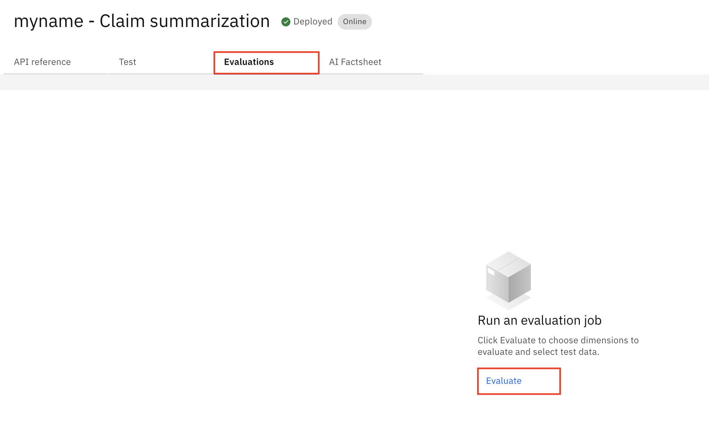

6. The **Select dimensions to evaluate** section of the window shows the different evaluations available. Currently, **Generative AI Quality** is the only one available for this particular prompt template. Click on the **Advanced settings** link.

Take a moment to scroll through the **Generative AI Quality** settings screen to see the different metrics that will be measured as part of the quality evaluation, and the alert thresholds set for each. Note that these thresholds can be fully-customized on a per-model basis, allowing risk managers to make sure their models comply with regulatory standards. The metrics include quality measurements such as precision, recall, and similarity, as well as personally identifiable information (PII) and hateful, aggressive, and profane (HAP) content detection for both model input and output. For more information on the individual metrics, see the [watsonx.governance documentation](https://dataplatform.cloud.ibm.com/docs/content/wsj/model/wos-monitor-gen-quality.html?context=cpdaas).

7. Click **Cancel** to return to the **Evaluate prompt template** window.

8. Click **Next** and drag and drop the **claim_summarization_validation.csv** file you downloaded in a previous step in this lab to the upload section on the screen, or browse to it.

9. Click on the **Input** dropdown, and select **Insurance_Claim** from the list. Click on the **Reference output** dropdown, and select **Summary** from the list. Click **Next**.

10. Click **Evaluate** to start the evaluation, which can take up to a few minutes to run. Note that if the evaluation fails, re-running it will usually complete successfully.

You have successfully ran an evaluation on a **generative** AI model.

### Review the evaluation results

1. When the evaluation is complete, scroll down to the **Generative AI Quality - Text summarization** section. The different quality metrics are listed here, with the model's score and any alert threshold violations. Click the **arrow icon** for more information on the quality metrics.

2. The detailed view for quality shows the different metrics over time; as more evaluations are performed, these graphs will update with the additional data points. Note that clicking on the **Time settings** link allows you to adjust the time window for the evaluations you would like to see. Scroll down to the sections for the different metrics. Note that you can click to expand the sections for a more detailed view of each metric.

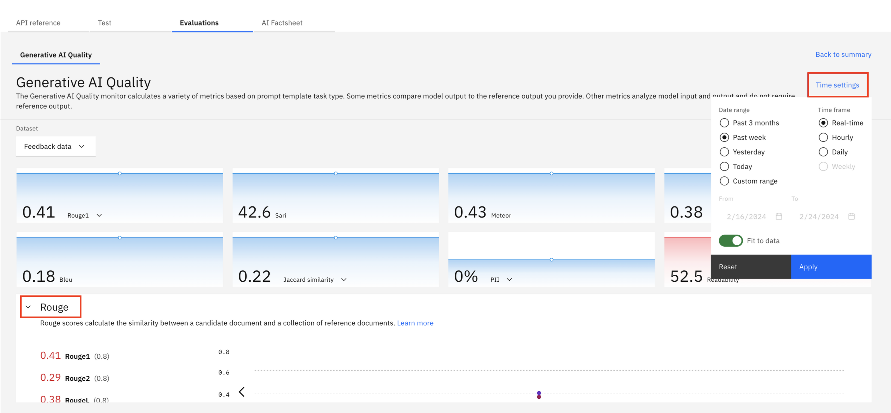

3. When you are finished viewing the quality metrics, scroll back to the top of the screen and click on the **Model health** tab. Take a moment to review this tab, which contains historical data for health metrics such as latency, throughput, number of users, and more. This information can be vital for an organization's infrastructure and engineering teams ensuring that the models are responding to application and user requests in a reasonable amount of time, and keeping compute costs to acceptable levels. Note that you can click to expand the sections for a more detailed view of each metric.

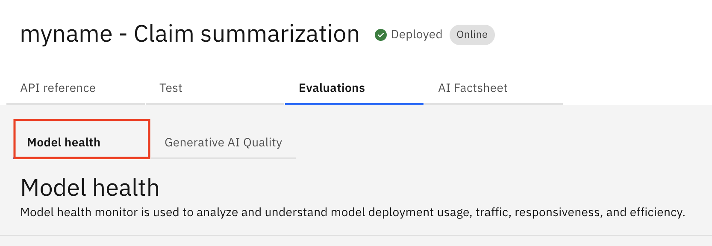

You can also navigate to the **Model Health** tab by pressing the **arrow** to the right of **Model Health** on the **Evaluations** tab.

You have successfully reviewed an evaluation on a **generative** AI model.

### View the updated lifecycle

1. Click on the **AI Factsheet** tab, which will open the factsheet specific to the model deployment. Note that the model is still in the **Validate** portion of the model lifecycle.

2. Scroll down to the **Evaluation results** section of the factsheet. The information from the model evaluation has been automatically stored in the factsheet, allowing stakeholders such as risk managers, business users, and AI engineers to access relevant information without requiring any manual effort from data scientists.

3. Click on the **Navigation Menu** in the upper left to expand it. Locate the **AI governance** section of the menu, expanding it if necessary, and click on **AI use cases**.

4. Select the AI use case you created in **lab 102** (ex. `<your initials or unique string> - Claim summarization`) and click on the **Lifecycle** tab to view the lifecycle graph for this model's use case, which will reflect the same progress on the **AI Factsheet**. Note that the entry for the model is still in the **Validate** section of the model lifecycle view, with an updated badge showing that it has been evaluated. Click on the name of the deployed model (ex. `<your initials or unique string> - Claim summarization`) in the **Validate** section.

Note that the information from the model evaluation that has been automatically stored on the **AI Factsheet** can also be accessed here as well.

5. Scroll to the bottom of the screen and click on the **More details** arrow icon. The full factsheet for the base model opens, containing all the previous model metadata, as well as the metrics from the deployed version.

  <QuizAlert text='There is a quiz question on AI Factsheet.' />

You have successfully viewed the updated lifecycle from an evaluation on a **generative** AI model.

### Congratulations, you've reached the end of lab 106 for evaluating a **generative** AI model and completed the L3 watsonx.governance labs.

You can now **[complete the quiz](https://learn.ibm.com/course/view.php?id=16170)** for IBM watsonx.governance for Technical Sales Level 3 Quiz.

Once the quiz is completed, click, **[IBM watsonx.governance](/watsonx/watsonxgov)** to go to the IBM watsonx.governance home page.

## Evaluate a **predictive** AI model

In this lab, you will evaluate a **predictive** AI model using the **Quality** and **Fairness** evaluation dimensions.

### Configure the deployment space for monitoring

1. In a separate tab in your browser, navigate to <https://cloud.ibm.com/resources> and login to IBM Cloud.

2. Click on **Watson OpenScale-\*\*** under the **AI / Machine Learning** section.

3. Click on **Launch Watson OpenScale**.

4. Verify that you are signed into the correct account by clicking the avatar icon in the upper right corner of the screen. Ensure that the correct account is selected in the **Account** dropdown.

5. Click on the **Configure** button on the left menu bar.

6. From the **Required** section, click on **Machine learning providers** and then click on the **Add machine learning provider** button.

7. Click on the **pencil icon** to edit the name of the machine learning provider. Give your provider a name that includes some identifying information and the purpose it will be used for (ex. `<your initials or unique string> - Auto policy risk test`), and click the blue **Apply** button.

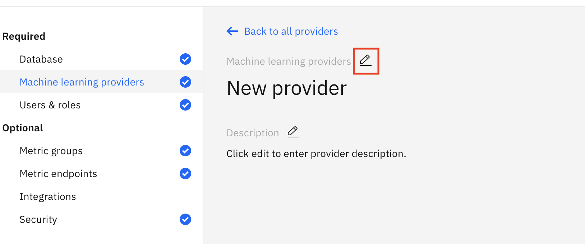

8. Click on the **pencil icon** in the **Connection** tile. Fill out the information below for the connection and then press the **Save** button:

- **Service provider:** **Watson Machine Learning (V2)**.
- **Deployment space:** Select the deployment space you created in **lab 105** (ex. `<your initials or unique string> - Policy risk testing`).
- **Environment type:** **Pre-production**

You have successfully identified your deployment space as a machine learning provider for the monitoring service. You may now configure monitoring for the model itself.

### Add the model to the dashboard

1. Click on the **Insights dashboard** button on the left menu bar.

2. Click on the blue **Add to dashboard** button. The **Select a model deployment** screen will open.

3. Click on the **Machine learning providers** button. From the list of providers, select the one you created earlier in this lab (ex. `<your initials or unique string> - Auto policy risk test`) and then click **Next**.

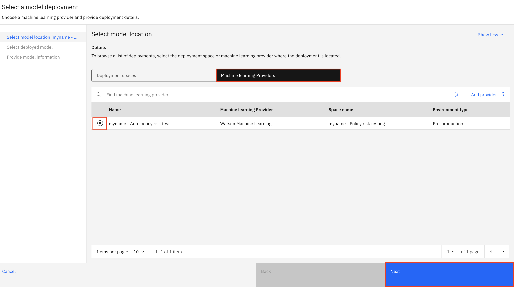

4. From the list of deployed models, select the one you created in **lab 105** (ex. `<your initials or unique string> - Policy risk testing`) and then click **Next**.

5. The information on the **Provide model information** screen will be retrieved from the available model metadata. Click the **View summary** button, then click **Finish**. After a brief wait, the metrics overview screen for the model will open.

You have successfully added your model to the **Insights dashboard**.

### Gather the necessary information

Configuring monitoring for the model will require sending some data to it, which in turn requires some information about the model subscription in the monitoring service. Note that this step would not normally be required; however, you will be monitoring the model for indirect bias, which requires sending metadata to the model that is not included as a feature.

1. From the model metrics overview screen, click on the **Actions** button and select **View model information** from the dropdown menu.

2. Copy and paste the values for **Evaluation datamart ID** and **Subscription ID** into a text file, making sure to note which value is which. You will use these two values in a Jupyter notebook in the next step.

3. In a different browser window, navigate to the **[IBM Cloud API keys](https://cloud.ibm.com/iam/apikeys)** page for your account, signing in if necessary.

4. Click the **Create** button.

5. Give your API key a name and click **Create**. Click the **Copy** icon beneath your API key to copy it to your clipboard. Paste it into a text file for later use.

### Send data to the model

1. In your IBM watsonx platform browser window, click on the **Navigation Menu** in the upper left to expand it. Locate the **Projects** section of the menu, expanding it if necessary, and click on **View all projects**.

2. Select your **predictive** AI project that you created in **lab 103** (ex. `<your initials or unique string> - Auto policy risk`).

3. Click on the **Assets** tab of the project. From the list of assets, locate the **Send data to the model** notebook. Click on the three dots to the right of it to open the options menu and select **Edit**. The watsonx Jupyter notebook editor will open.

4. Copy and paste the values you gathered in the previous steps into the first code cell, ensuring that they are contained within the quotation marks on each line.

5. Click the **Cell** item from the menu above the code cells and select **Run All** to run all the code cells. They should take roughly 30 seconds to complete.

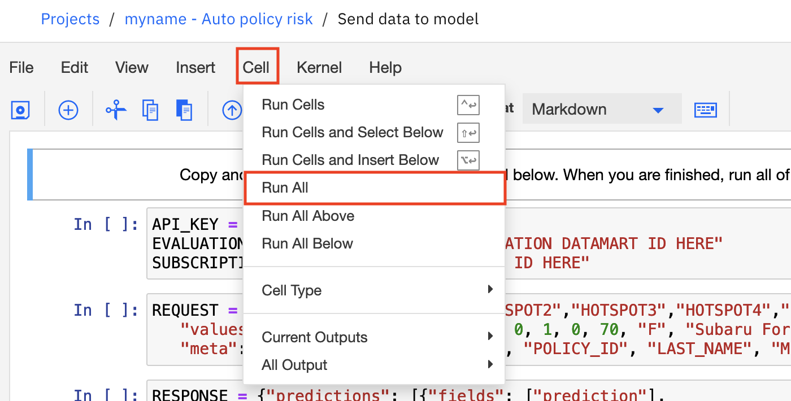

If the code cells ran successfully, you should see a message below the bottom code cell similar to this:

If you received an error message, it is likely because you did not use the correct values in the first code cell. Double check that they are correct, then run all the code cells again. Once they run successfully, proceed to the next step.

You have successfully sent data to your model via a Jupyter notebook.

### Connect to the training data

Next, you will configure the individual monitors for the model. Note that each deployed model can have its own custom metrics and alert thresholds configured, allowing administrators, compliance officers, and risk management professionals to ensure that the models meet all relevant regulations and internal requirements.

1. In your IBM Watson OpenScale browser window, click on the **Actions** button and select **Configure monitors** from the dropdown menu.

2. Click the **Edit** icon in the **Training data** tile.

3. Leave the **Use manual setup** option selected for **Configuration method**, and click **Next**.

4. Click on the **Training data option** dropdown, and click **Database or cloud storage**. Click on the **Location** dropdown, and click **Cloud Object Storage**. **Get from lab host** the values for the **Resource instance ID** and **API key** fields and then click on **Connect**.

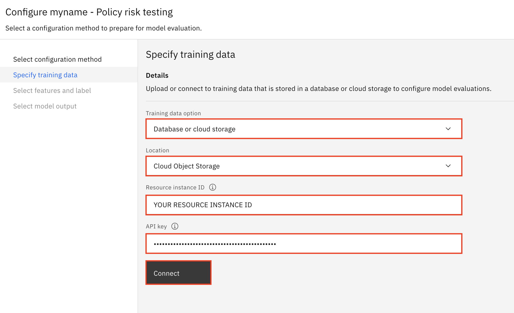

5. Click on the **Bucket** dropdown and click on the **faststartlab-donodelete...** bucket. Click on the **Data set** dropdown to select the **policy_risk_openscale_train.csv file**. Click **Next**.

6. The monitoring tool should correctly identify the feature and label columns, using the metadata stored with the model. Click **Next**.

7. The monitoring tool also correctly identifies the prediction field. Click **View summary** to continue.

8. Click **Finish** to save the training data setup.

You have successfully connected to the training data.

### Configure the fairness monitor

1. From the list of **Evaluations** on the left, click on **Fairness**.

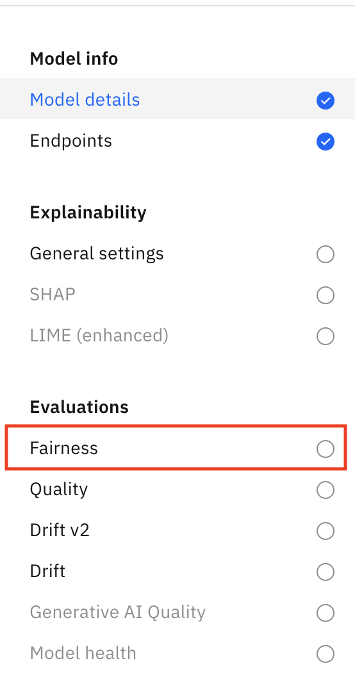

2. Note the description of fairness in the center of the screen, which gives a good definition of what the monitor is evaluating. Click on the **Edit** icon in the **Configuration** tile.

3. You will manually configure the fairness file. Leave **Configure** manually selected and click **Next** to proceed.

4. To properly monitor a model for unfair bias, you must specify which model outcomes are favorable and which are unfavorable. For binary classification models like a Risk vs. No Risk credit model, or a Hire vs. No Hire candidate screening model, these values are easy to determine. However, it's a bit more difficult for a regression model like the one in this lab. You will need to define ranges of outputs that represent favorable or unfavorable outcomes. Note that the monitoring tool has read in the training data, and helpfully filled in what the minimum and maximum values for **RISK** are in that dataset. For this use case, you will identify any score of 40 or higher as an unfavorable outcome. Use the number entry fields to enter a minimum value of **0** and a maximum value of **39**, then click **Add value**. Use the checkbox to set the value to **Favorable**.

5. Repeat the previous step to add a second value, with a minimum value of **40** and a maximum value of **100** (the theoretical upper limit of the model output), then click **Add value**. Use the checkbox to set the value to **Unfavorable**, then click **Next**.

6. Set the **Minimum sample size** to **100** and click **Next**.

7. Leave the **Selected monitored metrics** set to **Disparate impact** and click **Next**.

8. Leave the lower and upper thresholds for **Disparate impact** set to their defaults, and click **Next**.

9. You now need to select which fields to monitor for fairness. IBM Watson OpenScale has analyzed the training data and suggested that **PRIM_DRIVER_AGE** and **PRIM_DRIVER_GENDER** be monitored, as based on their names and values they likely represent age and gender fields. However, for this use case, you will not need to monitor for these fields, as insurance companies have proven over time that male drivers, as well as drivers in certain age groups, present an elevated risk, and this data can therefore be legally used to set policy premiums. Use the checkboxes to deselect **PRIM_DRIVER_AGE** and **PRIM_DRIVER_GENDER**. Scroll to the bottom of the feature list, and check the box next to **MINORITY**, and click **Next**.

10. Use the checkboxes to specify **MINORITY** as the **Monitored** group and **NON-MINORITY** as the **Reference** group. Click **Next**.

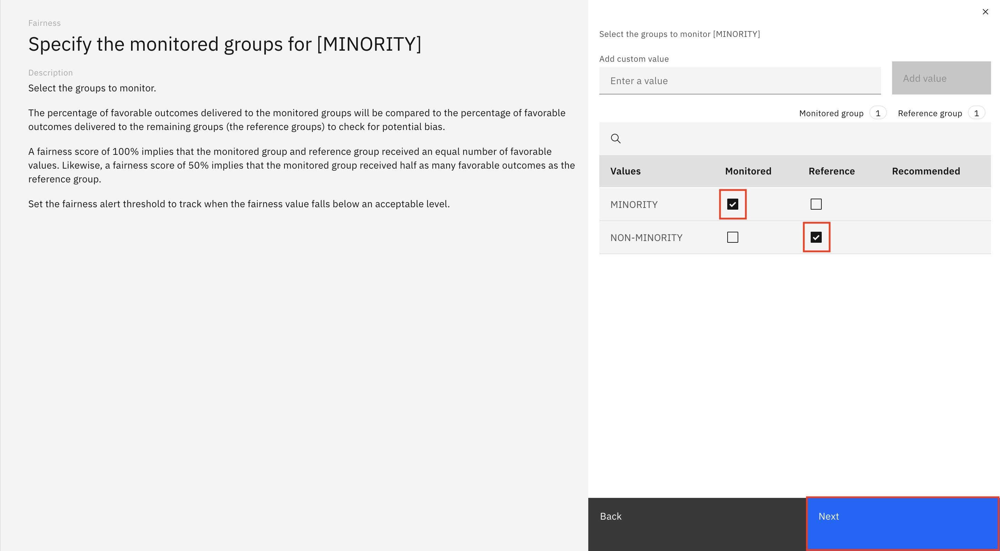

11. Use the default alert threshold (80), and click **Save** to finish configuring the fairness monitor.

You have successfully configured the fairness monitor for an evaluation.

### Configure the quality monitor

1. From the list of **Evaluations** on the left, click on **Quality**.

2. Click the **Edit** icon on the **Quality thresholds** tile.

3. Leave the default lower and upper threshold values as they are. Note that you can click the **Information** icon to the right of each value for more information on how it is calculated. Click **Next**.

4. Set the **Minimum sample size** value to **100**. Click **Save** to save the quality configuration.

You have successfully configured the quality monitor for an evaluation.

### Configure the explainability service

1. In the **Explainability** section on the left, click on **General settings**.

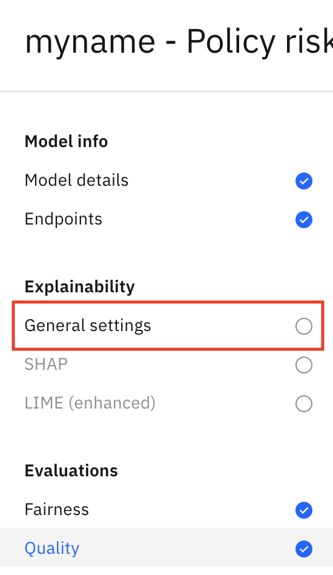

2. In the **Explanation method** tile, click on the **Edit** icon.

3. Two different methods are available for explanations: **[Shapley Additive Explanations](https://shap.readthedocs.io/en/latest/)** (SHAP) or **[Local Interpretable Model-agnostic Explanations](https://www.openlayer.com/blog/post/understanding-lime-in-5-steps)** (LIME). As described in hint that appears when you click the **Information** box, SHAP often provides more thorough explanations, but LIME is faster. Leave the LIME method selected and click **Save**.

You have successfully configured the explainability service.

### Run an evaluation

1. Download the [policy_risk_openscale_eval.csv](https://raw.githubusercontent.com/ibm-build-lab/VAD-VAR-Workshop/main/content/labs/Watsonx/WatsonxGov/files/policy_risk_openscale_eval.csv) evaluation data file to your local machine.

2. In your IBM Watson OpenScale browser window, click on **Go to model summary** on the left.

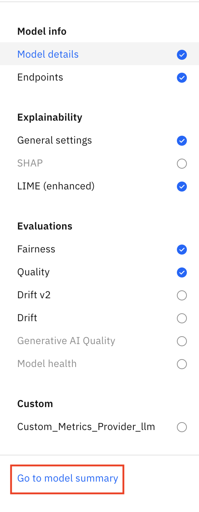

3. Click on the **Actions** button and select **Evaluate now** from the dropdown menu.

4. Click the **Import** dropdown and choose from **CSV file** from the list of options. Drag and drop the downloaded evaluation CSV file into the designated area on your screen, or browse to it on your machine using the link, then click **Upload and evaluate**. When the monitor completes and the metrics are displayed, proceed to the next step.

> **Note:** the evaluation can take up to several minutes to perform. If it fails for any reason, following the same steps and re-running the evaluation typically fixes the issue.

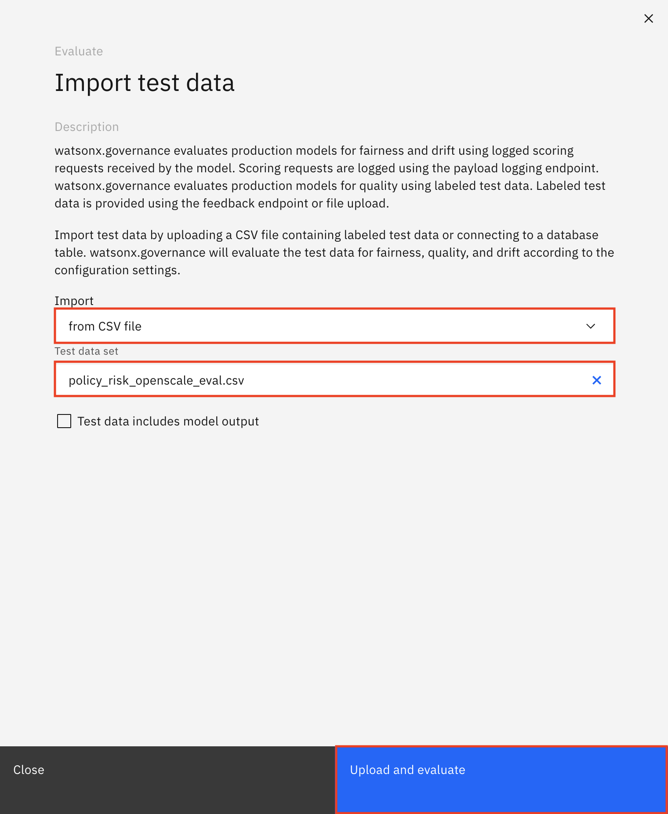

You have successfully run an evaluation for a predictive AI model.

### View the evaluation results

1. Take a moment to review the results of the evaluation. Note that, based on the content of the random sample of the evaluation data, your results will vary each time you perform the evaluation.

2. Review the different metrics in the **Quality** tile. Notice that, if the measurement falls below the alert threshold set when you configured the quality monitor, the amount will be listed in the **Violation** column of the table. For a full explanation of the many different metrics used to calculate model quality, see this **[documentation page](https://dataplatform.cloud.ibm.com/docs/content/wsj/model/wos-quality-overview.html?context=analytics)**.

3. Next, look at the **Fairness** tile. Again, based on the content of the random sample of the evaluation data, your results will vary each time you perform the evaluation. In most cases, the model will show as fair, with no alerts for fairness issues. Click on the **arrow icon** on the **Fairness** tile for more information.

4. Scroll down to the graph portion of the screen and take a moment to read and understand the **How the disparate impact score was determined** section, clicking on the **View calculation** link to see the specific calculation.

<QuizAlert text='There is a quiz question on the fairness score metric.' />

5. Look at the graph. The monitored group, colored purple in the screenshot, has a calculated fairness above the alert threshold (80%, the red line on the graph) that you configured when setting up the fairness monitor. Hovering your cursor over either bar of the graph will also show you the exact percentage of favorable outcomes the group received from the model.

6. Scroll down to the **Indirect bias: proxy features for MINORITY** section at the bottom of the screen. In the screenshot below, note that the **MINORITY** tag is fairly strongly (0.38) correlated with proximity to **HOTSPOT3**, indicating that particular area with frequent auto accidents is likely located in an area of Chicago with a high minority population. Correlations like this can potentially cause unfair bias in AI models, causing them to discriminate against minorities even if ethnicity is not part of the training data set. However, if you click the **Arrow icon** to the left of the **HOTSPOT3** label, you will note that (at least in the screenshot below) proximity to that hotspot did not lead to significantly more negative outcomes, meaning that it is not likely an important feature for determining the model's decision. If you wish to learn more about proxy features and correlation strength, click on the **Information** icons to the right of each measurement heading.

<QuizAlert text='There is a quiz question on indirect bias.' />

7. When you are finished reviewing the results, scroll to the top of the screen and click on the **View payload transactions** button.

You have successfully view the evaluation reults for quality and fairness.

### Explain a prediction

Beyond meeting standards for quality and fairness, AI models in many cases are required to provide explanations into the decisions or predictions they make. For example, under the Equal Credit Opportunity Act in the United States and the European Union General Data Protection Regulation, people affected by an AI decision have the right to know specific reasons for the decision. The **[Right to explanation Wikipedia page](https://en.wikipedia.org/wiki/Right_to_explanation)** provides several useful links with more information.

IBM watsonx.governance provides the ability to generate detailed explanations for predictive models using the algorithm you specified previously when configuring the explainability service.

1. From the table of transactions, click one of the **Explain prediction** links. You may get more interesting results if you can find a prediction that is close to the threshold for unfavorable (39, as defined when configuring the fairness monitor). The explainability service will use the LIME algorithm to generate a detailed explanation, which can take a few minutes to run.

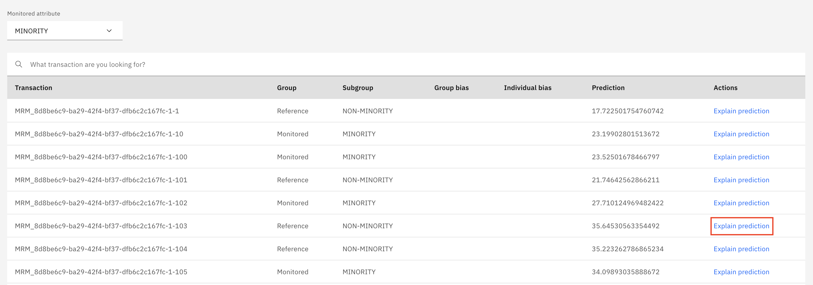

2. Once the explanation has been generated, scroll down to the graph, which shows the influence different features had in the model's outcome. Features in **blue** increased the final score, while those in **red** decreased it. For classification models, **blue** features contributed positively to the model's confidence in the prediction, while those in **red** decreased the confidence. Hover your cursor over the individual columns of the graph for more information.

3. Click on the **Inspect** tab. On this tab, you can alter values associated with the record and re-submit it to the model to see how the final risk calculation changes. This can be useful for understanding how the model is working, or if a policyholder is looking for ways to decrease their risk assessment.

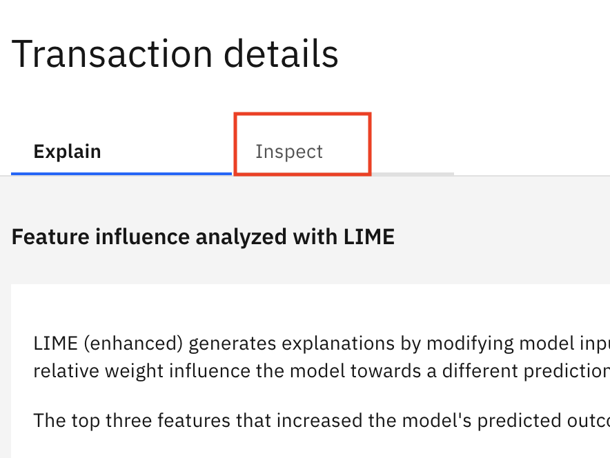

You have successfully viewed the the model's prediction explanation.

### View the updated lifecycle

1. In your IBM watsonx platform browser window, click on the **Navigation Menu** in the upper left to expand it. Locate the **AI governance** section of the menu, expanding it if necessary, and click on **AI use cases**.

4. Select the AI use case you created in **lab 102** (ex. `<your initials or unique string> - Auto policy risk`) and click on the **Lifecycle** tab to view the lifecycle graph for this model's use case. Note that the entry for the model is now in the **Validate** section of the model lifecycle view, with an updated badge showing that it has been evaluated and a red alert providing a visual cue that the model may have issues. Click on the name of the deployed model (ex. `<your initials or unique string> - Policy risk testing`).

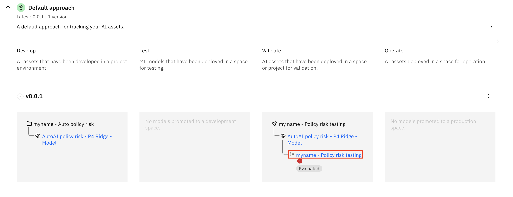

5. Scroll down to the **Quality** and **Fairness** sections of the model's factsheet. Note that the evaluation metrics generated by the IBM Watson OpenScale monitoring tool have automatically been stored on the model's factsheet, allowing stakeholders such as risk managers and data scientists access to information they need to assess model performance, with an optional link provided that will open the monitoring tool if they further information.

  <QuizAlert text='There is a quiz question on AI Factsheet.' />

You have successfully viewed the updated lifecycle from an evaluation on a **predictive** AI model.

### Congratulations, you've reached the end of lab 106 for evaluating a **predictive** AI model and completed the L3 watsonx.governance labs.

You can now **[complete the quiz](https://learn.ibm.com/course/view.php?id=16170)** for IBM watsonx.governance for Technical Sales Level 3 Quiz.

Once the quiz is completed, click, **[IBM watsonx.governance](/watsonx/watsonxgov)** to go to the IBM watsonx.governance home page.
